## 1장 사용자 수에 따른 규모 확장성

### 단일 서버
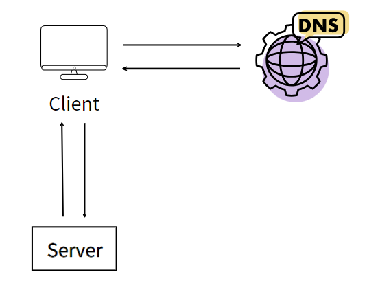
- 모든 컴포넌트가 단 한 대의 서버에서 실행되는 가장 간단한 시스템
- 웹 앱, 데이터베이스, 캐시 등이 전부 서버 한 대에서 실행됨
- 문제점
  - 애플리케이션과 DB 둘 중 하나라도 장애가 발생할 경우 전체 서비스의 장애로 이어짐
  - 서버 자원을 효율적으로 사용하기가 어려움
  - DB와 애플리케이션이 한 서버에 구축되어 있기에 보안이 취약함
  - 애플리케이션과 데이터베이스가 하나의 서버로 구성되면 똑같은 데이터를 여러 서버에 복제해야 하므로 관리가 매우 힘들어지고 이는 scale-out 서버 확장의 어려움으로 이어짐  
  -> **no failover (장애를 자동복구하지 못하는 문제)**

### 데이터베이스
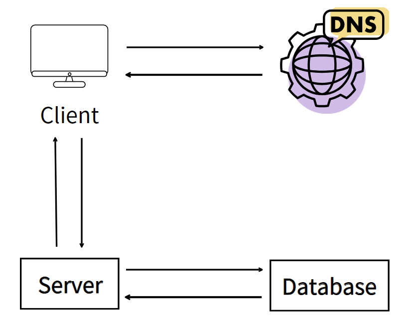
- 웹/모바일 트래픽 처리 서버(웹 계층)과 데이터베이스 서버(데이터 계층)을 분리 (애플리케이션과 데이터베이스 서버를 분리)
- 문제점
  - 단일 서버의 단점을 어느정도 해소해주지만 두 개의 서버를 관리하므로 구성이 다소 복잡해짐
  - 클라이언트는 여전히 하나의 애플리케이션 서버를 바라보고 있기 때문에 scale-out은 어려운 구조임  
  -> **장애의 자동복구나 다중화를 지원 X**

### 수직적 규모 확장 vs 수평적 규모 확장

**수직적 규모 확장 (scale up)**
- 장애에 대한 자동복구(failover)이나 다중화(redundancy) 방안을 제시하지 않음  
-> 서버에 장애가 발생하면 웹사이트/앱은 완전히 중단됨  
-> 대규모 애플리케이션을 지원하는 데는 **수평적 규모 확장법 (scale out)** 이 적절  

---

>앞의 설계들에서 **로드 밸런서와 데이터베이스 다중화** 도입을 통해 성능 개선

**로드밸런서(load balancer)**

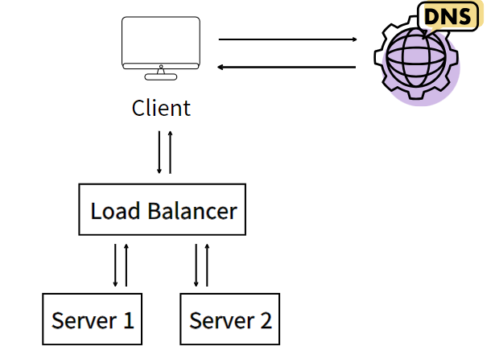
- 부하 분산 집합(load balancing set)에 속한 웹 서버들에게 트래픽 부하를 고르게 분산하는 역할
- 부하를 나누기 위해 새로운 서버를 추가할 수 있음
- 서버 간 통신에는 사설 IP 주소 이용  
-> no failover 해소, 웹 계층의 가용성(availability) 향상
  

**데이터베이스 다중화**

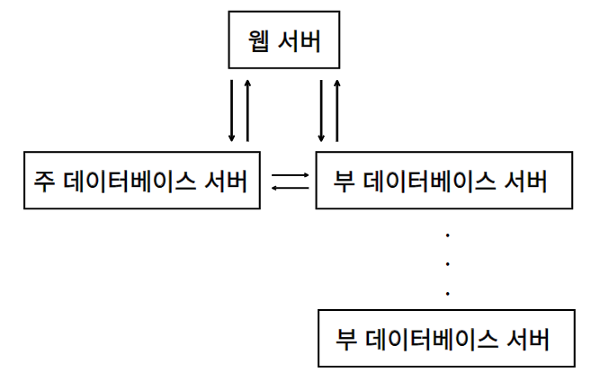
- 보통은 서버 사이에 주(master)-부(slave) 관계를 설정하고 데이터 원본은 주 서버에, 사본은 부 서버에 저장하는 방식  
-> 더 나은 성능, 안정성(reliability), 가용성(availability)
  

**로드밸런서와 데이터베이스 다중화를 고려한 설계안**

> - 사용자는 DNS로부터 로드밸런서의 공개 IP 주소를 받는다.
> - 사용자는 해당 IP 주소를 사용해 로드밸런서에 접속한다.
> - HTTP 요청은 서버 1이나 서버 2로 전달된다.
> - 웹 서버는 사용자의 데이터를 부 데이터베이스 서버에서 읽는다.
> - 웹 서버는 데이터 변경 연산은 주 데이터베이스로 전달한다. 데이터 추가, 삭제, 갱신 연산 등이 이에 해당한다.

---

>캐시(cache)를 붙이고 정적 콘텐츠를 콘텐츠 전송 네트워크(Content Delivery Network, CDN)로 옮겨 **응답시간 개선**

### 캐시

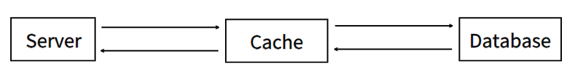
- 값비싼 연산 결과 또는 자주 참조되는 데이터를 메모리 안에 두고, 뒤이은 요청이 보다 빨리 처리될 수 있도록 하는 저장소
- 데이터베이스 부하를 줄여주고, 캐시 계층의 규모를 독립적으로 확장시킬 수 있음
- 고려할 점
  - caching할 데이터의 갱신과 참조 빈도
  - 캐시는 휘발성 메모리기 때문에 중요 데이터는 지속적 저장소(persistant data store)에 두어야 함
  - 캐시에 보관된 데이터 만료(expire) 정책
  - 일관성(consistency) 유지
  - 장애 대처 방법
  - 캐시 메모리의 크기
  - 데이터 방출(eviction) 정책

### 콘텐츠 전송 네트워크(CDN)

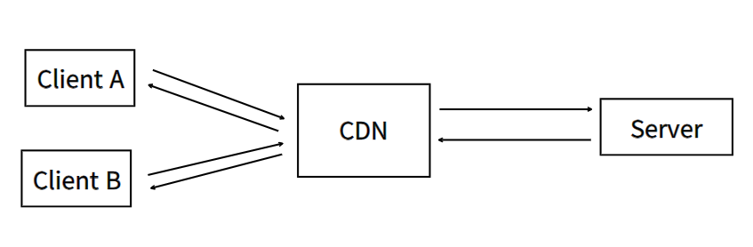
- 정적 콘텐츠를 전송하는 데 쓰이는 지리적으로 분산된 서버의 네트워크
- 고려할 점
  - 비용
  - 적절한 만료 시한 설정
  - CDN 장애에 대한 대처 방안
  - 콘텐츠 무효화(invalidation) 방법

 

**CDN과 캐시가 추가된 설계**

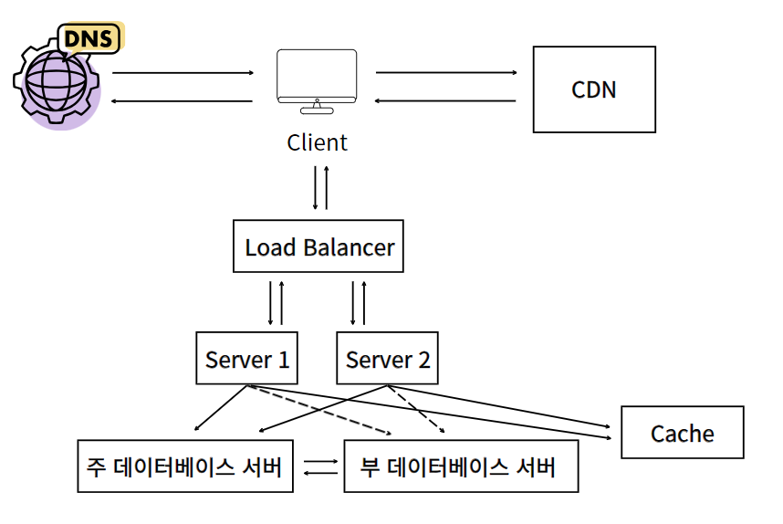
>- 정적 콘텐츠(js, css, 이미지 등)는 웹 서버가 아니라 CDN을 통해 제공하여 더 나은 성능을 보장
>- 캐시가 데이터베이스 부하를 줄여줌
---

>웹 계층을 수평적으로 확장하는 방법

### 무상태(stateless) 웹 계층
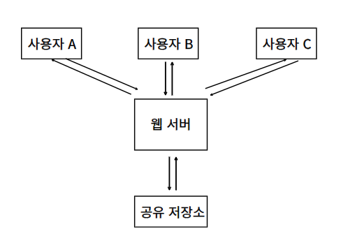
- 상태 정보(사용자 세션 데이터와 같은)를 웹 계층에서 제거
- 상태 정보가 필요한 경우 공유 저장소(shared storage)로부터 데이터 가져옴
- 상태 정보는 웹 서버로부터 물리적으로 분리되어 있음
  -> 단순하고, 안정적이며, 규모 확장이 쉽다

 

**무상태 웹 계층을 갖도록 기존 설계 변경**
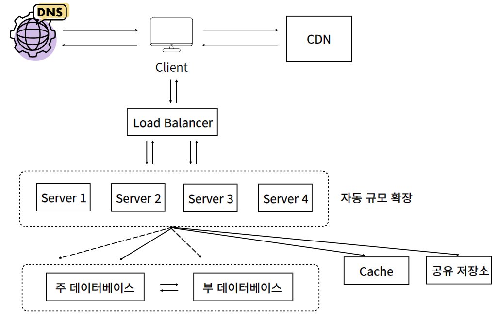

---

### 데이터 센터
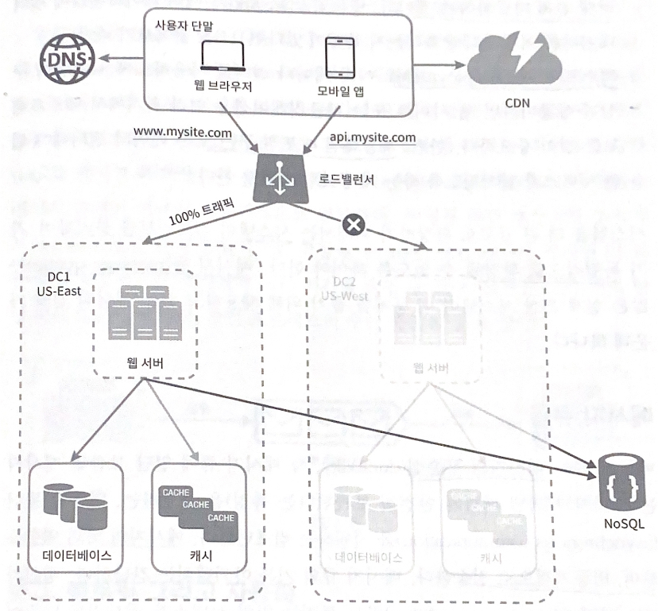
- 지리적 라우팅에서의 geoDNS: 사용자의 위치에 따라 도메인 이름은 어떤 IP 주소로 변환할지 결정하는 DNS 서비스
- 가용성을 높이고 전 세계 어디서도 쾌적하게 사용할 수 있게 함
- 데이터 센터 중 하나에 심각한 장애가 발생하면 모든 트래픽은 장애가 없는 데이터 센터로 전송
- 다중 데이터센터 아키텍처에서 고려할 점
  - 트래픽 우회
  - 데이터 동기화
  - 테스트와 배포
- 시스템을 더 큰 규모로 확장하기 위해서 시스템의 컴포넌트를 분리하여, 각기 독립적으로 확장해야 함  
-> 메시지 큐(message queue) 사용

### 메시지 큐

- 데이터의 무손실을 보장하는 비동기 통신을 지원하는 컴포넌트
- 메시지의 버퍼 역할을 함
- 서버 간 결합이 느슨해져서, 규모 확장성이 보장되어야 하는 안정적 애플리케이션을 구성하기 좋음

### 로그, 메트릭 그리고 자동화
- 웹 사이트와 함께 사업 규모가 커지고 나면, 이러한 도구에 필수적으로 투자해야 함
- 로그 
  - 에러 로그 모니터링
- 메트릭
  - 호스트 단위 메트릭: CPU, 메모리, 디스크 I/O에 관한 메트릭
  - 종합 메트릭: 데이터베이스 계층의 성능, 캐시 계층의 성능
  - 핵심 비즈니스 메트릭: 일별 능동 사용자, 수익, 재방문
- 자동화
  - 지속적 통합을 도와주는 도구. 빌드, 테스트, 배포 등의 절차 자동화
  
 

**메시지 큐, 로그, 메트릭, 자동화 등을 반영하여 수정한 설계안**

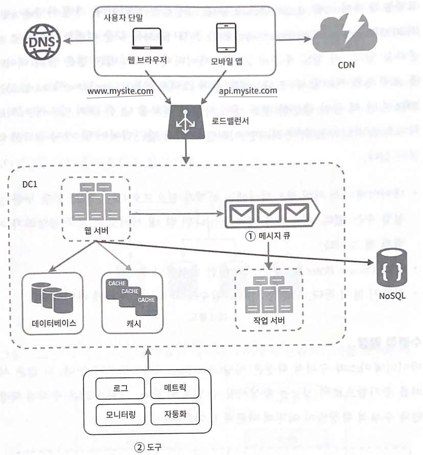

>- 메시지 큐는 각 컴포넌트가 보다 느슨히 결합(loosely coupled)될 수 있도록 하고, 결함에 대한 내성을 높임
>- 로그, 모니터링, 메트릭, 자동화 등을 지원하기 위한 장치 추가

---

### 데이터베이스의 규모 확장
- 수직적 확장
  - 고성능의 자원 증설
  - 문제점
    - 데이터베이스 서버 하드웨어에는 한계가 있음
    - SPOF(Single Point of Failure) 위험성이 큼
    - 비용이 많이 듦
- 수평적 확장 
  - 샤딩(sharding)
  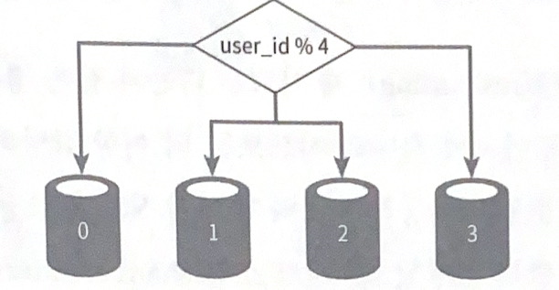
  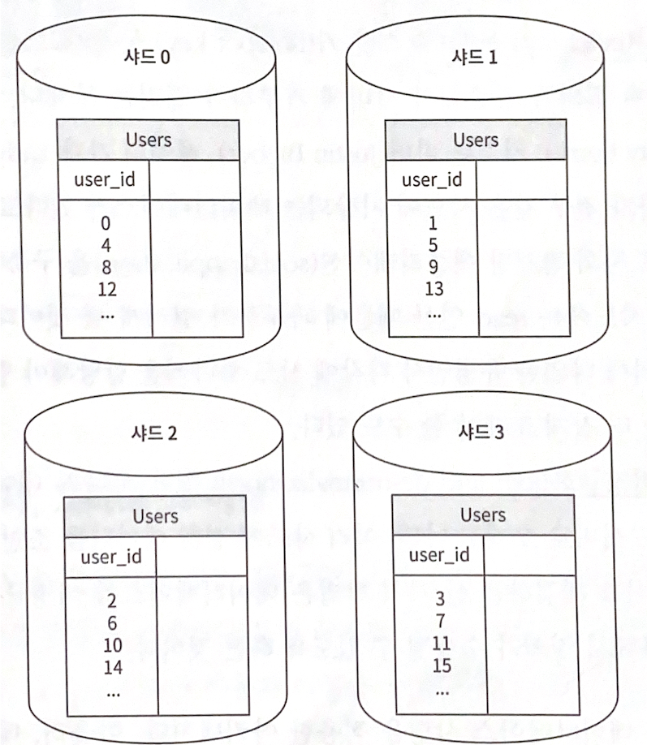
  - 대규모 데이터베이스를 샤드(shard)라고 부르는 작은 단위로 분할하는 기술
    - 샤딩 키를 정할 때 데이터를 고르게 분할할 수 있도록 하는 것이 가장 중요
    - 문제점
      - 데이터의 재샤딩: 데이터가 너무 많을 때, 데이터 분포가 균등하지 못할 때 
      - 유명인사 문제: 특정 샤드에 질의가 집중되어 서버에 과부하
      - 조인과 비정규화: 여러 샤드에 걸친 데이터 조인하기 힘듦 -> DB 비정규화

### 백만 사용자, 그리고 그 이상
>- 웹 계층은 무상태 계층으로
>- 모든 계층에 다중화 도입
>- 가능한 한 많은 데이터를 캐시할 것
>- 여러 데이터 센터를 지원할 것
>- 정적 콘텐츠는 CDN을 통해 서비스할 것
>- 데이터 계층은 샤딩을 통해 그 규모를 확장할 것
>- 각 계층은 독립적 서비스로 분할할 것
>- 시스템을 지속적으로 모니터링하고, 자동화 도구들을 활용할 것
