# 사용자 수에 따른 규모 확장성
- [단일-서버](#단일-서버)

- [데이터베이스](#데이터-베이스)
  - [어떤 데이터베이스를 사용할 것인가?](#어떤-데이터-베이스를-사용할-것인가)

- [수직적 규모 확장 vs 수평적 규모 확장](#수직적-규모-확장-vs--수평적-규모-확장)
  - [로드밸런서](#로드밸런서)
  - [데이터베이스 다중화](#웹-계층은-트래픽-처리가-되지만-데이터베이스는---데이터베이스-다중화)

- [캐시](#응답시간-개선---캐시)
  - [캐시 사용 시 유의할 점](#캐시-사용-시-유의할-점)
  - [컨텐츠 전송 네트워크(CDN)](#콘텐츠-전송-네트워크cdn)
  - [CDN 사용 시 고려해야 할 사항](#cdn-사용-시-주의-사항)

- [무상태(stateless) 웹 계층](#무상태stateless-웹-계층)
  - [상태 정보 의존적인 아키텍처](#상태-정보-의존적인-아키텍처)
  - [무상태 아키텍처](#무상태-아키텍처)

- [데이터 센터](#데이터-센터)

- [메시지 큐](#메시지-큐)

- [로그,메트릭,그리고 자동화](#메시지-큐-로그-메트릭-자동화)
  - [로그](#로그)
  - [메트릭](#메트릭)
  - [자동화](#자동화)

- [데이터베이스의 규모 확장](#데이터베이스-규모-확장)
  - [수직적 확장](#수직적-확장)
  - [수평적 확장](#수평적-확장)

- [1장 정리](#지금까지-아키텍처-구조-정리)

## 단일 서버
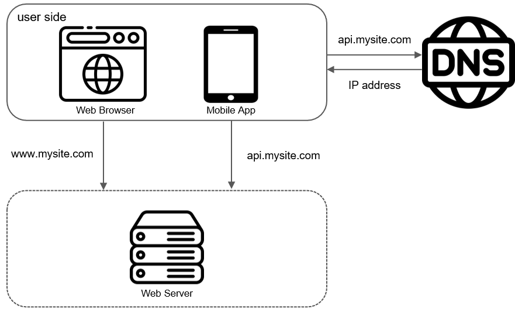
1. 사용자는 도메인 이름을 이용하여 웹 사이트에 접속한다. 이 접속을 위햐서는 이름을 도메알 이름 서비스(Domain Name Service, DNS)에 질의하여 IP주소로 변환하는 과정이 필요하다.
2. DNS 조회 결과로 IP주소가 반환된다.
3. 해당 IP주소로 HTTP 요청이 전달된다.
4. 요청을 받은 웹 서버는 HTML페이지나 JSON 형태의 응답을 반환한다.

## 데이터 베이스
사용자가 늘면 서버 하나로는 부족해서 여러 서버를 두어야 한다.

1. 웹/모바일 트래픽 처리 용도 
2. 데이터베이스용도

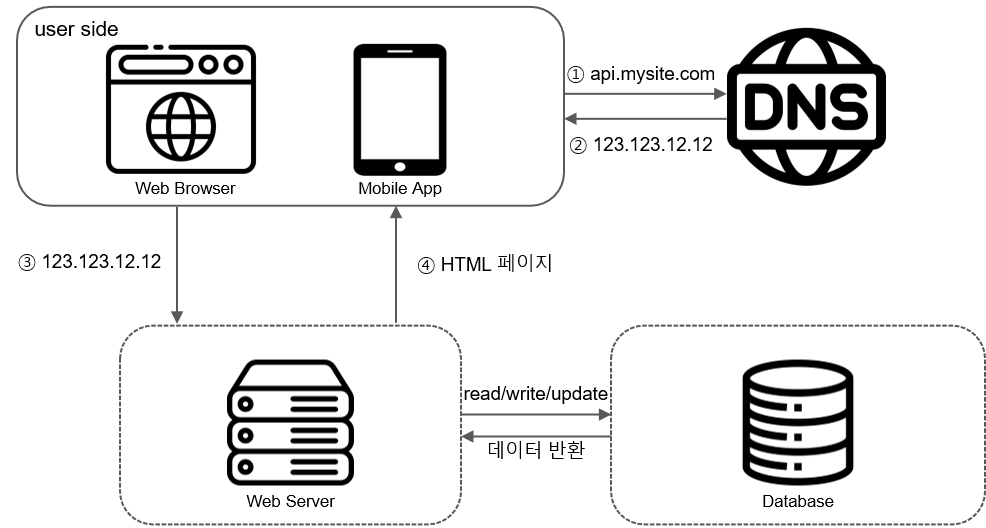

위의 그림처럼 웹/모바일 트래픽 처리 서버(웹 계층)와 데이터베이스 서버(데이터 계층)를 분리하면
그 각각을 독립적으로 확장해 나갈 수 있게 된다.

### 어떤 데이터 베이스를 사용할 것인가?

- 관계형 데이터베이스(Relational Data-base Managment System, RDBMS) 
  - MySQL, 오라클 데이터베이스, PostgreSQL 등
  - 테이블과 열, 칼럼으로 표현
  - SQL을 사용하면 여러 테이블에 있는 데이터를 그 관계에 따라 조인(join)하여 합칠 수 있음.

- 비-관계형 데이터베이스(NoSQL) 
    - CouchDB, Neo4jm Cassandra, HBase, Amazon DynamoDB 등
    - 키-값 저장소, 그래프 저장소, 칼럼 저장소, 문서 저장소
    - 조인연산 지원 X

#### 대부분은 관계형 데이터베이스가 최선이지만, 이럴 때는 비-관계형 데이터베이스가 바람직하다.
- 아주 낮은 응답 지연시간이 요구됨
- 다루는 데이터가 비정형이나 관계형 데이터가 아님
- 데이터(JSON,XML,YAML 등)을 직렬화하거나, 역직렬화 할 수 있기만 하면 됨
- 아주 많은 양의 데이터를 저장할 필요가 있음

## 수직적 규모 확장 vs  수평적 규모 확장

- 수직적 규모 확장(스케일 업) : 서버에 고사양 자원(더 좋은 CPU, 더 많은 RAM 등)을 추가하는 행위를 말한다.
  - **서버로 유입되는 트래픽 양이 적을 때는 수직적 확장이 좋은 선택**
  - 한계 1: 한 대의 서버에 CPU나 메모리를 문한대로 증성할 방법은 없다.
  - 한계 2: 장애에 대한 자동복구 방안이나 다중화 방안을 제시하지 않는다. 서버에 장애가 발생하면 웹 사이트/ 앱은 완전히 중단된다.
  
**대규모 애플리케이션을 지원하는 데는 수평적 규모 확장법이 보다 적절하다.**

- 수평적 규모 확장(스케일 아웃) : 더 많은 서버를 추가하여 성능을 개선하는 행위를 말한다.

위의 그림에 있는 설계에서는 **사용자가 웹 서버에 바로 연결**되었다.
웹 서버가 다운되면 웹 사이트는 접속할 수 없고, 
많은 사용자가 접속하여 웹 서버의 한계 상황에 도달하게 되면, 응답 속도가 느려지거나 수평 접속이 불가능해질 수도 있다.

이런 문제를 해결하는 데 **부하 분산기 or 로드밸런서**를 도입하는 것이 최선이다.

### 로드밸런서

로드밸런서는 부하 분산 집합에 속한 웹 서버들에게 트래픽 부하를 고르게 분산하는 역할을 한다.

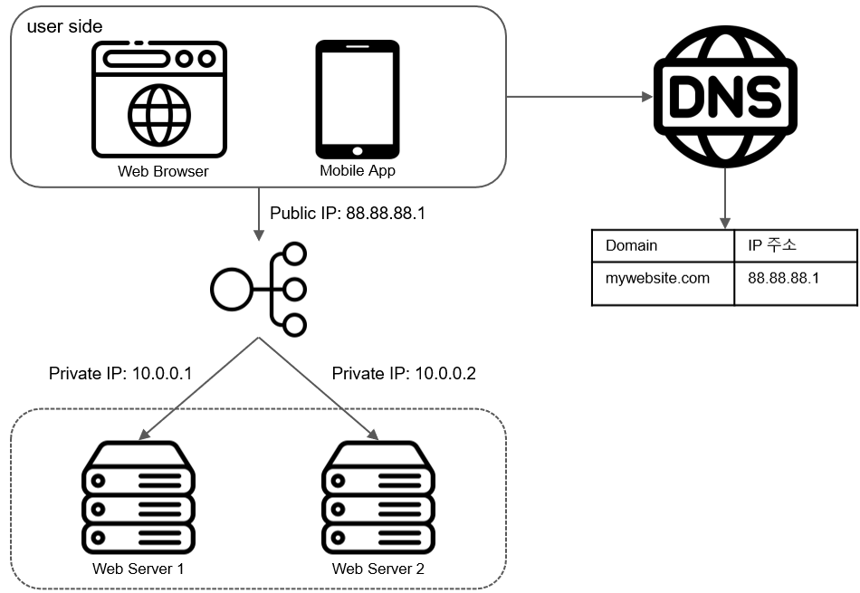

사용자: 로드밸런서의 공개 IP주소로 접속

서버 간 통신: 사설 IP주소가 이용

사설 IP주소는 같은 네트워크에 속한 서버 사이의 통신에만 쓰일 수 있는 IP주소로, 인터넷을 통해서는 접속할 수 없다.

로드밸런서는 웹 서버와 통신하기 위해 사설 주소를 이용한다.

**수평적 규모 확장으로 웹 서버 증설 후, 로드밸런서로 트래픽 부하를 분산시키는 구조**

**하나의 웹 서버에 많은 사용자가 몰릴 때의 문제점을 해결**

- 서버1이 다운되면 모든 트래픽은 서버 2로 전송 
  - 웹 사이트 전체가 다운되는 일 방지 가능 
  - 부하를 나누기 위해 새로운 서버 추가 가능

- 웹 사이트로 유입되는 트래픽이 가파르게 증가하면 두 대의 서버로 트래픽을 감당할 수 없는 시점이 옴 
  - 웹 서버계층에 더 많은 서버를 추가하면 로드밸런서가 자동적으로 트래픽을 분산해주는 방식으로 해결 가능

### 웹 계층은 트래픽 처리가 되지만 데이터베이스는? - 데이터베이스 다중화

- 보통 서버 사이에 주(master)-부(slave) 관계 설정
- 데이터 원본 -> 주 서버
- 데이터 사본 -> 부 서버
- 쓰기 연산은 마스터에서만 지원
- 부 데이터베잇는 주 데이터베이스로부터 사본을 전달받으며, 읽기 연산만을 지원
- insert, delete, update와 같은 데이터베이스를 변경하는 명령어들은 주 데이터베이스로만 전달되어야 함

대부분의 애플리케이션은 읽기 연산의 비중이 쓰기 연산보다 훨씬 높다.

따라서 통상 부 데이터베이스의 수가 주 데이터베이스 수보다 많다.
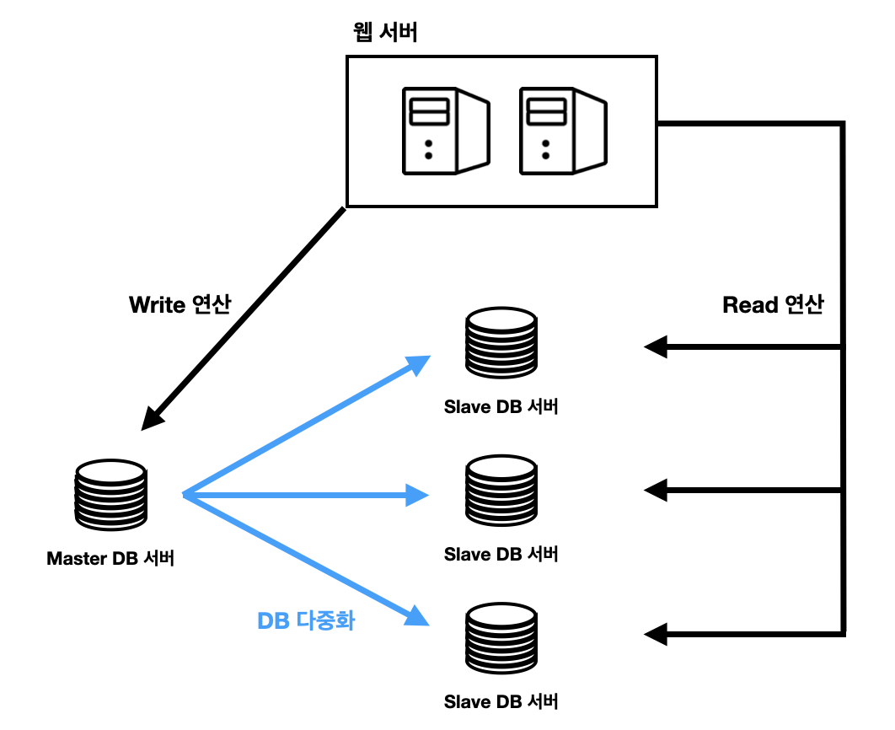

### 데이터 베이스를 다중화 하면 얻는 이득

- 더 나은 성능
  - 모든 데이터 변경 연산은 주 데이터베이스 서버로만 전달되는 반면 읽기 연산은 부 데이터베이스 서버들로 분산됨
  - 병렬로 처리될 수 있는 질의 수(query)가 늘어나므로 성능이 좋아짐
- 안정성
  - 데이터베이스 서버 가운데 일부가 파괴되어도 데이터는 보존됨
  - 데이터를 지역적으로 떨어진 여러 장소에 다중화시켜 놓을 수 있기 때문
- 가용성
  - 데이터를 여러 지역에 복제해 둠으로 써, 하나의 데이터베이스 서버에 장애가 발생하더라도 다른 서버에 있는 데이터를 가져와 계속 서비스할 수 있게 됨
  

### 데이터베이스 서버 가운데 하나가 다운되면 무슨일이 벌어지는가?

- 부 서버가 한 대 뿐인데 다운된 경우
  - 읽기 연산은 한시적으로 모두 주 데이터베이슬 전달 or 즉시 새로운 부 데이터베이스 서버가 장애 서버를 대체할 것

- 부 서버가 여러 대인 경우
  - 읽기 연산은 나머지 부 데이터베이스 서버들로 분산될 것 or 새로운 부 데이터베이스 서버가 장애 서버를 대체할 것

- 주 데이터베이스 서버가 다운되면
  - 한 대의 부 데이터베이스만 있는 경우
    - 해당 부 데이터베이스 서버가 새로운 주 서버가 될 것
    - 모든 데이터베이스 연산을 일시적으로 새로운 주 서버상에서 수행될 것
    - 그리고 새로운 부 서버 추가

부 서버에 보관된 데이터가 최신 상태가 아닐 수 있기 때문에 프로덕션 환경에서 벌어지는 일은 더 복잡하다.

없는 데이터는 복구 스크립트를 돌려서 추가해야 한다.

 

아래 그림은 로드밸런서와 데이터베이스 다중화를 고려한 설계안이다.

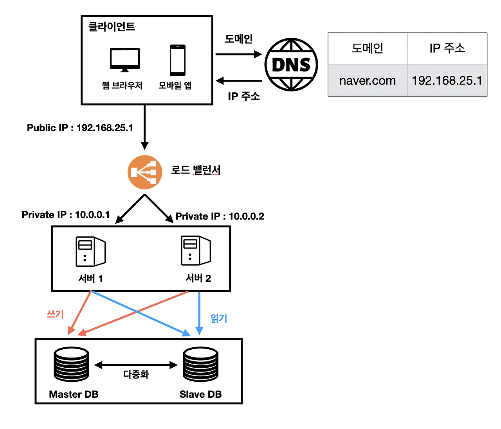

- 사용자는 DNS로부터 로드밸러서의 공개 IP주소를 받는다.
- 사용자는 해당 IP주소를 사용해 로드밸런서에 접속한다.
- HTTP요청은 서버1이나 서버2로 전달된다.
- 웹 서버는 사용자의 데이터를 부 데이터베이스 서버에서 읽는다.
- 웹 서버는 데이터 변경 연산은 주 데이터베이스로 전달한다. (데이터 추가, 삭제, 갱신 연산 등)

## 응답시간 개선 - 캐시

- 캐시
  - 값비싼 연산 결과 또는 자주 참조되는 데이터를 메모리 안에 두고, 뒤이은 요청이 보다 빨리 처리될 수 있도록 하는 저장소
  
- 캐시 계층
  - 데이터가 잠시 보관되는 곳, 데이터베이스보다 훨씬 빠름
  - 별도의 캐시 계층을 두면 성능이 개선될 뿐만 아니라 데이터베이스의 부하를 줄일 수 있음
  - 캐시 계층의 규모를 독립적으로 확장시키는 것도 가능

캐시 계층에 데이터가 있으면 아래 구조로 빠르게 데이터 반환 가능

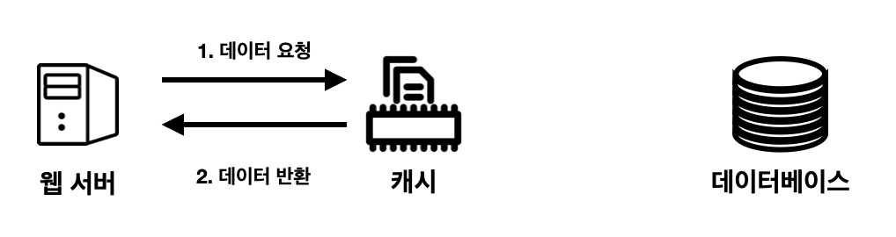

캐시 계층에 데이터가 없으면 DB에서 데이터를 반환받아야 함

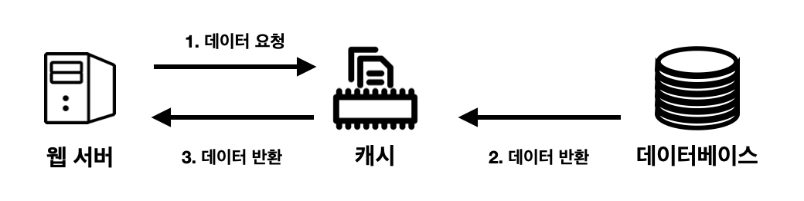

이러한 캐시 전략을 **읽기 주도형 캐시 전략(read-through caching strategy)**이라고 부른다.

이것 이외에도 다양한 캐시 전략이 있음

### 캐시 사용 시 유의할 점

- **캐시는 어떤 상황에 바람직한가?**
  - 데이터 갱신은 자주 일어나지 않지만 참조는 빈번한 상황

- **어떤 데이터를 캐시에 두어야 하는가?**
  - 캐시는 데이터를 휘발성 메모리에 둠
  - 영속적으로 보관할 데이터는 X, 
  

- **캐시에 보관된 데이터는 어떻게 만료되는가?**
  - 만료 정책을 마련해 두어야 함
  - 만료된 데이터는 캐시에서 삭제됨
  - 만료 정책이 없으면 데이터는 캐시에 계속 남음
  - 만료기간은 너무 짧아도 X -> DB를 너무 자주 읽게 됨 / 너무 길어도 X -> 원본과 차이 날 가능석 높아짐
  
- **일관성은 어떻게 유지되는가?**
  - 일관성은 데이터 저장소의 원본과 캐시 내의 사본이 같은지 여부
  - 저장소의 원본을 갱신하는 연산과 캐시를 갱신하는 연산이 단일 트랜잭션으로 처리되지 않는 경우 이 일관성은 깨질 수 있음
  

- **장애에는 어떻게 대처할 것인가?**
  - 캐시 서버를 한 대만 두는 경우 해당 서버는 단일 장애 지점(Single Point if Failure, SPOF)이 되어버릴 가능성이 있음.
  - 어떤 특징 지점에서의 장애가 전체 시스템의 동작을 중단시켜버릴 수 있는 경우, 해당 지점을 단일 장애 지점이라고 부름.
  - SPOF를 피하려면 여러 지역에 걸쳐 캐시 서버를 분산시켜야 함.

- **캐시 메모리는 얼마나 크게 잡을 것인가?**
  - 캐시 메모리가 너무 작으면 데이터가 너무 자주 캐시에서 밀려남. 캐시 성능 하락
  - 해결 방법: 캐시 메모리를 과할당하는 것 -> 캐시에 보관될 데이터가 갑자기 늘어났을 때 생길 문제 방지 가능
  

- **데이터 방출정책은 무엇인가?**
  - 캐시가 꽉 찼을 때 추가로 캐시에 데이터를 넣어야 할 경우 기존 데이터를 내보내야 함
  - LRU(Least Recently Used) : 마지막으로 사용된 시점이 가장 오래된 데이터를 내보냄
  - LFU(Least Frequently Used) : 사용된 빈도가 가장 낮은 데이터를 내보냄
  - FIFO(First In First Out): 가장 먼저 캐시에 들어온 데이터를 가장 먼저 내보냄
  

## 콘텐츠 전송 네트워크(CDN)

- 정적 콘텐츠를 전송하는 데 쓰이는, 지리적으로 분산된 서버의 네트워크
- 이미지, 비디오, CSS, JavaScript 파일 등 캐시 가능
- 사용자가 웹 사이트 방문 시, 지리적으로 가장 가까운 CDN서버가 정적 콘텐츠를 제공함
- 물리적 거리가 가까울 수록 속도가 빠름

[지리적 거리에 따른 속도]
미국 서버를 한국에서 접근하면 느리기에 한국 CDN서버로 빠른 응답 제공
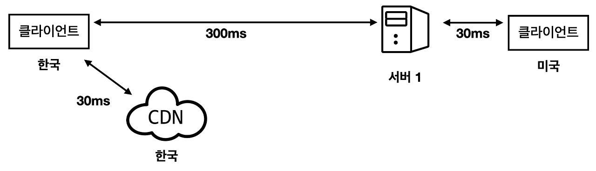

[CDN 동작 방식]
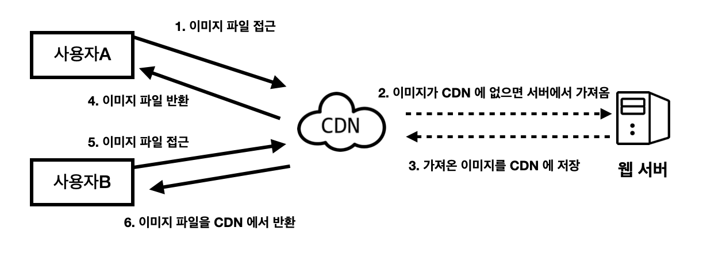
1. 사용자 A가 이미지 파일 접근
2. CDN 서버의 캐시에 이미지가 없으면 원본 서버에서 가져옴
3. 원본 서버가 파일을 CDN 서버에 반환
4. CDN 서버는 파일을 캐시하고 사용자 A에게 반환
5. 사용자 B가 이미지 파일 접근
6. 만료되지 않은 이미지 요청은 CDN 캐시를 통해 반환

### CDN 사용 시 주의 사항

- 비용
  - CDN은 제 3 사업자에 의해 운영되며, 데이터 전송량에 따라 비용 발생
  - 따라서 자주 사용되는 콘텐츠만 캐싱해서 사용

- 적절한 만료 시한 설정
  - 캐시처럼 짧으면 서버와 자주 접속하고, 길면 문제 발생
- CDN 장애 대응
  - CDN 서버 장애 시 원본 서버에서 정적 컨텐츠 제공하도록 시스템 구성
- 컨텐츠 무효화 방법 설정
  - CDN 서비스 사업자가 제공하는 API로 컨텐츠 무효화
  - 컨텐츠의 다른 버전을 서비스하도록 오브젝트 버저닝 이용
    (콘텐츠의 새로운 버전을 지정하기 위해서는 URL 마지막에 버전 번호를 인자로 주면 됨. ex_ image.png?v=2)
  
[CDN과 캐시가 추가된 설계]

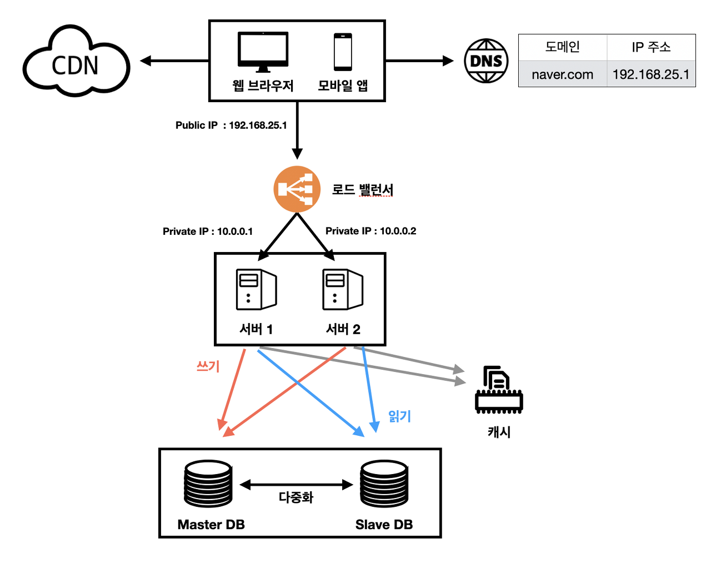

- 정적 컨텐츠(js, css, 이미지 등)은 웹 서버가 아닌 CDN에서 제공하여 응답속도 개선
- 캐시를 통해 DB의 부하를 줄이고 응답속도 개선

## 무상태(stateless) 웹 계층
- 상태 정보를 웹 계층에서 제거하고, DB 같은 지속성 저장소에 보관하고 필요할 때 가져오는 것

## 상태 정보 의존적인 아키텍처
- 서버는 클라이언트(사용자)의 상태 정보를 유지하여 요청들 사이에 공유되도록 함

[상태 정보 의존적인 아키텍처]

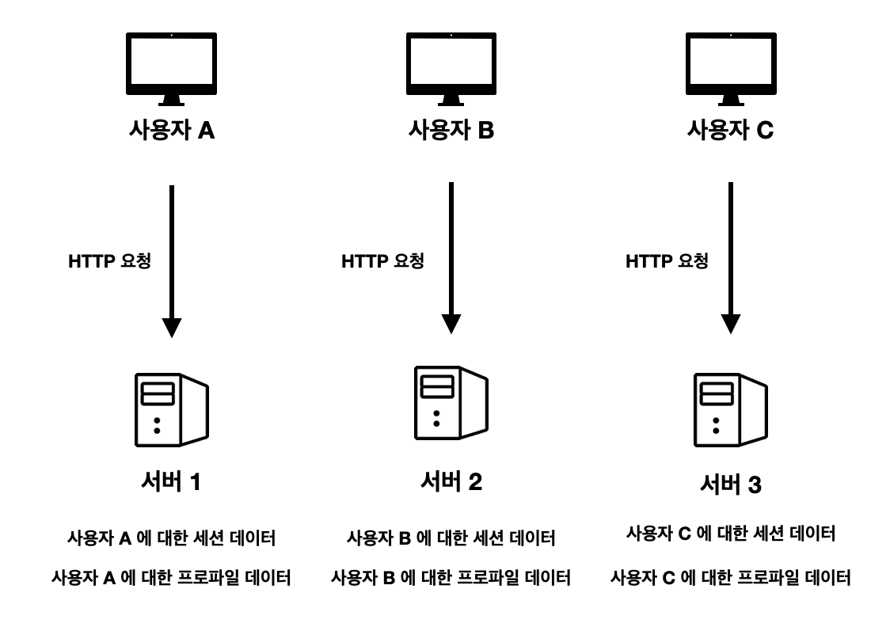

- 같은 클라이언트(사용자)로부터의 요청은 항상 같은 서버로 전송되어야 하는 단점 존재
  - 즉, 사용자 A가 서버 2에 요청하면 새로 로그인을 해야함
  - 이를 위해 로드밸런서가 고정 세션 기능 제공
  - 하지만 고정 세션도 하나의 서버에만 트래픽이 몰릴 수 있는 문제점 존재
  - 또한, 고정 세션을 사용하면 서버 추가 및 제거도 까다로울 수 있음

## 무상태 아키텍처
- 클라이언트 요청은 어떤 웹 서버로도 전달 될 수 있음
- 웹 서버는 상태 정보가 필요할 경우 공유 저장소에서 데이터 가져옴
- 즉, 상태 정보는 웹 서버로부터 물리적으로 분리되어 있음

[무상태 아키텍처]

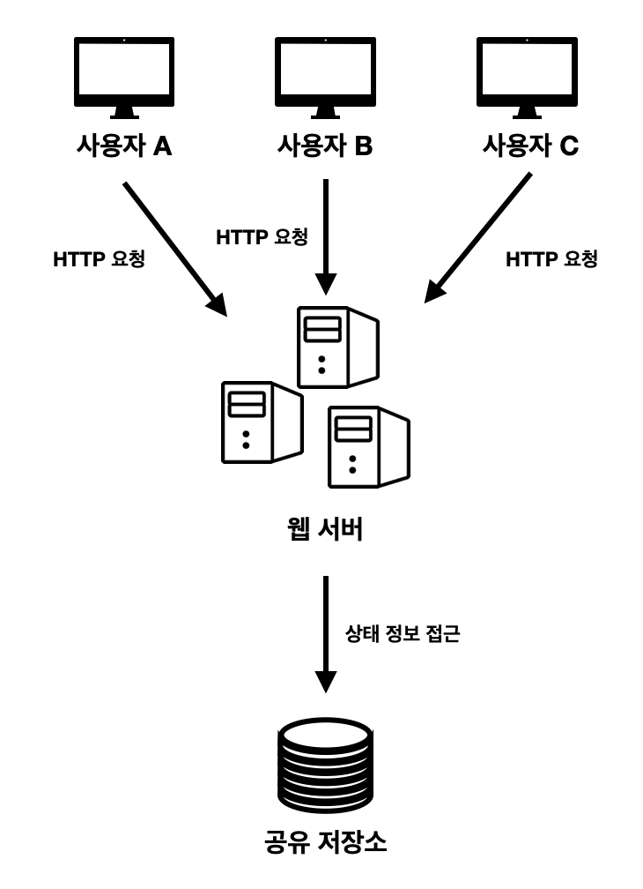

- 이 구조는 단순하고 안정적이며 규모 확장 쉬움
- 공유 저장소는 RDBMS(관계형 데이터베이스), Memcached/Redis(캐시 시스템), NoSQL일 수 있음
  - 자동 규모 확장이 지원되는 저장소 사용을 추천

[무상태 웹 계층이 추가된 아키텍처 설계]

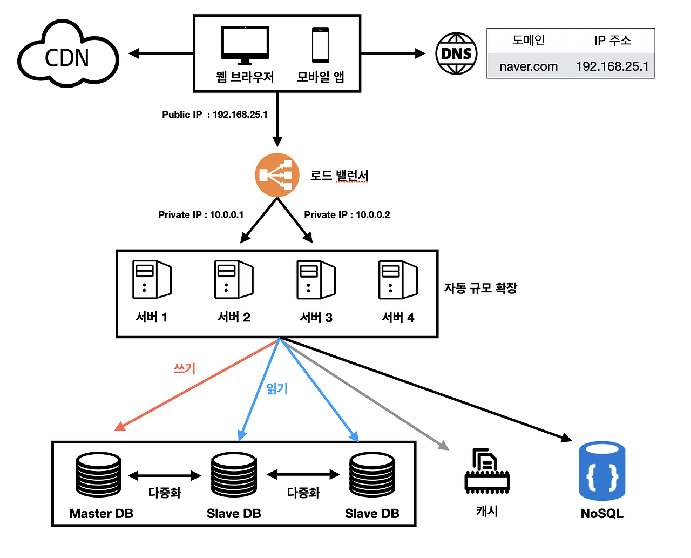

- 세션 데이터를 웹 계층에서 분리하고 지속성 데이터 보관소에 저장 
- 상태 정보가 웹 서버들로부터 제거
- 트래픽 양에 따라 웹 서버 추가 및 제거만 해도 자동으로 규모 확장 가능

## 데이터 센터

- 장애가 없는 상황에서 사용자는 가장 가까운 데이터 센터에서 처리됨
- 이를 지리적 라우팅(geoDNS-routing)이라고 함
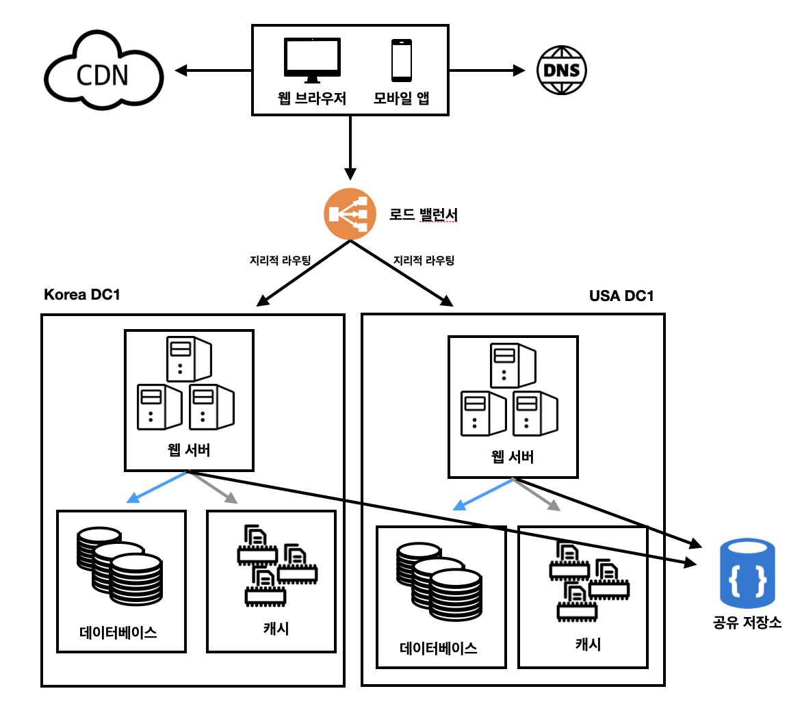

- 한국 사용자는 Korea DC1, 미국 사용자는 USA DC1로 안내됨
- 만약 데이터 센터 하나가 장애 발생 시, 다른 데이터 센터로 모든 트래픽이 전송됨

## 다중 데이터센터 구성 시 주의사항
- 트래픽 우회: 올바른 데이터 센터로 트래픽을 보내는 효과적인 방법 찾기
  - GeoDNS는 사용자에게서 가장 가까운 데이터센터로 트래픽을 보낼 수 있도록 해 준다.

- 데이터 동기화 
  - 데이터 센터마다 별도의 데이터베이스를 사용하고 있는 상황이라면, 장애가 자동으로 복구되어 트래픽이 다른 데이터베이스로 우회된다 해도, 해당 데이터센터에는 찾는 데이터가 없을 수 있다.
  - 이런 상황을 막는 보편적인 전략은 데이터를 여러 데이터 센터에 걸쳐 다중화하는 것이다.(넷플릭스 다중화 참고)

- 테스트와 배포
  - 여러 데이터 센터를 사용하도록 시스템이 구성된 상황이라면 웹 사이트 또는 애플리케이션을 여러 위치에서 테스트해보는 것이 중요하다.
  - 자동화된 배포 도구는 모든 데이터 센터에 동일한 서비스가 설치되도록 하는데 중요한 역할을 한다.

위와 같은 주의사항(분산 시스템의 여러 문제들)을 해결하기 위해 **메시지 큐**를 사용하기도 한다.

## 메시지 큐, 로그, 메트릭, 자동화

## 메시지 큐
- 메시지 큐는 메시지의 무손실을 보장하는 비동기 통신을 지원하는 컴포넌트
- 즉, 메시지 큐에 보관된 메시지는 꺼낼 때까지 안전히 보관된다는 특성을 지님

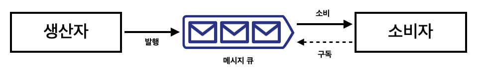

1. 생산자 or 발행자라고 불리는 입력 서비스가 메시지를 메시지 큐에 발행
2. 큐에는 소비자 or 구독자라고 불리는 서비스 혹은 서버사 연결되어 있음
3. 소비자가 메시지를 받아 그에 맞는 동작을 수행

### 메시지 큐 장점
- 메시지 큐를 이용하면 서비스 or 서버 간 결합이 느슨해짐
  - 따라서 규모 확장성이 보장되어야 하는 안정적 애플리케이션을 구성하기 좋음
- 생산자는 소비자 프로세스가 다운되어 있어도 메시지 발행 가능
- 소비자는 생산자 서비스가 가용한 상태가 아니라도 메시지 수신 가능

### 메시지 큐로 데이터 동기화

데이터 센터간 독립적인 DB로 데이터 불일치 문제가 있을 수 있다.

이러한 문제는 데이터베이스 다중화(넷플릭스 다중화 참고)나 여러 해결방법이 있지만 메시지 큐를 이용한 방법도 있다.

[데이터 변경 시 다른 DB에 알려줘서 데이터 반영하기]

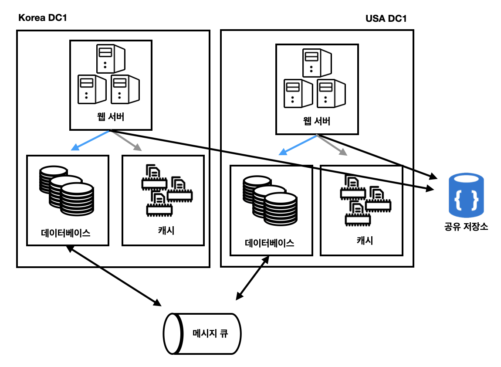

## 로그
- 에러 로그로 시스템 오류와 문제를 보다 쉽게 찾아낼 수 있기에 중요함
- 에러 로그는 서버 단위 모니터링 가능
- 로그를 단일 서비스로 모아주는 도구를 활용하면 더 편리하게 검색 및 조회 가능

## 메트릭
- 특정 수치들을 시각화해서 보여주거나 그대로 알려주는 것
- 메트릭을 잘 수집하면 사업 현황에 관한 유용한 정보를 얻거나, 현 시스템 상태를 손쉽게 파악 가능
- 호스트 단위 메트릭: cpu, 메모리, 디스크, I/O 등
- 종합 메트릭: DB 계층 성능, 캐시 계층 성능 등
- 핵심 비즈니스 메트릭: 일별 능동 사용자, 수익, 재방문 등

## 자동화
- 시스템이 크고 복잡해지면 생산성을 높이기 위해 자동화 도구를 사용해야 함
- 지속적 통합(CI)을 도와주는 도구를 활용하면 쉽게 문제 감지 가능
- 빌드,테스트, 배포 등의 절차를 자동화하여 개발 생산성 크게 향상 가능

[메시지 큐, 로그, 메트릭, 자동화를 반영한 아키텍처 구조]

- 메시지 큐는 각 컴포넌트가 느슨히 결합될 수 있도록 하고, 결함에 대한 내성 높임
  - 시간이 오래 걸리는 작업은 메시지 큐에 넣고, 작업 서버가 비동기적으로 꺼내서 처리함

- 로그, 모니터링, 메트릭, 자동화 등을 지원하기 위한 장치 추가

## 데이터베이스 규모 확장

서비스 규모가 커지면 DB부하도 같이 증가한다.
그렇기에 DB 확장에 대한 다음 2가지 방법을 생각해야 한다.

1. 수직적 규모 확장
2. 수평적 규모 확장

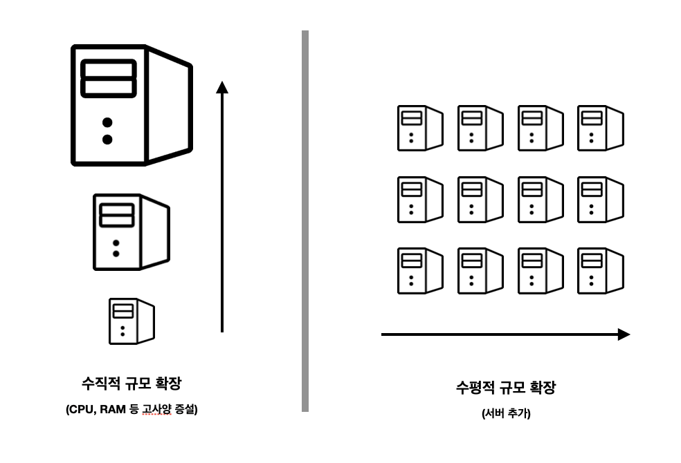

## 수직적 확장

- 기존 서버의 자원(CPU, RAM 등)을 고사양 or 더 많이 증설하는 방법
- 하드웨어의 한계로 무한 증설 X
- 서버 1대로 모든 트래픽 감당 X
- SPOF(Single Point of Failure) 위험성 증가
- 고성능 자원일수록 비용 증가

## 수평적 확장
- DB의 수평적 확장은 샤딩(sharding)이라고 부름
- 더 많은 서버 추가로 성능 향상시키는 방법
- 샤딩은 대규모 DB를 샤드하고 부르는 작은 단위로 분할하는 기술
- 모든 샤드는 같은 스키마를 사용하지만 샤드에 보관되는 데이터에는 중복 X

[샤드로 분할된 DB 예시]

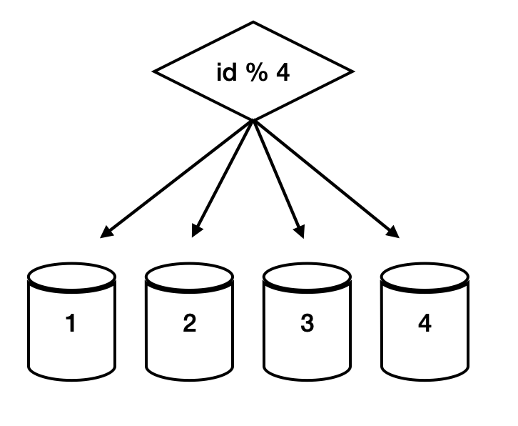

- 위 예시는 id%4 조건을 해시 함수로 사용하여 데이터가 보관될 샤드를 정함

[DB에 들어가는 데이터 예시]

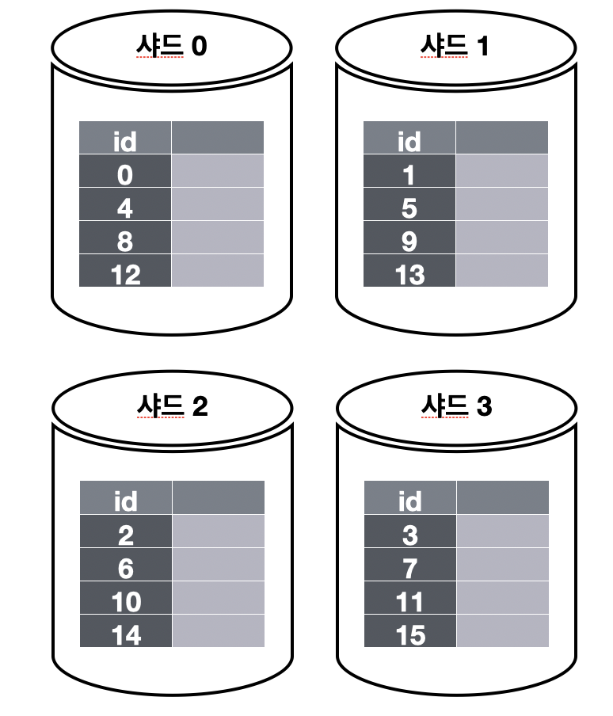

- 샤딩 전략 구현 시 샤딩 키 정의가 중요함
  - 샤딩 키는 파티션 키라고 부름
  - 데이터가 어떻게 분산될지 정하는 하나 이상의 컬럼으로 구성됨
  - 위 그림 예시에서는 샤딩 키는 id
  - 샤딩 키로 데이터 조회나 변경을 처리하므로 효율 높일 수 있음
  - 샤딩 키는 데이터를 고르게 분할할 수 있도록 하는게 중요함

### 샤딩 도입 시 생길 수 있는 문제

- 데이터의 재 샤딩
  - 데이터가 너무 많아져서 하나의 샤드로 감당 못할 때
  - 샤드 간 데이터 분포가 균등하지 못하여 특정 샤드만 공간 소모가 심할 때
  - 위 2가지 상황을 샤드 소진(shard exhaustion)이라고 부르며, 이 때 재 샤딩 발생
  - 샤드 소진 시, 샤드 키를 계산하는 함수를 변경하고 데이터를 재배치 해야함
  - 안정 해시(consistent hashing) 기법 활용하여 문제 해결 가능
 
- 유명인사 문제
  - 핫스팟 키(hotspot key) 문제라고도 부름
  - 특정 샤드에 질의가 집중되어 서버에 과부하 생기는 문제
  - 해결하려면 특정 샤드 데이터를 분산시키거나 더 잘게 쪼개야 함

- 조인과 비정규화
  - 하나의 DB를 여러 샤드 서버로 쪼개면 데이터 조인이 힘들어짐
  - 해결하려면 DB 비정규화하여 하나의 테이블에서 질의가 수행되도록 하는 것

### DB 샤딩을 적용한 아키텍처 구조

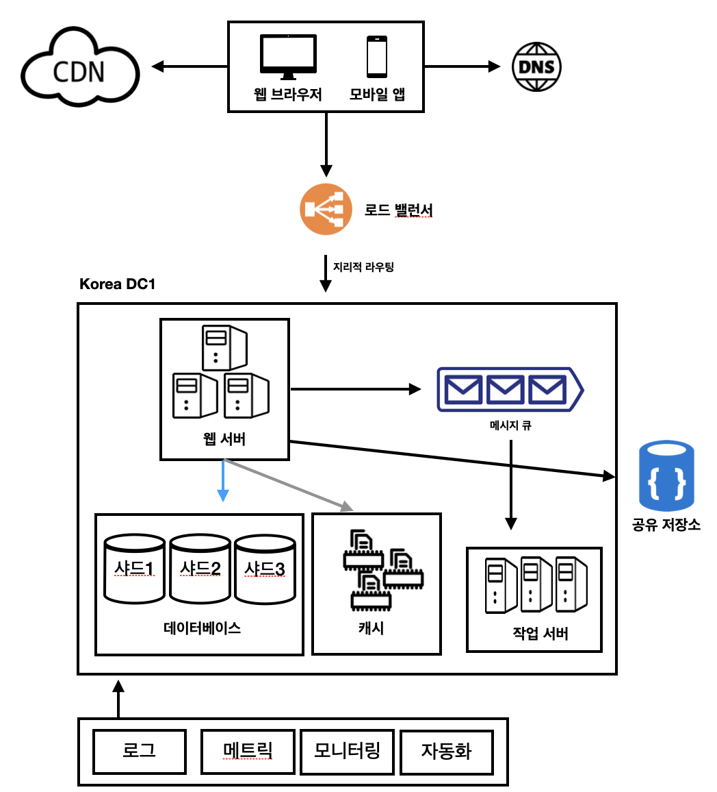

## 지금까지 아키텍처 구조 정리

- 웹 계층은 무상태 계층으로
- 모든 계층에 다중화 도입
- 접근이 많은 데이터는 가능한 많이 캐시할 것
- 여러 데이터 센터를 지원하여 지리적 라우팅 할 것
- 정적 콘텐츠는 CDN 서비스할 것
- 데이터 계층은 샤딩을 통해 규모 확장
- 각 계층은 독립적 서비스로 분할할 것
- 시스템을 지속적으로 모니터링하고, 자동화 도구 활용할 것