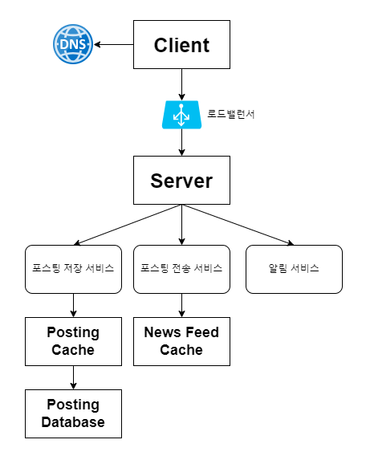
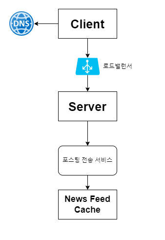
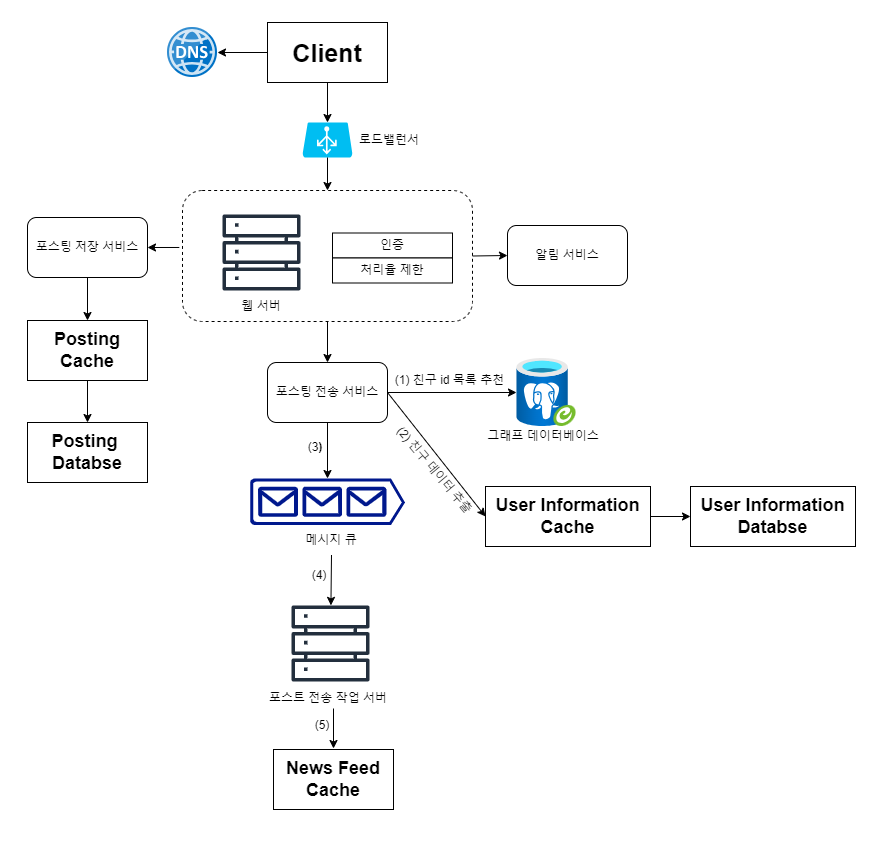
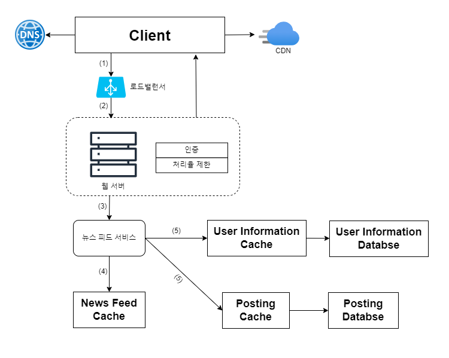

## 3장 시스템 설계 면접 공략법
- 시스템 설계 면접에 관한 유용한 팁
- 시스템 설계 문제를 공량하는 효과적 접근법

### 효과적 면접을 위한 4단계 접근법
#### 1단계: 문제 이해 및 설계 범위 확정
- 올바른 질문
- 적절한 가정
- 시스템 구축에 필요한 정보 모으기

**예제**: 뉴스 피드(news feed) 시스템 설계
- 모바일 앱과 웹 지원 여부: 둘 다 지원
- 가장 중요한 기능: 새로운 포스트을 올리고, 다른 친구의 뉴스 피드 탐색
- 포스트의 가중치 여부: X -> 포스트는 시간 역순 정렬
- 사용자 친구 수 제한: 5000명
- 트래픽 규모: 일간 능동 사용자(daily active user, DAU)는 천만명
- 이미지와 비디오 같은 미디어 파일 첨부 가능 여부: O

 

#### 2단계: 개략적인 설계안 제시 및 동의 구하기
**예제**: 뉴스 피드 시스템의 개략적 설계 

- 피드 발행: 사용자가 포스트를 올리면 관련된 데이터가 캐시/데이터베이스에 기록되고, 해당 사용자의 친구 뉴스 피드에 뜨게 됨

 

- 피드 생성: 사용자의 뉴스 피드는 해당 사용자 친구들의 포스트를 시간 역순으로 정렬하여 만듦

 

#### 3단계: 상세 설계
- 설계 대상 컴포넌트 사이의 우선순위 정하기   
  - 시스템의 성능 특성: 시스템의 병목 구간이나 자원 요구량 추정치에 초점
  - 단축 URL 생성기(URL shortener) 설계: 해시 함수의 설계 설명
  - 채팅 시스템: 지연시간(latency)을 줄이고 사용자의 온/오프라인 상태를 표시할 방법 

**에제**: 뉴스 피드 시스템 상세 설계

- 피드 발행
  - ❓[그래프 DB를 이용한 추천 시스템](https://bitnine.tistory.com/508)

 

- 뉴스 피드 가져오기(news feed retrieval)

 

#### 4단계: 마무리
- 시스템 병목구간, 좀 더 개선 가능한 지점
- 오류가 발생하면 무슨 일이 생기는지(서버 오류, 네트워크 장애 등)
- 운영 이슈 
  - 매트릭 수집
  - 모니터링
  - 로그
  - 시스템 배포
- 사용자 규모 증가
- 세부적 개선사항들
