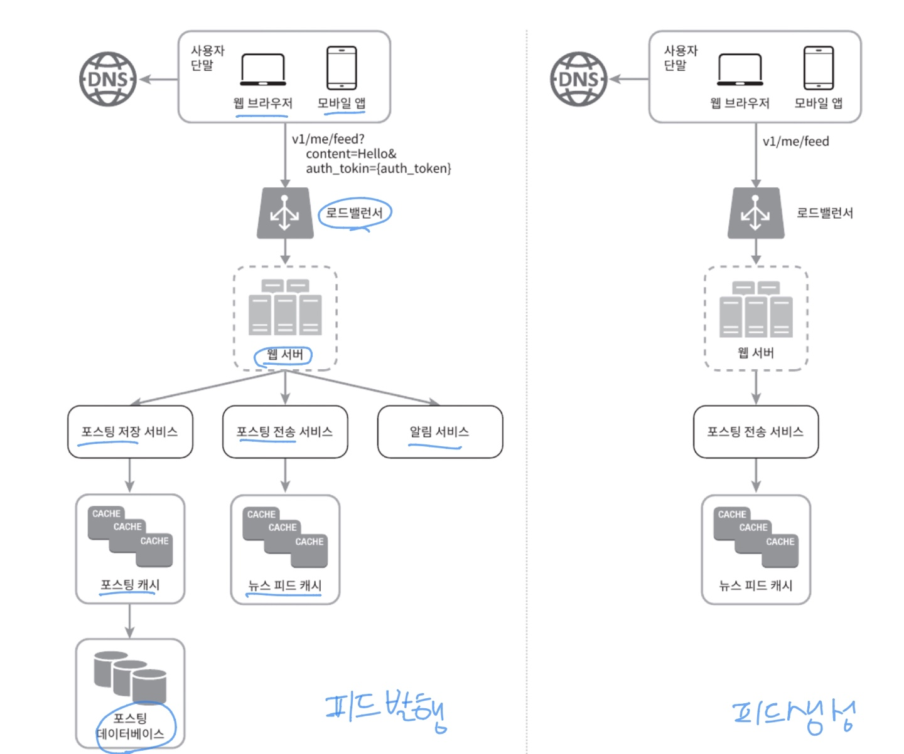
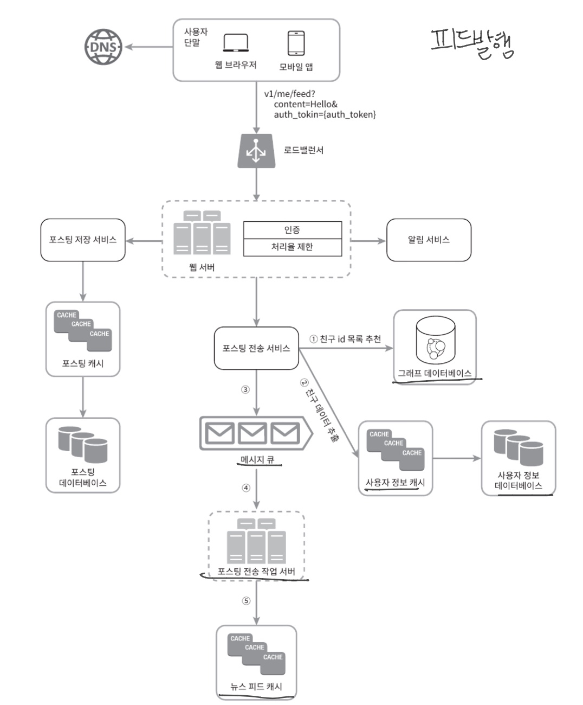
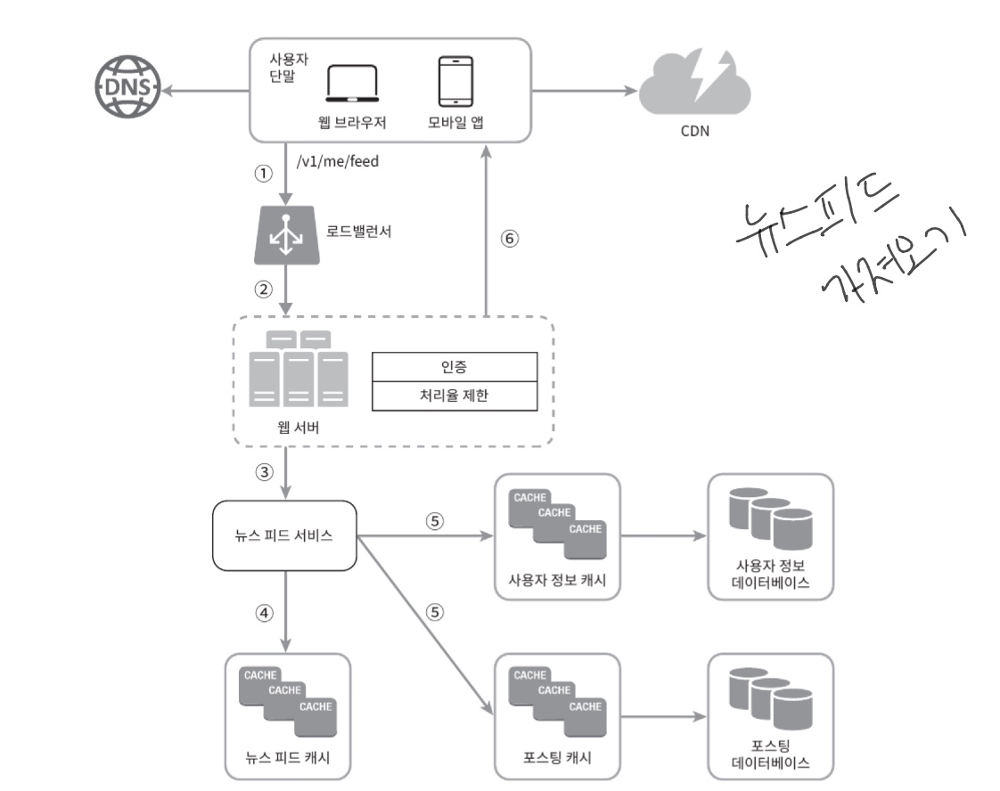

# 시스템 설계 면접 공략법

## 시스템 설계 면접이 있는 이유?

``` 시스템 설계 면접은 두 명의 동료가 모호한 문제를 풀기 위해 협려가여 그 해결책을 찾아내는 과정에 대한 시뮬레이션```

- 정해진 결말 X
- 정해진 답 X

설계 과정에서 내린 결정들에 대한 방어 능력을 보이는 자리

면접관의 피드백을 건설적인 방식으로 처리할 자질이 있음을 보이는 자리

지원자가 협력에 적합한 사람인지

압박이 심한 상황도 잘 헤쳐 나갈 자질이 있는지

모호한 문제를 건설적으로 해결할 능력이 있는지

## 부정적 신호 - 과도한 엔지니어링
- 설계의 순수성에 집착한 나머지 타협적 결정을 도외시하고 과도한 엔지니어링을 하게 됨
  - 이는 시스템 전반의 비용을 올림
  - 완고함, 편협함


# 효과적 면접을 위한 4단계 접근법

## 1단계: 문제 이해 및 설계 범위 확정

**요구사항을 완전히 이해하지 않고 생각 없이 바로 답을 내는 것은 엄청난 부정적 신호**

### 요구사항을 정확히 이해하는 데 필요한 질문을 하라.

- 구체적으로 어떤 기능들을 만들어야 하나?
- 제품 사용자 수는 얼마나 되나?
- 회사의 규모는 얼마나 빨리 커지리라 예상하나? 석 달, 여섯 달, 일년 뒤의 규모는 얼마가 되리라 예상하는가?
- 회사가 주로 사용하는 기술 스택은 무엇? 설계를 단순화하기 위해 활용할 수 있는 기존 서비스로는 어떤 것들이 있는가?

## 2단계: 개략적인 설계안 제시 및 동의 구하기

- 설계안에 대한 최초 청사진을 제시하고 의견 구하기
- 핵심 컴포넌트를 포함하는 다이어그램을 그리기 (클라이언트(모바일/웹), API, 웹 서버, 데이터 저장소, 캐시, CDN, 메시지 큐)
- 이 최초 설계안이 시스템 규모에 관계된 제약 사항들을 만족하는지를 개략적으로 계산해보기
- 가능하다면 시스템의 구체적 사용 사례 살펴보기 - API 엔드포인트나 데이터베이스 스키마도 보여야 하는가는 질문에 따라 다름 -> 면접관에게 의견 묻기


## 3단계 : 상세 설계
- 설계 대상 컴포넌트 사이의 우선순위를 정하기
- 시스템의 병목 구간, 자원 요구량 추정치에 초점
  - 단축 url 생성기 설계: 해시 함수 설계를 구체적으로 설명
  - 채팅 시스템: 지연시간을 줄이고 사용자의 온/오프라인 상태를 표시할 것인지를 설명
- 시간 관리 중요

## 4단계: 마무리
- 면접관은 후속 질문을 던질 수도, 면접자 스스로 추가 논의를 진행하도록 할 수 있음
- 개선할 점은 언제나 있으니 완벽하다고 생각하지 말기
- 만든 설계를 한번 다시 요약해주는 것 Good
- 오류가 발생하면 무슨 일이 생기는지(서버 오류, 네트워크 장애 등)
- 운영 이슈(메트릭은 어떻게 수집, 로그는?, 시스템은 어떻게 배포할 것인지?)
- 미래에 닥칠 규모 확장 요구에 어떻게 대처할 것인지?


# 정리 - 해야할 것 vs 하지 말아야 할 것


### 해야 할 것
- 질문을 통해 확인
- 문제의 요구사항을 이해하라
- 정답이나 최선의 답안 같은 것은 없다.
- 면접관이 자신의 사고 흐름을 이해할 수 있도록 하라
- 가능하다면 여러 해법을 함께 제시
- 개략적 설계에 면접관이 동의하면, 각 컴포넌트의 세부사항을 설명하기 시작하라- 가장 중요한 컴포넌트부터 진행하라
- 면접관의 아이디어를 이끌어 내라
- 포기하지 말라


### 하지 말아야 할 것
- 전형적인 면접 문제들에도 대비하지 않은 상태에서 면접장에 가지 마라
- 요구사항이나 가정들을 분명히 하지 않은 상태에서 설계를 제시하지 마라
- 처음부터 특정 컴포넌트의 세부사항을 너무 깊이 설명하지 마라- 개략적인 설계를 마친 후에 세부사항으로 나아가라
- 진행 중에 막혔다면, 힌트를 청하기를 주저하지 말라- 소통을 주저하지 말라
- 의견을 일찍, 그리고 자주 구하라


# 4단계 시간 배분
1단계: 문제 이해 및 설계 범위 확정 - 3분에서 10분

2단계: 개략적 설계안 제시 및 동의 구하기 - 10분에서 15분

3단계: 상세설계 - 10분에서 25분

4단계: 마무리 - 3분에서 5분


예시) 

**뉴스 피드 시스템을 설계하라**

1단계: 문제 이해 및 설계 범위 확정

```
지원자: 모바일 앱과 웹 앱 가운데 어느쪽을 지원해야하나요? 아니면 둘 다일까요?

면접관 : 둘 다 지원해야합니다.

지원자: 가장 중요한 기능은 무엇인가요?
면접관 : 새로운 포스트를 올리고, 다른 친구의 뉴스 피드를 볼 수 있도록 하는 기능입니다.

지원자: 이 뉴스 피드는 시간 역순으로 정렬되어야 하나요? 아니면 다른 특별한 정렬 기준이 있습니까?
제가 특별한 정렬 기준이 있느냐고 묻는 이유는, 피드에 올라갈 포스트마다 다른 가중치가 부여되어야 하는지 알고 싶어서 인데요,
가령 가까운 친구의 포스트가 사용자 그룹에 올라가는 포스트보다 더 중요하다거나

면접관 : 문제를 단순하게 만들기위해 일단 시간 역순으로 정렬된다고 가정합시다.

지원자: 한 사용자는 최대 몇 명의 사용자와 친구를 맺을 수 있나요?
면접관 : 5000명입니다.

지원자: 사이트로 오는 트래픽 규모는 어느정도입니까?

면접관 : 일간 능동 사용자는 천만 명입니다.

지원자: 피드에 이미지나 비디오도 올라올 수 있나요? 아니면 포스트는 그저 텍스트입니까?

면접관 : 이미지나 비디오 같은 미디어 파일도 포스트할 수 있어야 합니다.

```

2단계 : 개략적인 설계안 제시 및 동의 구하기

개략적으로 보자면 이 설계는 두가지 플로(flow)로 나눠 생각해 볼 수 있다.
피드 발행, 피드 생성

- 피드 발행: 사용자가 포스트를 올리면 관련된 데이터가 캐시/데이터베이스에 기록되고, 해당 사용자의 친구 뉴스 피드에 뜨게 된다.
- 피드 생성: 어떤 사용자의 뉴스 피드는 해당 사용자 친구들의 포스트를 시간 역순으로(최신 포스트부터 오래된 포스트 순으로) 정렬하여 만든다.



3단계: 상세 설계




(11장에서 자세히 설명)
4단계: 마무리(설계 요약, 오류 발생 시 어떤 일이 생기는지?, 운영 이슈, 미래에 닥칠 규모 확장 요구 대처 방법 등등)
