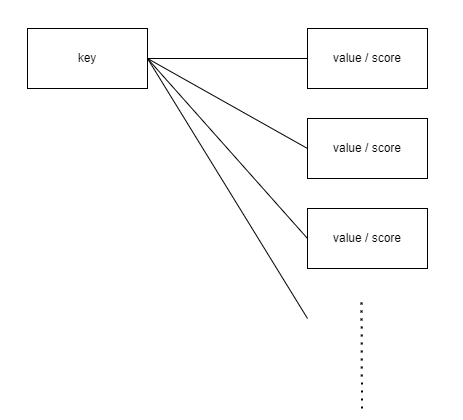

- 발표자 : 허민영
- 날짜 : 2024-03-20(수)
- 내용 : 4장. 처리율 제한 장치의 설계

---
## 질문
> 1. 고정윈도와 이동윈도로깅의 차이점

 
고정윈도 : 
일정한 시간 간격으로 윈도우가 정의됩니다. 
각 윈도우는 일정한 시간 동안 유지되며, 이 기간 동안에만 해당 윈도우 내의 요청이 관리합니다. 
윈도우가 닫힌 후에는 해당 윈도우에 들어왔던 요청들은 로그에서 삭제됩니다. 

 
이동윈도로깅 : 
윈도우의 크기가 고정이 되어있지 않습니다. 
요청이 도착할 때마다 윈도우가 이동하며 윈도우 내에 들어온 요청들을 관리합니다. 
이동 윈도우에서는 요청이 윈도우 내에 들어오면 해당 요청이 윈도우를 벗어날 때까지 로그에 남게 됩니다. 
만약 윈도우를 벗어난 요청이 윈도우 내에 재진입할 때는 해당 요청이 다시 처리될 수 있습니다. 
 

> 2. 고정윈도 카운터 알고리즘에서 새로운 요청이 열릴 때까지 버려진다는 점이 무슨소리인가?

타임라인을 고정된 간격의 윈도로 나누고, 각 윈도마다 카운터를 붙입니다. 
초당 3개까지의 요청을 허용할때, 새 요청이 열린다는 의미는  
아마 1초 후 새요청이 들어올 때를 의미하는 것 같습니다. 
즉, 새로운 시간 간격이 시작될 때까지를 의미합니다.

 

> 3. 고정 윈도 카운터 알고리즘은 시간을 어떻게 측정하는지?

새로운 윈도가 열릴 때, **해당 윈도의 카운터는 초기화**되며 새로운 요청이 들어왔을 때부터 새로운 카운트가 시작됩니다. 
따라서 이미 버려진 요청은 다시 실행되지 않습니다. 
이러한 방식으로 고정 윈도 카운터 알고리즘은 과부하를 효과적으로 관리할 수 있습니다. 
 

> 4. 이동 윈도로깅은 마지막 시간을 기준으로 상대적으로 측정하는건지?

마지막 시간을 기준으로 이전 1분까지 측정하는 것 같습니다.
 
---
## 기타 논의사항

- 레디스의 정렬집합이란 무엇인가?

  - key 하나에 여러개의 score와 value로 구성하는 자료구조입니다.
  - Value는 score로 sort되며 중복되지 않습니다. 
  - Score가 같으면 value로 sort됩니다. 
  - Sorted Sets에서는 집합이라는 의미에서 value를 member라 부릅니다. 
  - Sorted Sets은 주로 sort가 필요한 곳에 사용됩니다.

 간단히 정리하자면, 한 Key에 여러 value와 score를 가지고 있으며 중복되지 않는 value로 score순으로 데이터를 정렬합니다.

- 경성 또는 연성 처리율 제한  
  - 경성 처리율 제한: 요청의 개수는 임계치를 절대 넘어설 수 없습니다.
    - 예) 시스템이 초당 100개의 요청을 처리할 수 있다고 가정하면, 경성 처리율 제한을 100으로 설정하여 초당 요청이 이 수를 초과하면 추가적인 요청은 거부되도록 설정할 수 있습니다. 이렇게 하면 시스템이 과부하 상태에 빠지는 것을 방지하고 안정적으로 동작할 수 있습니다.
        
  - 연성 처리율 제한
    - 요청 개수는 잠시 동안은 임계치를 넘어설 수 있습니다.
      - 시스템이 처음에는 초당 100개의 요청을 처리할 수 있지만 시간이 지남에 따라 처리율을 조절할 수 있습니다. 이를 통해 예상치 못한 부하가 발생했을 때 시스템이 유연하게 대응할 수 있습니다.
      - 연성 처리율 제한은 시스템이 자원을 효율적으로 활용하고 과부하를 방지하는 데 도움이 됩니다. 예를 들어, **특정 시간대에는 사용량이 많고 다른 시간대에는 적을 때** 이를 반영하여 시스템의 성능을 최적화할 수 있습니다.