# 처리율 제한 장치의 설계
- 처리율 제한 장치
  - 클라이언트 또는 서비스가 보내는 트래픽의 처리율을 제어하기 위한 장치 
    ex
    - 사용자는 초당 2회 이상 새 글을 올릴 수 없다.
    - 같은 IP 주소로는 하루에 10개 이상의 계정을 생성 할 수 없다.
    - 같은 디바이스로는 주당 5회이상 리워드 요청을 할 수 없다.
  
- api 처리율 제한 장치를 두면 좋은 점
  - Dos(Denial of Service)의 공격에 대한 자원 고갈을 방지 할 수 있음
  - 비용 절감 -> api 호출에 대한 과금 횟수가 줄어듦
  - 서버 과부하를 막음 -> 봇에서 오는 트래픽이나 사용자의 잘못된 이용 패턴으로 유발된 트래픽을 걸러내는데 처리율 제한 장치를 활용할 수 있음

1단계)  문제 이해 및 설계 범위 확정
---
--- 
- 면접관과 소통하면서 어떤 제한 장치를 구현해야 하는지 분명하게 할 수 있음
  - 클리이언트 측 제한 장치인가? 서버 제한 장치인가?
  - 어떤 기준을 통해 호출을 제한하는가? 어떤 제어 규칙을 사용하는가?
  - 시스템 규모는 어떻게 되는가?
  - 분산된 환경을 고려해야하는가?
  - 제한된 경우, 클라이언트에게 알려주어야 하는가?

### 요구 사항
--- --- 
- 처리율 초과하는 요청은 정확하게 제한
- 낮은 응단 시간: 응단 시간에 나쁜 영향을 주면 안됨
- 가능한 적은 메모리 사용
- 분산형 처리율 제한: 하나의 처리율 제한 장치를 여러 서버나 프로세스에서 공유할 수 ㅇㅆ어야 함
- 예외 처리: 요청이 제한된 경우, 클라이언트가 알 수 있어야함
- 높은 결함 감내성: 제한 장치에 장애가 생겨도 전체 시스템에 영향을 주면 안됨

2단계) 개략적 설계안 제시 및 동의 구하기
---
- 복잡한 구조를 피하고 기본적인 클라이언트-서버 통신 모델 사용
### 처리율 제한 장치는 어디에 둘 것인가?
- 클라이언트
  - 좋지 않음 -> 위변조 가능, 모든 클라이언트 주현을 통제하는 것 어려움

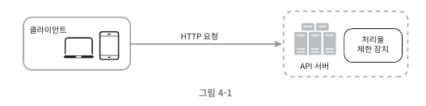

- 서버
  - 서버에 제한 장치를 둚
  
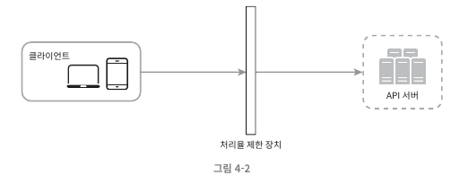
- 미들웨어
  - 요청이 서버에 들어가기 이전 미들웨어에서 먼저 통제
  - 제한된 요청이라고 판단되면 서버에 안보내고, 미들웨어 단에서 HTTP 429(too many requests) 반환
  - Cloud MSA 구조에서 보통 API Gateway를 활용 -> 처리율 제한, SSL termination, 사용자 인증 ip whiltelist(ip 허용 목록 리스트) 등 지원

- 어디에 둘 것인지 정답은 없음
  - 고려할 점
    - 프로그래밍 언어, 캐시 서비스 등 기술 스택 점검 → 현재 서버 측 언어를 통해 구현이 가능한가? 충분한가?
    - 현재 비즈니스에 맞는 처리율 제한 알고리즘 찾기 → 미들웨어 및 제 3자가 서비스하는 Gateway를 사용한다면 적절한 알고리즘이 있는지 확인.
    - MSA 구조를 사용하고 있어 이미 API Gateway 사용하고 있다면, 기존 API Gateway에 Rate limiter(처리 제한) 포함시키는 것 고려
### 처리율 제한 알고리즘
--- ---
- 토큰 버킷 (Token bucket)
- 누출 버킷 (Leaky bucket)
- 고정 윈도 카운터 (Fixed window counter)
- 이동 윈도 로그 (Sliding window log)
- 이동 윈도 카운터 (Sliding window counter)

#### 토큰 버킷 알고리즘
- 지정된 용량을 갖는 컨테이너인 토큰 버킷
- 이 버켓에는 사전 설정된 양의 토큰이 주기적으로 채워짐
- 토큰이 꽉 찬 버킷에는 더 이상의 토큰이 추가 되지 않음
  - ex
    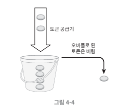
    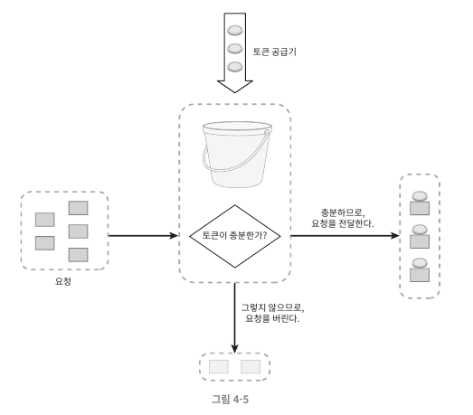
    - 각 요청은 처리될 때 마다 하나의 토큰을 사용함
    - 요청이 도착하면 버킷에 충분한 토큰이 있는지 검사
      - 충분한 토큰이 있는 경우, 버킷에서 토큰 하나를 꺼낸후 요청 시스템으로 전달
      - 없는경우, 해당 요청 버려짐
        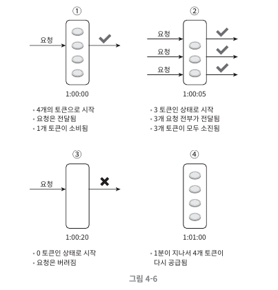
- 2개의 인자를 받음
  - 버킷 크기: 버킷에 담을 수 있는 토큰의 최대 개수
  - 토큰 공급률: 초당 몇개의 토큰이 버킷에 공급되는가

- 장점
  - 구현이 쉬움
  - 메모리 사용 측면에서도 효율적
  - 짧은 시간에 집중되는 트래픽(burst of traggic)도 처리 가능
  - 버킷에 넘은 토큰이 있기민 히면 여청은 시스템에 전달 될 것이며, 없다면 요청이 안감
- 단점
  - 버킷 크기와 토큰 공급률을 튜닝하기 까다로움

#### 누출 버킷 알고리즘
- 토큰 버킷 알고리즘과 비슷 but 요청 처리율이 고정 되어있다는 점에서 다름
보통 FIFO 큐로 구현해 사용됨
  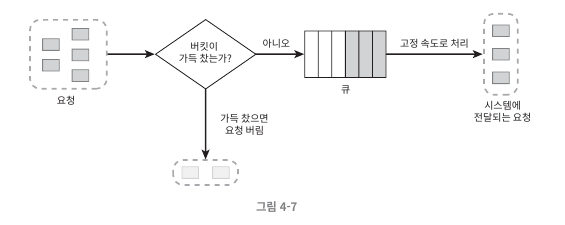
  - 요청이 도착하면 큐가 가득 차 있는지 확인
  - 빈자리가 있으면, 요청을 규에 추가
  - 빈자리가 없으면, 요청을 버림
  - 지정된 시간 마다 큐에서 요청을 꺼내어 처리
- 2개의 파라미터
  - 버킷 크기: 큐 사이즈 값
  - 처리율: 지정된 시간 당 몇 개의 항목을 처리할 것인가(초단위)
- 장점
  - 큐의 크기가 제한되어있어 메모리 사용량에 효율적
  - 고정된 처리율-> 안정적 출력이 필요한 경우 적합
- 단점
  - 단시간에 트래픽이 몰리는 경우(Burst of traffic), 큐에는 오래된 요청이 쌓임 → 제때 처리 못하면 최신 요청들 버려짐
  - 토큰 버킷과 마찬가지로 튜닝하는게 까다로울 수 있음

#### 고정 윈도 카운터 알고리즘
  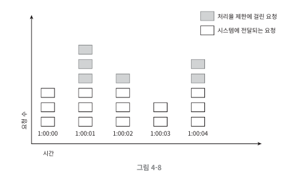

- 타임라인을 고정된 간격의 윈도로 나누고, 윈도마다 카운터를 붙임
- 요청마다 카운터를 1씩 증가시킴, 카운터 값이 임계치에 도달하면 새로운 요청은 새 윈도우가 열릴 때까지 버려짐
- 위 예시는 시간 단위 1초, 처딩 4게낒; 허영힌디/ 매초마다 열리는 윈도에 3개 이상의 요청이 밀려오면 초과분은 버려지게 됨
--- 
- 문제점
  - 윈도의 경계 부근에 순간적으로 많은 트래픽이 집중 될 경우 윈도 할당 된 양보다 더 많은 요청을 처리할 수 있음
  - 예시
    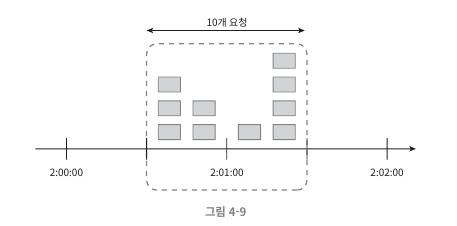
    - 만약 이 시스템은 분당 5개의 요청을 처리하는 시스템인데 예시 처럼 요청을 들이는 경우  2:00:30 ~ 2:01:30 동안 1분동안 보면
      1분에 10개의 요청을 처리
- 장점
  - 메모르 효율이 좋음
  - 이해하기 쉬움
  - 윈도가 열릴 때 카운터가 초기화되는 방식은 특정 트래픽 패턴을 처리하기 적합함
    특정 패턴이란..어떤 걸까
- 단점
  - 위에서 설명한 문제처럼 윈도 경계부분에 요청이 몰리면, 제한하고 싶은 한도보다 많은 요청을 처리할 수 있음

#### 이동 윈도 로깅 알고리즘
고정 윈도 알고리즘의 문제점 해결
- 요청의 타임스탬프를 추적, 타임 스탬프 로그를 레디스 또는 정렬 집합 같은 캐시에 저장
- 새 요청이 왔을 때, 캐시에 저장된 타임스탬프 중 만료된 타임스탬프는 제거
- 새 요청의 타임스탬프를 로그(캐시)에 추가
- 로그의 양이 허용치보다 같거나 작으면 요청을 수행. 허용치보다 많은 경우, 요청 처리 거부.
  - 예시
    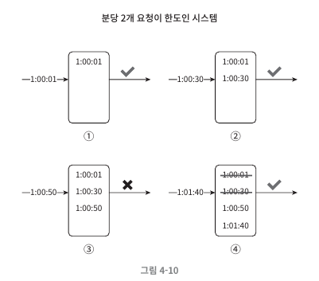
    - 분당 2개 요청이 한도인 시스템
      - 요청이 1:00:01에 도착하였을 때, 로그는 비어 있기 떄문에 요청이 허용
      - 새로운 요청 1:00:30에 도착, 해당 타임스탬프가 로그에 추가, 추가 직후 로그의 크기는 2이며, 허용 한도보다 크지 않음 ->요청이 시스템에 전달.
      - 새로운 요청 1:0:50에 도착, 해당 스탬프가 로그에 추가,추가 직후 로그의 크기는 3으로 허용 한도보다 큰 값 -> 타임스탬프는 로그에 남지만 요청은 거부 
      - 새로운 요청 1:01:40에 도착,  1:00:40~1:01:40의 범위 내에 있는 요청은 1분 윈도 안에 있는 요청이지만, 1:00:40 이전의 타임스탬프는 전부 만료된 값 ->  만료된 타임스탬프 1:00:01과 1:00:30을 로그에서 삭제 -> (삭제 직후 로그의 크기는 2) 1:01:40의 신규 요청은 시스템에 전달 
- 장점
  - 처리율 제한 매커니즘이 아주 정교함 → 어느 순간의 윈도를 보더라도 허용되는 요청의 개수는 시스템 처리율 한도를 넘지 않음
- 단점 
  - 다량의 메모리가 필요. 거부된 요청의 타임스탬프도 보관함 -> 왜..
  
#### 이동 윈도 카운터 알고리즘
고정 윈도 카운터 알고리즘과 이동 윈도 로깅 알고리즘을 결합.
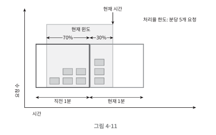
- 현재 윈도우와 현재 시간을 보고, 들어온 요청의 비율을 따져서 처리할지 판단하는 알고리즘.
  - ex) 윈도우 크기 1분
    - 현재 1분간의 요청 수 + 직전 1분간의 요청 수 * 이동 윈도(현재 요청으로부터 1분 간)와 직전 1분이 겹치는 비율
    다양한 알고리즘이 있음

- 장점
  - 이전 윈도의 평균 처리율과 현재 윈도 상태를 측정해 계산하므로 짧은 시간에 몰리는 트래픽에도 잘 대응
- 단점
  - 직전 윈도(시간)에 도착한 요청이 균등하게 분포되어있다고 가정하고 위와 같은 식을 사용. 이것도 경계 부분에 몰렸을 경우, 계산이 예상한 결과와 다르게 동작할 수 있음.

#### 카운터는 어디에 저장할 것인가?
메모리상에서 동작하는 캐시가 바람직할 것
- 빠르고, 시간에 기반한 만료 정책을 지원.
- Redis → INCR, EXPIRE 명령어 지원
  - INCR: 메모리에 저장된 카운터 1증가
  - EXPIRE: 카운터에 저장한 타임아웃 값 설정 → 만료되면 자동으로 삭제

3단계) 상세 설계
---
--- 
처리율 제한 규칙은 어떻게 만들어지고 어디에 저장되는가?
처리가 제한된 요청들은 어떻게 처리되는가?

#### 처리율 한도 초과 트래픽의 처리
- HTTP 429 응답(Too many requests)
- 경우에 따라 한도 제한이 걸린 메시지를 나중 처리를 위해 큐에 보관

##### 처리율 제한 장치가 사용하는 HTTP Header
클라이언트는 자기 요청이 처리율 제한에 걸리고 있는지를 어떻게 감지할까?
자기 요청이 처리율 제한에 걸리기까지 얼마나 많은 요청을 보낼 수 있는지 어떻게 알 수 있나?
- X-Ratelimit-Remaining: 윈도 내 남은 처리가능 요청 수
- X-Ratelimit-Limit: 매 윈도마다 클라이언트가 전송할 수 있는 요청의 수
- X-Ratelimit-Retry-After: 한도 제한에 걸리지 않으려면 몇 초 뒤에 요청을 보내야하는 지 알림

#### 상세 설계
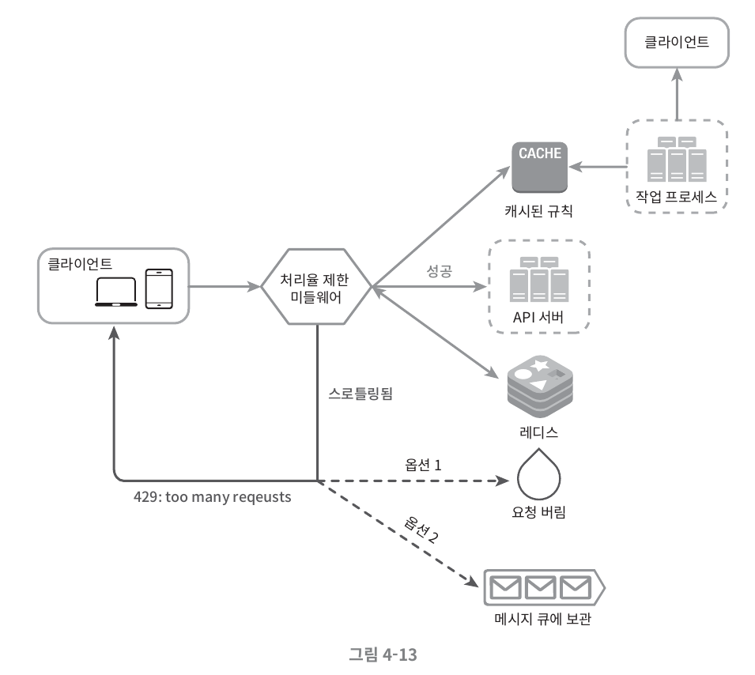
- 처리율 제한 규칙은 디스크에 보관
  - 작업 프로세스는 수시로 규칙을 디스크에서 읽어 캐시에 저장
- 클라이언트가 요청을 서버에 보내면 요청은 먼저 처리율 제한 미들웨어에 도달
- 처리율 제한 미들웨어는 제한 규칙을 캐시에서 가져옴
  - 카운터 마지막 요청의 타임 스탬프를 레디스 캐시에서 가져옴 -> 결정
    - 해당 요청이 처리율 제한에 걸리지 않은 경우에는 API서버로 보냄.
    - 해당 요청이 처리율 제한에 걸렸다면 429에러를 클라이언트에 보냄.
  - 요청은 버릴 수도, 메시지 큐에 보관할 수도 있음

#### 분산환경에서의 처리율 제한 장치 구현

##### 경쟁 조건 (Race condition)
카운터를 사용한다고 했을 때, 분산환경에서 동시에 카운터 값에 접근하여 업데이트를 하다보면 경쟁 조건 이슈가 발생할 수 있음.

경쟁 조건 문제를 해결할 수 있는 가장 쉬운 방법은 Lock이지만, 성능 이슈가 커짐. 이를 해결할 수 있는 다른 방안은 루아 스크립트와 정렬집합 레디스 자료구조.

#### 동기화 (Synchronization)
- 처리율 제한 장치 서버를 여러 대 두게 되면 동기화가 필요해짐.
  - 이 상황에서 웹 계층은 기본적으로 무상태이기 때문에 한 클라이언트라도 요청이 각기 다른 처리율 제한장치로 갈 수 있음.
  - A 처리율 제한 장치는 요청이 허용되고, B 처리율 제한 장치는 요청이 거부될 수도 있음.
- Redis 같은 중앙 집중형 데이터 저장소를 사용해서 해결

#### 성능 최적화
에지 서버 사용

#### 모니터링
처리율 제한 장치가 효과적으로 동작하고 있는가 확인?

2개의 측면에서 모니터링 해야함.
- 채택된 처리율 제한 알고리즘이 효과적인가?
- 정의한 처리율 제한 규칙(파라미터)이 효과적인가?

4단계) 개략적 설계안 제시 및 동의 구하기
--- 

다음과 같은 부분도 생각해보기
- 경성 또는 연성 처리율 제한 
  - 경성(Hard): 요청의 개수는 임계치를 절대 넘을 수 없음.
  - 연성(Soft): 요청의 개수는 잠시동안 임계치를 넘을 수 있음.

처리율 제한 회피 방법? 클라이언트 설계 방법?

- 캐시를 사용해 API 호출 횟수를 줄임
- 클라이언트가 처리율 제한 임계치 이해
- 처리율 제한이 되었을 때, 클라이언트 Gracefully 복구 고려
- Retry 로직 → 충분한 back-of