## 4장 처리율 제한 장치의 설계

**처리율 제한 장치(rate limiter)**
- 클라이언트 또는 서비스가 보내는 트래픽의 처리율(rate)을 제어하기 위한 장치
- ex) HTTP: 특정 기간 내에 전송되는 클라이언트의 요청 횟수 제어
- 장점
  - DoS(Denial of Service) 공격에 의한 자원 고갈(resource starvation) 방지
  - 비용 절감
  - 서버 과부하 막음

### 1단계 문제 이해 및 설계 범위 확장
- 설정된 처리율을 초과하는 요청은 정확하게 제한
- 낮은 응답시간: HTTP 응답시간에 나쁜 영향을 주면 안됨
- 가능한 한 적은 메모리
- 분산형 처리율 제한(distributed rate limiting): 하나의 처리율 제한 장치를 여러 서버나 프로세스에서 공유할 수 있어야 함
- 예외 처리: 요청이 제한되었을 때 사용자에게 분명하게 보여주어야 함
- 높은 결함 감내성(fault tolerance): 제한 장치에 장애가 생기더라도 전체 시스템에 영향을 주어서는 안됨

### 2단계 개략적 설계안 제시 및 동의 구하기
- 기본적인 클라이언트-서버 통신 모델 사용

#### 처리율 제한 장치는 어디에 둘 것인가?
- 클라이언트 측
  - 클라이언트 요청은 쉽게 위변조가 가능
- 서버 측 
  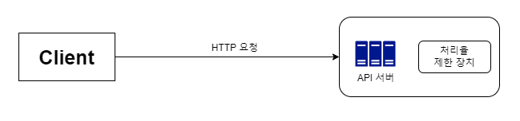
    
  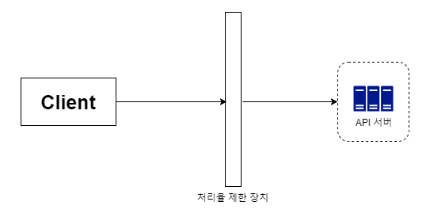
  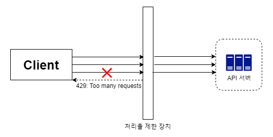
  - 처리율 제한 미들웨어(middleware) 
    - HTTP 상태 코드 429: 사용자가 너무 많은 요청을 보내려고 했음(Too many requests)을 알림

#### 클라우드 마이크로서비스
  - API 게이트웨이에 구현
    - 처리율 제한을 지원하는 미들웨어
    - 처리율 제한, SSL 종단(termination), 사용자 인증(authentication), IP 허용목록(whitelist) 관리 등을 지원하는 완전 위탁관리형 서비스
    -> 클라우드 업체가 유지 보수를 담당하는 서비스
  
 

#### 처리율 제한 알고리즘
- 토큰 버킷(token bucket)
- 누출 버킷(leaky bucket)
- 고정 윈도 카운터(fixed window counter)
- 이동 윈도 로그(sliding window log)
- 이동 윈도 카운터(sliding window counter)

#### 토큰 버킷 알고리즘
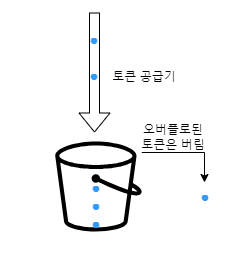
- 동작 방식
  1. 주기적으로 토큰 버킷에 토큰을 공급함
  2. 각 요청은 처리될 때마다 하나의 토큰 사용
  3. 토큰이 없는 경우, 해당 요청은 버려짐
- parameter
  - 버킷 크기: 버킷에 담을 수 있는 토큰의 최대 개수
  - 토큰 공급률(refill rate): 초당 몇 개의 토큰이 버킷에 공급되는가
- 장점
  - 구현이 쉬움
  - 메모리 사용 측면에서도 효율적
  - 짧은 시간에 집중되는 트래픽(burst of traffic)도 처리 가능
- 단점
  - 버킷 크기와 토큰 공급률 값을 적절하게 튜닝하는 것이 까다로움

#### 누출 버킷 알고리즘
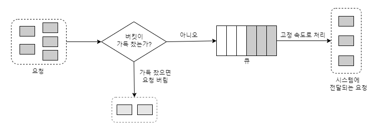
- 동작 방식
  1. 요청이 도착하면 큐가 가득 차 있는지 봄 
  2. 빈자리가 있는 경우, 큐에 요청 추가
  3. 큐가 가득 차 있는 경우, 새 요청은 버림
  4. 지정된 시간마다 큐에서 요청을 꺼내어 처리
- 토큰 버킷 알고리즘과 비슷하지만, 요청 처리율은 고정
- FIFO(First-In-Fist-Out) 큐로 구현
- parameter
  - 버킷 크기: 큐 사이즈와 같은 값. 큐에는 처리될 항목들이 보관
  - 처리율(outflow rate): 지정된 시간당 몇 개의 항목을 처리할지 지정하는 값. 보통 초 단위로 표현됨
- 장점
  - 큐의 크기가 제한되어 있어 메모리 사용량 측면에서 효율적
  - 고정된 처리율을 갖고 있기 때문에 안정적 출력(stable outflow rate)이 필요한 경우 적합
- 단점
  - 단시간에 많은 트래픽이 몰리는 경우, 큐에는 오래된 요청들이 쌓이게 되고 그 요청들을 제때 처리하지 못하면 최신 요청들은 버려짐
  - 두 개 인자(버킷 크기, 처리율)를 올바르게 튜닝하기 까다로움

#### 고정 윈도 카운터 알고리즘
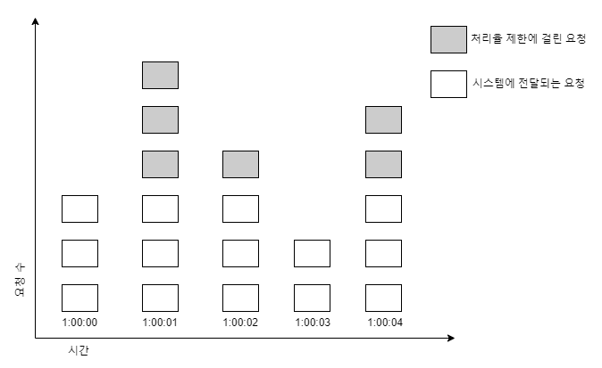
- 동작 방식
  1. 타임라인(timeline)을 고정된 간격의 윈도(window)로 나누고, 각 윈도마다 카운터(counter)를 붙임
  2. 요청이 접수될 때마다 카운터의 값은 1씩 증가
  3. 카운터의 값이 사전에 설정된 임계치(threshold)에 도달하면 새로운 요청은 새 윈도가 열릴 때까지 버려짐   

  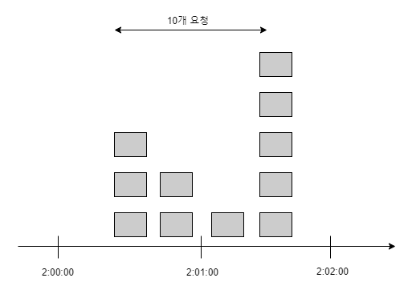
- 문제점: 윈도의 경계 부근에 순간적으로 많은 트래픽이 집중될 경우, 윈도에 할당된 양보다 더 많은 요청이 처리될 수 있음
  - 분당 최대 5개의 요청만을 허용
  - 카운터는 매분마다 초기화
  - 1분(2:00:30~2:01:30) 동안 시스템이 처리한 요청은 10개
- 장점
  - 메모리 효율이 좋음
  - 이해하기 쉬움
  - 윈도가 닫히는 시점에 카운터를 초기화하는 방식은 특정한 트래픽 패턴을 처리하기에 적합
- 단점
  - 윈도 경계 부근에서 일시적으로 많은 트래픽이 몰려드는 경우, 기대했던 시스템의 처리 한도보다 많은 양의 요청을 처리하게 됨

#### 이동 윈도 로깅 알고리즘
- 고정 윈도 카운터 알고리즘의 문제점 해결
- 동작 방식
  1. 요청의 타임스탬프(timestamp) 추적 
  2. 새 요청이 오면 만료된 타임스템프는 제거
  3. 새 요청의 타임스탬프를 로그(log)에 추가
  4. 로그의 크기가 허용치와 같거나 작으면 요청을 시스템에 전달. 그렇지 않은 경우에는 처리를 거부   

  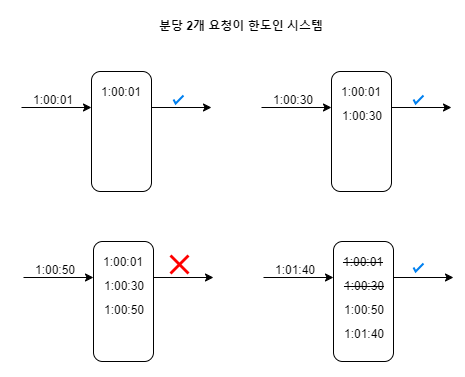
  1. 1:00:01에 요청이 도착했을 때, 로그는 비어 있는 상태 -> 요청 허용
  2. 1:00:30에 새로운 요청 도착. 해당 타임스탬프가 로그에 추가됨. 
  추가 직후, 로그의 크기는 2 (허용 한도보다 크지 않음)   
  -> 요청은 시스템에 전달
  3. 1:00:50에 새로운 요청 도착. 해당 타임스탬프 로그에 추가.  
  추가 직후 로그의 크기는 3 (허용 한도보다 큰 값)   
  -> 타임스탬프는 로그에 남지만 요청은 거부됨
  4. 1:01:40에 새로운 요청 도착.  
  [1:00:40, 1:01:40) 범위 안에 있는 요청은 1분 윈도 안에 있는 요청이지만, 1:00:40 이전의 타임스탬프는 전부 만료된 값  
  -> 두 개의 만료된 타임스탬프 1:00:01과 1:00:30을 로그에서 삭제. 삭제 직후 로그의 크기는 2  
  -> 1:01:40의 신규 요청은 시스템에 전달
- 장점
  - 위 알고리즘이 구현하는 처리율 제한 메커니즘은 매우 정교함  
  -> 어느 순간의 윈도를 보더라도, 허용되는 요청의 개수는 시스템의 처리율 한도를 넘지 않음
- 단점
  - 다량의 메모리를 사용함 (거부된 요청의 타임스탬프도 보관하기 때문)

#### 이동 윈도 카운터 알고리즘
- 고정 윈도 카운터 알고리즘과 이동 윈도 로깅 알고리즘을 결합한 것
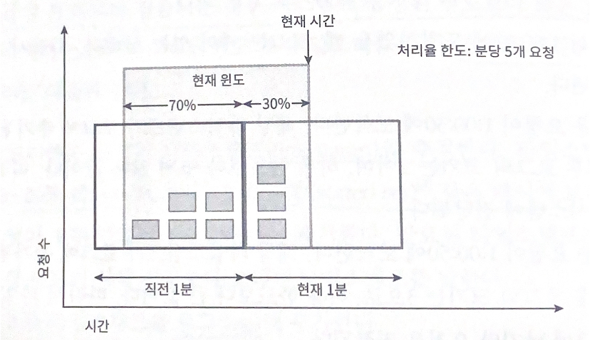
- 장점
  - 이전 시간대의 평균 처리율에 따라 현재 윈도의 상태를 계산하므로 짧은 시간에 몰리는 트래픽에도 잘 대응함
  - 메모리 효율이 좋음
- 단점
  - 직전 시간대에 도착한 요청이 균등하게 분포되어 있다고 가정한 상태에서 추정치를 계산하기 때문에 다소 느슨함  
    심각한 문제는 아님 ex) 클라우드플레어가 실시했던 실험 -> 40억 개의 요청 가운데 시스템의 실제 상태와 맞지 않게 허용되거나 버려진 요청은 0.003%
  
#### 개략적인 아키텍쳐
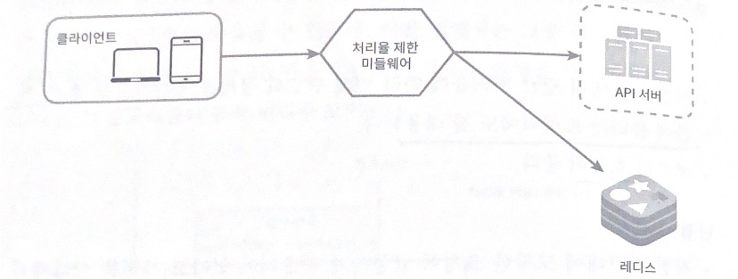
- 동작 원리
  1. 클라이언트가 처리율 제한 미들웨어에게 요청을 보냄
  2. 처리율 제한 미들웨어는 레디스의 지정 버킷에서 카운터를 가져와서 한도에 도달했는지 검사
     - 한도에 도달했다면 요청은 거부됨
     - 한도에 도달하지 않았다면, 요청은 API 서버로 전달.  
     미들웨어는 카운터 값을 증가시킨 후 다시 레디스에 저장
 

### 3단계 상세 설계
> 처리율 제한 규칙은 어떻게 만들어지고 어디에 저장되는가? 

> 처리가 제한된 요청들은 어떻게 처리되는가?

#### 처리율 제한 규칙
ex) 리프트(Lyft)는 처리율 제한에 오픈 소스 사용
- 마케팅 메시지의 최대치를 하루 5개로 제한
- 클라이언트가 분당 5회 이상 로그인 할 수 없도록 제한
- 이런 규칙들은 보통 설정 파일(configuration file) 형태로 디스크에 저장

#### 처리율 한도 초과 트래픽의 처리
- 요청이 한도 제한에 걸리면 API는 HTTP 429 응답(too many requests)을 클라이언트에게 보냄
- 경우에 따라, 한도 제한에 걸린 메시지를 나중에 처리하기 위해 큐에 보관할 수도 있음

#### 처리율 제한 장치가 사용하는 HTTP 헤더
- X-Ratelimit-Remaining: 윈도 내에 남은 처리 가능 요청의 수
- X-Ratelimit-Limit: 매 윈도마다 클라이언트가 전송할 수 있는 요청의 수
- X-Ratelimit-Retry-After: 한도 제한에 걸리지 않으려면 몇 초 뒤에 요청을 다시 보내야 하는지 알림
-> 429 too many requests 오류를 X-Ratelimit-Retry-After 헤더와 함께 반환하도록 함

#### 상세 설계
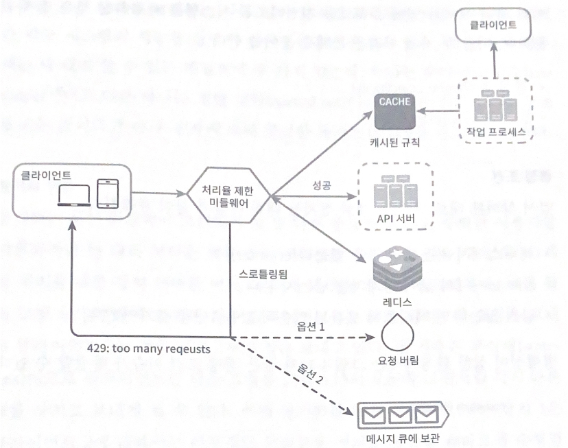
- 처리율 제한 규칙은 디스크에 보관. 작업 프로세스(workers)는 수시로 규칙을 디스크에서 읽어 캐시에 저장
- 클라이언트가 요청을 서버에 보내면 요청은 먼저 처리율 제한 미들웨어에 도달
- 처리율 제한 미들웨어는 제한 규칙을 캐시에서 가져옴. 카운터 및 마지막 요청의 타임스탬프를 레디스 캐시에서 가져옴.  
  가져온 값들에 근거하여 해당 미들웨어는 다음과 같은 결정을 내림
  - 해당 요청이 처리율 제한에 걸리지 않는 경우, API 서버로 보냄
  - 해당 요청이 처리율 제한에 걸렸다면, 429 too many requests 에러를 클라이언트에 보냄  
    해당 요청은 그대로 버릴 수도 있고, 메시지 큐에 보관할 수도 있음

#### 분산 환경에서의 처리율 제한 장치 구현
- 문제점
  - 경쟁 조건(race condition)
  - 동기화(synchronization)

**경쟁 조건**

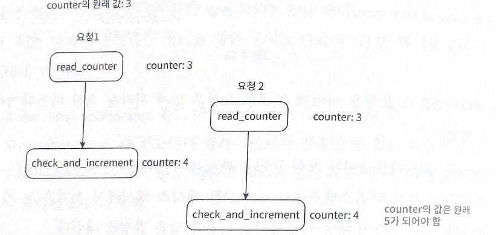

해결책
- 락(lock)
  - 시스템의 성능을 상당히 떨어뜨림
- 루아 스크립트
- 레디스의 정렬 집합

 

**동기화**

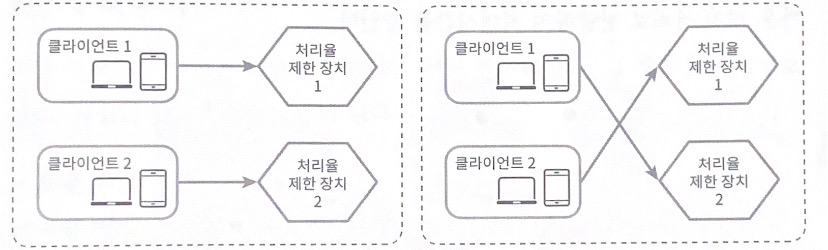
- 해결책
  - 고정 세션 활용 
    - 규모면에서 확장 가능X, 유연X
  - 레디스와 같은 중앙 집중형 데이터 저장소 쓰기

#### 성능 최적화
- 데이터센터 지원
- 제한 장치 간에 데이터를 동기화할 때 최종 일관성 모델 사용

#### 모니터링
- 처리율 제한 장치를 설치한 이후, 효과적으로 동작하고 있는지 보기 위해 데이터를 모을 필요가 있음
- 채택된 처리율 제한 알고리즘이 효과적인지, 정의한 처리율 제한 규칙이 효과적인지 살펴볼 수 있음
 

### 4단계 마무리
- 경성(hard) 또는 연성(soft) 처리율 제한
- 다양한 계츠엥서의 처리율 제한
- 처리율 제한을 회피하는 방법, 클라이언트를 설계하는 최선의 방법
