# 안정 해시 설계
수평적 규모 확장성 달성을 위해서는 요청 또는 데이터를 서버에 균등하게 나누는 것ㅇ이 중요
-> 안정 해시 사용

### 해시 키 재배치 문제
--- --- 
N개의 캐시 서버가 있다고 할 때, 이 서버들에 부하를 균등하게 나누는 보편적 방법은 아래와 같은 해시 함수를 사용하는 것.
serverIndex = hash(key) % N (N은 서버의 개수)

특정 키가 보관 된 서버를 알아내기 위해, 나머지 연산을 f(key) % 4 와 같이 적용함

- 서버 풀의 크기가 고정 되어있을 때 , 데이터 분포가 균등할 때 잘 동작함
- 서버가 추가되거나 기존 서버가 삭제 되면 문제가 생김
    - 예시
      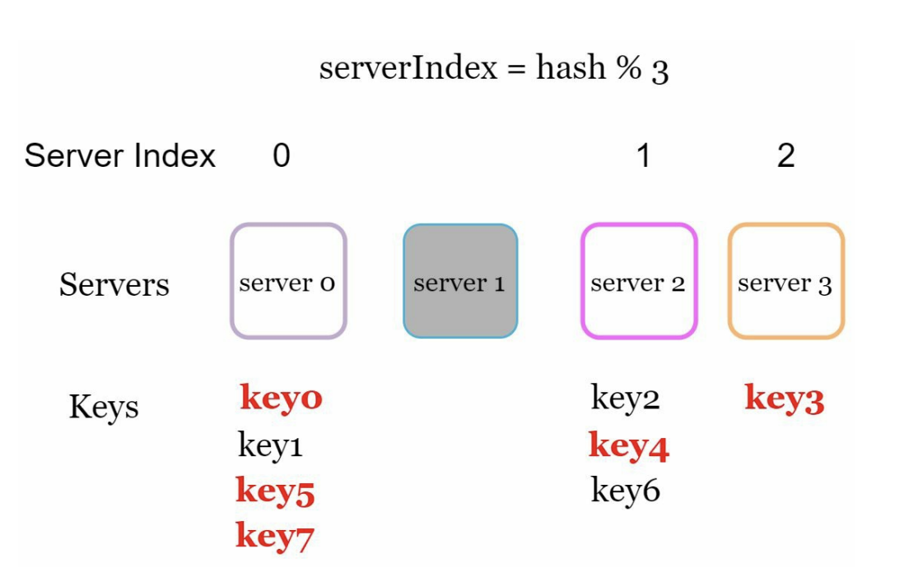
      - 만약 1번 서버가 장애를 일으켜 동작을 중단했다고하면 -> 서버 풀의 크기는 3으로 바뀜
      - 키에 대한 해시값은 변하지 않지만 나머지 연산을 적용하여 계산한 서버 인덱스 값은 달라짐 (인덱스가 1 줄었기 때문)
      - 결과 값은 해시 % 3
- 장애가 발생한 서버에 보관되어 있는 키 뿐만 아닌 대부분의 키가 재분배됨
- 해당 서버에 존재하던 해시키가 사라지고, 엉뚱한 서버로 접근하게 되어 대규모 캐시미스가 발생하게 되므로 대량의 리밸런싱이 이루어져야한다.

### 안정 해시
--- --- 
- 해시 테이블 크기가 조정 될 때 평균적으로 오직 k/n개의 키만 재배치하는 해시 기술(k는 키의 개수, n은 슬롯 수)

#### 해시 공간과 해시 링
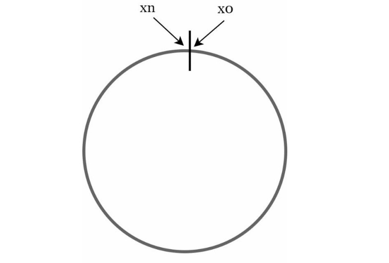

- 해시 공간의 양쪽을 구부려 접으면 해시링이 만들어짐
#### 해시 서버
- 해시 함수 f를 사용하면 서버 ip나 이름을 이 링 위에 어떤 위치에 대응 시킬 수 있음

#### 해시 키
- "해시 키 재배치 문제"에 언급된 함수와 다름
- 키들도 아래 그림과 같이 해시 링 위의 지점에 배치 할 수 있음
  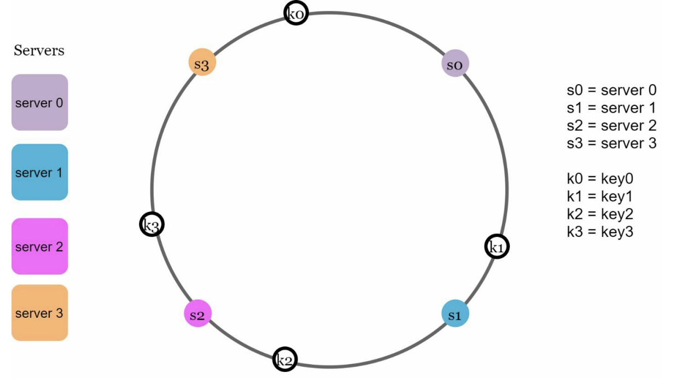
### 서버 조회
- 키의 위치에서 링을 시계방향으로 탐색하다가 만나는 최초의 서버가 키가 저장될 서버
  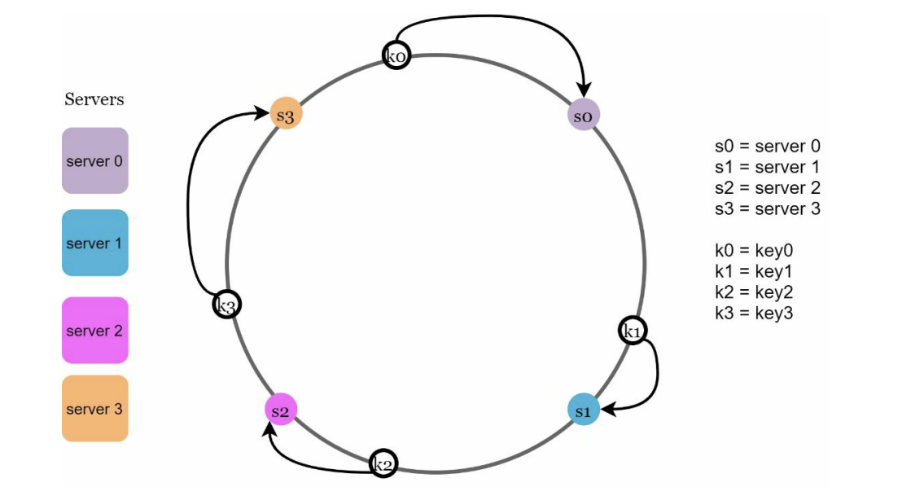
- 위 그림을 통해 k0 → s0, k1 → s1, k2 → s2, k3 → s3 인 것을 알 수 있음.
### 서버 추가
- 서버 조회의 내용을 버면 알 수 있듯이 서버를 추가하더라도 키 가운데 일부만 재배치 하면 됨.
  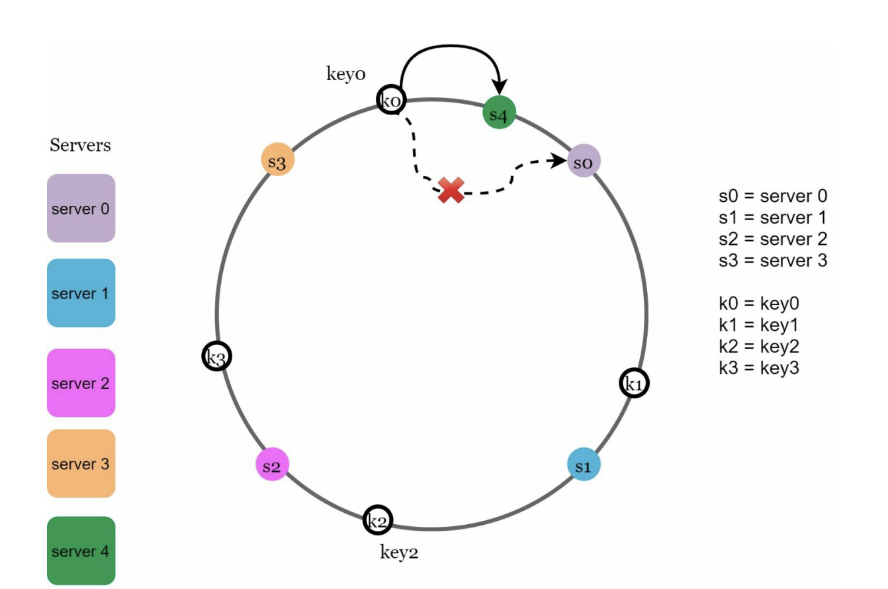
- 새로운 서버 4사 추가 된 뒤에 key0만 재배치 됨을 알 수 있음
- 시계 방향으로 순회했을 때 처음으로 만나게 되는 서버가 서버4이기 때문
### 서버 제거
- 하나의 서버가 제거되면 키 가운데 일부만 재배치 됨
  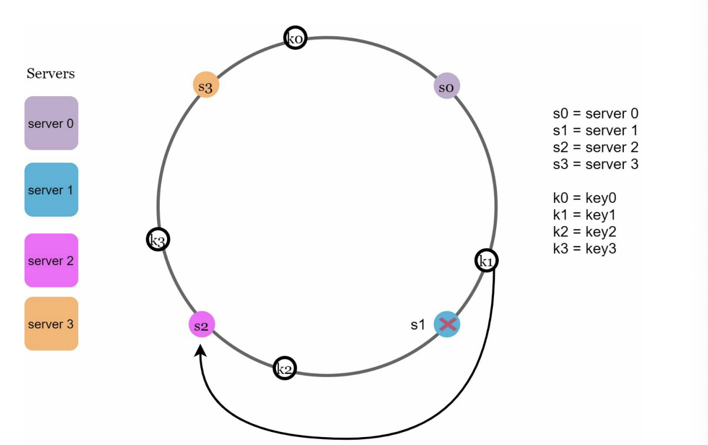
- k1만 s2로 재배치 되었음
### 기본 구현법 두 가지 문제
- 안졍 해시 알고리즘은 다음과 같은 두 가지 절차를 걸침
  - 서버와 키를 균등 분포 해시 함수를 사용해 해시 링에 배치
  - 키의 위치에서 링을 시계 방향으로 탐색하다 만나는 최초의 서버가 키가 저장 될 서버
- 여기서 두 가지 문제가 발생함
  - 추가 혹은 삭제 상황에서 파티션의 크기를 균등하게 유지하는 것은 불가능
  - 파티션 == 서버와 서버 사이의 해시 공간
    - 아래 그림과 같이 s1이 제거 되면, s0 ~ s2 사이의 해시 공간이 다른 파티션보다 커지게 됨
      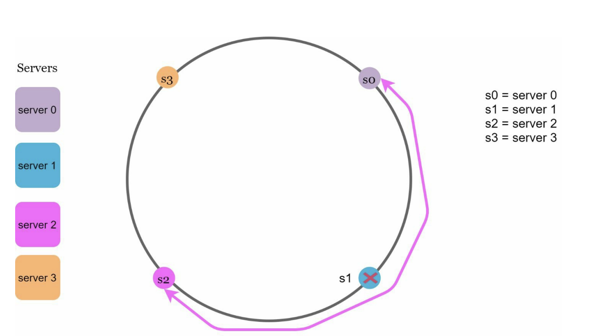
  - 키의 균등 분포를 달성하기 어려움
    - 아래와 같이 분포되어 있다면, s1과 s3는 아무 데이터를 갖지 않고 s2는 4개의 데이터를 갖게 됨
      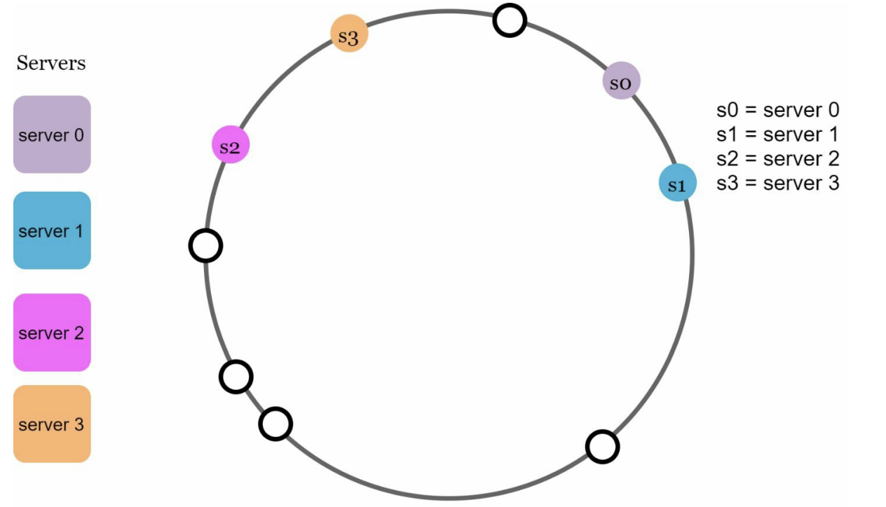
=> 위 두문제를 해결하기 위해 가상노드라는 기법을 씀

### 가상 노드
- 실제 노드 또는 서버를 가리키는 노드
- 하나의 서버는 여러 개의 가상 노드를 가질 수 있음
  - 아래 그림을 보면 s0과 s1은 3개의 노드를 가짐
    - 실제 시스템은 3개보다 훨씬 큰 가상 노드를 가짐
- 이렇게 각 서버가 여러 노드로 나뉘어 각 서버는 여러 파티션을 관리 하게 됨
  - 아래 그림에서 각각 s1,s0로 이어진 선의 범위의 합이 관리하게 되는 총 파티션
    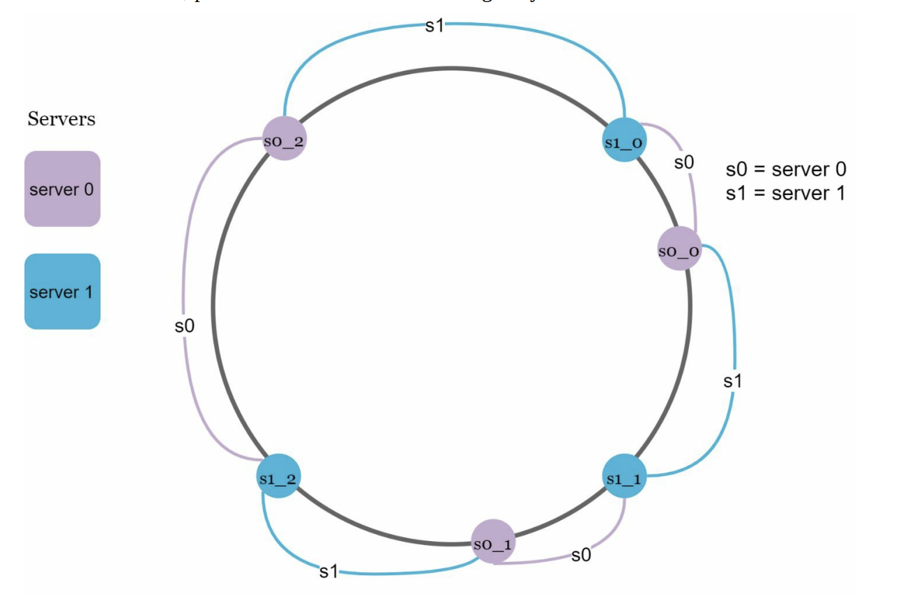
  - 가상 노드가 없었던 예시와 같이, 키가 가장 먼저 만나는 가상 노드가 가리키는 서버에 키가 저장
    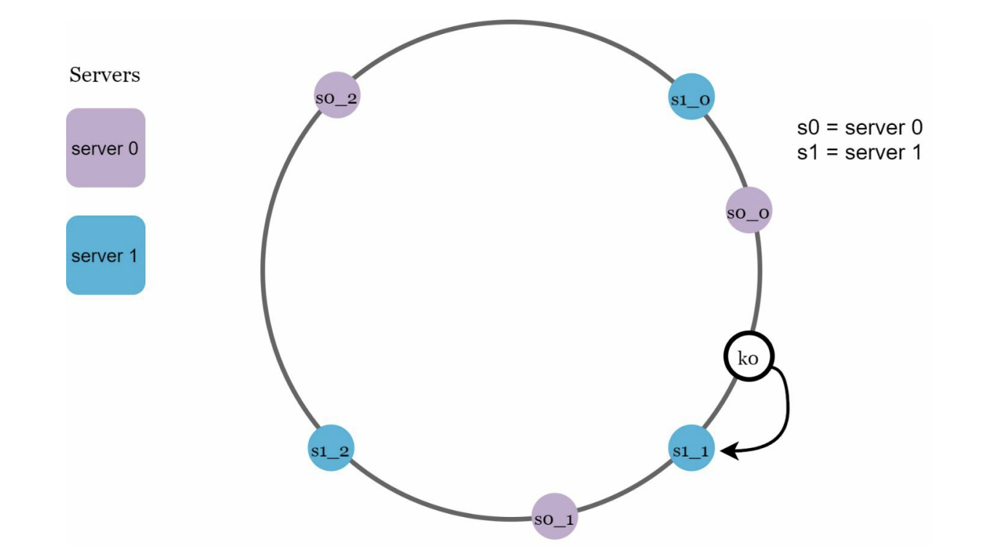
  - 이렇게 가상 노드의 개수를 늘리면 키의 분포는 균등해짐
    - 표준편차가 작아져 데이터가 고르게 분포되기 때문
    - 가상노드의 개수가 많아질수록 표준편차는 작아지는데, 가상 노드 데이터 저장에 필요한 공간이 많아지기 때문에 항상 trade-off를 생각하기!
### 재배치할 키를 결정
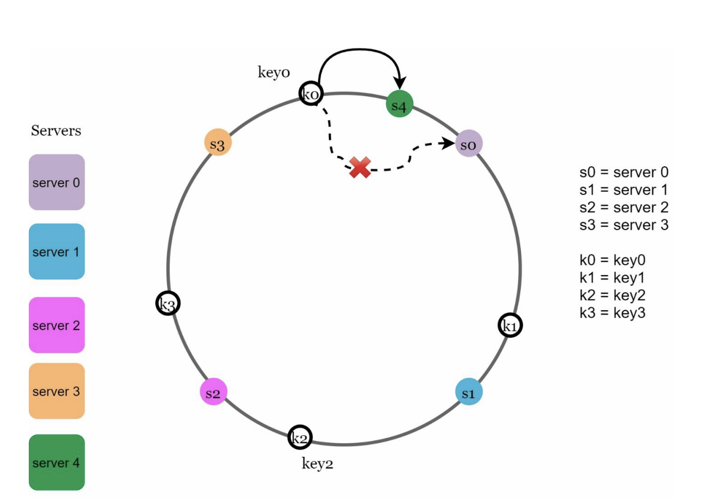
- 위 그림과 같이 s4가 추가될 걍우, 시계 빙향으러 s3~ s4 범위의 키들을 재배치

- 위 그림과 같이 s1이 삭제된다면. 시계 방향으로 s0~s2 사이의 키들이 재배치

### 마치며
--- --- 
- 안정 해시의 이점
  - 서버가 추가되거나 삭제될 때. 재배치 되는 키의 수를 최소화
  - 데이터가 균등하게 분포되어 스케일 아웃을 달성하기 쉬움
  - 핫스팟 문제를 줄임
    - 특정 샤드에 대한 접근이 지나치게 빈번하면 서버 과부화
    - 안정해시는 데이터를 더 균등하게 분배하므로 이런 문제가 생길 가능성을 중임