## 5장 안정 해시 설계
수평적 규모 확장성을 달성하기 위해 요청 또는 데이터를 서버에 균등하게 나누는 것 중요  
-> 안정 해시 사용

### 해시 키 재배치(rehash) 문제
`serverIndex = hash(key) % N (N은 서버의 개수)`

| 서버 인덱스 | 0 | 1 | 2 | 3 |
| --- | --- | --- | --- | --- |
| 서버 | server 0 | server 1 | server 2  | server 3 |
| 키 | key1   key3 | key0   key4 | key2   key6 | key5   key7 |
- 서버 풀(server pool) 크기 고정, 데이터 분포 균등 시 잘 동작
  - 서버 추가, 기존 서버 삭제 시 문제   

| 서버 인덱스 | 0                                          |  | 2                            | 3        |
| --- |--------------------------------------------| --- |------------------------------|----------|
| 서버 | server 0                                   | server 1 | server 2                     | server 3 |
| 키 | **key0**   key1   **key5   key7** |  | key2   **key4**   key6 | **key3** |
- 장애가 발생한 서버에 보관된 키 뿐만 아니라 대부분의 키 재분배  -> 대부분 캐시 클라이언트가 데이터가 없는 엉뚱한 서버에 접속하게 됨  -> 대규모 캐시 미스(cache miss) 발생  -> **안정 해시** 사용

### 안정 해시
- 해시 테이블 크기가 조정될 때 평균적으로 오직 k/n개의 키만 재배치하는 해시 기술 
      (k = 키의 개수, n = 슬롯의 개수)
- 대부분의 전통적 해시 테이블은 슬롯의 수가 바뀌면 키를 재배치

#### 해시 공간과 해시 링
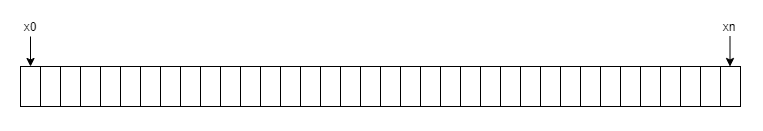
- 해시 함수: SHA-1 사용
- 출력 값 범위: x0, x1, ... , xn
- 해시 공간 범위: 0 ~ 2^160 - 1

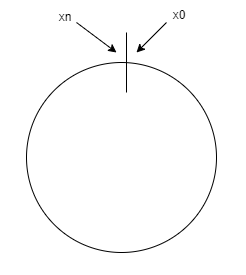
- 해시 공간의 양쪽을 구부려 접으면 해시 링이 만들어짐

#### 해시 서버
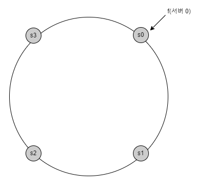
- 서버 IP나 이름을 링 위의 어떤 위치에 대응 (해시 함수 f 사용)

#### 해시 키
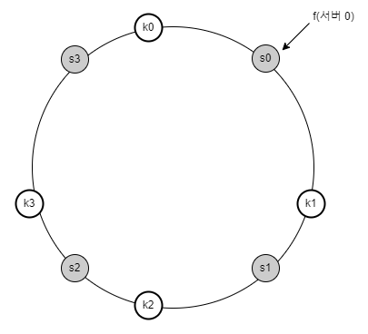
- 캐시할 키를 해시 링 위의 어느 지점에 배치할 수 있음

#### 서버 조회
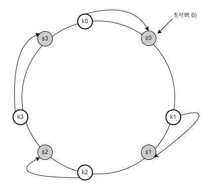
- 키가 저장되는 서버: 해당 키의 위치로부터 시계 방향으로 링을 탐색해나가면서 만나는 첫 번째 서버

#### 서버 추가
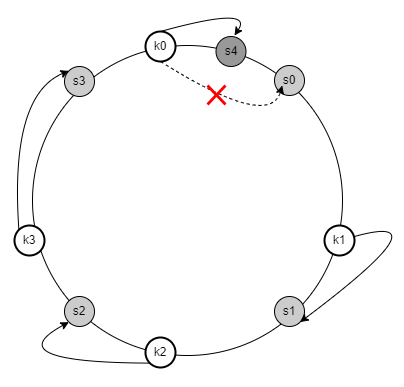
- 서버를 추가하더라도, 키 가운데 일부만 재배치하면 됨
  - 서버 4 추가 -> key0만 재배치

#### 서버 제거
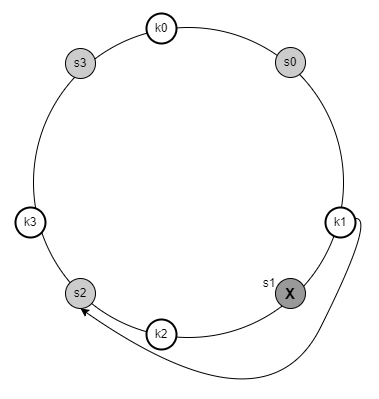
- 서버가 제거되면 키 가운데 일부만 재배치
- 나머지 키에는 영향 없음
    - 서버 1 삭제 -> key1은 서버 2로 재배치

#### 기본 구현법의 두 가지 문제
- 안정 해시 알고리즘
  - 서버와 키를 균등 분포(uniform distribution) 해시 함수를 사용해 해시 링에 배치
  - 키의 위치에서 링을 시계 방향으로 탐색하다 만나는 최초의 서버가 키가 저장될 서버
- 문제점  
    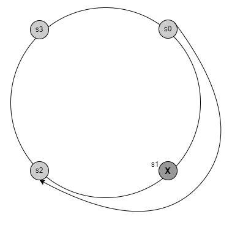
  - 파티션(partition)의 크기를 균등하게 유지하는 것 불가능 
    - 파티션: 인접한 서버 사이의 해시 공간
    - 어떤 서버는 작은 해시 공간 할당, 어떤 서버는 큰 해시 공간 할당 
    - ex) s1 삭제 후, s2의 파티션이 다른 파티션 대비 거의 두 배로 커짐   
    
  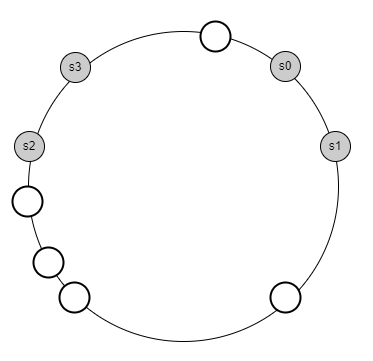
  - 키의 균등 분포(uniform distribution) 달성하기 어려움
    - ex) 서버 1과 서버 3은 아무 데이터도 갖지 않는 반면, 대부분의 키는 서버 2에 보관
    
-> **가상 노드(virtual node)** 또는 **복제(replica)** 라고 불리는 기법 제안   

#### 가상 노드
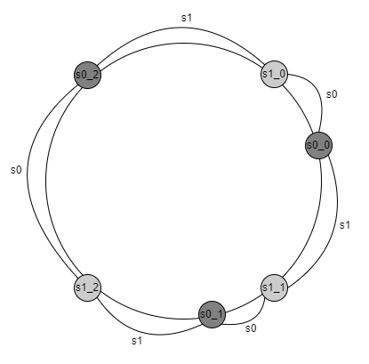
- 실제 노드 또는 서버를 가리키는 노드
- 하나의 서버는 링 위에 여러 개의 가상 노드를 가질 수 있음
  - 각 서버는 하나가 아닌 여러 개의 파티션 관리   

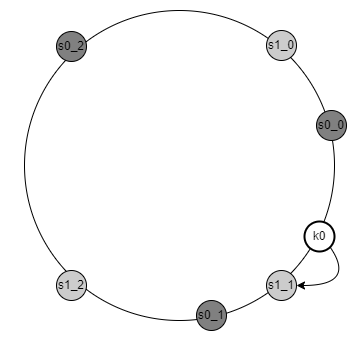
  - 해당 키가 저장될 서버: 키의 위치로부터 시계방향으로 링을 탐색하다 만나는 최초의 가상 노드
  - ex) k0가 저장되는 서버: 노드 s1_1가 나타내는 서버 -> 서버 1

- 가상 노드의 개수를 늘리면 키의 분포는 점점 더 균등해짐
  - 표준 편차가 작아져서 데이터가 고르게 분포되기 때문
  - 가상 노드 데이터를 저장할 공간은 더 많이 필요하게 되기 때문에, 타협적 결정(tradeoff)이 필요  
-> 시스템 요구사항에 맞도록 가상 노드 개수를 적절히 조정   

#### 재배치할 키 결정

- s4(서버 4) 추가   
  - 영향 받은 범위: s4(새로 추가된 노드)부터 반시계 방향에 있는 첫 번째 서버 s3 
  - s3부터 s4 사이에 있는 키들을 s4로 재배치해야 함   

- s1(서버 1) 삭제
  - s1부터(삭제한 노드) 그 반시계 방향에 있는 최초 서버 s0 사이에 있는 키들이 s2로 재배치되어야 함

### 마치며
**안정 해시의 이점**
- 서버가 추가되거나 삭제될 때 재배치되는 키의 수가 최소화
- 데이터가 보다 균등하게 분포하게 되므로 수평적 규모 확장성을 달성하기 쉬움
- 핫스팟(hotspot) 키 문제를 줄임
  - 특정한 샤드(shard)에 대한 접근이 지나치게 빈번하면 서버 과무하 문제 생길 수 있음
  ex) 유명인의 데이터가 전부 같은 샤드에 몰리는 상황
  - 안정 해시는 데이터를 좀 더 균등하게 분배하므로 이런 문제가 생길 가능성 줄임

**안정 해시가 쓰이는 곳**
- 아마존 다이나모 데이터베이스(DynamoDB)의 파티셔닝 관련 컴포넌트
- 아파치 카산드라(Apache Cassandra) 클러스터에서의 데이터 파티셔닝
- 디스코드(Discord) 채팅 어플리케이션
- 아카마이(Akamai) CDN
- 매그레프(Meglev) 네트워크 부하 분산기