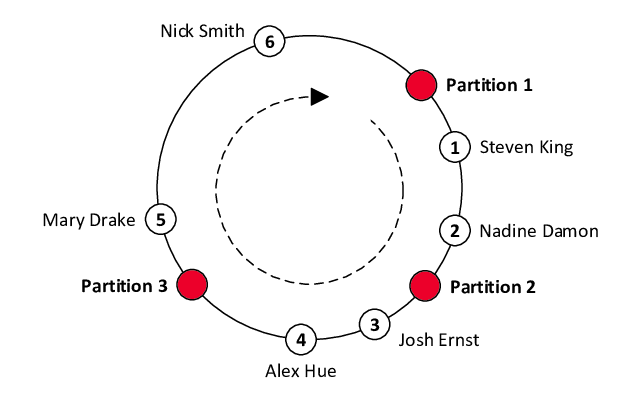

### 해시 키 재배치 문제

N개의 캐시 서버가 있다고 할 때, 이 서버들에 부하를 균등하게 나누는 보편적인 방법은 아래와 같은 해시 함수를 사용하는 것이다.
* serverIndex = hash(key) % N

##### 만약 한 서버에 이상이 발생하여 서버 풀의 개수가 줄어든다면?
 -> 해당 서버에 존재하던 해시키가 사라지고, 엉뚱한 서버로 접근하게 되어 대규모 캐시 미스가 발생하게 되므로 대량의 리밸런싱이 이루어져야 한다.

 ### 안정 해시 (Consistent Hash)

 * 안정 해시는 해시 테이블의 크기가 조정될 때 평균적으로 k/n개의 키만 재배치하는 해시 기술이다. (k = 키의 개수, n = 슬롯 개수)
