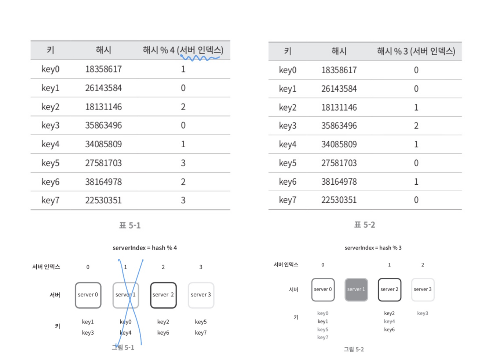
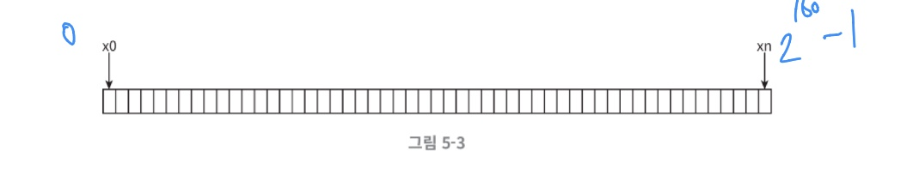
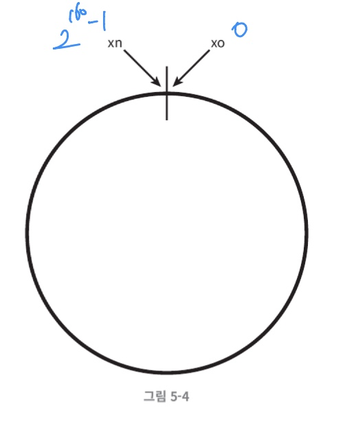
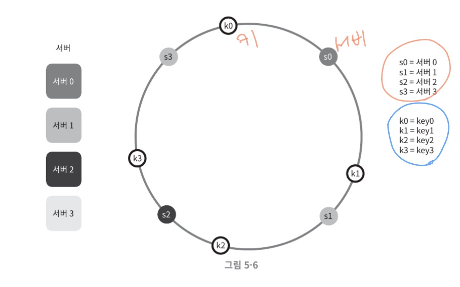
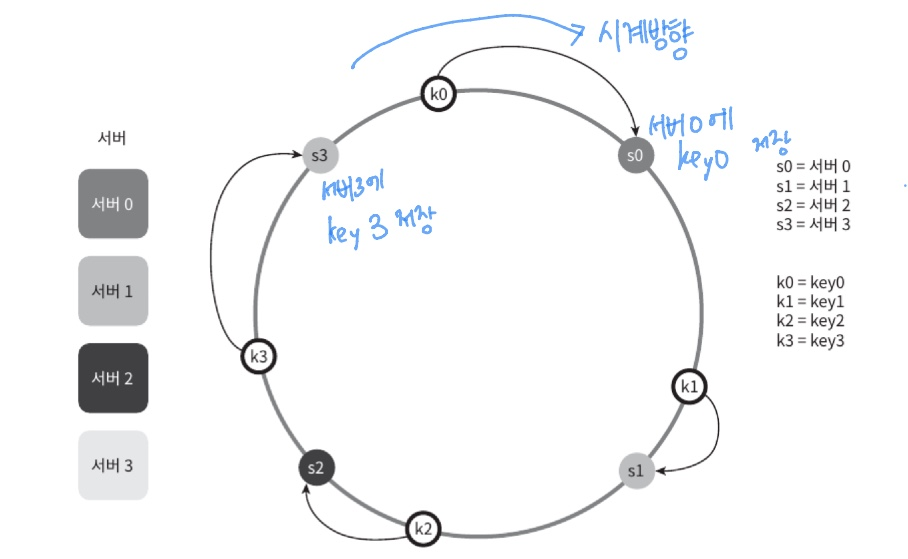
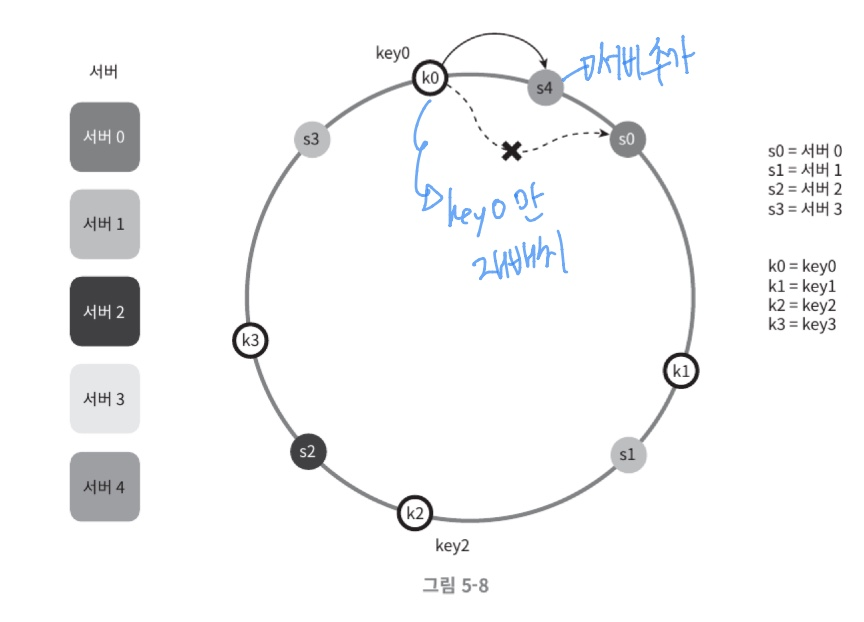
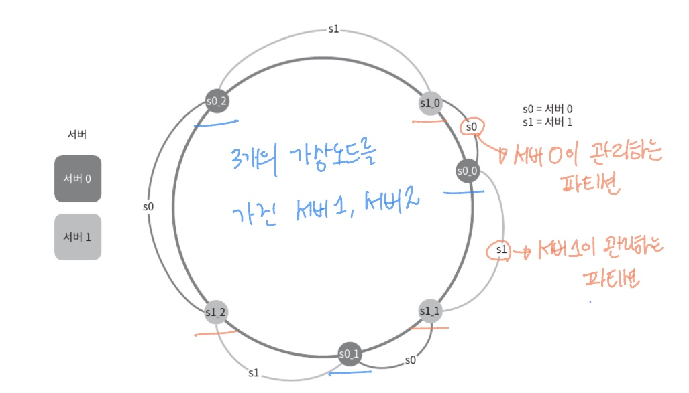

# 안정 해시 설계

수평적 규모 확장성을 달성하기 위해서는 요청 또는 데이터를 서버에 균등하게 나누는 것이 중요

- N개의 캐시 서버에 부하를 균등하게 나누는 보편적인 방법 
  - 해시 함수 사용

- 해시 함수
- serverIndex = hash(key) % N(서버 개수)

**해시키 재배치 문제**

서버 풀(server pool)이 고정되어 있을 때, 그리고 데이터 분표가 균등할 때 작동이 잘됨
- 서버 하나가 장애가 발생하여 동작 중단 -> 서버 풀 크기 변화
  - 키에 대한 해시 값은 변하지 않지만 나머지 연산(%)을 적용하여 계산한 서버 인덱스 값은 달라짐.
  - 즉, 장애가 발생한 1번 서버에 보관되어 있던 키 뿐만 아니라 대부분의 키가 재분배됨.
  - 대규모 캐시미스 발생!!

**보편적인 해시함수 방법의 문제점을 안정 해시가 해결**

**안정 해시**
- 해시 테이블 크기가 조정될 때 평균적으로 오직 k/n개의 키만 재배치되는 해시 기술(k: key개수, n: 슬롯의 개수)

### 해시 공간과 해시 링

#### 가정
- 사용할 해시 함수 f : SHA-1
- SHA-1의 범위(해시 공간의 범위) : 0 ~ 2^160 -1

- 양쪽을 구부려 접으면 해시 링 생성

#### 해시링 위에 해시 서버와 해시 키 배치

- 해시 함수 f를 사용하면 서버 IP나 이름을 이 링 위의 어떤 위치에 대응시킬 수 있음
- 이 해시 함수는 나머지 연산을 사용하지 않음
- 캐시할 키 또한 해시 링 위 어느 지점에 배치 가능

#### 서버 조회

어떤 키가 저장되는 서버: 해당 키의 위치로부터 시계방향으로 링을 탐색해나가면서 만나는 첫번째 서버

key0 -> 서버 0에 저장 / key1 -> 서버 1에 저장 / key2 -> 서버 2에 저장 / key3 -> 서버 3에 저장

#### 서버 추가

서버를 추가하더라도 키 가운데 일부만 재배치하면 됨.

서버 4를 추가 -> key0만 재배치 , 나머지 키들은 재배치 되지 않음

#### 서버 제거
서버1 제거 -> key1만 서버2로 재배치

나머지 키에는 영향 X

#### 기본적 구현법 두 가지 문제 존재
1. 파티션의 크기가 균등하게 유지되는 것이 불가능
2. 키의 균등 분포 달성의 어려움

#### 위의 문제 해결 방법 : 가상 노드

가상노드는 실제 노드 또는 서버를 가리키는 노드

하나의 서버는 링 위에 여러개의 가상 노드를 가질 수 있음.

위의 그림처럼 이제 각 서버는 하나가 아닌 여러 개 파티션을 관리 해야함.

#### 가상 노드의 개수를 늘리면 키의 분포는 점점 균등해짐
- 표준편차가 작아져서 데이터가 고르게 분포됨

- 표준편차가 작아야 좋은 것

- **표준편차**: 데이터가 어떻게 퍼져 나갔는지를 보이는 척도

> 100~200개의 가상 노드를 사용했을 경우 표준 편차 값은 평균의 5%(가상 노드가 200개인 경우)에서 10%(가상 노드가 100개인 경우) 사이

-  가상 노드 개수를 더 늘리면 표준 편차 값은 더 떨어짐 
  - 그러나 가상 노드 데이터를 저장할 공간은 더 많이 필요하게 됨 
  - 타협적 결정 필요 
  - 시스템 요구사항에 맞도록 가상 노드 개수를 적절히 조정해야 할 것.

### 안정 해시의 이점

- 서버가 추가되거나 삭제될 때 재배치되는 키의 수가 최소화
- 데이터가 보다 균등하게 분포하게 되므로 수평적 규모 확장성을 달성하기 쉬움
- 핫스팟 키 문제를 줄임. 특정한 샤드에 대한 접근이 지나치게 빈버나면 서버 과부하 문제 방생

 