# 키-값 저장소 설계
--- --- 
키-값 저장소 == 키-값 데이터베이스 : 비 관계형 데이터베이스

저장되는 값은 고유 식별자를 키로 가져야 함

키-값 쌍에서의 키는 유일해야 하며 해당 키에 매달린 값은 키를 통해서만 접근 가능함.

키는 일반 텍스트일수도 있고 해시 값일 수도 있음

당연히 키는 짧을수록 좋음(성능상)

값에는 무엇이 오든 크게 상관없음(객체, 리스트 등)

키-값 저장소를 한 번 설계해 볼 것이다~
### 문제 이해 및 설계 범위 확장
--- --- 
완벽한 설계는 없음

읽기, 쓰기 그리고 메모리 사용량 사이에 어떤 균형을 찾고, 데이터의 일관성과 가용성에서 타협적 결정을 내린 설계를 만들었다면 쓸만한 답안일 것임

이번 장에서는 다음 특성을 갖는 키-값 저장소를 설계해 볼 것임

- 키-값 쌍의 크기는 10KB 이하
- 큰 데이터를 저장할 수 있어야 함
- 높은 가용성을 제공해야 함. 따라서 시스템은 설사 장애가 있더라도 빨리 응답해야 함
- 높은 규모 확장성을 제공해야함. -> 트래픽 양에 따라 자동적으로 서버 증설/삭제가 이루어져야함.
- 데이터 일관성 수준은 조정이 가능해야 함
- 응답 지연 시간이 짧아야 함

### 단일 서버 키-값 저장소
--- ---
한대 서버만 사용하는 키-값 저장소 설계는 쉬움

가장 직관적인 방법은 키-값 쌍 전부를 메모리에 해시 테이블로 저장하는 것

다만 이는 빠른 속도를 보장하기는 하지만 모든 데이터를 메모리 안에 두는 것이 불가능 할 수도 있다는 약점을 가지고 있음

해결책
- 데이터 압축
- 자주 쓰이는 데이터만 메모리에 두고 나머지는 디스크에 저장

물론 이렇게 해도 한 대로는 부족함

따라서 분산 키-값 저장소를 만들 필요성이 있음

### 분산 키-값 저장소
--- ---
분산 해시 테이블이라고도 불림, 이는 키-값 쌍을 여러 서버에 분산시키기 때문

이를 설계하기 위해서는 CAP(Consistency, Availability, Partiotion Tolerance Theorem) 정리를 이해하고 있어야 함

#### CAP 정리
- 데이터 일관성, 가용성, 파티션 감내라는 세 가지 요구사항들을 동시에 만족하는 분산 시스템을 설계하는 것은 불가능하다는 정리

먼저 각 요구 사항의 의미를 명확하게 하자면

- 데이터 일관성(c)
  - 분산 시스템에 접속하는 모든 클라이언트는 어떤 노드에 접속했느냐와 관계 없이 언제나 같은 데이터를 보게 되어야 함
- 가용성(A)
  - 분산 시스템에 접속하는 클라이언트는 일부 노드에 장애가 발생하더라도 항상 응답을 받을 수 있어야 함.
- 파티션 감내(p)
  - 파티션은 두 노드 사이에 통신 장애가 발생하였음을 의미
  - 즉, 파티션 감내는 네트워크에 파티션(분산 시스템에서 노드끼리 데이터를 주고 받을 때 타임아웃이 발생하는 모든 경우)이 생기더라도 시스템이 계속 동작해야 한다는 것을 의미

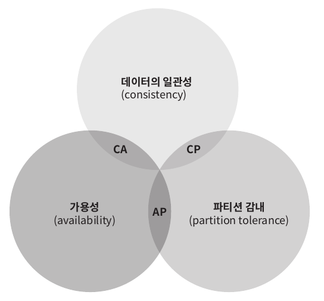

여기서 2가지를 충족하려면, 나머지 하나는 반드시 희생되어야 함.

위의 세 요구 사항 중 어떤 두가지를 만족하냐에 따라 다음과 같이 분류
1. CP시스템
2. AP시스템
3. CA시스템
  - 다만 통상 네트워크 장애는 피할 수 없는 것으로 여겨지기 때문에 분산 시스템은 반드시 파티션 문제를 감내할 수 있도록 설계 되어야 함.
  - 따라서 CA시스템은 실질 존재하지 않음

--- ---
이에 관한 몇 가지 사례를 살펴보자

분산 시스템에서 데이터는 보통 여러 노드에 복제되어 보관됨

세 개의 복제 노드 n1,n2,n3에 데이터를 복제하여 보관하는 상황
--- ---
#### 이상적 상태
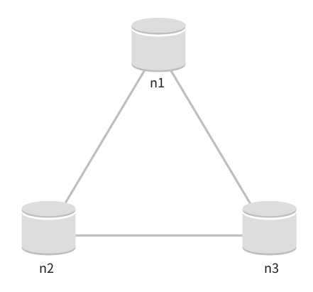

- 네트워크가 파티션 되는 상황은 절대로 일어나지 않을 것
- n1에 기록된 데이터는 자동으로 n2, n3에 복제됨 -> 데이터 일관성과 가용성도 만족

#### 실세계의 분산 시스템
분산 시스템은 파티션 문제를 피할 수 없음

그리고 파티션 문제가 발생하면 우리는 일관성과 가용성 사이에서 하나를 선택해야 함

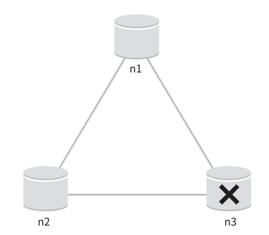

- 위 그림에서는 n3에 장애가 발생하여 n1 및 n2와 통신할 수 없는 상황을 보여줌
- 클라이언트가 n1 또는 n2에 기록한 데이터가 n3에 전달되지 않음
- n3에 기록되었으나 아직 n1 n2로 전달되지 않은 데이터가 있다면 n1와 n2는 오래된 사본을 가지고 있음

- 가용성 대신 일관성을 선택(cp 시스템)
  - 세 서버 사이에 생길 수 있는 데이터 불일치 문제를 피하게 위해 n1과 n2에 대해 쓰기 연산을 중지 시켜야 함 -> 가용성이 깨짐(장애가 발생하도 요청을 처리할 수 있어야 함)
  - 만약 일관성이 깨질 수 있는 상황이 발생하면 이런 상황이 해결될 땨 까지는 오류는 반환해야 함

- 일관성 대신 가용성 선택(AP 시스템)
  - 낡은 데이터를 반환할 위험이 있다고 해도 계속 읽기 연산을 허용해야함
  - n1과 n2에서는 계속 쓰기 연산을 해용할 것이고 파티션 문제가 해결된 후에 새 데이터를 n3에게 전송
=> 분산 키-값 저장소를 만들 때에는 그 요구사항에 맞도록 CAP정리를 적용해야 함
  
--- ---
### 시스템 컴포넌트
키-값 저장소 구현에 사용될 핵심 컴포넌트들 및 기술
- 데이터 파티션
- 데이터 다중화
- 일관성
- 일관성 불일치 해소
- 장애 처리
- 시스템 아케텍처 다이어그램
- 쓰기 경로
- 읽기 경로

널리 사용되고 있는 세가지 키-값 저장소(다이나모, 카산드라, 빅테이블)의 사례 참고

#### 데이터 파티션
대규모 어플리케이션에서 전체 데이터를 한 대 서버에 욱여넣는 것은 불가능

가장 단순한 해결책은 데이터를 작은 파티션들로 분할한 다음에 여러 대의 서버에 저장하는 것

데이터를 파티션 단위로 나눌 떄는 다음 두가지 문제를 중요하게 살펴보아야 함.

- 데이터를 여러 서버에 고르게 분산할 수 있는가
- 노드가 추가되거나 삭제될 때 데이터 이동을 최소화 할 수 있는가
  - 이전에 배운 안정해시는 이런 문제를 푸는데 적합한 기술임
  
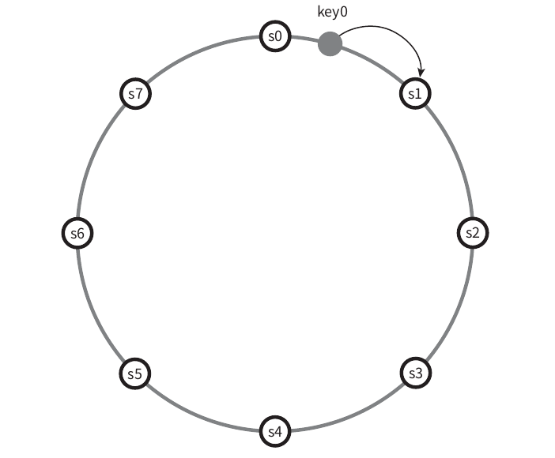

1. 서버를 해시링에 배치
2. 어떤 키-값 쌍을 어떤 서버에 저장할 지 경정하려면 우선 해당 키를 같은 링 위에 배치해야함
3. 그 지점으로부터 링 시계 방향으로 순회하다가 만나는 첫 번쨰 서버가 바로 해당 키-값쌍을 저장할 서버

장점
- 규모 확장 자동화
  - 시스템 부하에 따라 서버가 자동으로 추가되거나 삭제될 수 있음.
- 다양성
  - 각 서버의 용량에 맞게 가상 노드의 수를 조정할 수 있음
    - 고성능 서버는 더 많은 가상 노드를 갖도록 설정할 수 있음
    
#### 데이터 다중화
높은 가용성과 안정성을 확보하기 위해서는 데이터를 N개 서버에 비동기적으로 다중화할 필요가 있음
- n은 튜닝 가능한 값

N개 서버를 선정하는 방법은 어떤 키를 해시 링 위에 배치한 후, 그 지점으로부터 시계 방향으로 링을 순회하면서 만나는 첫 N개 서버에 데이터 사본을 보관하는 것

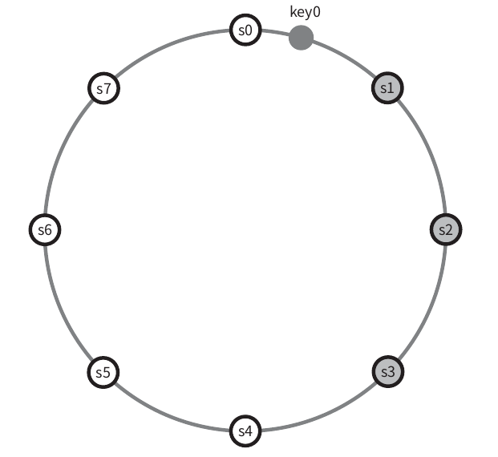

따라서 N=3으로 설정한 이 예제에서 key0은 s1,s2, s3에 보관됨

그러나 가상 노드를 사용한다면 위와 같이 선택한 N개의 노드가 대응될 실제 물리 서버의 개수가 N보다 작아질 수 있음

-> 같은 물리 서버를 중복 선택하지 않도록 주의

같은 데이터 센터에 속한 노드는 정전, 네트워크 이슈 등의 문제를 동시에 겪을 가능성 있음
-> 안정성을 담보하기 위해 데이터 사본은 다른 센터의 서버에 보관, 센터들은 고속 네트워크로 연결

#### 데이터 일관성
여러 노드에 다중화 된 데이터는 적절히 동기화 되어야 함

정족수(Quorum Consensus) 프로토콜을 사용 -> 읽기/쓰기 연산 모두에 일관성을 보장할 수 있음

- 관련된 정의
  - N = 사본 개수
  - W = 쓰기 연산에 대한 정족수, 쓰기 연산이 성공한 것으로 간주되려면 적어도 W개의 서버로 부터 쓰기 연산이 성공했다는 응답을 받아야함.
  - R = 읽기 연산에 대한 정족수, 읽기 연산에 성공한 것으로 간주되려면 적어도 R개의 서버로 부터 응답을 받아야 함.

  - 예제
    
  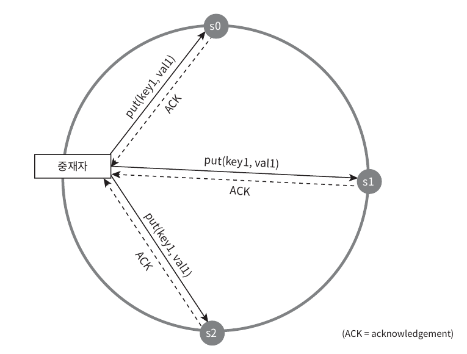
  
  - N = 3인 경우
  - W = 1은 데이터가 한 대 서버에만 기록된다는 뜻이 아님
  - 위 예시 처럼 데이터가 s0,s1,s2에 다중화 되는 상황을 예를 들자면
    W=1의 의미는 쓰기 연산이 성공했다고 판단하기 위해 중재자는 최소 한 대의 서버로부터 쓰기 성공 응답을 받아야 한다는 것을 뜻함
  - 즉, s1으로부터 성공 응답을 받았다면 s0, s2로 부터의 응답을 기다릴 필요가 없음

W,R,N의 값을 정하는 것은 응답 지연과 데이터 일관성 사이의 타협점을 찾는 전형적인 과정임

W=1 또는 R=1의 구성인 경우 한 대의 서버로부터의 응답만 받으면 되기 떄문에 응답속도는 빠를 것임

만약 이보다 큰 경우 데이터 일관성의 수준은 높지만 응답속도는 느려질 것임

W+R > N의 경우에는 강한 일관성 보장

-> 일관성을 보증할 최신 데이터를 가진 노드가 최소 하나는 겹칠 것 이기 떄문

- R = 1, W = N: 빠른 읽기 연산에 최적화 된 시스템
- W = 1, R = N : 빠른 쓰기 연산에 최적화된 시스템
- W+R>N : 강한 일관성 보장
- W+R<=N : 강한 일관성의 보장이 없음
- W+R<=N : 강한 일관성의 보장 없음
 -> 요구되는 일관성 수준에 따라 조정하면 됨

#### 일관성 모델
일관성 모델은 키-값 저장소를 설계할 때에 고려해야 할 또 하나의 중요한 요소임

데이터 일관성의 수준을 결정하는데, 종류가 다양함.

- 강한 일관성
  - 모든 읽기 연산은 가장 최근에 걍신된 결과를 반환함
    - 클라이언트는 절대로 낡은 데이터를 보지 못함
- 약한 일관성
  - 읽기 연산은 가장 최근에 갱신된 결과를 반환하지 못할 수 도 있음
- 결과적 일관성
  - 약한 일관성의 한 형태로, 갱신 경과가 결국에는 모든 사본에 반영(즉 동기화) 되는 모델

강한 일관성을 달성하는 일반적인 방법은, 모든 사번에 현재 쓰기 연산의 결과가 반영될 때 까지 해당 데이터에 대한 읽기/쓰기를 금지하는 것
- 고가용성 시스템에는 적합하지 않음, 새로운 요청의 처리가 중단되기 떄문임
- 다이나모 또는 카산드라 같은 저장소

결과적 일관성 모델을 따를 경우, 쓰기 연산이 병렬적으로 발생하면서 시스템에 저장된 값의 일관성이 꺠질 수 있음
- 클라이언트가 해결해야 함
- 클라이언트 측에서 데이터의 버전 정보를 활용해 일관성이 꺠진 데이터를 읽지 않고록 하기 위해서 살펴보어야함.

##### 비 일관성 해소 기법: 데이터 비저닝
데이터를 다중화 하면 가용성은 높아지지만 사본 간 일관성이 꺠징 가능성이 높아짐.

-> 비저닝과 벡터시계가 문제 해결

비저닝: 데이터를 변경할 때마다 해당 데이터의 새로운 버전을 만드는 것을 의미 -> 각 버전의 데이터는 변경 불가능

비저닝에 대해 알아보기 전에 우선 데이터 일관성이 어떻게 깨지는지 예시를 통해 살펴보자

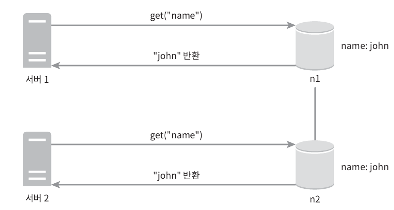

- 어떤 데이터의 사본이 노드 n1과 n2에 보관되어 있다고 가정
- 데이터를 가져오려는 서버1과 서버2는 get("name")의 결과로 같은 값을 얻음

- 서버1은 "name"에 매달린 값을 "johnSanFrancisco"로 바꾸고, 서버2는 "johnNewYork"로 바꾼다고 가정
- 두 연산은 동시에 이루어짐

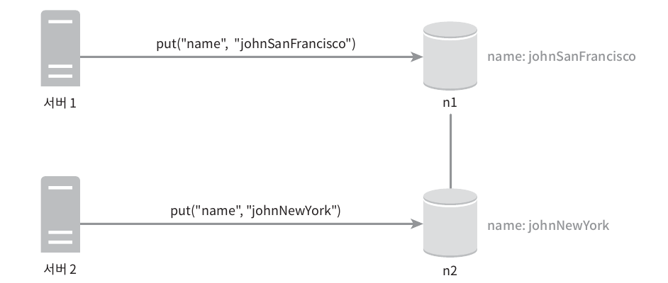

- 이 변경이 이루어진 이후, 원래 값은 무시할 수 있음 (변경이 끝난 옛날 값이기 떼문)
- 마지막 두 버전 v1, v2 사이의 충돌은 해결하기 어려움
  - 이 문제를 해결하려면, 충돌을 발견하고 자동으로 해결해 낼 비저닝 시스템이 필요
  - 벡터 시계는 이런 문제 해결에 보편적으로 사용되는 기술

--- ---

#### 백터 시계
[서버, 버전]의 순서쌍을 데이터에 매단 것
어떤 버전이 선행 버전인지 후행 버전인지 아니면 다른 버전과 충돌이 있는지 판별함

벡터 시계는 D([S1, v1], [S2, V2]...[Sn, vn])와 같이 표현한다고 가정

D는 데이터, Vi는 카운터 , Si는 서버 번호

만일 데이터 D를 서버 Si에 기록하면 시스템은 아래 작업 가운데 하나를 수행해야 함
- [Si, Vi]가 있다면 vi를 증가
- 그렇지 않으면 새항목 [Si, 1]을 만듦
  - 예시
    
    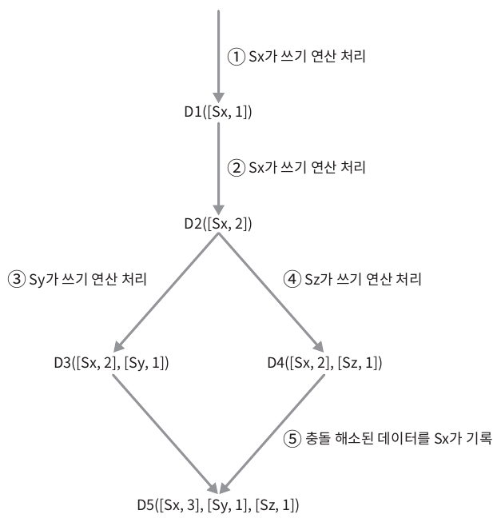
  
  - 클라이언트가 데이터 D1을 시스템에 기록, 이 쓰기 연산을 처리한 서버는 Sx임
    - 따라서 벡터 시계는 D1[(Sx, 1)]으로 변힘
  - 다른 클라이언트가 데이터 D1을 읽고 D2로 업데이트 한 다음 기록, D2는 D1에 대한 변경이므로 D1을 덮어씀
    - 쓰기 연산은 같은 Sx가 처리한다고 가정, 벡터 시계는 D2([Sx,2])로 변경
  - 다른 클라이언트가 D2를 읽어 D3로 갱신한 다음 기록, 
    - 이 쓰기 연산은 Sy가 처리한다고 가능, 벡터 시계 상태는 D3([Sx, 3], [Sy, 1])
  - 또 다른 클라이언트가 D2를 일고 D4로 갱신한 다음 기록
    - 이때 쓰기 연산은 Sz가 처리한다고 가정, 벡터 시계는 D4([Sx, 2], [Sz, 1])
  - 어떤 클라이언트가 D3와 D4를 읽으면 데이터 간 충돌있다는 것을 알게 됨.
    - D2를 Sy와 Sz가 각기 다른 값으로 바꾸었기 때문
    - 이 충돌은 클라이언트가 해소한 후에 서버에 기록
    - 이 쓰기 연산을 처리한 서버는 Sx였다고 가정
      - 벡터 시계는 D5([Sx, 3], [Sy, 1], [Sz, 1])로 바뀜

벡터 시계를 사용하면 어떤 버전 x가 버전 y의 이전 버전인지 (따라서 충돌이 없는지) 쉽게 판단 가능함
- 예를 들어 벡터 시계 D([S0, 1], [s1, 1])은 D([s0, 1], [s1, 2])의 이전 버전. 따라서 두 데이터 사이에 충돌은 없음.

버전 X와 Y사이에 충돌이 있는지 보려면 Y의 벡터 시계 구성요소 가운제 X의 벡터 시계 동일 서버 구성요소보다 작은 값을 갖는 것이 있는지 확인해 보면 됨
- 예를 들어 D([S0,1], [s1,2])와 D([s0,2], [s1,1])는 서로 충돌 _ 다른 버전에서 파생됨

- 단점
  1. 충돌 감지 및 해소 로직이 클라이언트에 들어가야 하므로, 클라이언트 구현이 복잡헤짐
  2. [서버:버전] 의 순서쌍 개수가 굉장히 빨리 늘어남

 --- ---
#### 장애 감지
분산 시스템에서는 그냥 서버 한대가 죽었다고 "지금 서버 A가 죽었습니다." 라고 해서 버로 서버A를 장애 처리 하지 않음

보통 두 대 이상의 서버가 똑같이 서버A의 장애를 보고해야 실제로 해당 서버에 장애가 발생했다고 간주 함

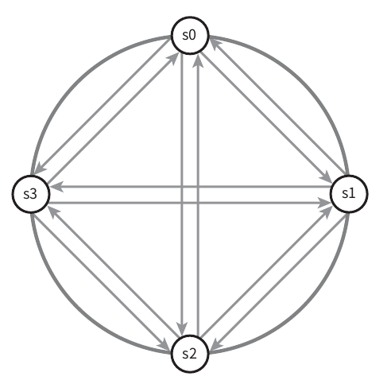

위와 같이 모든 노드 사이에 멀티캐스팅 채넣을 구축하는 것이 서버 장애를 감지하는 가장 손쉬운 방법이지만 서버가 많을 때는 비효율적

##### 가십 프로토콜
가십 프로토콜 같은 분산형 장애 감지 솔루션을 채택하는게 효율적

가십프로토콜 동작 원리
- 각 노드는 멤버십 목록을 유지함, 멤버십 목록은 각 멤버 id와 그 박동 카운터 쌍의 목록
- 각 노드는 주기적으로 자신의 박동 카운터를 증가시킴
- 각 노드는 무작위로 선정된 노드들에게 주기적으로 자기 박동 카운터 목록을 보냄
- 박동 카운터 목록을 받은 노드는 멤버십 목록을 멤버십 목록을 최신 값으로 갱신
- 어떤 멤버의 박동 카운터 값이 지정된 시간 동안 갱신 되지 않으면 해당 멤버는 장애 상태인 것으로 간주

예시

- 노드 S0는 좌츨의 테이블과 같은 멤버십 목록을 가진 상태
- 노드 S0는 S2(멤버ID=2)의 박동 카운터가 오랫동안 증가 되지 않았다는 것을 발견
- 노드 S0은 노드 S2를 포함하는 박동 카운터 목록을 무작위로 선택된 다른 노드에게 전달
- 노드 S2의 박동카운터가 오랫동안 증가 되지 않았음을 발견한 모든 노드는 해당 노드를 장애 노드로 표시

#### 일시적 장애 처리
가십 프로토콜로 장애를 감지한 시스템은 가용성을 보장하기 위한 조치를 해야함

- 엄격한 정족수 접근법: 읽기와 쓰기 연산을 금지 하는 등.. 
- 엄격한 정족수 접근법을 쓰는 대신 느슨한 정족수 접근법은 이 조건을 완화하여 가용성을 높임

쓰기 연산을 수행할 W개의 건강한 서버와 읽기 연산을 수행할 R개의 건강한 서버를 해시링에서 고름
-> 장애 상태인 서버는 무시

장애 서버로 가는 요청은 다른 서버에서 처리

그동안의 변경 사항은 해당 서버 복구시 일괄로 반영하여 일관성을 높임

이를 위해 임시로 쓰기 연산을 처리한 서버에서 hint를 남기고, 이를 단서 후 임시 위탁이라 함

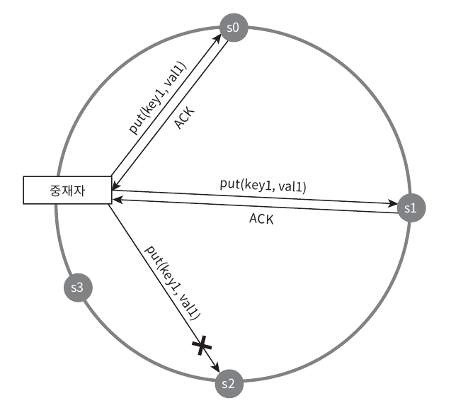

#### 영구 장애 처리
영구적인 노드의 장애처리는 어떻게 할까?
이 처리를 위해 반-엔트로피 프로토콜을 사용하여 사본을 동기화할 것임

반-엔트로피 프로토콜은 사본들을 비교하여 최신 버전으로 걍신하는 과정을 포함함.

사본 간의 일관성이 망가진 상태를 탐지하고 전송 데이터의 양을 줄이기 위해서는 머클트리를 사용

머클 트리
- 해시 트리라고도 불람
- 각 노드에 그 자식 노드들에 보관된 값의 해시, 또는 자식 노드들의 레이블로 부터 계산 된 해시 값을 레이블로 붙여두는 트리임
- 대규모 자료 구조의 내용을 효과적이면서도 보안상 안전한 방법으로 검증 가능

- 예시
  - 키 공간이 1부터 12일 때 머클 트리를 만드는 예제를 살펴보자..
  - 일관성이 망가진 데이터가 위치한 상자는 다른 색으로 표시
    1. 키 공간을 버킷으로 나눔(4개의 버킷)
       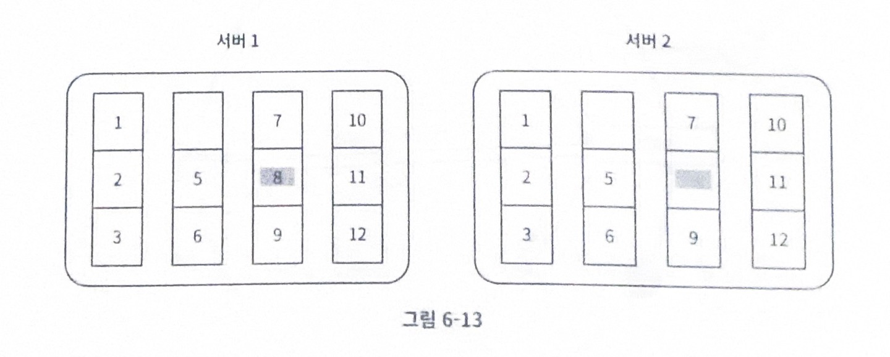
    2. 버킷에 포함된 각각의 키에 균등 분포 해시 함수를 적용하여 해시 값 계산
       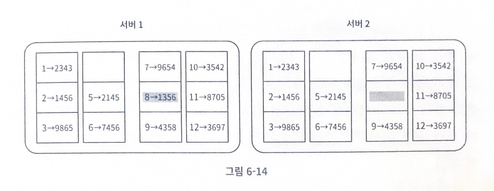
    3. 버킷 별로 해시 값 계산 후 , 해당 해시 값을 레이블로 같은 노드 만듦
       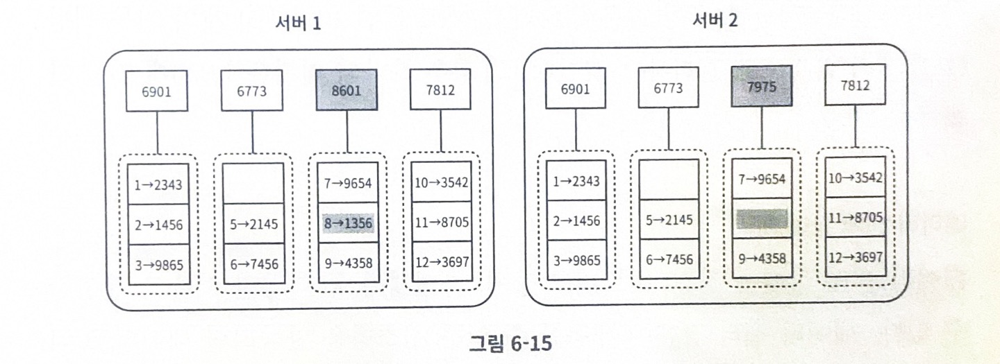
    4. 자식 노드의 레이블로부터 새로운 해시값을 계산하여 이진트리를 상향식으로 구성
       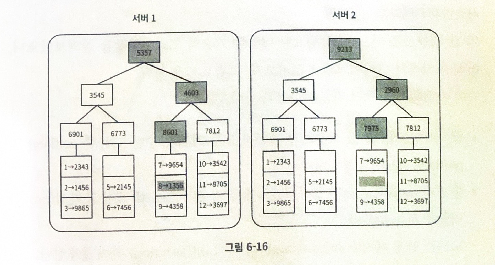
  - 이 두 머클 트리의 비교는 루트 노드의 해시값을 비교하는 것으로 시작
    - 루트 노드의 해시값이 일치한다면 두 서버는 같은 데이터를 갖음
    - 다른 경우에는 왼쪽 자식 노드의 해시 값을 비교하고 다음으로는 오른쪽 자식 노드의 해시 값 비교
    - 탐색해나가다 보면 다른 데이터를 갖는 버킷 찾을 수 있음, 그 버킷들만 동기화

#### 데이터 센터 장애 처리
- 데이터 센터 장애는 정전, 네트워크 장애, 자연재해 등 다양한 이유로 발생
- 데이터 센터 장애에 대응할 수 있는 시스템을 만들려면 데이터를 여러 데이터 센터에 다중화하는 것이 중요
- 한 데이터센터가 완전히 망가져도 사용자는 다른 데이터 센터에 보관된 데이터를 이용할 수 있을 것

#### 시스템 아키텍처 다이어그램
기술적 고려사항 다 봤으니 아키텍처 다이어 그램 살펴봏자

아키텍처 주 기능
- 클라이언트는 키-값 저장소가 제공하는 두 가지 단순한 API, 즉 get(key) 및 put(key, value)와 통신함.
- 중재자는 클라이언트에게 키-값 저장소에 대한 프락시 역할을 하는 노드임.
- 노드는 안정 해시의 해시 링 위에 분포함

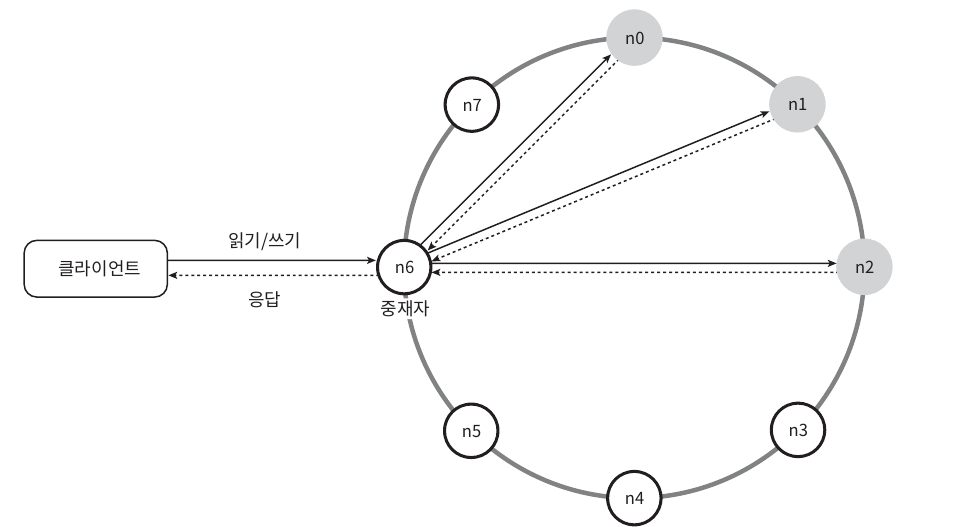

- 노드를 자동으로 추가/삭제할 수 있도록 시스템은 완전히 분산됨
- 데이터는 여러 노드에 다중화
- 모든 노드가 같은 책임을 지므로, SPOF(Single Point of Failure)는 존재하지 않음

완전히 분산된 설계를 채택하였으므로, 모든 노드는 아래 그림에서 제시된 기능 전부를 지원함

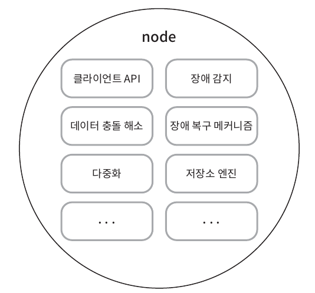

#### 쓰기 경로
쓰기 요청이 특정 노드에 전달되면 무슨 일이 벌어지는지 살펴보자..

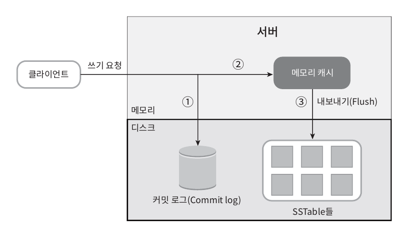

1. 쓰기 요청이 커밋 로그 파일에 기록
2. 데이터가 메모리 캐시에 기록
3. 메모리 캐시가 가득차거나 사전에 정의된 어떤 임계치에 도달하면 데이터는 디스크에 있는 SSTable에 기록됨 (SSTable은 Sorted-String Table의 약어로, <키, 값>의 순서쌍을 정렬된 리스트 형태로 관리하는 테이블)

#### 읽기 경로
읽기 요청을 받은 노드는 데이터가 메모리 캐시에 있는지부터 살핌. 있는 경에는 아래와 같이 해당 데이터를 클라이언트에게 반환

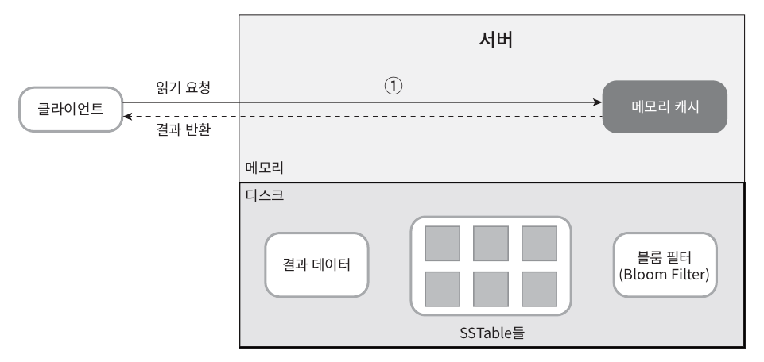

데이터가 메모리에 없는 경우 디스크에서 가져옴.

어느 SSTable에 찾는 키가 있는지 알아낼 효율적인 방법이 필요함 (블룸 필터가 흔히 사용됨)

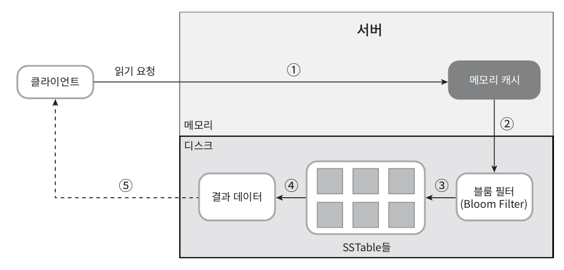

1. 데이터가 메모리 있는지 검사. 없으면 2로
2. 데이터가 메모리에 없으므로 블룸 필터를 검사.
3. 블룸 필터를 통해 어떤 SSTable에 키가 보관되어 있는지 알아냄.
4. SSTable에서 데이터를 가져옴
5. 해당 데이터를 클라이언트에 반환.

### 요약
--- ---
분산 키-값 저장소가 가져야 하는 기능과 그 기능 구현에 이용되는 기술..
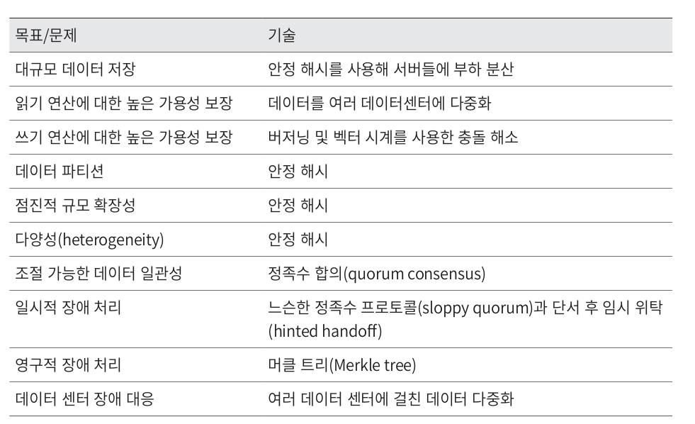
