# 6장 키-값 저장소 설계

**키-값 저장소(key-value store)**

| 키 | 값 |
| --- | --- |
| 145 | john |
| 147 | bob |
| 160 | julia |

- 키-값 데이터베이라고도 불리는 비 관계형(non-relational) 데이터베이스
- 고유 식별자(identifier)를 키로 가져야 함
    - e.g. 일반 텍스트 키: "last_logged_in_at", 해시 키: 253DDEC4
- 키-값 쌍에서의 값은 무엇이 오든 상관하지 않음
  - e.g. 문자열, 리스트, 객체
- e.g. 아마존 다이나모, memcached, 레디스 등
```
put(key, value): 키-값 쌍을 저장소에 저장
get(key): 인자로 주어진 키에 매달린 값을 꺼냄
```
-> 다음 연산을 지원하는 키-값 저장소 설계

## 문제 이해 및 설계 범위 확정
다음 특성을 갖는 키-값 저장소 설계
- 키-값 쌍의 크기는 10KB 이하
- 큰 데이터 저장 가능
- 높은 가용성 제공. 시스템은 장애가 있더라도 빨리 응답해야 함
- 높은 규모 확장성 제공. 트래픽 양에 따라 자동으로 서버 증설/삭제가 이루어져야 함
- 데이터 일관성 수준은 조정 가능해야 함
- 응답 지연시간(latency) 짧아야 함

>읽기, 쓰기, 메모리 사용량 사이의 균형 <br>
데이터의 일관성과 가용성 사이에서 타협적 결정을 내린 설계

## 단일 서버 키-값 저장소
- 한 대 서버만 사용하는 키-값 저장소를 설계하는 것은 쉬움 <br>
    - 키-값 쌍 전부를 메모리에 해시 테이블로 저장
        - 문제점
          - 빠른 속도를 보장하지만, 모든 데이터를 메모리 안에 두는 것은 불가능
        - 해결책 
          - 데이터 압축(compression)
          - 자주 쓰이는 데이터만 메모리에 두고 나머지는 디스크에 저장 <br>

-> 문제점을 개선하더라도, 한 대 서버로 부족한 때가 찾아옴 <br>
-> 많은 데이터를 저장하려면 분산 키-값 저장소(distributed key-value store) 만들 필요성

## 분산 키-값 저장소
- 분산 해시 테이블이라고도 불림
  - 키-값 쌍을 여러 서버에 분산

### CAP 정리(Consistency, Availability, Partition Tolerance theorem)
- 데이터 일관성(consistency), 가용성(availability), 파티션 감내(partition tolerance)를 동시에 만족하는 분산 시스템을 설계하는 것은 불가능'
  - 데이터 일관성
    - 분산 시스템에 접속하는 모든 클라이언트는 어떤 노드에 접속했느냐에 관계없이 언제나 같은 데이터를 보게 되어야 함
  - 가용성
    - 분산 시스템에 접속하는 클라이언트는 일부 노드에 장애가 발생하더라도 항상 응답을 받을 수 있어야 함
  - 파티션 감내
    - 네트워크에 파티션이 생기더라도 시스템은 계속 동작하여야 함
      - 파티션: 두 노드 사이에 통신 장애가 발생하였음을 의미함

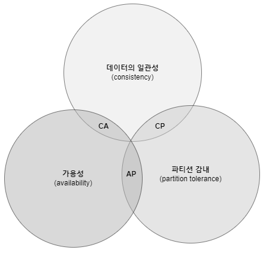
- CP 시스템
  - 일관성과 파티션 감내를 지원하는 키-값 저장소
    - 가용성 희생
- AP 시스템
  - 가용성과 파티션 감내를 지원하는 키-값 저장소
    - 데이터 일관성 희생
- CA 시스템
  - 일관성과 가용성을 지원하는 키-값 저장소
    - 파티션 감내는 지원하지 않음
    - 통상 네트워크 장애는 피할 수 없는 일로 여겨지므로, 분산 시스템은 반드시 파티션 문제를 감내할 수 있도록 설계되어야 함 <br>

  -> 실세계에 CA 시스템은 존재하지 않음

<br>

> 예제: 세 대의 복제(replica) 노드 n1, n2, n3에 데이터를 복제하여 보관하는 상황
#### 이상적 상태
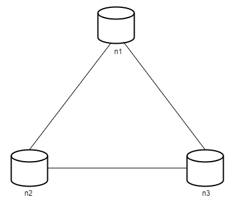
- 네트워크가 파티션되는 상황은 절대로 일어나지 않음
- n1에 기록된 데이터는 자동적으로 n2, n3에 복제
- 데이터 일관성과 가용성도 만족

<br>

> 예제: n3에 장애가 발생하여 n1 및 n2와 통신할 수 없는 상황
#### 실세계의 분산 시스템
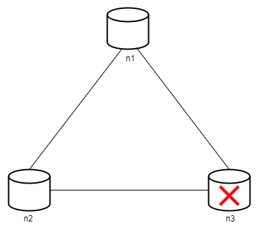
- 분산 시스템은 파티션 문제를 피할 수 없음
    - 일관성과 가용성 사이에서 하나 선택해야 함
- 상황
  - 클라이언트가 n1 또는 n2에 기록한 데이터는 n3에 전달되지 않음
  - n3에 기록되었으나 아직 n1 및 n2에 전달되지 않은 데이터가 있다면 n1과 n2는 오래된 사본을 갖고 있을 것임
- **CP 시스템** (가용성 대신 일관성 선택)
  - n1과 n2에 대해 쓰기 연산 중단
    - 세 서버 사이에 생길 수 있는 데이터 불일치 문제 피하기 위해 <br>
  -> 가용성 깨짐
    - e.g. 은행권 시스템 
      - 데이터 일관성 양보X
      - 온라인 뱅킹 시스템이 계좌 최신 정보를 출력하지 못하면 큰 문제가 생김
  - 네트워크 파티션 때문에 일관성이 깨질 수 있는 상황이 발생하면, 상황이 해결될 때까지는 오류를 반환해야 함
- **AP 시스템** (일관성 대신 가용성 선택)
  - 낡은 데이터를 반환할 위험이 있더라도 읽기 연상 항상 허용
    - n1과 n2는 계속 쓰기 연산을 허용 
    - 파티션 문제가 해결된 뒤에 n3에 새 데이터 전송

-> 분산 키-값 저장소를 만들 때는 그 요구사항에 맞도록 CAP 정리를 적용해야 함

### 시스템 컴포넌트
**키-값 저장소 구현에 사용될 핵심 컴포넌트들 및 기술들**
- 데이터 파티션
- 데이터 다중화(replication)
- 일관성(consistency)
- 일관성 불일치 해소(inconsistency resolution)
- 장애 처리
- 시스템 아키텍처 다이어그램
- 쓰기 경로(write path)
- 읽기 경로(read path)

#### 데이터 파티션
- 대규모 애플리케이션의 경우, 전체 데이터를 한 대 서버에 욱여넣는 것 불가능
-> 데이터를 작은 파티션들로 분할한 다음, 여러 대 서버에 저장
- 따져봐야 하는 점
  - 데이터를 여러 서버에 고르게 분산할 수 있는가
  - 노드가 추가되거나 삭제될 때 데이터의 이동을 최소화할 수 있는가 <br>
-> 안정 해시 사용<br>
  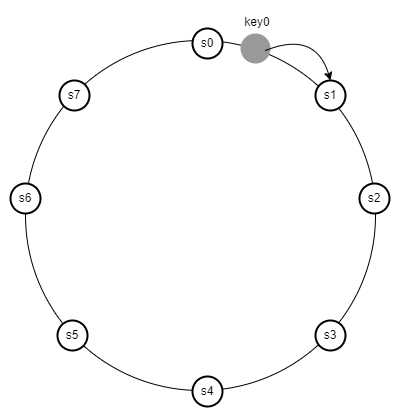
  ```
  1. 서버를 해시 링에 배치
  2. 해당 키를 같은 링 위에 배치
  3. 링을 시계 방향으로 순회하다 만나는 첫번째 서버가 해당 키-값을 저장할 서버
  -> key0는 s1에 저장
  ```
  - 안정 해시를 사용하여 데이터를 파티션하면 좋은 점 
    - 규모 확장 자동화(automatic scaling)
      - 시스템 부하에 따라 서버가 자동으로 축되거나 삭제되도록 만들 수 있음
    - 다양성(heterogeneity)
      - 각 서버의 용량에 맞게 가상 노드(virtual node)의 수 조정 가능 <br>
      -> 고성능 서버는 더 많은 가상 노드를 갖도록 설정할 수 있음

#### 데이터 다중화
- 데이터를 N개 서버에 비동기적으로 다중화 (N은 튜닝 가능한 값) <br>
-> 높은 가용성과 안정성 확보 
> 예제: N개 서버를 선정하는 방법 (N=3)

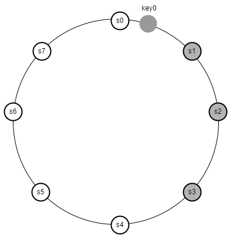
1. 어떤 키를 해시 링 위에 배치
2. 그 지점으로부터 시계 방향으로 링을 순회하면서 만나는 첫 N개 서버에 데이터 사본 보관
3. key0은 s1, s2, s3에 저장

- 문제점
  - 가상 노드 사용 시, N개의 노드가 대응될 실제 물리 서버의 개수가 N보다 작아질 수 있음 <br>
  -> 노드를 선택할 때, 같은 물리 서버를 중복 선택하지 않도록 해야 함
  - 같은 데이터 센터에 속한 노드는 정전, 네트워크 이슈, 자연재해 등의 문제를 동시에 겪을 가능성 <br>
  -> 데이터의 사본은 다른 센터의 서버에 보관하고, 센터들은 고속 네트워크로 연결 (안정성 담보)

#### 데이터 일관성
- 여러 노드에 다중화된 데이터는 적절히 동기화가 되어야 함 <br>
-> 정족수 프로토콜(Quorum Consensus) 사용 <br>
-> 읽기/쓰기 연산 모두에 일관성 보장

> 예제: 정족수 합의 프로토콜 (N = 3)
> - N=사본 개수
> - W=쓰기 연산에 대한 정족수. 쓰기 연산이 성공한 것으로 간주되려면, 적어도 W개의 서버로부터 쓰기 연산이 성공했다는 응답을 받아야 함
> - R=읽기 연산에 대한 정족수. 읽기 연산이 성공한 것으로 간주되려면 적어도 R애의 서버로부터 응답을 받아야 함

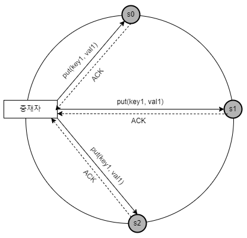
- W = 1
  - 데이터가 한 대 서버에만 기록된다는 뜻 X
  - 쓰기 연산이 성공헀다고 판단하기 위해 중재자(coordinator)는 최소 한 대 서버로부터 쓰기 성공 응답을 받아야 한다는 뜻
  - s1으로부터 성공 응답을 받았다면, s0, s2로부터의 응답은 기다릴 필요 없음 <br>
  -> 중재자는 클라이언트와 노드 사이에서 프락시(proxy) 역할을 함
- W = 1 or R = 1
  - 중재자는 한 대 서버로부터의 응답만 받으면 됨 -> 응답속도 빠름
- W or R > 1
  - 시스템의 보여주는 데이터 일관성의 수준은 향상
  - 가장 느린 서버로부터의 응답을 기다려야 하므로, 중재자의 응답 속도 느려짐
- W + R > N
  - 강한 일관성 보장
  - 일관성을 보증할 최신 데이터를 가진 노드가 최소 하나는 겹침

> **R = 1, W = N**: 빠른 읽기 연산에 최적화된 시스템 <br>
> **W = 1, R = N**: 빠른 쓰기 연산에 최적화된 시스템 <br>
> **W + R > N**: 강한 일관성이 보장됨 (보통 N = 3, W = R = 2) <br>
> **W + R <= N**: 강한 일관성이 보장되지 않음 <br><br>
> -> 요구되는 일관성 수준에 따라 W, R, N의 값을 조정하면 됨

##### 일관성 모델
- 강한 일관성(string consistency)
  - 모든 읽기 연산은 가장 최근에 갱신된 결과를 반환
  - 클라이언트는 절대로 낡은(out-of-date) 데이터를 보지 못함
  - 모든 사본에 현재 쓰기 연산의 결과가 반영될 떄까지 해당 데이터에 대한 읽기/쓰기 금지 <br>
  -> 고가용성 시스템에는 적합하지 않음
- 약한 일관성(weak consistency)
  - 읽기 연산은 가장 최근에 갱신된 결과를 반환하지 못할 수 있음
- 결과적 일관성(eventual constistency)
  - 약한 일관성의 한 형태
  - 갱신 결과가 결국에는 모든 사본에 반영(동기화)되는 모델
  - 쓰기 연산이 병렬적으로 발생하면 시스템에 저장된 값의 일관성이 깨어질 수 있음 <br>
  -> 클라이언트가 해결해야 함 <br>
  -> 데이터 버저닝: 클라이언트 측에서 데이터의 버전 정보를 활용해 일관성이 깨진 데이터를 읽지 않도록 하는 기법
  - e.g. 다이나모 or 카산드라 같은 저장소

##### 비 일관성 해소 기법: 데이터 버저닝
- 데이터를 다중화하면 가용성↑, 사본 간 일관성 깨질 가능성↑ <br>
-> 버저닝(versioning)과 벡터 시계(vector clock) 기술 등장
  - 버저닝: 데이터를 변경할 때마다 해당 데이터의 새로운 버전을 만드는 것
    - 각 버전의 데이터는 변경 불가능(immutable)

> 예제: 데이터 일관성이 깨지는 과정 

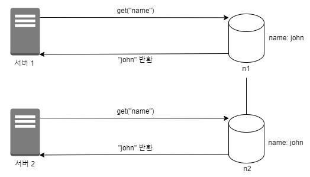
- 서버 1은 "name"을 "johnSanFrancisco"로 바꿈
- 서버 2는 "johnNewYork"으로 바꿈 
  - 두 연산은 동시에 이뤄짐
  - 충돌(conflict)하는 두 값을 갖게 됨
  - 각각을 버전 v1, v2라고 함

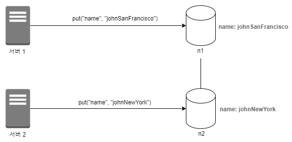
- 두 버전 v1과 v2 사이의 충돌 해소하기 어려움
  - 충돌을 발견하고 자동으로 해결해 낼 버저닝 시스템 필요 <br>
  -> 벡터 시계(vector clock)


**벡터 시계**
- [서버, 버전]의 순서쌍을 데이터에 매단 것
  - 어떤 버전이 선행 버전인지, 후행 버전인지. 다른 버전과 충돌이 있는지 판별하는데 쓰임
- D([S1, v1], [S2, v2], ... , [Sn, vn])
  - D: 데이터, vi: 버전 카운터, Si: 서버 번호
  - 데이터 D를 서버 Si에 기록하면 시스템은 아래 작업 가운데 하나를 수행해야 함
    - [Si, vi]가 있으면 vi를 증가시킴
    - 그렇지 않으면 새 항목 [Si, 1]를 만듦

> 예제: 추상적 로직 수행 방식

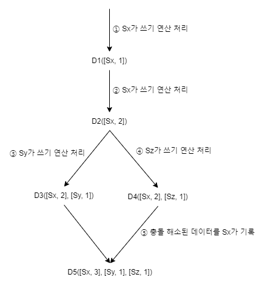 <br>
① 클라이언트가 데이터 D1을 시스템에 기록
- 쓰기 연산을 처리한 서버는 Sx
- 벡터 시계는 D1([Sx, 1]) <br>

② 다른 클라이언트가 데이터 D1을 읽고 D2로 업데이트한 다음 기록 
- D2는 D1에 대한 변경이므로 D1을 덮어씀
  - 쓰기 연산은 같은 서버 Sx가 처리한다고 가정
- 벡터 시계는 D2([Sx, 2]) <br>

③ 다른 클라이언트가 D2를 읽어 D3로 갱신한 다음 기록
- 쓰기 연산은 Sy가 처리한다고 가정
- 벡터 시계 상태는 D3([Sx, 2], [Sy, 1]) <br>

④ 또 다른 클라이언트가 D2를 읽고 D4로 갱신한 다음 기록
- 쓰기 연산은 서버 Sz가 처리한다고 가정
- 벡터 시계는 D4([Sx, 2], [Sz, 1]) <br>

⑤ 어떤 클라이언트가 D3과 D4를 읽으면 데이터 간 충돌이 있다는 것 알게 됨
- D2를 Sy와 Sz가 각기 다른 값으로 바꿨기 때문
- 클라이언트가 충돌을 해소한 후, 서버에 기록
- 쓰기 연산은 서버 Sx가 처리한다고 가정
- 벡터 시계는 (D5([Sx, 3], [Sy, 1], [Sz, 1]))

- D([s0, 1], [s1, 1])은 D([s0, 1], [s1, 2])의 이전 버전
- D([s0, 1], [s1, 2])는 D([s0, 2], [s1, 1])은 서로 충돌
- 벡터 시계의 단점
  - 클라이언트 구현이 복잡해짐 
    - 충돌 감지 및 해소 로직이 클라이언트에 들어감
  - [서버: 버전]의 순서쌍 개수가 굉장히 빨리 늘어남
    - 해결 방법
      - 길이에 임계치(threshold) 설정
      - 임계치 이상으로 길이가 길어지면 오래된 순서쌍을 벡터 시계에서 제거 <br>
      -> 버전 간 선후 관계 정확하게 결정될 수 없음
      -> 충돌 해소 과정의 효율성 낮아짐 
      - e.g. 아마존은 실제 서비스에서 그런 문제가 벌어지는 것을 발견한 적 없음 <br>
      -> 대부분의 기업에서 벡터 시계는 적용해도 괜찮은 솔루션

##### 장애 처리
- 장애 감지(failure detection) 
- 장애 해소(failure resolution)

##### 장애 감지

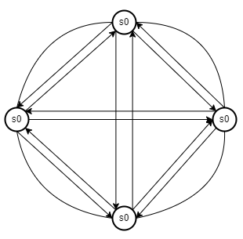
- 모든 노드 사이에 멀티캐스팅(multicasting) 채널 구축
  - 서버 장애를 감지하는 가장 손쉬운 방법
  - 서버가 많을 때는 비효율적

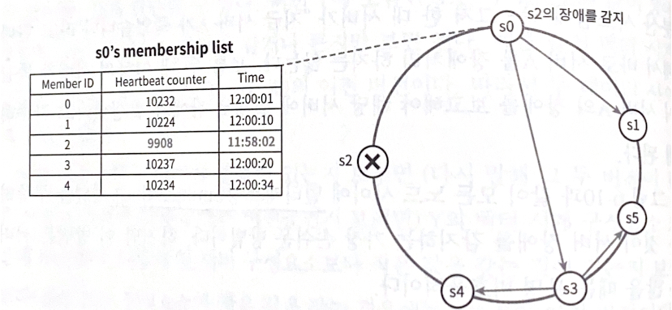
- 가십 프로토콜(gossip protocol): 분산형 장애 감지(decentralized failure detecture) 솔루션
  - 동작 원리
    - 각 노드는 멤버십 목록(membership list)를 유지
      - 멤버십 목록은 각 멤버 ID와 그 박동 카운터(heartbeat counter) 쌍의 목록
    - 각 노드는 주기적으로 자신의 박동 카운터 증가
    - 각 노드는 무작위로 선정된 노드들에게 주기적으로 자기 박동 카운터 목록을 보냄
    - 박동 카운터 목록을 받은 노드는 멤버십 목록을 최신 값으로 갱신
    - 어떤 멤버의 박동 카운터 값이 지정된 시간 동안 갱신되지 않으면, 해당 멤버는 장애(offline) 상태인 것으로 간주
  - 예제 동작 순서
    - 노드 s0은 그림 좌측의 테이블과 같은 멤버십 목록을 가진 상태
    - 노드 s0은 노드 s2(멤버 ID=2)의 박동 카운터가 오랫동안 증가되지 않았다는 것을 발견
    - 노드 s0은 노드 s2를 포함하는 박동 카운터 목록을 무작위로 선택된 다른 노드에게 전달
    - 노드 s2의 박동 카운터가 오랫동안 증가되지 않았음을 발견한 모든 노드는 해당 노드를 장애 노드로 표시

##### 일시적 장애 처리
- 엄격한 정족수(strict quorum) 접근법
  - 읽기와 쓰기 연산 금지
- 느슨한 정족수(sloppy quorum) 접근법 
  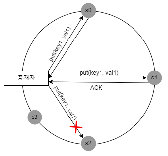
```
- 장애 상태인 노드 s2에 대한 읽기 및 쓰기 연산은 일시적으로 노드 s3가 처리
- s2가 복구되면, s3은 갱신된 데이터를 s2로 인계
```
  - 해시 링에서 쓰기 연산을 수행할 N개의 서버와 읽기 연산을 수행할 R개의 서버를 고름
  - 임시 위탁 기법(hinted handoff)
    - 장애 상태인 서버로 가는 요청은 다른 서버가 잠시 맡아 처리
    - 해당 서버가 복구되었을 때, 변경사항을 일괄 반영하여 데이터 일관성 보존
      - 임시로 쓰기 연산을 처리한 서버는 그에 대한 단서(hint)를 남겨둠

##### 영구 장애 처리
- 반-엔트로피(anti-entropy) 프로토콜을 구현하여 사본 동기화
- 머클 트리 사용
  - 머클(Merkle) 트리
    - 해시 트리라 불림
    - 각 노드에 그 자식 노드들에 보관된 값의 해시 또는 자식 노드들의 레이블로부터 계산된 해시값을 테이블로 붙여두는 트리
    - 대규모 자료 구조의 내용을 효과적이면서도 보안상 안전한 방법으로 검증(verification)할 수 있음
  - 사본 간의 일관성이 망가진 상태를 탐지하고 전송 데이터의 양을 줄임

> 예제: 키 공간(key space)이 1부터 12까지일 때 머클 트리 만들기

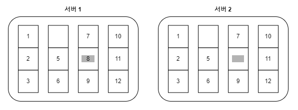
`1단계: 키 공간을 버킷(bucket)으로 나눔 (예제에서는 4개로 나눔)` <br><br>

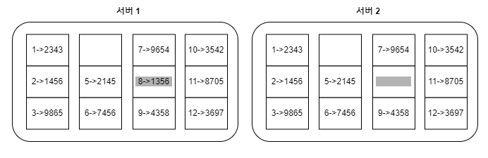
`2단계: 버킷에 포함된 각각의 키에 균등 분포 해시(uniform hash) 함수를 적용해 해시 값 계산` <br><br>

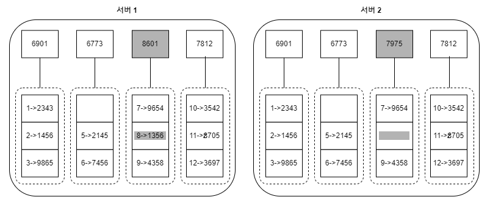
`3단계: 버킷별로 해시값을 계산한 후, 해당 해시 값을 레이블로 갖는 노드를 만듦` <br><br>

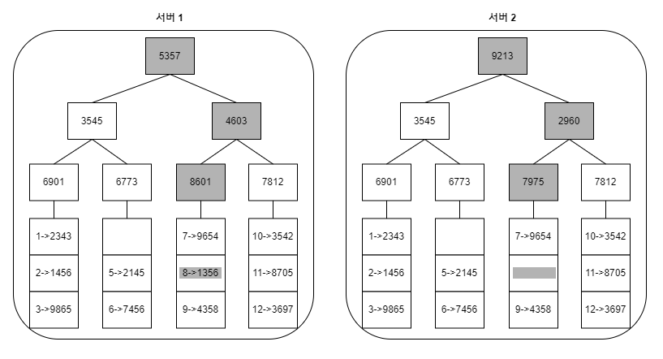
`4단계: 자식 노드의 레이블로부터 새로운 해시 값을 계산하여, 이진 트리를 상향식으로 구성해 나감`

탐색 과정
- 루트 노드의 해시 값 일치 <br>
-> 두 서버는 같은 데이터를 갖고 있음
- 값이 다른 경우 <br>
-> 왼쪽 자식 노드의 해시값 비교, 오른쪽 자식 노드의 해시 값 비교 <br>
-> 아랫쪽으로 탐색해 나가다보면 다른 데이터를 갖는 버킷 찾을 수 있음 <br>
-> 그 버킷들만 동기화 <br><br>

특징
- 동기화해야 하는 데이터의 양은 실제로 존재하는 차이의 크기에 비례
  - 두 서버에 보관된 데이터의 총량과는 무관해짐
- 버킷 하나의 크기가 꽤 큼

##### 데이터 센터 장애 처리
- 여러 데이터 센터에 데이터 다중화
  - 한 데이터센터가 완전히 망가져도, 사용자는 다른 데이터 센터에 보관된 데이터 이용 가능

#### 시스템 아키텍처 다이어그램
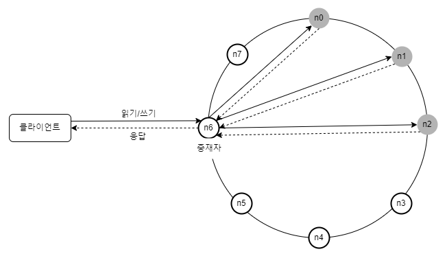

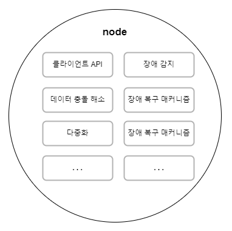 <br>
주된 기능
- 클라이언트는 키-값 저장소가 제공하는 get(key) 및 put(key, value)와 통신
- 중재자(coordinator)는 클라이언트에게 키-값 저장소에 대한 프락시(proxy) 역할을 하는 노드
- 노드는 안정 해시(consistent hash)의 해시 링(hash ring) 위에 분포
- 노드를 자동으로 추가 또는 삭제할 수 있도록 시스템은 완전히 분산(decentralized)
- 데이터는 여러 노드에 다중화
- 모든 노드가 같은 책임을 지므로, SPOF(Single Poing of Failure)는 존재하지 않음

#### 쓰기 경로
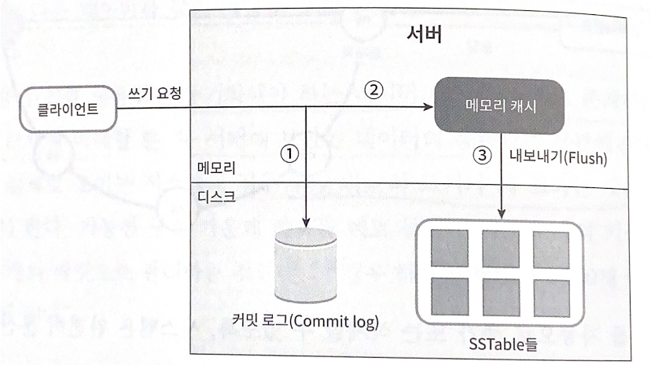
```
쓰기 요청이 특정 노드에 전달될 때 (카산드라의 사례)
1. 쓰기 요청이 커밋 로그(commit log) 파일에 기록
2. 데이터가 메모리 캐시에 기록
3. 매모리 캐시가 가득차거나 사전에 정의된 어떤 임계치에 도달하면 데이터는 디스크에 있는 SSTable에 기록
  - SSTable
    - Sorted-String Table의 약어
    - <키,값>의 순서쌍을 정렬된 리스트 형태로 관리하는 테이블
```

#### 읽기 경로

```
읽기 요청을 받은 노드
- 데이터가 메모리 캐시에 있는지 살핌
  - 있는 경우, 해당 데이터를 클라이언트에게 반환
  - 없는 경우, 디스크에서 가져와야 함
    - 어느 SSTable에 찾는 키가 있는지 알아낼 효율적인 방법 필요
    -> 블룸 필터(Bloom filter) 사용
```
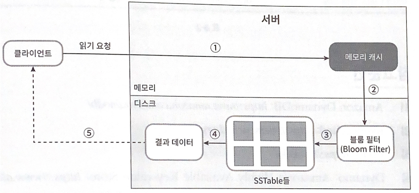
```
데이터가 메모리에 없을 때 읽기 연산이 처리되는 경로
1. 데이터가 메모리에 있는지 검사
2. 데이터가 메모리에 없으므로, 블룸 필터를 검사
3. 블룸 필터를 통해 어떤 SSTable에 키가 보관되어 있는지 알아냄
4. SSTable에서 데이터 가져옴
5. 해당 데이터를 클라이언트에게 반환
``` 

## 요약
| 목표/문제 | 기술 |
| --- | --- |
| 대규모 데이터 저장 | 안정 해시를 사용해 서버들에 부하 분산 |
| 읽기 연산에 대한 높은 가용성 보장 | 데이터를 여러 데이터센터에 다중화 |
| 쓰기 연산에 대한 높은 가용성 보장 | 버저닝 및 벡터 시계를 사용한 충돌 해소 |
| 데이터 파티션 | 안정 해시 |
| 점진적 규모 확장성 | 안정 해시 |
| 다양성(heterogeneity) | 안정 해시 |
| 조절 가능한 데이터 일관성 | 정족수 합의(quorum consensus) |
| 일시적 장애 처리 | 느슨한 정족수 프로토콜(sloppy quorum)과 단서 후 임시 위탁(hinted handoff) |
| 영구적 장애 처리 | 머클 트리(Merkle tree) |
| 데이터 센터 장애 대응 | 여러 데이터 센터에 걸친 데이터 다중화 |

