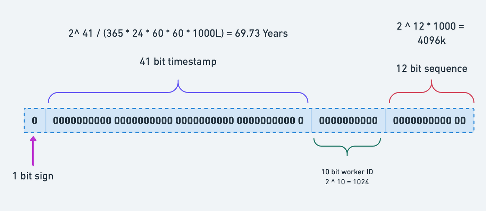
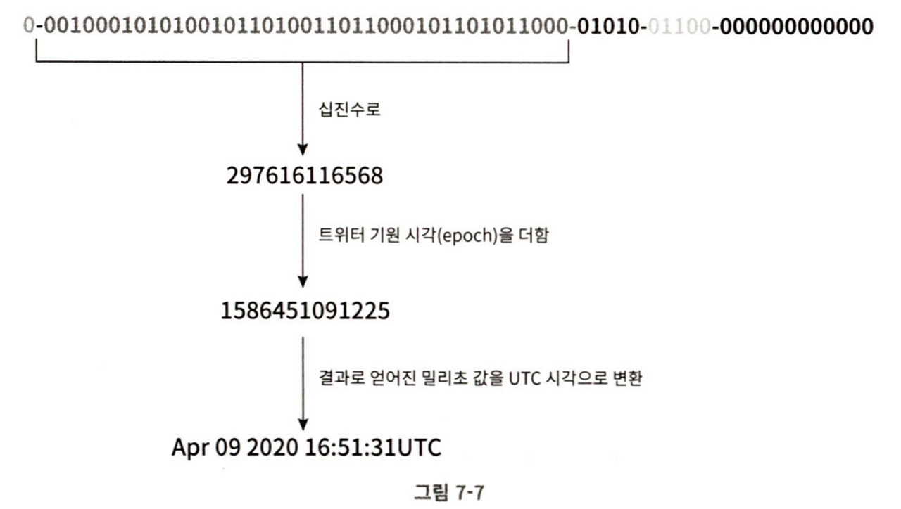

# 분산 시스템을 위한 유일 ID 시스템 설계
--- ---
auto_increment속성이 설정된 관계형 데이터베이스의 기본 키를 쓰면 되겠다고 생각할 수 있지만 이 접근법은 분산환경에서 사용할 수 없음.

### 1단계 ) 문제 이해 및 설계 범위 확정

- ID는 유일해야 함. (unique)
- ID는 숫자로만 구성되어있어야 함.
- ID는 발급 날짜에 따라 정렬 가능해야함.
- ID는 64비트로 표현될 수 있는 값이어야함.
- ID는 발급 날짜에 따라 정렬 가능해야 함.
- 초당 10,000개의 ID를 만들 수 있어야 함.

### 2단계) 개략적 설계안 제시 및 동의 구하기

우리가 고를 수 있는 선택지
- 다중 마스터 복제 (multi-master replication)
- UUID(Universally Unique Identifier)
- 티켓 서버(ticket server)
- 트위터 스노플레이크 접근법

#### 다중 마스터 복제
다중 마스터 복제는 데이터베이스의 auto_increment 기능을 활용

현재 사용 중인 데이터벰이스 서버의 수를 k라고 하자.
다음 ID 값을 구할 때 이전 키에서 k만큼 더해주는 방법.
서버마다 시작하는 숫자를 달리하면 다음에 생성되는 키들도 전부 유니크해질 것임.

- 장점
  - 데이터베이스 수를 늘리면 초당 생산 가능 ID 수도 늘어남
- 한계
  - 여러 데이터 센터에 걸쳐 규모를 늘리기 어려움
  - ID의 유일성은 보장되겠지만 그 값이 시간 흐름에 맞추어 커지도록 보장할 수는 없음
  - 서버를 추가하거나 삭제할 때도 잘 동작하도록 만들기 어려움.

#### UUID
- UUID: 컴퓨터 시스템에 저장되는 정보를 유일하게 식별하기 위한 128비트 짜리 수
- UUID 값은 충돌 가능성이 지극히 낮음.

UUID 값은 다음과 같은 형태를 띤

f2195bf4-4eb1-11ed-bdc3-0242ac120002

- 장점
  - UUID를 만드는 것은 단순함
  - 동기화 이슈도 없음. 서버 간의 조율이 필요 없으므로 각 서버가 자기가 쓸 ID를 알아서 만드는 구조이므로 규모 확장이 쉬움
- 단점
  - ID가 128비트로 김. 이번 문제에서는 쓸 수 없음
  - ID를 시간순으로 정렬할 수 없음.
  - ID에 숫자가 아닌 값이 포함될 수 있음.
  
#### 티켓 서버
auto_increment 기능을 갖춘 데이터베이스 서버를 티켓서버로 하고, 중앙 집중형으로 하나만 사용하는 것

- 장점
  - 숫자로만 구성된 ID를 쉽게 만들 수 있음
  - 구현하기 쉽고, 중소 규모 애플리케이션에 적합
- 단점
  - 티켓서버가 단일장애지점(SPOF, Single-Point-of-Failure)이 됨
  - 슈를 해결하기 위해 티켓 서버를 여러 대 준비하게 되는데, 그렇게 하면 데이터 동기화같은 새로운 문제가 발생

#### 트위터 스노플레이크 접근법
2ㅣ금까지 얘기했던 방법들 모두 문제의 요구사항을 만족하지 못함
트위터에서 사용하는 스노플레이크라는 ID 생성 기법은 이번 문제의 요구사항을 만족함

이 방법은 divide and conquer 전략을 사용.

생성해야하는 ID를 여러 섹션으로 분할하는 것임.

snowflake는 ID를 5개의 섹션으로 구분함.

- sign bit: 1비트, 음수와 양수를 구별하는데 사용
- timestamp: 41비트, 기원 시각(epoch) 이후로 몇 밀리초가 경과했는지를 나타내는 값.
- 데이터센터 ID: 5비트, 2^5=32개의 데이터센터를 지원할 수 있음.
- 서버 ID: 5비트, 데이터 센터 당 32개의 서버를 사용할 수 있음.
- 일련번호(sequence): 12비트, 각 서버에서는 ID를 생성할 때마다 이 일련번호를 1만큼 증가시킴. 이 값은 1밀리초가 경과할 때마다 0으로 초기화.

### 3) 상세 설계
개략적 설계를 진행하면서 우리는 분산 시스템에서의 ID 생성기를 설계하는 데 사용할 다양한 기술적 선택지를 봤음

문제의 요구사항을 만족시키기 위해 트위터의 snowflake 기법을 사용해서 상세 설계를 진행해보자.

#### 데이터 센터 ID와 서버 ID
- 이 둘은 시스템이 시작될 때 결정되고, 일반적으로 시스템 운영 중에는 바뀌지 않음
- 데이터 센터 ID나 서버 ID 선택 시 잘못하게 되면 ID 충돌이 발생할 수 있으므로 신중하게 작업

--- ---
#### 타임스템프

앞서 살펴본 ID 구조에서 가장 중요한 41비트를 차지하고 있음. 타임스태ㅐㅁ프는 시간이 흐름에 따라 점점 큰 값을 갖게 되므로, 결국 아이디는 시간순으로 정렬 가능하게 됨.

이진 표현 형태로부터 UTC 시각을 추출하는 예제

- 41비트로 표현할 수 있는 타임스탬프의 최댓값은 2^41 −1=2199023255551 밀리초. (약 69년)
- 기원시각을 현재랑 가깝게 하면 오버플로가 발생하는 시점을 늦춰 놓을 수 있음.
- 69년이 지나면 기원 시각을 바꾸거나 ID 체계를 다른 것으로 이전해야 함.

#### 일련번호 
일련번호는 12비트 이므로 4096개의 값을 가짐

### 4) 마무리
ID 생성기 구현에 쓰일 수 있는 4가지 전략을 살펴보았다.

- 다중 마스터 복제
- UUID
- 티켓 서버
- 트위터의 snowflake
그리고 이번 문제의 요구사항에 적합한 snowflke를 선택함

설계 이후 추가로 논의할 수 있는 주제들
- 시계 동기화(clock synchronization): 이번 설계를 진행하면서 우리는 ID 생성 서버들이 전부 같은 시계를 사용한다고 가정함. 하지만 이런 가정은 하나의 서버가 여러 코어에서 실행될 경우 유효하지 않을 수 있음. 여러 서버가 물리적으로 독립된 여러 장비에서 실행되는 경우에도 마찬가지.
  - NTP는 이 문제를 해결하는 가장 보편적 수단.
- 각 섹션의 길이 최적화: 예를 들어 동시성이 낮고 수명이 긴 애플리케이션이라면 일련번호 절의 길이를 줄이고 타임스탬프 절의 길이를 늘리는 것이 효과적일 수 있음.
- 고가용성(high availability): ID 생성기는 필수 불가결(mission critical) 컴포넌트 이므로 아주 높은 가용성을 제공해야 할 것임 .