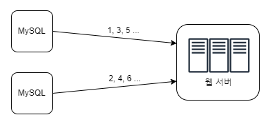
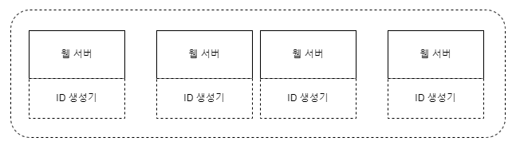
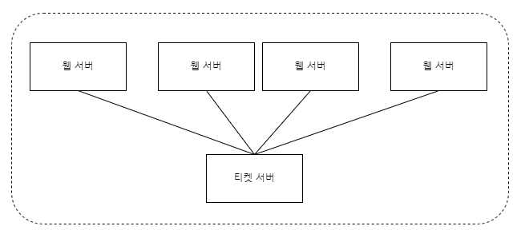
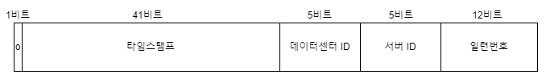
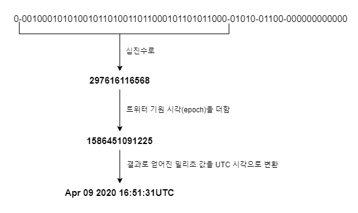

# 7장 분산 시스템을 위한 유일 ID 생성기 설계

auto_increment 속성이 설정된 관계형 데이터베이스의 기본키 사용
- 분산 환경에서 이 접근법은 통하지 않음
- 데이터베이스 서버 한 대로는 요구 감당하기 어려움
- 여러 데이터베이스 서버를 쓰는 경우, 지연 시간(delay)을 낮추기 힘듦

## 1단계: 문제 이해 및 설계 범위 확정
- ID는 유일해야 함
- ID는 숫자로만 구성되어야 함
- ID는 64비트로 표현될 수 있는 값이어야 함
- ID는 발급 날짜에 따라 정렬 가능해야 함
- 초당 10,000개의 ID를 만들 수 있어야 함

## 2단계: 개략적 설계안 제시 및 동의 구하기
- 다중 마스터 복제(multi-master replication)
- UUID(Universally Unique Identifier)
- 티켓 서버(ticket server)
- 트위터 스노플레이크(twitter snowflake) 접근법

### 다중 마스터 복제

- 데이터베이스의 auto_increment 기능 활용
  - ID 값을 구할 때, k만큼 증가 (k = 현재 사용 중인 데이터베이스 서버의 수)
- 장점
  - 규모 확장성 문제 어느 정도 해결
    - 데이터베이스 수를 늘리면 초당 생산 가능 ID도 늘릴 수 있음
- 단점
  - 여러 데이터 센터에 걸쳐 규모 늘리기 어려움
  - ID의 유일성은 보장되지만 그 값이 시간 흐름에 맞춰 커지도록 보장할 수 없음
  - 서버를 추가하거나 삭제할 때도 잘 동작하도록 만들기 어려움

### UUID
- 컴퓨터 시스템에 저장되는 정보를 유일하게 식별하기 위한 128비트짜리 수
- 충돌 가능성이 낮음
- UUID를 사용하는 시스템의 구조
  
  `각 웹 서버는 별도의 ID 생성기를 사용해 독립적으로 ID를 만들어 냄`
- 장점
  - UUID 만드는 것 단순
    - 서버 사이의 조율이 필요 없어 동기화 이슈도 없음
  - 각 서버가 자기가 쓸 ID를 알아서 만드는 구조이므로 규모 확장도 쉬움
- 단점
  - ID가 128비트로, 긴 편임
  - ID를 시간순으로 정렬할 수 없음
  - ID에 숫자(numeric) 아닌 값이 포함될 수 있음

### 티켓 서버
- 플리커(Flicker)는 분산 기본 키(distributed primary key)를 만들어 내기 위해 이 기술 이용
- 동작 방식
  
  - auto_increment 기능을 갖춘 데이터베이스 서버(티켓 서버)를 중앙 집중형으로 하나만 사용
- 장점
  - 오직 숫자로만 구성되고, 유일성이 보장되는 ID를 쉽게 만들 수 있음
  - 구현하기 쉽고, 중소 규모 애플리케이션에 적합함
- 단점
  - 티켓 서버가 SPOF(Single-Point-of-Failure)가 됨
    - 서버에 장애가 발생하면, 해당 서버를 이용하는 모든 시스템이 영향을 받음  
  -> 이 이슈를 피하려면 티켓 서버를 여러 대 준비해야 함  
  -> 데이터 동기화 같은 새로운 문제 발생

### 데이터 스노플레이크 접근법
- 생성해야 하는 ID의 구조를 여러 절(section)로 분할

  - 사인(sign) 비트
    - 1비트 할당
    - 음수와 양수를 구별하는 데 사용
  - 타임스탬프(timestamp)
    - 41비트 할당
    - 기원 시각(epoch) 이후로 몇 밀리초(millisecond)가 경과했는지 나타내는 값
    - e.g. 1288834974657(Nov 04, 2010, 01:42:54 UTC에 해당) 이용
  - 데이터센터 ID
    - 5비트 할당
    - 2^5 = 32개 데이터센터 지원 가능
  - 서버 ID
    - 5비트 할당
    - 데이터센터당 32개 서버 사용 가능
  - 일련번호
    - 12비트 할당
    - 각 서버에서는 ID를 생성할 때마다 일련번호를 1만큼 증가
      - 1밀리초가 경과할 때마다 0으로 초기화(reset) 됨

## 3단계: 상세 설계
ID 구조 다이어그램

- 데이터센터 ID와 서버 ID는 시스템이 시작할 때 결정
  - 일반적으로 시스템 운영 중에는 바뀌지 않음
  - 데이터센터 ID나 서버 ID를 잘못 변경하게 되면 ID 충돌이 발생할 수 있음
- 타임스탬프나 일련번호는 ID 생성기가 돌고 있는 중에 만들어지는 값

### 타임스탬프
- 시간순으로 정렬 가능하게 됨

> 예제: ID 구조를 따르는 값의 이진 표현 형태로부터 UTC 시각을 추출

- 역으로 적용하면, 어떤 UTC 시각도 타임스탬프 값으로 변환 가능
- 41비트로 표현할 수 있는 타임스탬프의 최댓값은 2^41 - 1 = 2199023255551 밀리초
  - 대략 69년에 해당  
  -> 69년이 지나면 기원 시각을 바꾸거나 ID 체계를 다른 것으로 이전(migration)해야 함 

### 일련번호
- 12비트이므로, 2^12 = 4096개의 값을 가질 수 있음
- 어떤 서버가 같은 밀리초 동안 하나 이상의 ID를 만들어 낸 경우에만 0보다 큰 값 갖게 됨

## 4단계: 마무리
추가 논의 사항
- 시계 동기화(clock synchronization)
  - 하나의 서버가 여러 코어에서 실행될 경우, ID 생성 서버들이 전부 같은 시계를 사용하지 않을 수 있음
    - 서버가 물리적으로 독립된 여러 장비에서 실행되는 경우도 마찬가지임 
  - NTP(Network Time Protocol)는 이 문제를 해결하는 가장 보편적 수단
- 각 절(section)의 길이 최적화
  - 동시성(concurrency)이 낮고 수명이 긴 애플리케이션이라면 일련번호 절의 길이를 줄이고 타임스탬프 절의 길이를 늘리는 것이 효과적일 수 있음
- 고가용성(high availability)
  - ID 생성기는 필수 불가결(mission critical) 컴포넌트이므로 아주 높은 가용성 제공해야 함