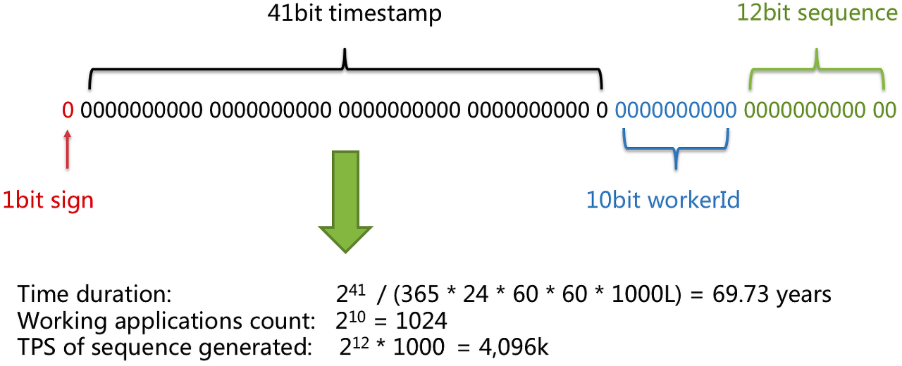

## 분산 시스템을 위한 유일 ID 생성기 설계

'auto_increment 속성이 설정된 관계형 데이터베이스의 기본 키를 쓰면 되지않을까?' 

-> 데이터베이스 서버 한 대로는 그 요구를 감당할 수 없을뿐더러, 여러 데이터베이스 서버를 쓰는 경우에는 지연시간을 낮추기가 무척 힘들 것이다.

#### 1단계, 문제 이해 및 설계 범위 확정

- ID는 유일해야 한다.
- ID는 숫자로만 구성되어야 한다.
- ID는 64비트로 표현될 수 있는 값이어야 한다.
- ID는 발급날짜에 따라 정렬 가능해야 한다.
- 초당 10,000개의 ID를 만들 수 있어야 한다.

#### 2단계, 개략적 설계안 제시 및 동의 구하기

- 다중 마스터 복제
- UUID
- 티켓 서버
- 트위터 스노플레이크 접근법

### 다중 마스터 복제
- 1만큼 증가시켜 얻는 것이 아닌 데이터베이스의 수 k 만큼 증가시킨다. (k는 현재 사용중인 제이터베이스 서버의 수)
- 겹치지 않고 초당 생산 가능 ID 수를 늘릴 수 있다.
##### 장점
- 규모의 확장성 문제를 어느정도 해결할 수 있다.
##### 단점
- 여러 데이터 센터에 걸쳐 규모를 늘리기 어렵다.
- 시간 흐름에 맞추어 커지도록 보장할 수 없다.
- 서버를 추가하거나 삭제하면 제대로 동작하지 못할 수 있다. k가 변하게 된다.

### UUID
컴퓨터 시스템에 저장되는 정보를 유일하기 식별하기 위한 128비트 수

##### 장점
- UUID 만드는 것 단순. 중복확률도 진짜 매우 매우 낮다.
- 각 서버가 알아서 만드는 것이므로 규모 확장도 쉽다.
##### 단점
- 128비트로 구성되어 요구사항에 맞지 않다. 길다.
- 숫자가 아닌 값이 포함될 수 있으며, 시간 순으로 정렬할 수 없다.

### 티켓 서버(Ticket Server)

##### 장점
- 유일성이 보장되는 오직 숫자로만 이루어진 ID를 쉽게 만들 수 있다.
- 구현하기 쉽고, 중소 규모 애플리케이션에 적합 → 양이 많아지면 관리할 수 없는 정도로 테이블이 커질 수 있다.
##### 단점
- SPOF → 단일 티켓서버 사용 시, 문제 포인트가 될 수 있다.

### 트위터 스노플레이크 (Twitter snowflake)

- Sign: 1 bit 할당
- Timestamp: 41 bit 할당. 기원시각 이후로 몇 millisecond가 경과했는지 나타내는 값
- Datacenter id: 5 bit 할당. 데이터 센터의 아이디. 5비트이므로 32개의 데이터센터 지원 가능하다.
- Server id: 5 bit 할당. 서버의 아이디. 5비트이므로 32개의 서버 지원 가능하다.
- sequence: 12bit 할당. 각 서버에서는 ID 생성시마다 해당 sequence 1씩 증가. 1 millisecond마다 0으로 초기화한다.

#### 3단계, 상세 설계

- 현재 시간을 millisecond로 변환 후 해당 서버의 기원시간을 뺀다. 그 결과를 2진수로 변환해서 사용한다.

  - 결국 timestamp는 0부터 시작하게 되는 것이다.

- 41 bit로 이루어져있어 시간으로 따지면 최대 69년에 해당하는 값을 나타낼 수 있다. 즉, 해당 ID 생성기는 69년동안만 정상작동한다. 69년이 지나면 중복된 ID가 나올 수 있고, 정렬에 따른 ID 생성순서를 표현할 수 없다.

#### 4단계, 마무리

- 시계 동기화(Clock synchronization)
- 고가용성
  - ID 생성기는 필수적인 컴포넌트(mission critical).
  - 고가용성을 제공해야만 한다.
