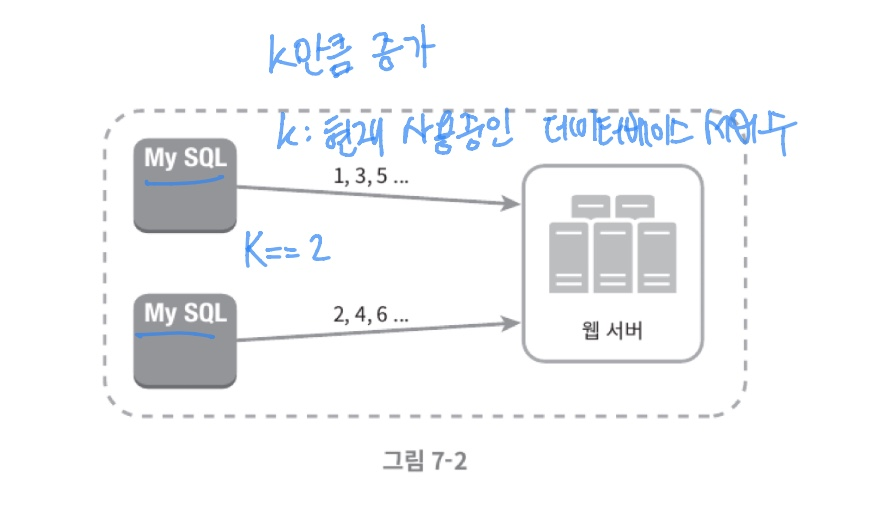
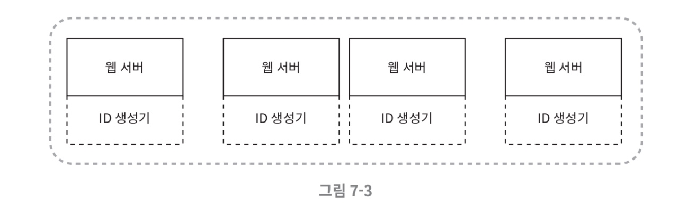
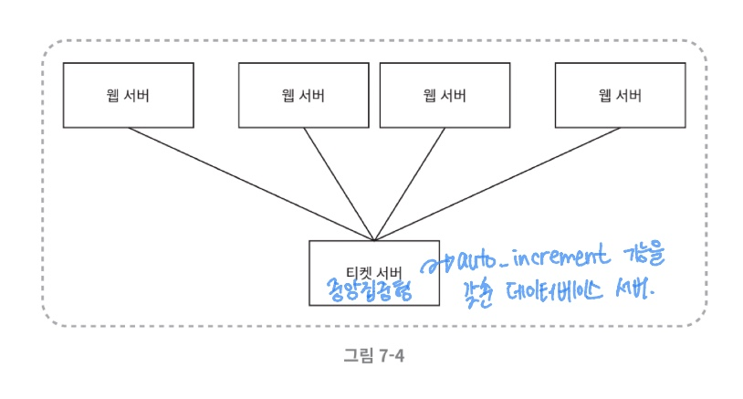
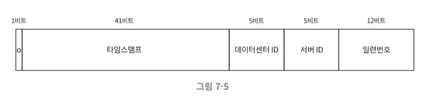
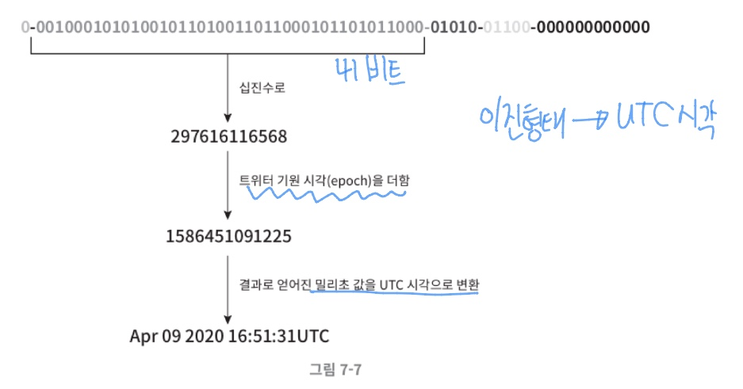

# 분산 시스템을 위한 유일 ID 생성기 설계

> auto_increment 속성이 설정된 관계형 데이터 베이스 기본키를 사용하면 되지 않을까?

- 분산 환경에서는 이 접근법이 통하지 X

- 데이터베이스 서버 한 대로는 요구를 감당할 수X

- 여러 데이터베이스 서버를 쓰는 경우에는 지연 시간을 낮추기가 무척 힘들 것

> 그렇다면 어떻게? 유일 ID를 설계할까?

단계별 설정 방법!

### 1단계 : 문제 이해 및 설계 범위 확정

면접자에게 적절한 질문을 통해 모호함을 없앤다.

질문을 통해 얻은 요구사항 저일
- ID는 유일해야한다.
- ID는 숫자로만 구성되어야 한다.
- ID는 64비트로 표현될 수 있는 값이어야 한다.
- ID는 발급 날짜에 따라 정렬 가능해야 한다.
- 초당 10,000개의 ID를 만들 수 있어야 한다.

### 2단계: 개략적 설계안 제시 및 동의 구하기

분산 시스템에서 유일성이 보장되는 ID를 만드는 4가지 방법

#### 1. 다중 마스터 복제

- 데이터 베이스의 auto_increment 기능 활용
- ID값을 구할 때 1만큼 증가 X -> K만큼 증가
- k: 현재 사용 중인 데이터베이스 서버 수
- 위의 그림에서는 k는 2

>어느정도 규모 확장성 문제를 해결 :  
> 데이터베이스 수를 늘리면 초당 생산 가능 ID수도 늘릴 수 있기 때문

- 단점:
  - 여러 데이터 센터에 걸쳐 규모를 늘리기 어려움
  - ID의 유일성은 보장되겠지만 그 값이 시간 흐름에 맞추어 커지도록 보장할 수 없음
  - 서버를 추가하거나 삭제할 때도 잘 동작하도록 만들기 어려움
  
  

#### 2. UUID

> 컴퓨터 시스템에 저장되는 정보를 유일하게 식별하기 위한 128비트짜리 수

- UUID값은 충돌 가능성이 아주 낮음
- UUID는 서버 간 조율 없이 독립적으로 생성 가능

시스템 구조도

각 웹 서버는 별도의 ID생성기를 사용해 독립적으로 ID를 만들어냄

장점:

- 만들기 단순 
- 서버 사이의 조율도 필요 없음
  - 동기화 이슈 없음
- 각 서버가 자기가 쓸 ID를 알아서 만드는 구조
  - 규모 확장이 쉬움

단점:
- ID가 128 비트로 긺.
- ID는 시간 순으로 정렬할 수 없음
- ID에 숫자 아닌 값이 포함될 수 있음

#### 3. 티켓 서버

auto_increment 기능을 갖춘 데이터베이스 서버,즉 티켓 서버를 중앙 집중형으로 하나만 사용

장점:
- 유일성이 보장되는 오직 숫자로만 구성된 ID를 쉽게 만들 수 있음
- 구현이 쉬움
  - 중소 규모 애플리케이션에 적합
  
단점:
- 티켓 서버가 SPOF(Single-Poing-of-Faliure)
  - 이 서버에 장애가 발생하면, 해당 서버를 이용하는 모든 시스템이 영향을 받음
  - 이 이슈를 피하려면 티켓 서버를 여러대 준비
    - 이 해결방법은 데이터 동기화 같은 새로운 문제 발생
  

#### 4. 트위터 스노플레이크 접근법

트위터에서 사용하는 방법

우리가 생성해야하는 ID의 구조를 여러 절로 분할 한 구조

- 사인(sign)비트: 1비트
  - 음수와 양수 구별
- 타임스탬프(timestamp) : 41비트
  - 기원(epoch)시각 이후로 몇 밀리초가 경과했는지를 나타내는 값
  
- 데이터 센터 ID: 5비트
  - 2^5 = 32 개 데이터 센터를 지원할 수 있음
- 서버ID : 5비트
  - 데이터 센터당 32개의 서버 사용 가능
- 일련번호: 12비트
  - 각 서버에서는 ID를 생성할 때마다 이 일련 번호를 1만큼 증가시킴
  - 이 값은 1밀리초가 경과할 때마다 0으로 초기화 됨

### 3단게: 상세 설계

- 트위터 스노플레이크 접근법 사용하여 상세 설계 예정

- 데이터센터ID와 서버 ID는 시스템이 시작할 때 결정 
- 일반적으로 시스템 운영 중에는 바뀌지 않음 
- 데이터센터 ID나 서버 ID를 잘못 변경하게 되면 ID충돌 발생할 수 있으므로 신중 
- 타임 스탬프, 일련번호는 ID생성기가 돌고 있는 중에 만들어지는 값

#### 타임 스탬프

41비트 차지

위의 그림은 이진 표현 형태로부터 UTC시각을 추출하는 예제

- 41비트로 표현할 수 있는 타임스탬프의 최댓값 : 2^41 - 1 = 2199023255551밀리초 
  - 약 69년
- 따라서 이 ID생성기는 69년동안만 정상 작동 
- 기원시각을 현재에 가깝게 맞춰서 오버플로가 발생하는 시점을 늦춤

- 69년이 지나면 기원 시각을 바꾸거나 ID체계를 다른것으로 이전해야 함.

#### 일련번호

일련번호는 12비트이므로 2^12 = 4096개의 값을 가질 수 있음

어떤 서버가 같은 밀리초 동안 하나 이상의 ID를 만들어낸 경우에만 0보다 큰 값을 갖게 됨.

### 4단계 : 마무리

스노플레이크 방식이 모든 요구사항을 만족하면서도 분산 환경에서 규모 확장이 가능함

추가 논의 사항

- 시계 동기화
  - 위와 같은 설계는 ID 생성 서버들이 전부 같은 시계를 사용한다고 가정한 것
  - 하지만 이런 가저은 하나의 서버가 여로 코어에서 실행될 경우 유효하지 않을 수 있음
  - 여러 서버가 물리적으로 독립된 여러 장비에서 실행되는 경우에도 마찬가지
  - NTP(Network Time Protocol)은 이 문제를 해결하는 가장 보편적인 수단

- 각 절의 길이 최적화
  - 동시성이 낮고 수명이 긴 애플리케이션이라면 일련번호 절의 길이를 줄이고, 타임스탬프 절의 길이를 늘리는 것이 효과적
- 고가용성
  - ID 생성기는 필수 불가결 컴포넌트이므로 아주 높은 가용성을 제공해야할 것.