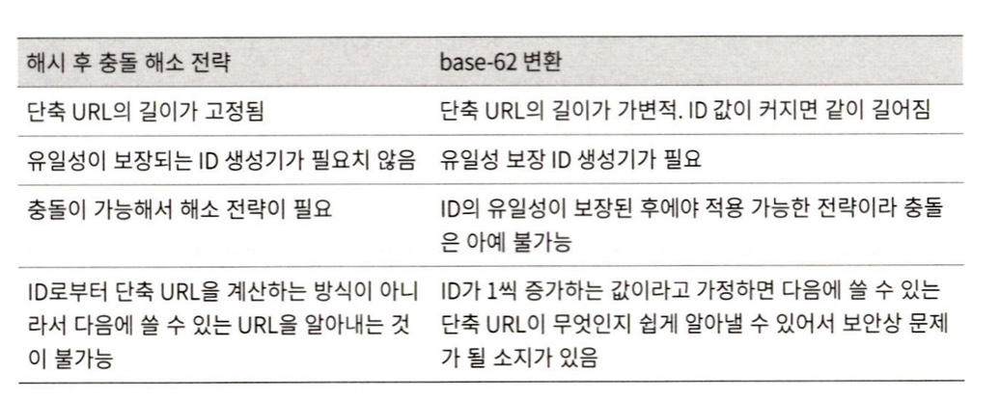

# URL 단축키 설계
--- ---

tiny url 같은 URL 단축 서비스를 설계 하는 문제

### 1단계 ) 문제 이해 및 설계 범위 확정

면접관과에 소통으로 알아낸 기능과 요구 사항
- URL 단축
- URL redirection
- 높은 가용성과 규모 확장성, 그리고 장애 감내가 요구 됨
- 단축 URL에는 숫자와 영문자를 사용할 수 있음
- 단축된 URL은 삭제나 갱신을 할 수 없다. (단순화를 위해 가정)

#### 개략적 추정
- 쓰기 연산: 매일 1억 개의 단축 URL 생성
- 초당 쓰기 연산: 1억(100million) / 24 / 3600 = 1160
- 읽기 연산
  - 비율 설정: 읽기 연산과 쓰기 연산 비율이 10:1 이라고 하자.
  - 그 경우 읽기 연산은 초당 1160×10=11600 회 발생.
- URL 단축 서비스를 10년간 운영한다고 가정하면 1억 × 365 × 10 = 3650억 개의 레코드를 보관해야 함.
- 축약 전 URL의 평균 길이를 100이라고 가정 
- 따라서 10년 동안 필요한 저장 용량은 3650억 × 100바이트 = 36.5TB.

### 2단계 ) 개략적 설계안 제시 및 동의 구하기
이번 단계에서는 API 엔드포인트, URL 리디렉션, URL 단축 플로우 살펴봄

#### API 엔트포인트

엔드포인트를 REST 스타일로 설계

URL 단축기는 기본적으로 두 개의 엔드포인트를 필요로 함

1. URL 단축용 엔드포인트: 새 단축 URL을 생성하고자 하는 클라이언트는 이 엔드포인트에 단축할 URL을 인자로 실어서 POST 요청을 보내야 함
   POST /api/v1/data/shorten 
   - 인자: longUrl: longUrlString
   - 반환: 단축 URL

2. URL 리디렉션용 엔드포인트: 단축 URL에 대해서 HTTP 요청이 오면 원래 URL로 보내주기 위한 용도의 엔드포인트.
   GET /api/v1/shortUrl 
   - 반환: HTTP 리디렉션 목적지가 될 원래 URL

#### URL 리디렉션
단축 URL을 받은 서버는 그 URL을 원래 URL로 바꾸어서 301 응답의 Location 헤더에 넣어 반함

여기서 유의할 점은 301 응답과 302 응답의 차이
- 301 permenently moved: 해당 url에 대한 HTTP 요청의 처리 책임이 영구적으로 Location 헤더에 반환된 URL로 이전되었다는 응답
  - 영구적으로 이전되었으므로, 브라우저는 이 응답을 캐시함
  - 추후 같은 단축 URl에 요청을 보낼 필요가 있을 때 브라우저는 캐시된 리디렉션 URL로 요청을 보내게 됨.
- 302 found: 주어진 url 로의 요청이 '일시적으로'Location 헤더가 지정하는 URL에 의해 처리되어야한다는 응답
  -  따라서 클라이언트의 요청은 언제나 단축 URL 서버에 먼저 보내진 후에 원래 URL로 리디렉션

- 이 두 방법은 각각의 적합한 상황이 있음
  - 서버 부하를 줄이는 것이 중요: 301 Permanent moved 사용
  - 트래픽 분석이 중요 (클릭 발생률, 발생위치 추적): 302 Found

우리는 단축 URL을 키로 하고, 원래 URL을 값으로 하는 해시테이블을 사용할 수 있음.
그렇게 되면 리디렉션은 다음과 같이 구현될 수 있음.

1. 원래URL = hashTable.get(단축URL)
2. 301 또는 302 응답 Location 헤더에 원래 URL을 넣어서 전송

#### URL 단축
단축 url의 형태는 다음과 같을 것임

www.tinyurl.com/[해시값]

=>그럼 우리가 결정해야하는 것은 어떻게 해시값을 결정하느냐가 될 것이고, 그것은 해시함수 fx를 찾는 일이 됨

해시함수는 다음 요구사항을 만족해야 함
- 입력으로 주어지는 긴 URL이 다른 값이면 해시 값도 달라야함
- 계산된 해시 값은 원래 입력으로 주어졌던 긴 URL로 복원될 수 있어야 함

### 3단계 ) 상세 설계
#### 데이터 모델
개략적으로 설계할 때는 모든 것을 해시 테이블에 둠.

하지만 이 방법을 실제 시스템에 쓰기에는 곤란한 것이, 메모리는 유한하고 비싸기 때문.

더 나은 방법은 <단축URL, 원래 URL>의 순서쌍을 관계형 데이터베이스에 저장하는 것

#### 해시 함수
원래 URL을 단축 URL로 변환하는 데 쓰임

편의상 해시함수가 계산하는 단축 URL 값을 hashValue라 함

- 해시 값의 길이
  - hashValue는 [0-9, a-x, A-Z]의 문자로 구성됨. hashValue의 길이를 n이라고 할때, n을 정하기 위해서는 62
    ^n ≥3650 억인 n의 최솟값을 찾아야 함. (3650억은 전체 레코드 개수였다.)
  - n=7 이면 3.5조개의 URL을 만들 수 있음. 요구사항을 만족시키기 충분한 값이다. 따라서 hashValue의 길이는 7로 하도록 함.

- 해시 후 충돌 해소
  - 긴 URL을 줄이려면 원래 URL을 7글자 문자열로 줄이는 해시함수가 필요함 => 쉬운 방법은 잘 알려진 해시 함수를 이용하는 것 하지만 짧은 해시값도 7글자를 넘음. 
  - 이 문제를 해결할 첫번 째 방법은 계산된 해시값의 첫 7글자를 hashValue로 삼는 것.
    - 이 방법을 적용하면 해시 충돌 확률이 높아짐. 충돌이 실제로 발생했을 경우, 충돌이 해소될 때까지 사전에 정한 문자열을 해시값에 덧붙이면 됨. 
  - 해시 충돌 발생을 감지하기 위해서는 DB에 질의를 할수 있는데 이것은 오베헤드가 큼.
  - 데이터베이스 대신 블룸 필터를 사용해서 성능을 높일 수가 있음.

- base-62 변환
  - 진법 변환(base conversion)은 URL 단축기를 구현할 때 흔히 사용되는 접근법.
  - 이 기법은 수의 표현 방식이 다른 두 시스템이 같은 수를 공유하여야하는 경우에 유용
    - 62은 수를 표현하기 위해 총 62개의 문자를 사용하는 진법이다. 따라서 0은 0으로, 9는 9로, 10은 a로, 11은 b로, ... 35는 z로 등등으로 대응시켜 표현하도록 할 것임

두 접근법 비교

### URL 단축기 상세 설계 
이번 예제에서는 62진법 변환 기법을 사용해 설계할 것임.

1. 입력으로 긴 URL을 받음
2. 데이터베이스에 해당 URL이 있는지 검사함.
3. 데이터베이스에 있다면 해당 URL에 대한 단축 URL을 만든 적이 있는 것임. 따라서 해당 단축 URL을 그대로 반환함.
4. 데이터베이스에 없는 경우 유일한 ID를 생성함. 이 ID는 데이터베이스의 기본 키로 사용됨
5. 62진법 변환을 적용, 생성한 ID를 단축 URL로 만듦.
6. ID, 단축 URL, 원래 URL로 새 데이터베이스 레코드를 만든 후 단축 URL을 클라이언트에 전달함.

위에서 언급된 ID 생성기의 경우, 단축 URL을 만들 때 사용할 ID를 만드는 것이고, 이 ID는 전역적 유일성이 보장되는 것이어야함.

- 데이터베이스 레코드 예시

<table>
<tr>
<td>ID</td>
<td>shortURL</td>
<td>longURL</td>
</tr>
<tr>
<td>200921567123</td>
<td>zn9edcu</td>
<td>https://github.com/2hy2on</td>
</tr>
</table>

#### URL 리디렉션 상세 설계
쓰기보다 읽기를 더 자주하는 시스템이라, <단축 URL, 원래 URL>의 쌍을 캐시에 저장하여 성능을 높였음.

로드밸런서의 동작흐름은 다음과 같이 요약할 수 있음.

1. 사용자가 단축 URL을 클릭함
2. 로드밸런서가 해당 클릭으로 발생한 요청을 웹 서버에 전달함
3. 단축 URL이 이미 캐시에 있는 경우에는 원래 uRL을 바로 꺼내서 클라이언트에게 전달함.
4. 캐시에 해당 단축 URL이 없는 경우에는 데이터베이스에서 꺼냄. 데이터베이스에 없다면 아마 사용자가 잘못된 URL을 입력한 경우일 것임.
5. 데이터베이스에서 꺼낸 URL을 캐시에 넣은 후 사용자에게 반환함

### 4단계 ) 마무리
설계를 마친후 할 수 있는 이야기

- 처리율 제한 장치 (rate limiter): 지금까지 살펴본 시스템은 엄청난 양의 URL단축 요청이 밀려들 경우 무력화될 수 있는 잠재적 보안 결함을 가지고 있음.
- 도스 디도스 ..
- IP 주소를 비롯한 필터링 규칙들을 이용해 요청을 걸러낼 수 있을 것임.
- 웹서버의 규모 확장: 위의 설계는 무상태 계층이므로 웹서버를 자유로이 증설/삭제할 수 있음.
- 데이터베이스의 규모 확장: 다중화, 샤딩
- 데이터 분석 솔루션: 성공적인 비즈니스를 위해서는 데이터가 중요함. URL 단축기에 데이터 분석 솔루션을 통합해두면 어떤 링크를 얼마나 많은 사용자가 클릭했는지, 언제 주로 클릭했는지 등 중요한 정보를 알아낼 수 있을 것임.
- 가용성, 데이터 일관성, 안정성: 대규모 시스템의 성공적 운영을 위해 반드시 갖춰야할 속성.
