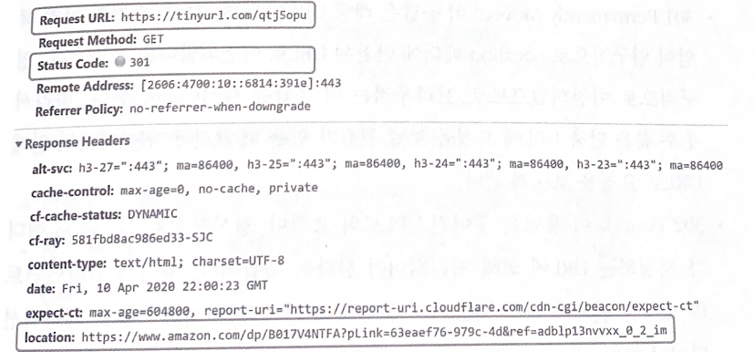
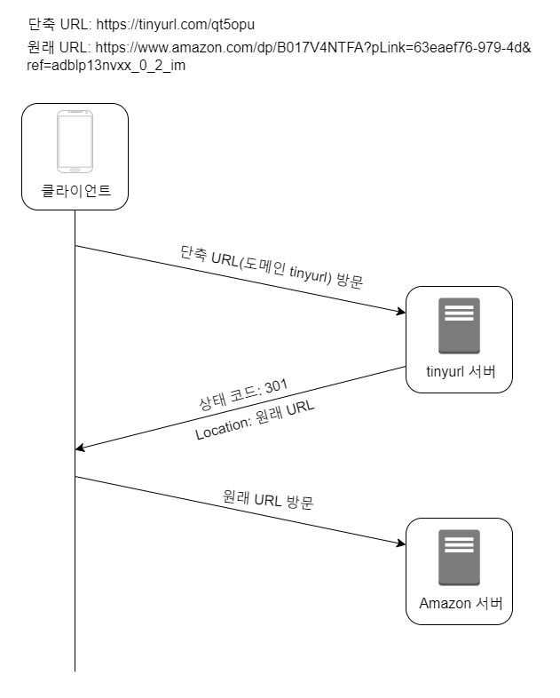
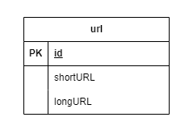
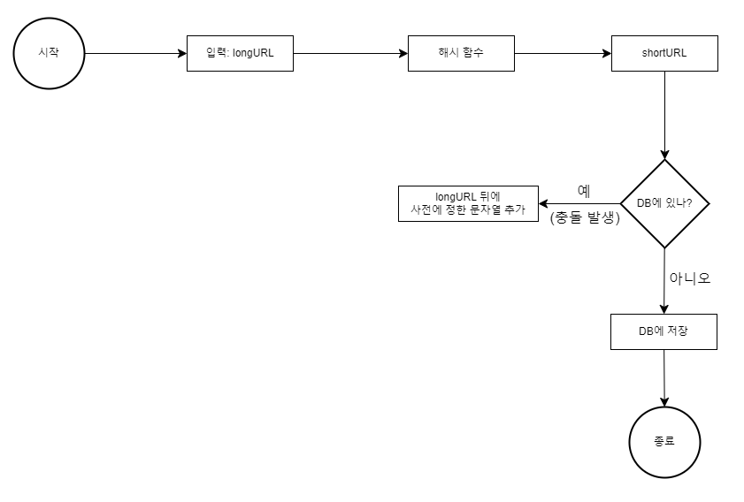
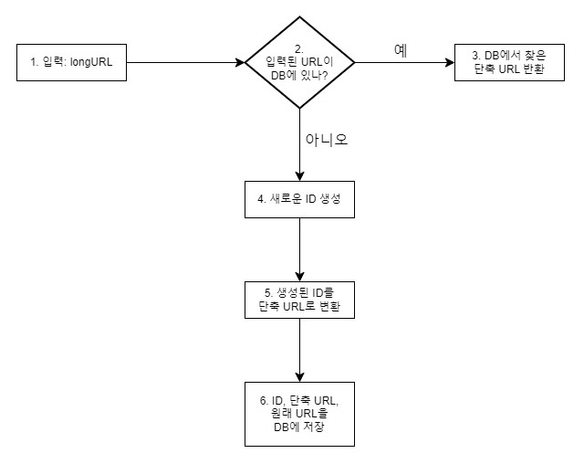
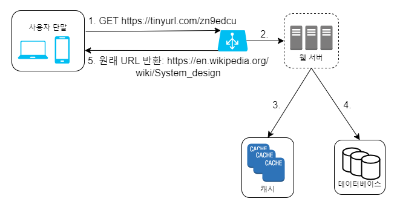

# 8장 URL 단축기 설계

## 1단계: 문제 이해 및 설계 범위 확장
기본적 기능
1. URL 단축
   - 주어진 긴 URL을 훨씬 짧게 줄임
2. URL 리디렉션(redirection) 
   - 축약된 URL로 HTTP 요청이 오면 원래 URL로 안내
3. 높은 가용성과 규모 확장성, 장애 감내 요구

### 개략적 추정
- 쓰기 연산
  - 매일 1억 개의 단축 URL 생성
- 초당 쓰기 연산
  - 1억(100million)/24/3600 = 1160
- 읽기 연산
  - 읽기 연산과 쓰기 연산 비율은 10:1로 가정
  - 읽기 연산은 초당 11,600회 발생(1160*10 = 11,600)
- URL 단축 서비스를 10년간 운영한다고 가정
  - 1억(100million)*365*10 = 3650억(365billion)개의 레코드 보관해야 함
- 축약 전 URL의 평균 길이는 100이라 가정
- 10년 동안 필요한 저장 용량은 3650억(365billion)*100바이트 = 36.5TB임

## 2단계: 개략적 설계안 제시 및 동의 구하기
### API 엔드포인트
1. URL 단축용 엔드포인트
   - 새 단축 URL을 생성하고자 하는 클라이언트는 이 엔드포인트에 단축할 URL을 인자로 실어서 POST 요청 보내야 함
   ```
    POST/api/v1/data/shorten
   - 인자: {longUrl: longURLstring}
   - 반환: 단축 URL
    ```
2. URL 리디렉션용 엔드포인트
   - 단축 URL에 대해서 HTTP 요청이 오면 원래 URL로 보내주기 위한 용도의 엔드포인트
   ```
    GET /api/v1/shortUrl
   - 반환: HTTP 리디렉션 목적지가 될 원래 URL
    ```
   
### URL 리디렉션

- 단축 URL을 받은 서버는 그 URL을 원래 URL로 바꾸어서 301 응답의 Location 헤더에 넣어 반환

<br>

> 클라이언트와 서버 사이의 통신 절차


301 응답과 302 응답의 차이점
- 301 Permanetly Moved
  - 해당 URL에 대한 HTTP 요청의 처리 책임이 영구적으로 Location 헤더에 반환된 URL로 이전되었다는 응답
  - 브라우저는 이 응답을 캐시(cache)함
  - 추후 같은 단축 URL에 요청을 보낼 필요가 있을 때, 브라우저는 캐시된 원래 URL로 요청을 보내게 됨
- 302 Found
  - 주어진 URL로의 요청이 일시적으로 Location 헤더가 지정하는 URL에 의해 처리되어야 한다는 응답
  - 클라이언트의 요청은 언제나 단축 URL 서버에 먼저 보내진 후에 원래 URL로 리디렉션 되어야 함

사용하는 경우
- 서버 부하를 줄이는 게 중요한 경우 <br>
-> 301 Permanent Moved 사용<br>
-> 첫 번째 요청만 단축 URL 서버로 전송됨
- 트래픽 분석(analytics)이 중요한 경우 <br>
-> 302 Found 사용 <br>
-> 클릭 발생률이나 발생 위치를 추적하는 데 좀 더 유리

URL 리디렉션을 구현하는 가장 직관적인 방법
- 해시 테이블 이용
  - <단축 URL, 원래 URL>의 쌍을 저장한다고 가정
    - 원래 URL = hashTable.get(단축 URL)
    - 301 또는 302 응답 Location 헤더에 원래 URL을 넣은 후 전송

### URL 단축
해시 함수 요구사항
- 입력으로 주어지는 긴 URL이 다른 값이면 해시 값도 달라야 함
- 계산된 해시 값은 원래 입력으로 주어졌던 긴 URL로 복원될 수 있어야 함

## 3단계: 상세 설계
### 데이터 모델


<단축 URL, 원래 URL>의 순서쌍을 관계형 DB에 저장
- 모든 걸 해시 테이블에 두는 방식은 초기 전략으로는 괜찮지만, 실제 시스템에 쓰기에는 곤란
  - 메모리는 유한하고 비쌈

### 해시 함수
- 원래 URL을 단축 URL로 변환하는 데 쓰임
- 편의 상 해시 함수가 계산하는 단축 URL 값을 hashValue라고 가정

#### 해시 값 길이
- hashValue는 [0-9 a-z, A-Z] 문자들로 구성됨 <br>
-> 사용할 수 있는 문자 개수는 62개(10 + 26 + 26)
- n=7, 62^7 = 3.5조 개의 URL 만들 수 있음

해시 함수 구현에 쓰일 기술
- 해시 후 충돌 해소
- base-62 변환

#### 해시 후 충돌 해소
| 해시 함수 | 해시 결과 (16진수) |
| --- | --- |
| CRC32 | 5cb54054 |
| MD5 | 5a62509a84df9ee03fe1230b9df8b84e |
| SHA-1 | 0eeae7916c06853901d9ccbefbfcaf4de57ed85b |
CRC32가 계산한 가장 짧은 해시값조차도 7보다는 김 <br>
-> 계산된 해시 값에서 처음 7개 글자만 이용


- 충돌 해소 가능
  - 단축 URL을 생성할 때 한 번 이상 데이터베이스 질의를 해야 함 <br>
  -> 오버헤드가 큼
  - 데이터베이스 대신 블룸 필터를 사용하면 성능 높일 수 있음
  - 블룸 필터: 어떤 집합에 특정 원소가 있는지 검사할 수 있도록 하는 확률론에 기초한 공간 효율이 좋은 기술

#### base-62 변환
- 62진법은 수를 표현하기 위해 총 62개의 문자를 사용하는 진법
  - 0은 0으로, 9는 9로, 10은 a로, 11은 b로, ... , 61은 Z로 대응시켜 표현
  - 11157은 2TX로 변환됨 
  
-> 단축 URL은 https://tinyurl.com/2TX가 됨

#### 두 접근법 비교

| 해시 후 충돌 해소 전략 | base-62 변환 |
| --- | --- |
| 단축 URL의 길이가 고정됨 | 단축 URL의 길이가 가변적. ID 값이 커지면 같이 길어짐 |
| 유일성이 보장되는 ID 생성기가 필요치 않음 | 유일성 보장 ID 생성기 필요 |
| 충돌이 가능해서 해소 전략이 필요 | ID의 유일성이 보장된 후에야 적용 가능한 전략이라 충돌은 아예 불가능 |
| ID로부터 단축 URL을 계산하는 방식이 아니라서 다음에 쓸 수 있는 URL을 알아내는 것이 불가능 | ID가 1씩 증가하는 값이라고 가정하면 다음에 쓸 수 있는 단축 URL이 무엇인지 쉽게 알아낼 수 있어서 보안상 문제가 될 소지가 있음 |

### URL 단축기 상세 설계
> 62진법 변환 기법


1. 입력으로 긴 URL을 받음
2. 데이터베이스에 해당 URL이 있는지 검사
3. 데이터베이스에 있다면, 해당 URL에 대한 단축 URL을 만든 적이 있는 것. 데이터베이스에서 해당 단축 URL을 가져와서 클라이언트에게 반환
4. 데이터베이스에 없는 경우, 해당 URL은 새로 접수된 것이므로 유일한 ID 생성. 이 ID는 데이터베이스의 기본 키로 사용됨
5. 62진법 변환을 적용, ID를 단축 URL로 만듦
6. ID, 단축 URL, 원래 URL로 새 데이터베이스 레코드를 만든 후 단축 URL을 클라이언트에 전달

**예제** <br>
- 입력된 URL이 https://en.wikipedia.org/wiki/Systems_design 이라고 가정
- 이 URL에 대해 ID 생성기가 반환한 ID는 2009215674938
- 이 ID를 62진수로 변환하면 zn9edcu를 얻음
- 아래와 같은 새로운 데이터베이스 레코드를 만듦

| ID | shortURL | longURL |
| --- | --- | --- |
| 2009215674938 | zn9edcu | https://en.wikipedia.org/wiki/Systems_design |

ID 생성기
- 단축 URL을 만들 때 사용할 ID 만드는 것
  - 이 ID는 전역적 유일성(globally unique) 보장되어야 함

### URL 리디렉션 상세 설계


로드밸런서의 동작 흐름
1. 사용자가 단축 URL 클릭
2. 로드밸런서가 해당 클릭으로 발생한 요청을 웹 서버에 전달
3. 단축 URL이 이미 캐시에 있는 경우, 원래 URL을 바로 꺼내서 클라이언트에게 전달
4. 캐시에 해당 단축 URL이 없는 경우, 데이터베이스에서 꺼냄. 데이터베이스에 없다면 아마 사용자가 잘못된 단축 URL을 입력한 경우임
5. 데이터베이스에서 꺼낸 URL을 캐시에 넣은 후 사용자에게 반환

## 4단계: 마무리
- 처리율 제한 장치(rate limiter)
  - IP 주소를 비롯한 필터링 규칙 이용
- 웹 서버의 규모 확장
- 데이터베이스의 규모 확장
  - 데이터베이스 다중화, 샤딩
- 데이터 분석 솔루션(analytics)
- 가용성, 데이터 일관성, 안정성