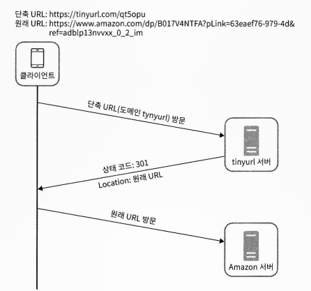

## URL 단축키 설계

#### 1단계 - 문제 이해 및 설계 범위 확정
- URL 단축
- URL redirection
- 높은 가용성과 규모 확장성, 그리고 장애 감내가 요구 됨
- 단축 URL에는 숫자와 영문자를 사용할 수 있음
- 단축된 URL은 삭제나 갱신을 할 수 없다. (단순화를 위해 가정)

##### 개략적 추정

- 쓰기 연산: 매일 1억 개의 단축 URL 생성
- 초당 쓰기 연산: 1억(100million) / 24 / 3600 = 1160
- 읽기 연산
  - 비율 설정: 읽기 연산과 쓰기 연산 비율이 10:1 이라고 하자.
  - 그 경우 읽기 연산은 초당 1160×10=11600 회 발생.
- URL 단축 서비스를 10년간 운영한다고 가정하면 1억 × 365 × 10 = 3650억 개의 레코드를 보관해야 한다.
- 축약 전 URL의 평균 길이를 100이라고 가정
- 따라서 10년 동안 필요한 저장 용량은 3650억 × 100바이트 = 36.5TB 이다.

#### 2단계. 개략적 설계안 제시 및 동의 구하기

- URL 단축용 엔드포인트
  - 새 단축 URL을 생성하는 API
  - POST /api/v1/data/shorten
    - body: {longUrl: longURLstring}
  - 응답 : 단축 URL
- URL 리다이렉션용 엔드포인트
  - 단축 URL에 대해서 HTTP 요청이 오면 원래 URL로 보내주기 위한 API
  - GET /api/v1/shortUrl
  - 응답 : HTTP 리다이렉션 목적지가 될 원래 URL

##### 301 vs 302 ?
- 301 Permanently Moved
  - 해당 URL에 대한 HTTP 요청의 처리 책임이 영구적으로 Location 헤더에 반환된 URL로 이전되었다.
  - 브라우저는 이 응답을 캐시한다
  - 서버 부하를 줄이는 것이 중요할 때 사용
- 302 Found
  - 해당 URL 요청이 일시적으로 Location 헤더가 지정하는 URL에 의해 처리되어야 한다는 응답.
  - 언제나 단축 URL 서버에 먼저 보내진 후에 원래 URL로 리다이렉션 되어야 함.
  - 트래픽 분석이 중요할 때 사용
 
URL 리다이렉션을 구현하는 가장 직관적인 방법
-> 해시 테이블 사용

