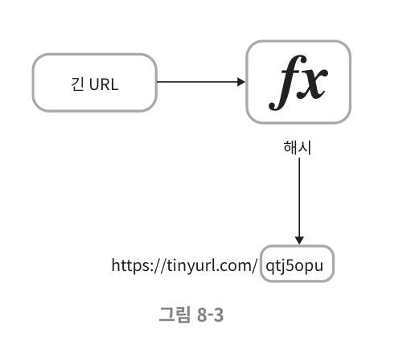
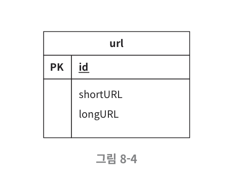

## URL 단축키 설계

#### 1단계 - 문제 이해 및 설계 범위 확정
- URL 단축
- URL redirection
- 높은 가용성과 규모 확장성, 그리고 장애 감내가 요구 됨
- 단축 URL에는 숫자와 영문자를 사용할 수 있음
- 단축된 URL은 삭제나 갱신을 할 수 없다. (단순화를 위해 가정)

##### 개략적 추정

- 쓰기 연산: 매일 1억 개의 단축 URL 생성
- 초당 쓰기 연산: 1억(100million) / 24 / 3600 = 1160
- 읽기 연산
  - 비율 설정: 읽기 연산과 쓰기 연산 비율이 10:1 이라고 하자.
  - 그 경우 읽기 연산은 초당 1160×10=11600 회 발생.
- URL 단축 서비스를 10년간 운영한다고 가정하면 1억 × 365 × 10 = 3650억 개의 레코드를 보관해야 한다.
- 축약 전 URL의 평균 길이를 100이라고 가정
- 따라서 10년 동안 필요한 저장 용량은 3650억 × 100바이트 = 36.5TB 이다.

#### 2단계 - 개략적 설계안 제시 및 동의 구하기

- URL 단축용 엔드포인트
  - 새 단축 URL을 생성하는 API
  - POST /api/v1/data/shorten
    - body: {longUrl: longURLstring}
  - 응답 : 단축 URL
- URL 리다이렉션용 엔드포인트
  - 단축 URL에 대해서 HTTP 요청이 오면 원래 URL로 보내주기 위한 API
  - GET /api/v1/shortUrl
  - 응답 : HTTP 리다이렉션 목적지가 될 원래 URL

##### 301 vs 302 ?
- 301 Permanently Moved
  - 해당 URL에 대한 HTTP 요청의 처리 책임이 영구적으로 Location 헤더에 반환된 URL로 이전되었다.
  - 브라우저는 이 응답을 캐시한다
  - 서버 부하를 줄이는 것이 중요할 때 사용
- 302 Found
  - 해당 URL 요청이 일시적으로 Location 헤더가 지정하는 URL에 의해 처리되어야 한다는 응답.
  - 언제나 단축 URL 서버에 먼저 보내진 후에 원래 URL로 리다이렉션 되어야 함.
  - 트래픽 분석이 중요할 때 사용
 
URL 리다이렉션을 구현하는 가장 직관적인 방법
-> 해시 테이블 사용

#### URL 단축

결국 중요한 것은 원래의 긴 URL을 해시 값으로 대응시킬 해시 함수를 찾는 것이다.

해당 함수는 아래와 같은 요구사항을 만족해야 한다.

- 입력으로 주어지는 긴 URL이 다른 값이면 해시 값도 달라야 한다.
- 계산된 해시 값은 원래 입력으로 주어졌던 긴 URL로 복원될 수 있어야 한다.

#### 3단계 - 상세 설계

개략적 설계에서는 모든 것을 해시 테이블에 두었다
-> 메모리는 유한하고 비싸기 때문에 실제 시스템에 쓰기는 곤란하다.

#### 해시 함수

원래 URL을 단축 URL로 변환하는 함수이다.

해시 함수가 계산하는 단축 URL 값을 hashValue라고 지칭한다.

hashValue는 [0-9, a-z, A-Z]의 문자들로 구성되어있다. ⇒ 총 62개

62^n ≥ 3650억인 n의 최솟값을 찾아야 한다.
→ 이 시스템은 3650억 개의 URL을 생성해야 하고 단축 URL의 길이는 최대한 짧은것이 좋으므로 n의 최솟값을 구해보자

n의 최솟값은 7이 되므로 hashValue의 길이는 7이 되어야 한다.

해시 함수 구현에 쓰일 기술로는 해시 후 충돌 해소 방법과 base-62 방법이 있다.

#### 해시 후 충돌 해소)
긴 URL을 줄이려면, 원래 URL을 7글자 문자열로 줄이는 해시 함수가 필요하다. 

손쉬운 방법은 CRC32, MD5, SHA-1 같이 잘 알려진 해시 함수를 이용하는 것이다.

|해시함수|해시 결과(16진수)|
|------|---|
|CRC32|5cb54054|
|MD5|5a62509a84df9ee03fe1230b9df8b84e|
|SHA-1|0eeae7916c06853901d9ccbefbfcaf4de56ed85b|

CRC32가 계산한 가장 짧은 해시값도 7보다는 길다.

해시 값에서 처음 7개 글자만 사용한다

→ 해시 결과가 서로 충돌할 확률이 있다.

실제로 충돌이 발생했을 때, 충돌이 해소될 때 까지 사전에 정한 문자열을 해시값에 덧붙인다

