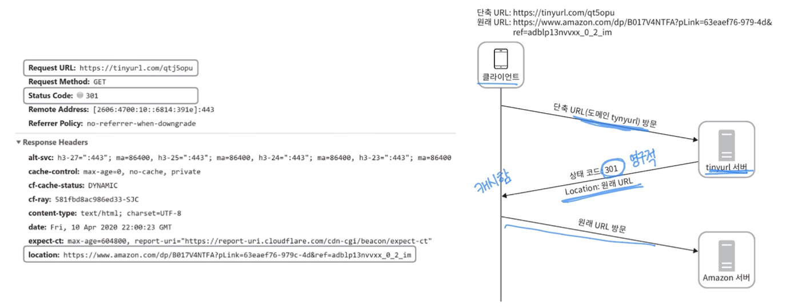
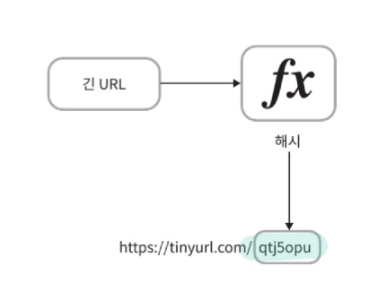
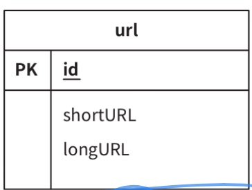
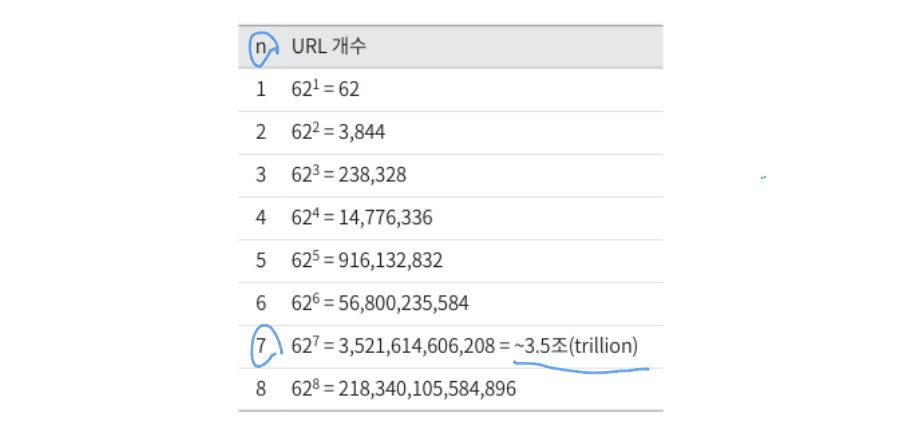
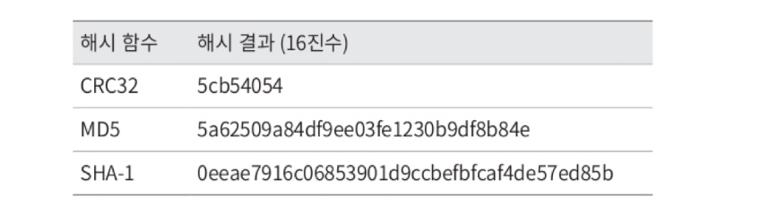
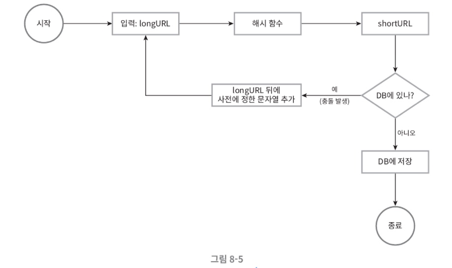
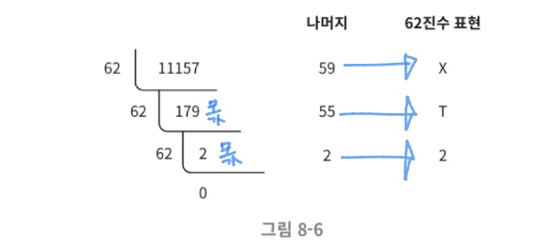
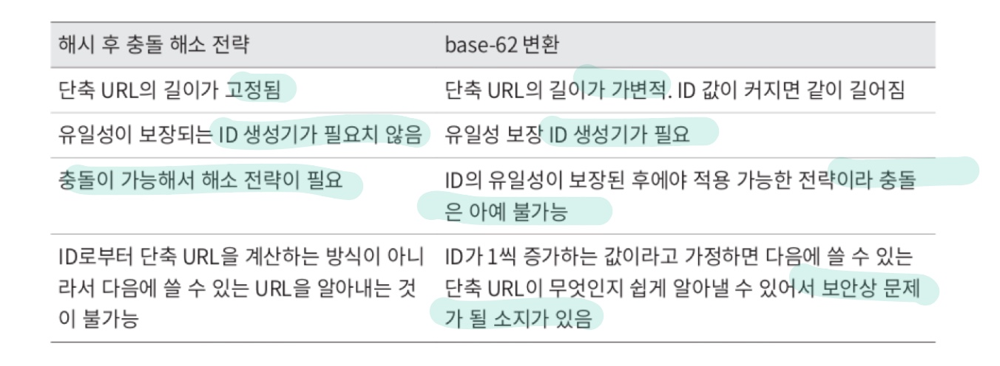
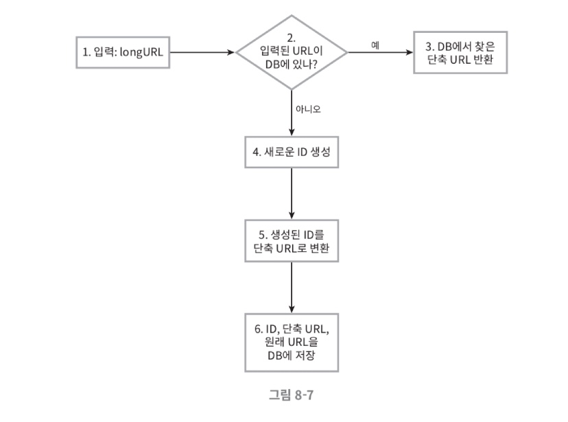
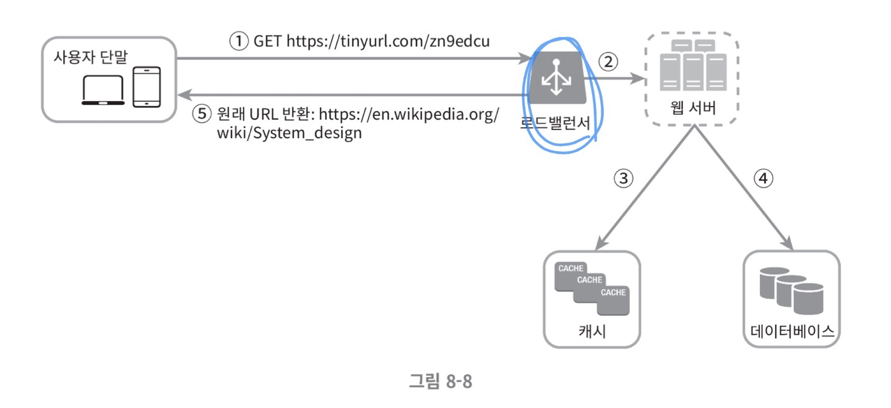

#  URL 단축기 설계

### 1단계: 문제 이해 및 설계 범위 확정

시스템 설계 면접 문제는 의도적으로 어떤 정해진 결말을 갖지 않도록 만들어짐.
따라서 면접장에서 시스템을 성공적으로 설계해 내려면 질문을 통해 모호함을 줄이고 요구사항을 알아내야 함.

질문 list 예시
- URL 단축키가 어떻게 동작해야 하는지 예제를 보여주세요.
- 트래픽 규모가 어느 정도인지?
- 단축URL의 길이는 어느 정도여야 하는지?
- 단축 URL에 포함될 문자에 제한이 있는지?
- 단축된 URL을 시스템에서 지우거나 갱신할 수 있는지?

시스템의 기본적 기능
1. URL단축: 주어진 긴 URL을 훨씬 짧게 줄인다.
2. URL 리디렉션: 축약된 URL로 HTTP 요청이 오면 원래 URL로 안내
3. 높은 가용성과 규모 확장성, 그리고 장애 감내가 요구됨.


#### 개략적 추정

- 쓰기 연산 : 매일 1억 개의 단축 URL 생성
- 초당 쓰기 연산: 1억(100million)/24/3600 = 1160
- 읽기 연산: 읽기 연산과 쓰기 연산 비율은 10:1 이라고 하자. 그 경우 읽기 연산은 초당 11,600회 발샏ㅇ한다.(1160 * 10 = 11,600)
- URL 단축 서비스를 10년간 운영한다고 가정하면 1억(100million) * 365 * 10 = 3650억(365billion)개의 레코드를 보관해야 한다.
- 축약 전 URL의 평균 길이는 100
- 따라서 10년 동안 필요한 저장 용량은 3650억(3650billion)* 100바이트 = 36.5TB이다.


### 2단계: 개략적 설계안 제시 및 동의 구하기

#### 1. API 엔드포인트 
  - 클라이언트는 서버가 제공하는 API 엔드포인트를 통해 서버와 통신함
  - 우리는 이 엔드포인트를 REST 스타일로 설계할 것

URL단축기는 기본적으로 두 개의 앤드포인트를 필요로 함

1. URL단축용 엔드포인트: 새 단축 URL을 생성학자 하는 클라이언트는 이 엔드포인트에 단축할 URL을 인자로 실어서 POST요청을 보내야함.
    ```
   POST/api/v1/data/shorten
   
   - 인자: {longUrl: longURLstring}
   - 반환: 단축 URL
   ```
   
2. URL 리디렉션용 엔드포인트: 단축 URL에 대해서 HTTP요청이 오면 원래 URL로 보내주기 위한 용도의 엔드포인트

    ```
   GET/api/v1/shortUrl
   - 반환: HTTP 리디렉션 목적지가 될 원래 URL
   ```

#### 2. URL 리디렉션



단축 URL을 받은 서버는 그 URL을 원래 URL로 바꾸어서 301응답의 Location 헤더에 넣어 반환함

##### 301응답과 302응답의 차이

> 301 Permanently Moved: <BR>
> - 해당 URL에 대한 HTTP요청이 처리 책임이 영구적으로 Location 헤더에 반환된 URL로 이전되었다는 응답<BR>
> - 따라서 추후 같은 단축 URL에 요청을 보낼 필요가 있을 때 브라우저는 캐시된 원래 URL로 요청을 보내게 됨<BR>


> 302 Found:<BR>
> - 일시적으로 Location 헤더가 지정하는 URL에 의해 처리되어야 한다는 응답<BR>
> - 따라서 클라이언트의 요청은 언제나 단축 URL 서버에 먼저 보내진 후에 원래 URL로 리디렉션되어야 함

- 서버 부하를 줄이는 것이 중요?
  - 301 사용

- 트래픽 분석이 중요? 
  - 302 사용

#### URL리디렉션을 구현하는 가장 직관적인 방법 : 해시 테이블 

<단축 URL, 원래 URL>의 쌍을 저장한다고 가정

- 원래 URL = hashTable.get(단축 URL)
- 301 또는 302 응답 Location헤더에 원래 URL을 넣은 후 전송


#### URL 단축



해시 함수는 다음 요구사항을 만족해야 함

- 입력으로 주어진 긴 URL이 다른 값이면 해시 값도 달라야 함
- 계산된 해시 값은 원래 입력으로 주어졌던긴 URL로 복원될 수 있어야 함


### 3단계: 상세 설계


#### 데이터 모델

개략적 설계를 진행할 때는 모든 것을 해시 테이블에 두었음
초기 전략으로는 괜찮지만 실제 시스템이 쓰기에는 곤란
메모리는 유한하고, 비쌈

더 나은 방법

<단축 URL, 원래 URL>의 순서쌍 관계형 데이터베이스에 저장

[간단한 설계]




### 해시 함수
  - 원래 URL을 단축 URL로 변환하는데 쓰임
  - 편의상 해시 함수가 계산하는 단축 URL 값을 hashValue라고 지칭

#### 해시 값 길이

hashValue는 [0-9, a-z, A-Z]의 문자들로 구성됨

따라서 사용할 수 있는 문자의 개수는 10+26+26 = 62개

hashValue의 길이를 정하기 위해서는 62^n >= 3650억인 n의 최솟값을 찾아야 함

개략적으로 계산했던 추정치에 따르면 이 시스템은 3650개의 URL을 만들어낼 수 있어야 함


표는 hashValue의 길이와, 해시 함수가 만들 수 있는 URL의 개수 사이의 관계

n= 7이면 3.5개의 URL을 만들 수 있음

#### 해시 함수 구현에 쓰일 2가지 기술

긴 URL을 줄이려면, 원래 URL을 7글자 문자열로 줄이는 해시함수가 필요

1. 해시 후 충돌 해소 
   - CRC32, MD5, SHA-1과 같이 잘 알려진 해시 함수를 이용
   
    - CRC32가 계산한 가장 짧은 해시값조차도 7보다는 긺
      - 처음 7개 글자만 이용
        - 충돌할 확률 높아짐
        - 충돌이 실제로 발생했을 때는, 충돌이 해소될 때까지 사전에 정한 문자열을 해시값에 덧붙임
        
        

- 이 방법을 쓰면 충돌은 해소할 수 있지만, 단축 URL을 생성할 때 한 번 이상 데이터베이스 질의를 해야 하므로 오버헤드가 큼
- 데이터베이스 대신 블룸 필터를 사용하면 성능을 높일 수 있음
- 블룸 필터는 어떤 집합에 특정 원소가 있는지 검사할 수 있도록 하는, 확률론에 기초한 공간 효율이 좋은 기술임

2. base-62 변환

진법 변환은 URL 단축기를 구현할 때 흔히 사용되는 접근법 중 하나

이 기법은 수의 표현 방식이 다른 두 시스템이 같은 수를 공유하여야 하는 경우에 유용
62진법을 쓰는 이유: hashValue에 사용할 수 있는 문자 개수가 62개이기 떄문



11157(10) = 2 * 62^2 + 55 * 62^1 + 59 * 62^0 = [2, 55, 59] => [2, T, X] => 2TX(62)

#### 두 접근법 비교




#### URL 단축기 상세 설계

URL 단축기는 시스템의 핵심 컴포넌트

- 논리적
- 단순
- 기능적으로는 언제나 동작하는 상태로 유지


[예제 - 62진법 변환 기법 사용]



1. 입력으로 긴 URL을 받음
2. 데이터베이스에 해당 URL이 있는지 검사
3. 있으면 해당 URL에 대한 단축 URL을 만든적이 있는 것임. 따라서 데이터베이스에서 해당 단축 URL을 가져와서 클라이언트에게 반환
4. 데이터베이스에 없는 경우에는 해당 URL을 새로 접수된 것임. 유일한 ID 생성. 이때 ID는 데이터베이스의 기본 키
5. 62진법 변환을 적용, ID를 단축 URL로 만듦
6. ID, 단축 URL, 원래 URL로 새 데이터베이스 레코드를 만든 후 단축URL을 클라이언트에 전달


- ID 생성기
  - 단축 URL을 만들 때 사용할 ID를 만드는 것
  - ID는 전역적 유일성이 보장되어야 함
  - 고도로 분산된 환경에서 이런 생성기를 만드는 것은 무척 어려운 일
    - 7장에서 분산 ID 생성기를 구현하는 몇가지 방법을 살펴본 적 있음


#### URL 리디렉션 상세 설계

쓰기보다 읽기를 더 자주하는 시스템.
<단축 URL, 원래 URL>의 쌍을 캐시에 저장하여 성능을 높임



1. 사용자가 단축 URL을 클릭
2. 로드밸런서가 해당 클릭으로 발생한 요청을 웹 서버에 전달.
3. 단축 URL이 이미 캐시에 있는 경우에는 원래 URL을 바로 꺼내서 클라이언트에게 전달
4. 캐시에 해당 단축 URL이 없는 경우에는 데이터베이스에서 꺼냄. 데이터 베이스에 없다면 아마 사용자가 잘못된 단축 URL을 입력한 경우일 것
5. 데이터베이스에서 꺼낸 URL을 캐시에 넣은 후 사용자에게 반환.


### 4단계 : 마무리

더 이야기 해보면 좋은 주제

- 처리율 제한 장치
  - 지금까지 살펴본 시스템은 엄청난 양의 URL단축 요청이 밀려들 경우 무력화될 수 있는 잠재적 보안 결함을 갖고 있음
  - 처리율 제한 장치를 두면 IP주소를 비롯한 필터링 규칙들을 이용해 요청을 걸러낼 수 있음
  - 4장 참고
  

- 웹 서버의 규모 확장
  - 본 설계에 포함된 웹 계층은 무상태 계층
    - 웹 서버를 자유로이 증설하거나 삭제할 수 있음


- 데이터베이스의 규모 확장
  - 데이터베이스를 다중화하거나 샤딩하여 규모 확장성을 달성할 수 있음
  

- 데이터 분석 솔루션
  - 어떤 링크를 얼마나 많은 사용자가 클릭했는지, 언제 주로 클릭했는지 등 중요한 정보를 알아낼 수 있을 것


- 가용성, 데이터, 일관성, 안정성
  - 대규모 시스템이 성공적으로 운영되기 위해서는 반드시 갖추어야 할 속성들임 