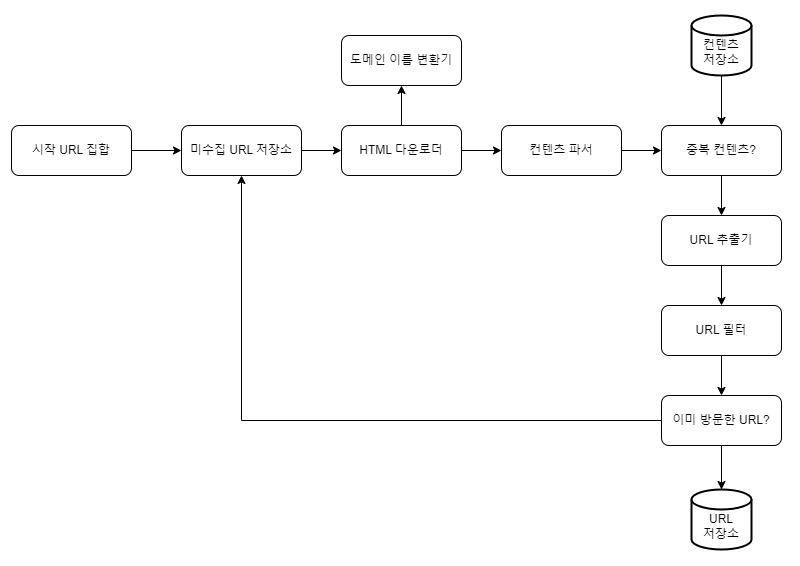
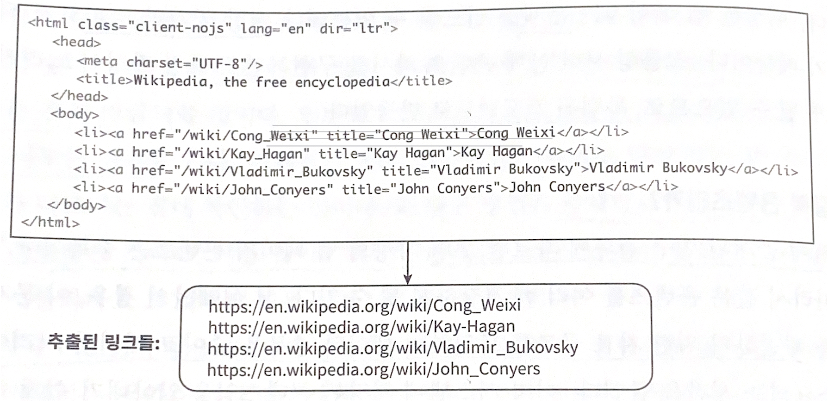
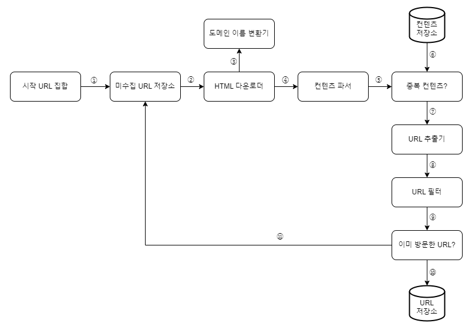
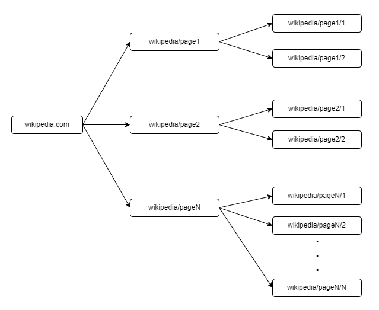
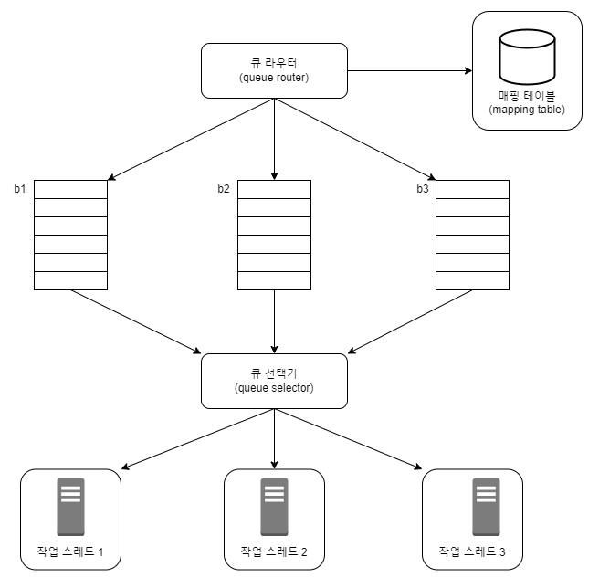
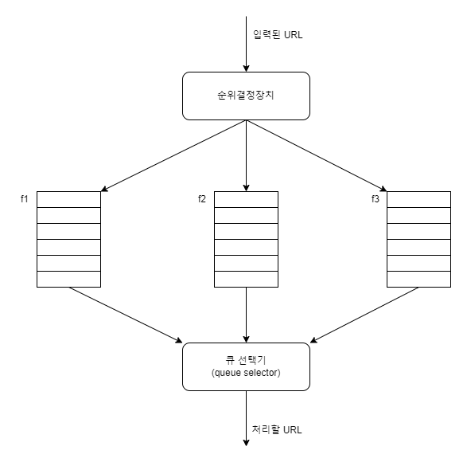
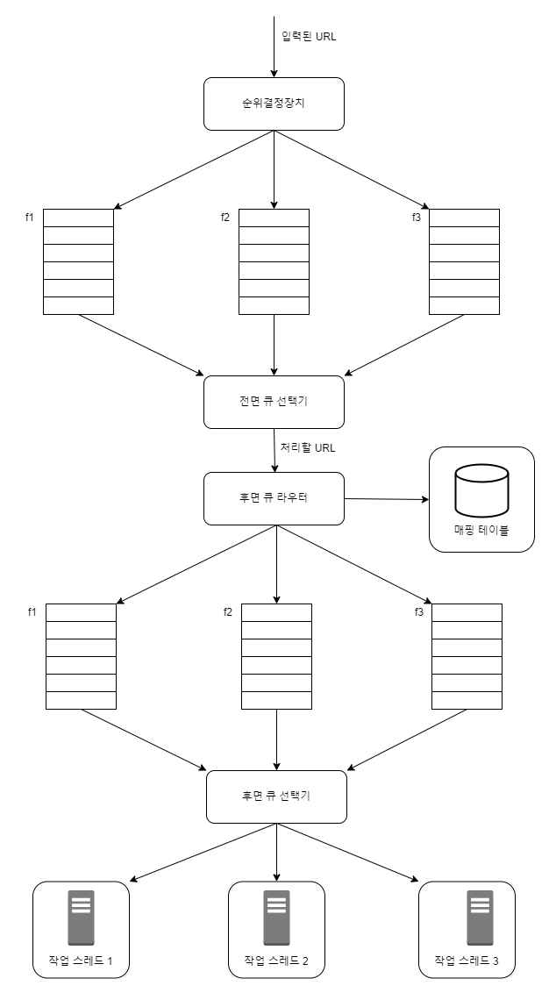
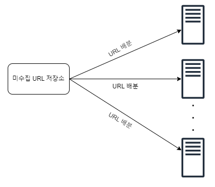
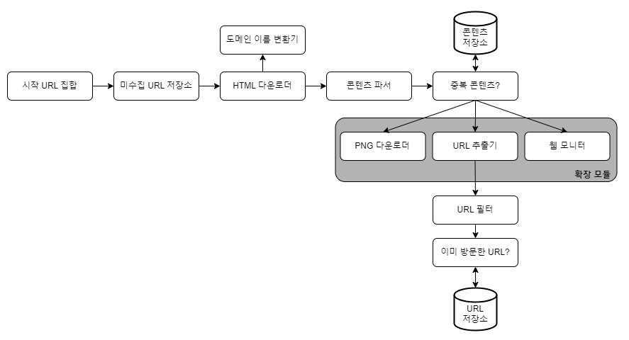

# 9장 웹 크롤러 설계
웹 크롤러
- 검색 엔진 인덱싱(search engine indexing)
  - 크롤러는 웹 페이지를 모아 검색 엔진을 위한 로컬 인덱스(local index)를 만듦
  - e.g. Googlebot: 구글 검색 엔진 웹 크롤러
- 웹 아카이빙(web archiving)
  - 나중에 사용할 목적으로 장기보관하기 위해 웹에서 정보를 모으는 절차
  - 많은 국립 도서관에서 크롤러를 돌려 웹사이트를 아카이빙함
  - e.g. 미국 국회 도서관(US Library of Congress), EU 웹 아카이브
- 웹 마이닝(web mining)
  - 웹 마이닝을 통해 인터넷에서 유용한 지식 도출
  - 유명 금융 기업들은 크롤러를 사용해 주주 총회 자료나 연차 보고서를 다운받아 기업의 핵심 사업 방향을 알아내기도 함
- 웹 모니터링(web monitoring)
    - 인터넷에서 저작권이나 상표권이 침해되는 사례를 모니터링할 수 있음
    - e.g. 디티마크(Digimarc)사는 웹 크롤러를 사용해 해적판 저작물을 찾아내서 보고함

## 1단계: 문제 이해 및 설계 범위 확정
웹 크롤러의 기본 알고리즘
1. URL 집합이 입력으로 주어지면, 해당 URL들이 가리키는 모든 웹 페이지를 다운로드
2. 다운받은 웹 페이지에서 URL들 추출
3. 추출된 URL들을 다운로드할 URL 목록에 추가하고, 위의 과정을 처음부터 반복

웹 크롤러가 만족해야 할 속성
- 규모 확장성
  - 병행성(parallelism)을 활용하면 보다 효과적으로 웹 크롤링 할 수 있음
- 안정성(robustness)
  - 크롤러는 비정상적 입력이나 환경에 잘 대응할 수 있어야 함
    - 잘못 작성된 HTML, 아무 반응이 없는 서버, 장애, 악성 코드가 붙어 있는 링크 등둥
- 예절(politeness)
  - 수집 대상 웹 사이트에 짧은 시간 동안 너무 많은 요청을 보내서는 안 됨
- 확장성(extensibility)
  - 새로운 형태의 콘텐츠를 지원하기 쉬워야 함
    - e.g. 이미지 파일도 크롤링 -> 전체 시스템을 새로 설계해야 한다면 곤란해짐

### 개략적 규모 추정
- 매달 10억 개의 웹 페이지를 다운로드 함
- QPS = 10억(1billion, 1,000,000,000)/30일/24시간/3600초 = 대략 400페이지/초
- 최대(Peak) QPS = 2 * QPS = 800
- 웹 페이지의 크기 평균은 500k라고 가정
- 10억 페이지 * 500k = 500TB/월
- 1개월치 데이터를 보관하는 데는 500TB, 5년간 보관한다고 가정하면 500TB * 12개월 * 5년 = 30PB 저장용량 필요함

## 2단계: 개략적 설계안 제시 및 동의 구하기


### 시작 URL 집합
- 웹 크롤러가 크롤링을 시작하는 출발점
- 크롤러가 가능한 많은 링크를 탐색할 수 있도록 하는 URL을 골라야 함
  - 전체 URL 공간을 작은 부분집합으로 나누기
    - 지역적인 특색, 나라별로 인기 있는 웹 사이트가 다르다는 점에서 착안
  - 주제별로 다른 시작 URL 사용
    - URL 공간을 쇼핑, 스포츠, 건강 등등의 주제별로 세분화하고 각각에 다른 시작 URL 사용

### 미수집 URL 저장소
1. 다운로드할 URL
   - 미수집 URL 저장소(URL frontier)라고 부름
   - FIFO(First-In-First-Out) 큐(queue)라고 생각하면 됨
2. 다운로드된 URL

### HTML 다운로더
- 인터넷에서 웹 페이지를 다운로드하는 컴포넌트
  - 다운로드할 페이지의 URL은 미수집 URL 저장소가 제공함

### 도메인 이름 변환기
- 웹 페이지를 다운받으려면 URL을 IP 주소로 변환하는 절차가 필요함
  - 도메인 이름 변환기를 사용하여 URL에 대응되는 IP 주소를 알아냄
  - e.g. www.wikipedia.org의 IP 주소: 35.26.96

### 콘텐츠 파서
- 웹 페이지를 다운로드하면 파싱(parsing)과 검증(validation) 절차를 거쳐야 함
  - 이상한 웹 페이지는 문제를 일으키고, 저장 공간을 낭비하게 됨
- 크롤링 서버 안에 콘텐츠 파서를 구현하면 크롤링 과정이 느려지게 될 수 있음 <br>
-> 독립된 컴포넌트로 만듦

### 중복 콘텐츠인가? 
- 웹에 공개된 연구 결과에 따르면, 29% 가량의 웹 페이지 콘텐츠는 중복임 <br>
-> 같은 콘텐츠를 여러 번 저장하게 될 수 있음 <br>
-> 웹 페이지의 해시 값 비교

### 콘텐츠 저장소
- HTML 문서를 보관하는 시스템
- 저장소를 구현할 기술을 고를 때는 저장할 데이터의 유형, 크기, 저장소 접근 빈도, 데이터의 유효 기간 등을 종합적으로 고려해야 함
- 본 설계안에서는 디스크와 메모리를 동시에 사용하는 저장소 택함
  - 데이터 양이 너무 많으므로 대부분의 콘텐츠는 디스크에 저장
  - 인기 있는 콘텐츠는 메모리에 두어 접근 지연시간을 줄임

### URL 추출기

- HTML 페이지를 파싱하여 링크들을 골라내는 역할을 함
  - 상대 경로는 전부 절대 경로로 변환

### URL 필터
- 아래와 같은 URL을 크롤링 대상에서 배제하는 역할
  - 특정한 콘텐츠 타입이나 파일 확장자를 갖는 URL
  - 접속 시 오류가 발생하는 URL
  - 접근 제외 목록(deny list)에 포함된 URL 등

### 이미 방문한 URL?
- 이미 방문한 URL이나 미수집 URL 저장소에 보관된 URL을 추적
  - 같은 URL을 여러 번 처리하는 일 방지할 수 있음
    - 서버 부하 줄임
    - 시스템이 무한 루프에 빠지는 것 방지할 수 있음
- 해당 자료구조로는 블룸 필터(bloom filter)나 해시 테이블이 널리 쓰임

### URL 저장소
- 이미 방문한 URL을 보관하는 저장소

### 웹 크롤러 작업 흐름

① 시작 URL들을 미수집 URL 저장소에 저장 <br>
② HTML 다운로더는 미수집 URL에서 URL 목록을 가져옴 <br>
③ HTML 다운로더는 도메인 이름 변환기를 사용해 URL의 IP 주소를 알아내고, 해당 IP 주소로 접속하여 웹 페이지를 다운받음 <br>
④ 콘텐츠 파서는 다운된 HTML 페이지를 파싱하여 올바른 형식을 갖춘 페이지인지 검증 <br>
⑤ 콘텐츠 파싱과 검증이 끝나면 중복 콘텐츠인지 확인하는 절차 개시 <br>
⑥ 중복 콘텐츠인지 확인하기 위해, 해당 페이지가 이미 젖아소에 있는지 봄
  - 이미 저장소에 있는 콘텐츠인 경우, 처리하지 않고 버림
  - 저장소에 없는 콘텐츠인 경우, 저장소에 저장한 뒤 URL 추출기로 전달 

⑦ URL 추출기는 해당 HTML 페이지에서 링크를 골라냄 <br>
⑧ 골라낸 링크를 URL 필터로 전달 <br>
⑨ 필터링이 끝나고 남은 URL만 중복 URL 판별 단계로 전달 <br>
⑩ URL 저장소에 보관된 URL인지 살핌. 이미 저장소에 있는 URL은 버림 <br>
  -> 이미 처리한 URL인지 확인하기 위해 <br>
⑪ 저장소에 없는 URL은 URL 저장소에 저장, 미수집 URL 저장소에도 전달

## 3단계: 상세 설계
- DFS(Depth-First Search) vs BFS(Breadth-First Search)
- 미수집 URL 저장소
- HTML 다운로더
- 안정성 확보 전략
- 확장성 확보 전략
- 문제 있는 콘텐츠 감지 및 회피 전략

### DFS를 쓸 것인가, BFS를 쓸 것인가
- 웹은 유향 그래프(directed graph)나 같음 <br>
- 페이지 = 노드, 하이퍼링크(URL) = 에지(edge)
- DFS
  - 그래프 크기가 클 경우 어느 정도로 깊숙이 가게 될지 가늠하기 어려워짐
- BFS 
  - 웹 크롤러는 보통 BFS 사용
  - 문제점
    
    - 한 페이지에서 나오는 링크의 상당수는 같은 서버로 되돌아감
      - wikipedia 서버는 수많은 요청으로 과부하에 걸리게 됨 
      - 크롤러는 예의 없는(impolite) 크롤러로 간주됨
    - 표준적 BFS 알고리즘은 URL 간에 우선순위를 두지 않음
      - 모든 웹 페이지가 같은 수준의 품질, 같은 수준의 중요성을 갖지는 않음
      - 페이지 순위(page rank), 사용자 트래픽의 양, 업데이트 빈도 등 여러 가지 척도에 비추어 처리 우선순위를 구별하는 것이 온당함

### 미수집 URL 저장소
- 예의(politeness)를 갖춘 크롤러, URL 사이의 우선순위와 신선도(freshness)를 구별하는 크롤러 구현할 수 있음

#### 예의
- 웹 크롤러는 수집 대상 서버로 짧은 시간 안에 너무 많은 요청을 보내는 것을 삼가야 함
- 동일 웹 사이트에 대해서는 한 번에 한 페이지만 요청해야 함 <br>
-> 같은 웹 사이트의 페이지를 다운받는 태스크는 시간차를 두고 실행 <br>
  - 웹 사이트의 호스트명(hostname)과 다운로드를 수행하는 작업 스레드(worker thread) 사이의 관계 유지 
  - 각 다운로드 스레드는 별도 FIFO 큐 가지고 있어, 해당 큐에서 꺼낸 URL만 다운로드 함


- 큐 라우터(queue router)
  - 같은 호스트에 속한 URL은 언제나 같은 큐(b1, b2, ... , bn)로 가도록 보장
<br><br>
  
| 호스트 | 큐 |
| --- | --- |
| wikipedia.com | b1 |
| apple.com | b2 |
| … | … |
| nike.com | bn |
- 매핑 테이블(mapping table)
  - 호스트 이름과 큐 사이의 관계를 보관하는 테이블
- FIFO 큐(b1부터 bn까지)
  - 같은 호스트에 속한 URL은 언제나 같은 큐에 보관됨
- 큐 선택기(queue selector)
  - 큐들을 순회하면서 큐에서 URL을 꺼내서 해당 큐에서 나온 URL을 다운로드하도록 지정된 작업 스레드에 전달
- 작업 스레드(worker thread)
  - 전달된 URL을 다운로드하는 작업 수행
  - 전달된 URL은 순차적으로 처리되며, 작업들 사이에는 일정한 지연시간(delay)을 둘 수 있음

#### 우선순위
- 웹 페이지는 모두 같은 중요도를 가지진 않음
- 크롤러 입장에서는 중요한 페이지를 먼저 수집하도록 하는 것이 바람직
- 유용성에 따라 URL의 우선순위를 나눔
  - 페이지랭크(PageRank)
  - 트래픽 양
  - 갱신 빈도(update frequency) <br>
  
-> 순위결정장치(prioritizer)
- URL 우선순위를 정하는 컴포넌트

- 순위결정장치(prioritizer)
  - URL을 입력으로 받아 우선순위를 계산
- 큐(f1, ... fn)
  - 우선순위별로 큐가 하나씩 할당됨
  - 우선순위가 높으면 선택될 확률도 올라감
- 큐 선택기
  - 임의 큐에서 처리할 URL을 꺼내는 역할
  - 순위가 높은 큐에서 더 자주 꺼내도록 프로그램되어 있음


- 전면 큐(front queue)
  - 우선순위 결정 과정 처리
- 후면 큐(back queue)
  - 크롤러가 예의 바르게 동작하도록 보증

#### 신선도
- 웹 페이지는 수시로 추가, 삭제, 변경됨
- 데이터의 신선함(freshness)을 유지하기 위해서는 주기적으로 웹페이지를 재수집(recrawl) 해야 함
- 최적화 전략
  - 웹 페이지의 변경 이력(update history) 활용
  - 우선순위를 활용하여 중요한 페이지는 더 자주 재수집
  
##### 미수집 URL 저장소를 위한 지속성 저장장치
- 모두 메모리에 보관하는 것은 안정성이나 규모 확장성 측면에서 바람직하지 않음
- 모두 디스크에 저장하는 것은 성능 병목지점이 될 수 있음
- 절충안
  - 대부분의 URL은 디스크에 둠
  - 메모리 버퍼에 큐를 두어 IO 비용을 줄임
  - 버퍼에 있는 데이터는 주기적으로 디스크에 기록

### HTML 다운로더
- HTTP 프로토콜을 통해 웹 페이지를 내려 받음

#### Robots.txt
- 웹사이트가 크롤러와 소통하는 표준적 방법
- 로봇 제외 프로토콜이라고도 부름
- 크롤러가 수집해도 되는 페이지 목록이 들어있음
- Robots.txt 파일을 거푸 다운로드하지 않기 위해 파일을 주기적으로 다시 받아 캐시에 보관
> 예시: https://www.amazon.com/robots.txt 파일
```text
User-agent: Googlebot
Disallow: /creatorHub
Disallow: /rss/people/*/reviews
Disallow: /gp/pdp/rss/*/reviews
Disallow: /gp/cdp/member-reviews/
Disallow: /gp/aw/c/r
```
CreatorHub와 같은 디렉터리의 내용은 다운받을 수 없음

#### 성능 최적화
1. 분산 크롤링


- 크롤링 작업을 여러 서버에 분산
- 각 서버는 여러 스레드를 돌려 다운로드 작업을 처리함
  - URL 공간은 작은 단위로 분할하여, 각 서버는 그중 일부의 다운로드를 담당하게 함

2. 도메인 이름 변환 결과 캐시
- 도메인 이름 변환기(DNS Resolver)는 크롤러 성능의 병목 중 하나
  - DNS 요청을 보내고 결과를 받는 작업의 동기적 특성 
  - 크롤러 스레드 가운데 어느 하나라도 DNS 요청을 하고 있으면, 다른 스레드의 DNS 요청은 전부 블록(block)됨 <br>
  
-> DNS 조회 결과로 얻어진 도메인 이름과 IP 주소 사이의 관계를 캐시에 보관해놓고 크론 잡(cron job) 등을 돌려 주기적으로 갱신하도록 해놓음 

3. 지역성
- 크롤링 작업을 수행하는 서버를 지역별로 분산
  - 크롤링 서버가 크롤링 대상 서버와 지역적으로 가까우면 페이지 다운로드 시간은 줄어듦
- 크롤 서버, 캐시, 큐, 저장소 등 대부분의 컴포넌트에 적용 가능

4. 짧은 타임아웃
- 어떤 웹 서버는 응답이 느리거나 아예 응답하지 않음
  - 최대 대기시간을 정해놓음
  - 이 시간동안 서버가 응답하지 않으면 크롤러는 해당 페이지 다운로드를 중단하고 다음 페이지로 넘어감

#### 안정성
- 안정 해시(consistent hashing)
  - 다운로더 서버들에 부하를 분산할 때 적용 가능
  - 다운로더 서버를 쉽게 추가하고 삭제할 수 있음
- 크롤링 상태 및 수집 데이터 저장
  - 장애가 발생한 경우데도 쉽게 복구할 수 있음
  - 저장된 데이터를 로딩하고 나면 중단되었던 크롤링 쉽게 재시작 가능
- 예외 처리(exception handling)
  - 예외가 발생해도 전체 시스템이 중단되는 일은 없어야 함
- 데이터 검증(data validation)
  - 시스템 오류를 방지하기 위한 중요 수단 가운데 하나

#### 확장성

- 새로운 모듈을 끼워 넣어, 새로운 형태의 콘텐츠를 지원할 수 있도록 설계
  - PNG 다운로더는 PNG 파일을 다운로드하는 플러그인(plug-in) 모듈
  - 웹 모니터(web monitor)는 웹을 모니터링해 저작권이나 상표권이 침해되는 일을 막는 모듈

#### 문제 있는 콘텐츠 감지 및 회피
1. 중복 콘텐츠
- 웹 콘텐츠의 30% 가량은 중복
  - 해시나 체크섬(check-sum) 사용
  
2. 거미 덫
- 크롤러를 무한 루프에 빠뜨리도록 설계한 웹 페이지
e.g. spidertrapexample.com/foo/bar/foo/bar/foo/bar/...
- URL의 최대 길이를 제한
  - 가능한 모든 종류의 덫을 피할 수 있는 해결책은 없음
- 덫이 있는 사이트를 크롤러 탐색 대상에서 제외하거나 URL 필터 목록에 걸어둠

3. 데이터 노이즈
- 어떤 콘텐츠는 가치가 없음
  - 광고, 스크립트 코드, 스팸 URL 등등 <br>
-> 가능하다면 제외해야 함

## 4단계: 마무리
좋은 크롤러가 갖추어야 하는 특성
- 규모 확장성(scalability)
- 예의
- 확장성(extensibility)
- 안정성

추가로 논의하면 좋은 것
- 서버 측 렌더링(server-side rendering)
  - 많은 웹사이트가 자바스크립트, ajax 등을 사용하여 링크를 즉석에서 만들어냄
  - 웹 페이지를 있는 그대로 다운받아 파싱하면, 동적으로 생성되는 링크 발견할 수 없음 <br>
  -> 서버 측 렌더링(동적 렌더링 dynamic rendering) 적용
- 원치 않는 페이지 필터링
  - 스팸 방지(anti-spam) 컴포넌트를 두어 품질이 조악하거나 스팸성인 페이지 걸러내도록 해둠
- 데이터베이스 다중화 및 샤딩
  - 데이터 계층(data layer)의 가용성, 규모 확장성, 안정성 향상시킬 수 있음
- 수평적 규모 확장성(horizontal scalability)
  - 대규모의 크롤링을 위해서는 다운로드를 실행할 서버가 수백 혹은 수천 대 필요하게 될 수 있음
    - 무상태(stateless) 서버로 만들어 수평적 규모 확장을 달성함
- 가용성, 일관성, 안정성
  - 성공적인 대형 시스템을 만들기 위해 필수적으로 고려해야 함
- 데이터 분석 솔루션(analytics)
  - 시스템을 세밀히 조정하기 위해서는 데이터와 분석 결과가 필수적임