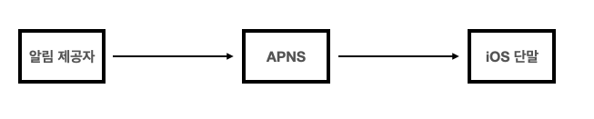
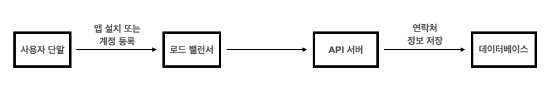
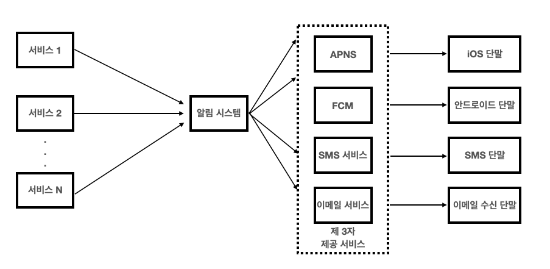
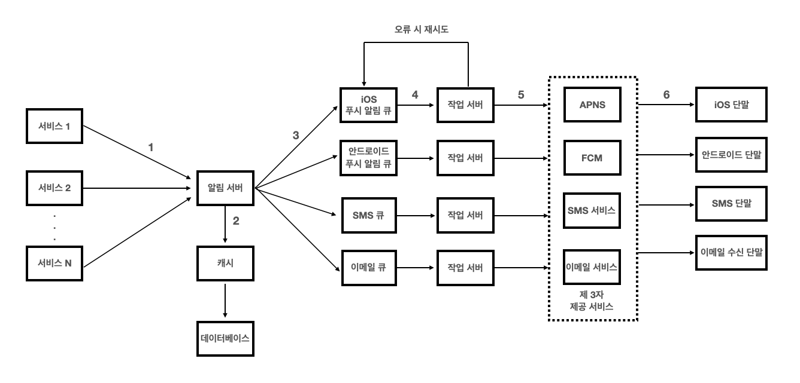
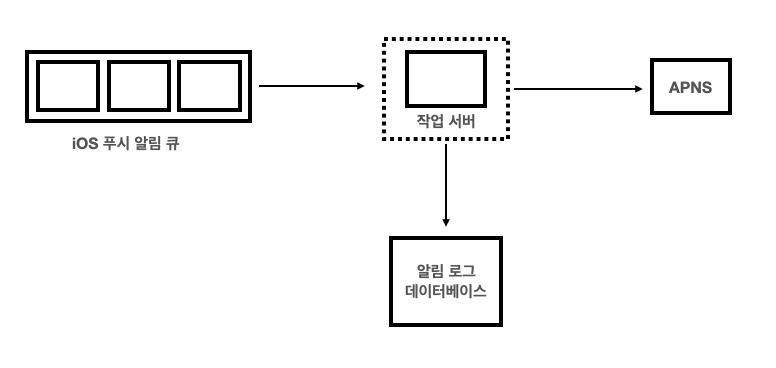
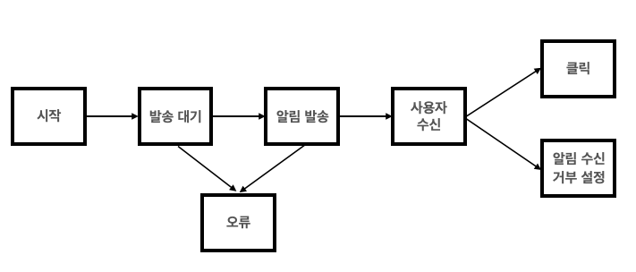
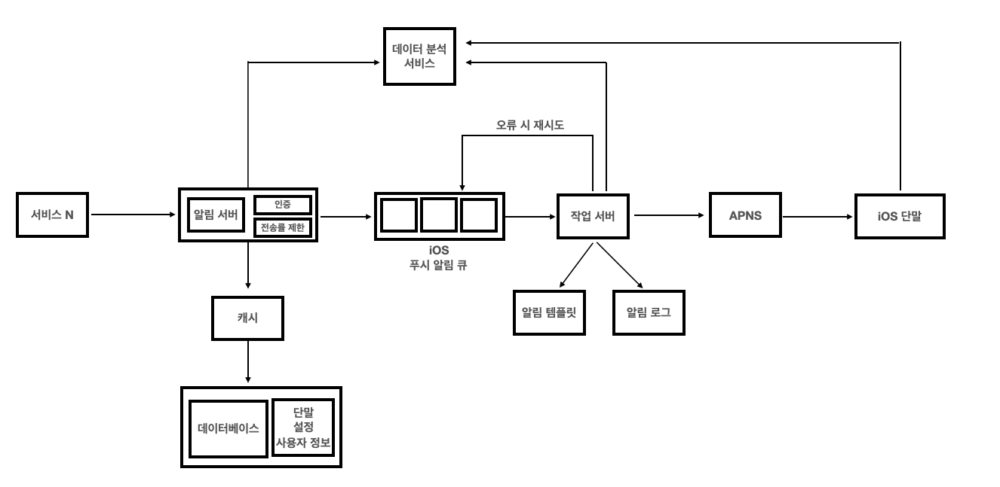

# 알림 시스템 설계
--- ---
알림 시스템은 단순히 모바일 푸쉬알림에 한정되지 않음
- 책에서는 모바일 푸쉬 알림, SMS메세지, 이메일 3가지로 분류함

---
## 1단계) 문제 이해 및 설계 확정
질문을 통한 설계 범위 확정

- 푸쉬 알림, SMS 메세지, 이메일
- iOS, Android, Laptop/Desktop 지원해야 함
- 연성 실시간 시스템
- 가능한 빨리 전달되어야 하지만, 요청이 몰린 경우 약간의 딜레이 허용
- 사용자가 알림을 허용하지 않으면 알림을 받지 않음
- 하루에 알림 몇건
  - 천만 건의 모바일 푸시
  - 백만 건의 SMS 메세지
  - 5백만 건의 이메일

--- ---
## 2단계) 개략적 설계안 제시 및 동의 구하기

### 알림 유형별 지원 방한
각각의 알림 매커니즘이 어떻게 동작하는지 살펴보자

#### iOs 푸쉬 알림



- 알림 제공자(provider): 알림 요청을 만들어 애플 푸쉬 알림 서비스(APNS: APple Push Notification Service)로 보내주는 주체
  알림 요청을 보내려면 device token(알림 요청을 보내는 데 필요한 고유 식별자), payload(알림 내용을 담은 Json 딕셔너리)가 필요함
- 알림 서비스(ARNS): 애플이 제공하는 원격 서비스. 푸시 알림을 iOS 장치로 보내는 역할을 담당
```
{
    "aps": {
            "alert":{
              'title': "Game Request",
              "body": "Bob wnats to play chess"
              "action-loc-key": "PLAY"
        },
        "badge":5
    }
}
```

#### 안드로이드 푸시 알림

- 안드로이드 푸시 알림도 ARMS 대신 FCM을 사용한다는 점이 다름

#### SMS 매세지
- 보통 트윌리오, 넥스모 같은 제3사업자의 서비스를 많이 이용함
  - 대부분 상용 서비스라 돈 내여ㅑ함

#### 이메일
- 대부분의 회사는 고유 이메일 서버를 구축할 역량을 가지고 있음
- 그럼에도 많은 회사가 사용 이메잉ㄹ 서비스 사용함
  - 센드그리드, 메일침프 -> 전송 성공률도 높고 데이터 분석 서비스도 제공

#### 연락처 정보 수집 절차



- 알림을 보내려면 모바일 단말 토큰 전화번호 이메일 주소등의 정보가 필요함
- 앱을 설치한 후에 처음 계정에 가입할 때 해당 사용자의 정보를 데이터베이스에 저장함

#### 알림 전송 및 수신 절차

- 개략적 설계 초안

  

  - 1부터 N까지의 서비스: 이 서비스 각각은 마이크로 서비스 일 수 도 있고, 크론잡일 수도 있고 분산 시스템 컴포넌트일 수도ㅓ 있음
  - 알림 시스템: 알림 전송/수신 처리의 핵심. 서비스 1~N에 알림 전송을 위한 API를 제공해야하고 제 3자 서비스에 전달할 알림 페이로드를 맍들어 낼 수 있어야 함
  - 제 3자 서비스: 사용자에게 알림을 실제로 전달하는 역할, 제 3자 서비스와의 통합을 진행할 때 유의할 것은 확장성
    쉽게 새로운 서비스를 통합하거나 기존 서비스를 제거할 수 있어야함
  - iOs, 안드로이드, SMS, 이메일 단말: 사용자는 자기 단말에서 알림을 수신함

--- ---
위 설계의 문제점
- SPOF(Single-Point-OF-Failure): 알림 서비스에 서버가 하나 밖에 없다는 것은 그 서버에 장애가 생기면 전체 서비스의 장애로 이어진다는 뜻
- 규모 확장성: 한 대 서비스로 푸시 알림에 관계 된 모든 것을 처리하므로 데이터베이스나 캐시 등 중요 컴포넌트의 규모를 개별적으로 늘릴 방법이 없음
- 성능 병목: 알림을 처리하고 보냐는 것은 자원을 많이 필요로 하는 작업일 수 있음. 모든 것을 한 서버로 처리하면 사ㅓ용자 트래픽이 많이 몰리는 시간에는 시스템 과부하 상테에 빠질 수 있음

--- ---
#### 개선된 설계안



- 데이터베이스와 캐시를 알림 시스템의 주서버에서 분리
- 알림 서버를 증설하고 자동으로 수평적 규모 확장이 이루어질 수 있도록 함
- 메세지 큐를 이용해 시스템 컴포넌트 사이의 경한 결합을 끊음

- 1부터 N까지의 서비스: 알림 시스템 서버의 API를 통헤 알ㄹ;ㅁ을 보낼 서비스들
- 알림 서버의 역할
  - 알림 전송 API: 스팸 방지를 위해 보통 사내 서비스 또는 인증된 클라이언트만 이용가능함
  - 알림 검증: 이메일 주소, 전화번호 등에 대한 기본적 검증을 수행함
  - 데이터베이스 또는 캐시 질의: 알림에 포함 시킬 데이터를 가져오는 기능
  - 알림 전송: 알림 데이터를 메세지 큐에 넣음 본 설계안의 경우 하나 이상의 메세지큐ㅜ를 사용하므로 알림을 병렬적으로 처리할 수 있음

POST https://api.example.com/v/sms/send
API 호출시 전송할 데이터(body) 사례:

```
{
  "to":[
  {
    "user_id": 123455
  }
  ],
  "from":{
      "email": "from_address@example.com"
   },
   "subject": "Hello, World",
   "content" : [
    {
      "type": "text/plain",
      "value": "Hello, world!"
    }
   ]
}
```

- 캐시: 사용자 정보, 단말 정보, 알림 템플릿(template) 등을 캐시
- 데이터베이스: 시ㅏㅏ용자 알림, 설정 등 다양한 정보를 저장
- 메세지 큐: 시스템 컴포넌트 간 의존성을 제거하기 위해 사용. 다량의 알림이 전송되어야 하는 경우를 대비한 버퍼 역할 도 함
  본설계안에서는 알림의 조ㅓㅇ츄별로 뱔도 메세지 큐를 사용함
  -> 3자 서비스 가우ㅡㄴ데 하나에 장애가 발생해도 다른 종류의 알림은 정상 동작하게 됨
- 작업 서버: 메세지 큐에서 전송할 알림을 꺼내서 제 3자 서비스로 저달하는 역할을 담당하는 서버

#### 알림이 전송되는 과정
1. API를 호출하여 알림 서버로 알림을 보냄
2. 알림 서버는 사용자 정보, 단말 토큰, 알림 설정 같은 메타데이터를 캐시나 데이터베이스에사ㅓ 가져옴
3. 알림 서버는 전송할 알림에 맞는 이벤트,를 만들어서 해당 이벤트를 위한 큐에 넣음
4. 작업 서버는 메세지 큐에서 알림 이벤트를 꺼냄
5. 작업 서버는 알림을 제3자 서비스로 보냄
6. 제3자 서비스는 사용자 단말로 알림을 전송

### 3단계) 상세 설계
# 알림 시스템 설계
--- ---
알림 시스템은 단순히 모바일 푸쉬알림에 한정되지 않음
- 책에서는 모바일 푸쉬 알림, SMS메세지, 이메일 3가지로 분류함

---
## 1단계) 문제 이해 및 설계 확정
질문을 통한 설계 범위 확정

- 푸쉬 알림, SMS 메세지, 이메일
- iOS, Android, Laptop/Desktop 지원해야 함
- 연성 실시간 시스템
- 가능한 빨리 전달되어야 하지만, 요청이 몰린 경우 약간의 딜레이 허용
- 사용자가 알림을 허용하지 않으면 알림을 받지 않음
- 하루에 알림 몇건
  - 천만 건의 모바일 푸시
  - 백만 건의 SMS 메세지
  - 5백만 건의 이메일

--- ---
## 2단계) 개략적 설계안 제시 및 동의 구하기

### 알림 유형별 지원 방한
각각의 알림 매커니즘이 어떻게 동작하는지 살펴보자

#### iOs 푸쉬 알림


- 알림 제공자(provider): 알림 요청을 만들어 애플 푸쉬 알림 서비스(APNS: APple Push Notification Service)로 보내주는 주체
  알림 요청을 보내려면 device token(알림 요청을 보내는 데 필요한 고유 식별자), payload(알림 내용을 담은 Json 딕셔너리)가 필요함
- 알림 서비스(ARNS): 애플이 제공하는 원격 서비스. 푸시 알림을 iOS 장치로 보내는 역할을 담당
```
{
    "aps": {
            "alert":{
              'title': "Game Request",
              "body": "Bob wnats to play chess"
              "action-loc-key": "PLAY"
        },
        "badge":5
    }
}
```

#### 안드로이드 푸시 알림

- 안드로이드 푸시 알림도 ARMS 대신 FCM을 사용한다는 점이 다름

#### SMS 매세지
- 보통 트윌리오, 넥스모 같은 제3사업자의 서비스를 많이 이용함
  - 대부분 상용 서비스라 돈 내여ㅑ함

#### 이메일
- 대부분의 회사는 고유 이메일 서버를 구축할 역량을 가지고 있음
- 그럼에도 많은 회사가 사용 이메잉ㄹ 서비스 사용함
  - 센드그리드, 메일침프 -> 전송 성공률도 높고 데이터 분석 서비스도 제공

#### 연락처 정보 수집 절차


- 알림을 보내려면 모바일 단말 토큰 전화번호 이메일 주소등의 정보가 필요함
- 앱을 설치한 후에 처음 계정에 가입할 때 해당 사용자의 정보를 데이터베이스에 저장함

#### 알림 전송 및 수신 절차

- 개략적 설계 초안

  

  - 1부터 N까지의 서비스: 이 서비스 각각은 마이크로 서비스 일 수 도 있고, 크론잡일 수도 있고 분산 시스템 컴포넌트일 수도ㅓ 있음
  - 알림 시스템: 알림 전송/수신 처리의 핵심. 서비스 1~N에 알림 전송을 위한 API를 제공해야하고 제 3자 서비스에 전달할 알림 페이로드를 맍들어 낼 수 있어야 함
  - 제 3자 서비스: 사용자에게 알림을 실제로 전달하는 역할, 제 3자 서비스와의 통합을 진행할 때 유의할 것은 확장성
    쉽게 새로운 서비스를 통합하거나 기존 서비스를 제거할 수 있어야함
  - iOs, 안드로이드, SMS, 이메일 단말: 사용자는 자기 단말에서 알림을 수신함

--- ---
위 설계의 문제점
- SPOF(Single-Point-OF-Failure): 알림 서비스에 서버가 하나 밖에 없다는 것은 그 서버에 장애가 생기면 전체 서비스의 장애로 이어진다는 뜻
- 규모 확장성: 한 대 서비스로 푸시 알림에 관계 된 모든 것을 처리하므로 데이터베이스나 캐시 등 중요 컴포넌트의 규모를 개별적으로 늘릴 방법이 없음
- 성능 병목: 알림을 처리하고 보냐는 것은 자원을 많이 필요로 하는 작업일 수 있음. 모든 것을 한 서버로 처리하면 사ㅓ용자 트래픽이 많이 몰리는 시간에는 시스템 과부하 상테에 빠질 수 있음

--- ---
#### 개선된 설계안


- 데이터베이스와 캐시를 알림 시스템의 주서버에서 분리
- 알림 서버를 증설하고 자동으로 수평적 규모 확장이 이루어질 수 있도록 함
- 메세지 큐를 이용해 시스템 컴포넌트 사이의 경한 결합을 끊음

- 1부터 N까지의 서비스: 알림 시스템 서버의 API를 통헤 알ㄹ;ㅁ을 보낼 서비스들
- 알림 서버의 역할
  - 알림 전송 API: 스팸 방지를 위해 보통 사내 서비스 또는 인증된 클라이언트만 이용가능함
  - 알림 검증: 이메일 주소, 전화번호 등에 대한 기본적 검증을 수행함
  - 데이터베이스 또는 캐시 질의: 알림에 포함 시킬 데이터를 가져오는 기능
  - 알림 전송: 알림 데이터를 메세지 큐에 넣음 본 설계안의 경우 하나 이상의 메세지큐ㅜ를 사용하므로 알림을 병렬적으로 처리할 수 있음

POST https://api.example.com/v/sms/send
API 호출시 전송할 데이터(body) 사례:

```
{
  "to":[
  {
    "user_id": 123455
  }
  ],
  "from":{
      "email": "from_address@example.com"
   },
   "subject": "Hello, World",
   "content" : [
    {
      "type": "text/plain",
      "value": "Hello, world!"
    }
   ]
}
```

- 캐시: 사용자 정보, 단말 정보, 알림 템플릿(template) 등을 캐시
- 데이터베이스: 시ㅏㅏ용자 알림, 설정 등 다양한 정보를 저장
- 메세지 큐: 시스템 컴포넌트 간 의존성을 제거하기 위해 사용. 다량의 알림이 전송되어야 하는 경우를 대비한 버퍼 역할 도 함
  본설계안에서는 알림의 조ㅓㅇ츄별로 뱔도 메세지 큐를 사용함
  -> 3자 서비스 가우ㅡㄴ데 하나에 장애가 발생해도 다른 종류의 알림은 정상 동작하게 됨
- 작업 서버: 메세지 큐에서 전송할 알림을 꺼내서 제 3자 서비스로 저달하는 역할을 담당하는 서버

#### 알림이 전송되는 과정
1. API를 호출하여 알림 서버로 알림을 보냄
2. 알림 서버는 사용자 정보, 단말 토큰, 알림 설정 같은 메타데이터를 캐시나 데이터베이스에사ㅓ 가져옴
3. 알림 서버는 전송할 알림에 맞는 이벤트,를 만들어서 해당 이벤트를 위한 큐에 넣음
4. 작업 서버는 메세지 큐에서 알림 이벤트를 꺼냄
5. 작업 서버는 알림을 제3자 서비스로 보냄
6. 제3자 서비스는 사용자 단말로 알림을 전송

### 3단계) 상세 설계
- 안정성
- 추가로 필요한 컴포넌트 및 고려사항: 알림 템플릿, 알림 설정, 전송률 제한, 재시도 메커니즘, 보안, 큐에 보관된 알림에 대한 모니터링과 이벤트 추적
- 개선된 설계안

#### 안정성
분산 환경에서 운영될 알림 시스템을 설계할 때는 안정성을 확보하기 위한 사항 몇 가지를 반드시 고려해야함
- 데이터 손실 방지
  - 알림 전송 시스템의 가장 중요한 요구사항 가운데 하나는 어떤 상황에서도 알림이 소실되면 안 된다는 것
  - 알림이 지연되거나 순서가 틀려도 괜찮지만, 사라지면 곤란함...
  -  이 요구사항을 만족하려면 알림 시스템은 알림 데이터를 데이터베이스에 보관하고 재시도 메커니즘을 구현해야 함
  - 알람 로그 데이터베이스를 유지하는 것이 한 가지 방법
  
  

#### 알림 중복 전송 방지
- 같은 알림이 여러 번 반복되는 것을 완전히 막는 것은 가능하지 않음
- 대부분의 경우 알림은 딱 한 번만 전송되겠지만, 분산 시스템의 특성상 가끔은 같은 알림이 중복되어 전송되기도 할 것임
- 보내야 할 알림이 도착하면 그 이벤트 ID를 검사하여 이전에 보낸 적이 있는 이벤트인지 확인
- 중복된 이벤트라면 버리고, 그렇지 않으면 알림을 발송

#### 추가로 필요한 컴포넌트 및 고려 사항
알림 템플릿
- 대형 알림 시스템은 하루에도 수백만 건 이상의 알림을 처리함
- 알림 메세지 대부분은 형식이 비슷
- 알림 템플릿은 이런 유사성을 고려하여, 알림 메세지의 모든 부분을 처음부터 다시 만들 필요가 없도록 해줌

알림 설정
- opt_in: boolean (#해당 채널로 알림을 받을 것인지의 여부)
  - 특정 종류의 알림을 보내기 전에 반드시 유저가 알림을 켜 두었는지 확인하고 보내야 함
  
전송률 제한
- 사용자에게 너무 많은 알림을 보내지 않도록 하는 한 가지 방법은 한 사용자가 받을 수 있는 알림의 빈도를 제한
- 알림을 너무 많이 보내기 시작하면 사용자가 알림 기능을 아예 꺼버릴 수도 있기 때문

재시도 방법
- 제 3자 서비스가 알림 전송에 실패하면 해당 알림을 재시도 전용 큐에 넣음. 같은 문제가 계속해서 발생하면 개발자에게 통지

푸시 알림과 보안
- iOS와 안드로이드 앱의 경우, 알림 전송 API는 appKey와 appSecret을 사용하여 보안을 유지함
- 인증된(authenticated), 혹은 승인된(verified) 클라이언트만 해당 API를 사용하여 알림을 보낼 수 있음

큐 모니터링
- 알림 시스템을 모니터링 할 때 중요한 메트릭(metric) 하나는 큐에 쌓인 알림의 개수. 이 수가 너무 크면 작업 서버들이 이벤트를 빠르게 처리하고 있지 못하다는 뜻임. 그런 경우네느 작업 서버를 증설하는게 바람직할 것임

이벤트 추적
- 알림 확인율, 클릭율, 실제 앱 사용으로 이어지는 비율 같은 메트릭은 사용자를 이해하는데 중요함



--- ---
### 수정된 설계안



- 알림 서버에 인증(authentication)과 전송률 제한(rete-limiting 기능이 추가
- 전송 실패에 대응하기 위한 재시도 기능이 추가. 전송에 실패한 알림은 다시 큐에 넣고 지정된 횟수만큼 재시도
- 전송 템플릿을 사용하여 알림 생성 과정을 단순화하고 알림 내용의 일관성을 유지.
- 모니터링과 추적 시스템을 추가하여 시스템 상태를 확인하고 추후 시스템을 개선하기 쉽도록 함

--- ---
## 마무리
- 안정성: 메세지 전송 실패율을 낮추기 위해 안정적인 재시도 메커니즘을 도입함.
- 보안: 인증된 클라이언트만이 알림을 보낼 수 있도록 appKey, appSecret 등의 메커니즘을 이용함.
- 이벤트 추적 및 모니터링: 알림이 만들어진 후 성공적으로 전송되기까지의 과정을 추적하고 시스템 상태를 모니터링하기 위해 알림 전송의 각 단계마다 이벤트를 추적하고 모니터링할 수 있는 시스템을 통합함.
- 사용자 설정: 사용자가 알림 수신 설정을 조정할 수 있도록 함. 따라서 알림을 보내기 전 반드시 해당 설정을 확인하도록 시스템 설계를 변경함.
- 전송률 제한: 사용자에게 알림을 보내는 빈도를 제한할 수 있도록 함.
