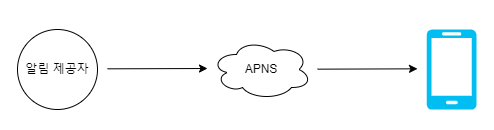
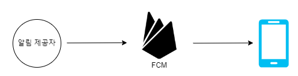
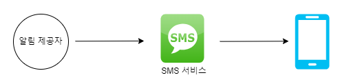
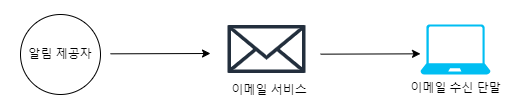
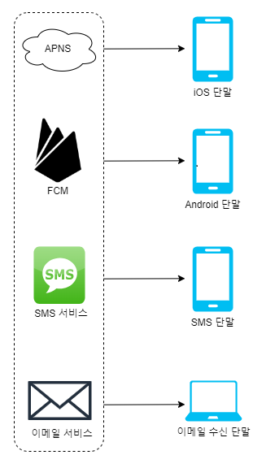
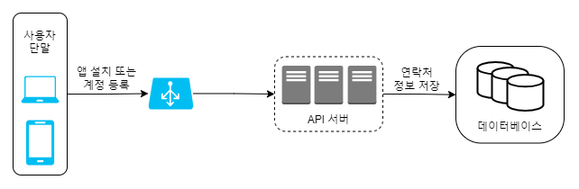
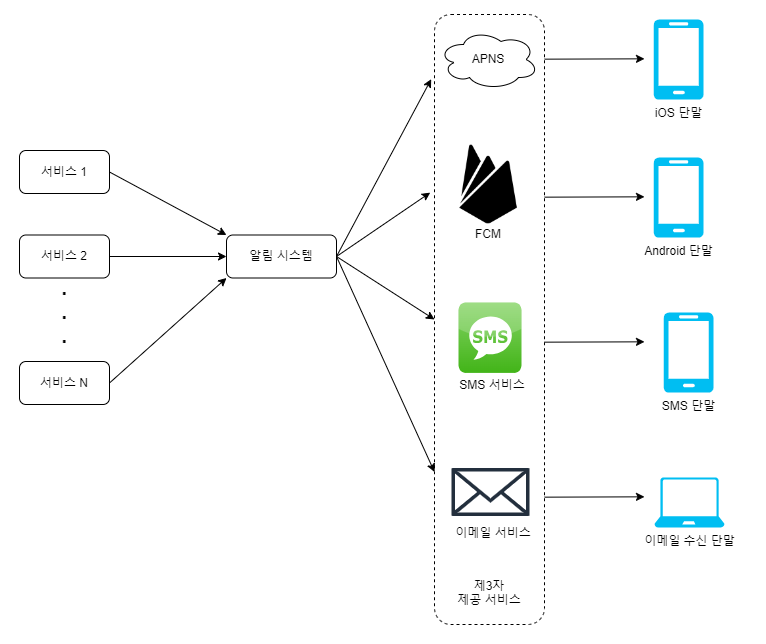
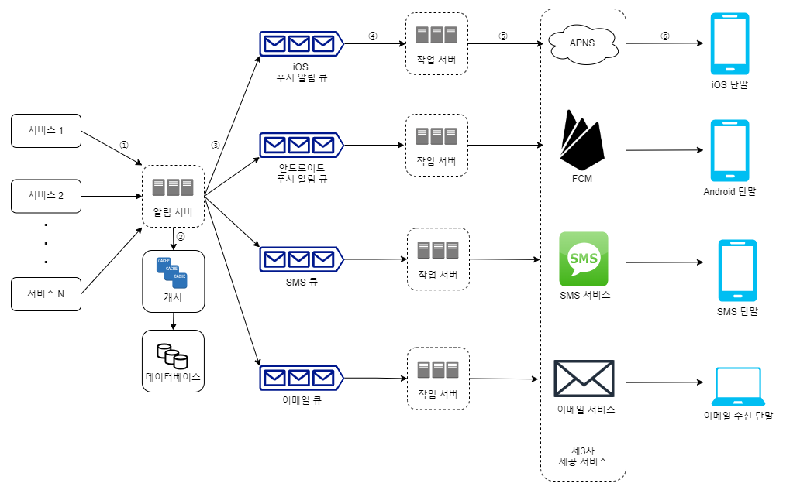
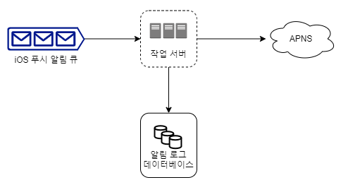
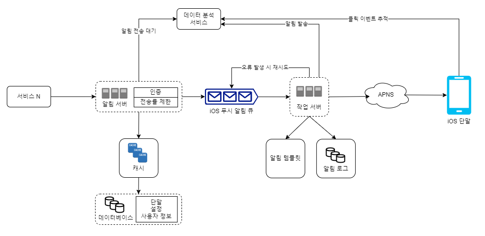

# 10장 알림 시스템 설계

알림 시스템(notification system)
- 고객에게 중요할 만한 정보를 비동기적으로 제공
  - e.g. 최신 뉴스, 제품 업데이트, 이벤트, 선물 등
- 분류
  - 모바일 푸시 알림
  - SMS 메시지
  - 이메일

## 1단계: 문제 이해 및 설계 범위 확정
- 푸시 알림, SMS 메시지, 이메일 지원
- 연성 실시간(soft real-time) 시스템
  - 알림은 가능한 빨리 전달
  - 시스템에 높은 부하가 걸렸을 때 약간의 지연은 무방
- iOS, 안드로이드(android), 랩톱/데스크톱 지원
- 알림은 클라이언트 애플리케이션이 만들거나 서버 측에서 스케쥴링할 수 있음
- 사용자가 알림을 받지 않도록(opt-out) 설정 가능
- 천만 건의 모바일 푸시 알림, 백만 건의 SMS 메시지, 5백만 건의 이메일 보낼 수 있어야 함

## 2단계: 개략적 설계안 제시 및 동의 구하기
- 알림 유형별 지원 방안
- 연락처 정보 수집 절차
- 알림 전송 및 수신 절차

### 알림 유형별 지원 방안
### iOS 푸시 알림

- 알림 제공자(provider)
  - 알림 요청(notification request)을 만들어 애플 푸시 알림 서비스(APNS: Apple Push Notification Service)로 보내는 주체
    - 필요한 데이터
      - 단말 토큰(device token)
        - 알림 요청을 보내는 데 필요한 고유 식별자
      - 페이로드(payload)
        - 알림 내용을 담은 JSON 딕셔너리(dictionary)
        ```json
        {
            "aps": {
                        "alert": {
                            "title": "Game Request",
                            "body": "Bob wants to play chess",
                            "action-loc-key": "PLAY"
                        },
                        "badge": 5
                  }
        }
        ```
- APNS
  - 애플이 제공하는 원격 서비스
  - 푸시 알림을 iOS 장치로 보내는 역할 담당
- iOS 단말(iOS device)
  - 푸시 알림을 수신하는 사용자 단말

### 안드로이드 푸시 알림

- iOS 푸시 알림과 비슷한 절차로 전송됨
- APNS 대신 FCM(Firebase Cloud Messaging)을 사용한다는 점만 다름

### SMS 메시지

- 트윌리오(Twilio), 넥스모(Nexmo) 같은 제3사업자의 서비스 많이 이용함

### 이메일

- 대부분 상용 이메일 서비스 이용
- e.g. 센드그리드(Sendgrid), 메일침프(Mailchimp)
  - 전송 성공률도 높고, 데이터 분석 서비스(analytics)도 제공

#### 알림 유형


### 연락처 정보 수집 절차

- 알림을 보내려면 모바일 단말 토큰, 전화번호, 이메일 주소 등의 정보가 필요함
- 사용자가 우리 앱을 설치하거나 처음으로 계정을 등록하면, API 서버는 해당 사용자의 정보를 수집하여 DB에 저장
  
  - 한 사용자가 여러 단말을 가질 수 있고, 알림은 모든 단말에 전송되어야 함

### 알림 전송 및 수신 절차
#### 개략적 설계안 (초안)

- 1부터 N까지의 서비스
  - 마이크로서비스(microservice), 크론잡(cronjob), 분산 시스템 컴포넌트일 수도 있음
  - e.g. 사용자에게 납기일을 알리는 과금 서비스(billing service), 배송 알림을 보내려는 쇼핑몰 웹사이트
- 알림 시스템(notification system)
  - 알림 전송/수신 처리의 핵심
  - 1개 서버만 사용하는 시스템이라고 가정
    - 서비스 1~N에 알림 전송을 위한 API를 제공해야 하고, 제3자 서비스에 전달할 알림 페이로드(payload)를 만들어 낼 수 있어야 함
- 제3자 서비스(third party services)
  - 사용자에게 알림을 실제로 전달하는 역할
  - 확장성(extensibility)에 유의
    - 쉽게 새로운 서비스를 통합하거나 기존 서비스를 제거할 수 있어야 함
  - 어떤 서비스는 다른 시장에서 사용할 수 없을 수도 있음
    - e.g. FCM은 중국에서 사용 불가. 제이푸시(Jpush), 푸시와이(pushY) 같은 서비스 사용
- iOS, 안드로이드, SMS, 이메일 단말
  - 사용자는 자기 단말에서 알림을 수신함

문제점
- SPOF(Single-Point-Of-Failure)
  - 알림 서비스에 서버가 하나밖에 없어, 서버에 장애가 생기면 전체 서비스의 장애로 이어짐
- 규모 확장성
  - 한 대 서비스로 푸시 알림에 관계된 모든 것을 처리
    - 데이터베이스나 캐시 등 중요 컴포넌트의 규모를 개별적으로 늘릴 방법이 없음
- 성능 병목
  - 알림을 처리하고 보내는 것은 자원을 많이 필요로 하는 작업일 수 있음
    - e.g. HTML 페이지를 만들고 제3자 서비스의 응답을 기다리는 일은 시간이 많이 걸릴 가능성이 있음
  - 모든 것을 한 서버로 처리하면 사용자 트래픽이 많이 몰리는 시간에는 시스템이 과부화 상태에 빠질 수 있음

#### 개략적 설계안 (개선된 버전)

> 1. API를 호출하여 알림 서버로 알림을 보냄
> 2. 알림 서버는 사용자 정보, 단말 토큰, 알림 설정 같은 메타데이터(metadata)를 캐시나 데이터베이스에서 가져옴
> 3. 알림 서버는 전송할 알림에 맞는 이벤트를 만들어서 해당 이벤트를 큐에 넣음
>   - iOS 푸시 이벤트는 iOS 푸시 알림 큐에 넣어야 함
> 4. 작업 서버는 메시지 큐에서 알림 이벤트를 꺼냄
> 5. 작업 서버는 알림을 제3자 서비스로 보냄
> 6. 제3자 서비스는 사용자 단말로 알림을 전송함

- 1부터 N까지의 서비스
  - 알림 시스템 서버의 API를 통해 알림을 보낼 서비스들
- 알림 서버(notification server)
  - 알림 전송 API
    - 스팸 방지를 위해 보통 사내 서비스 또는 인증된 클라이언트만 이용 가능
    > POST https://api.example.com/v/sms/send
    ```json
    {
      "to": [
        {
          "user_id": 123456
        }
      ],
      "from": {
        "email": "from_address@example.com"
      },
      "subject": "Hello, World!",
      "content": [
        {
          "type": "text/plain",
          "value": "Hello, World!"
        } 
      ]
    }
    ```
  - 알림 검증(validation)
    - 이메일 주소, 전화번호 등에 대한 기본적 검증 수행
  - 데이터베이스 또는 캐시 질의
    - 알림에 포함시킬 데이터를 가져오는 기능
  - 알림 전송
    - 알림 데이터를 메시지 큐에 넣음
    - 본 설계안에선 하나 이상의 메시지 큐를 사용하므로 알림을 병렬적으로 처리할 수 있음
- 캐시(cache)
  - 사용자 정보, 단말 정보, 알림 템플릿(template) 등을 캐시
- 데이터베이스(DB)
  - 사용자, 알림, 설정 등 다양한 정보 저장
- 메시지 큐(message queue)
  - 시스템 컴포넌트 간 의존성을 제거하기 위해 사용
  - 다량의 알림이 전송되어야 하는 경우를 대비한 버퍼 역할도 함
  - 본 설계안에서는 알림의 종류별로 별도 메시지 큐 사용
    - 제3자 서비스 가운데 하나에 장애가 발생해도 다른 종류의 알림은 정상 동작
- 작업 서버(workers)
  - 메시지 큐에서 전송할 알림을 꺼내서 제3자 서비스로 전달하는 역할을 담당하는 서버
- 제3자 서비스(third-party service)
- iOS, 안드로이드, SMS, 이메일 단말

## 3단계: 상세 설계
- 안정성(reliability)
- 추가로 필요한 컴포넌트 및 고려사항
  - 알림 템플릿
  - 알림 설정
  - 전송률 제한(rate limiting)
  - 재시도 메커니즘(retry mechanism)
  - 보안(security)
  - 큐에 보관된 알림에 대한 모니터링과 이벤트 추적 등
- 개선된 설계안

### 안정성
#### 데이터 손실 방지
- 어떤 상황에서도 알림이 소실되면 안 됨

- 알림 데이터를 데이터베이스에 보관하고 재시도 메커니즘을 구현
  - 알림 로그(notification log) 데이터베이스를 유지하는 것도 방법 중 하나

#### 알림 중복 전송 방지
- 같은 알림이 여러 번 반복되는 것을 완전히 막는 것은 불가능 <br>
-> 중복 탐지 메커니즘 도입
> - 보내야 할 알림이 도착하면, 그 이벤트 ID를 검사하여 이전에 본 적이 있는 이벤트인지 살핌.
> - 중복된 이벤트라면 버리고, 그렇지 않으면 알림을 발송함
 
### 추가로 필요한 컴포넌트 및 고려사항
#### 알림 템플릿
- 알림 대부분은 형식이 비슷함 <br>
-> 알림 템플릿 사용
  - 사전에 지정된 형식에 맞춰 알람을 만들어내는 틀
  - 인자(parameter)나 스타일, 추적 링크(tracking link) 조정하기만 하면 됨
```text
본문:
여러분이 꿈꿔온 그 상품을 우리가 준비했습니다. [item_name]이 다시 입고 되었습니다! [date]까지만 주문 가능합니다!

타이틀(CTA: Call to Action):
지금 [item_name]을 주문 또는 예약하세요!
```
- 전송될 알림들의 형식을 일관성 있게 유지 가능
- 오류 가능성뿐 아니라 알림 작성에 드는 시간도 줄일 수 있음

#### 알림 설정
```text
user_id     bigint
channel     varchar     # 알림이 전송될 채널. 푸시알림, 이메일, SMS 등
opt_in      boolean     # 해당 채널로 알림을 받을 것인지의 여부
```
- 사용자가 알림 설정 상세히 조정 가능
- 특정 종류의 알림을 보내기 전에, 사용자가 해당 알림을 켜 두었는지 반드시 확인해야 함

#### 전송률 제한
- 사용자가 받을 수 있는 알림의 빈도 제한
- 알림을 너무 많이 보내기 시작하면, 사용자가 알림 기능을 아예 꺼버릴 수도 있기 때문

#### 재시도 방법
- 제3자 서비스가 알림 전송에 실패하면, 해당 알림을 재시도 전용 큐에 넣음
- 같은 문제가 계속해서 발생하면 개발자에게 통지(alert)

#### 푸시 알림과 보안
- iOS와 안드로이드 앱
  - 알림 전송 API는 appKey와 appSecret을 사용하여 보안 유지
  - 인증된(authenticated), 혹은 승인된(verified) 클라이언트만 해당 API를 사용하여 알림 보낼 수 있음

#### 큐 모니터링
- 큐에 쌓인 알림의 개수
  - 알림 시스템을 모니터링 할 때 중요한 메트릭(metric) 중 하나
  - 수가 너무 크면 작업 서버들이 이벤트를 빠르게 처리하고 있지 못하다는 뜻 <br>
  -> 작업 서버를 증설하는 게 바람직함

#### 이벤트 추적
- 알림 확인율, 클릭율, 실제 앱 사용으로 이어지는 비율 같은 매트릭은 사용자를 이해하는데 중요
- 데이터 분석 서비스(analytics)는 보통 이벤트 추적 기능도 제공 <br>
-> 알림 시스템을 만들면, 데이터 분석 서비스와도 통합해야 함

> 데이터 분석 서비스를 통해 추적하게 될 알림 시스템 이벤트의 사례


### 수정된 설계안

- 알림 서버에 인증(authentication)과 전송률 제한(rate-limiting) 기능 추가
- 전송 실패에 대응하기 위한 재시도 기능 추가
  - 전송에 실패한 알림은 다시 큐에 넣고 지정된 횟수만큼 재시도
- 전송 템플릿을 사용
  - 알림 생성 과정을 단순화하고 알림 내용의 일관성 유지
- 모니터링과 추적 시스템 추가
  - 시스템 상태를 확인하고 추후 시스템을 개선하기 쉽도록 함

## 4단계: 마무리
알림의 예시
- 넷플릭스 신작 영화 출시 정보
- 신규 상품에 대한 할인 쿠폰 이메일
- 온라인 쇼핑 결제 확정 메시지

알림 시스템
- 푸시 알림, SMS 메시지, 이메일 등 다양한 정보 전달 방식을 지원
- 규모 확장이 쉬움
- 메시지 큐 적극적 사용
  - 시스템 컴포넌트 사이의 결합도를 낮춤

각 컴포넌트의 구현 방법과 최적화 기법
- 안정성(reliability)
  - 메시지 전송 실패율을 낮추기 위해 안정적인 재시도 메커니즘 도입
- 보안(security)
  - 인증된 클라이언트만이 알림을 보낼 수 있도록 appKey, appSecret 등의 메커니즘 이용
- 이벤트 추적 및 모니터링
  - 알림이 만들어진 후 성공적으로 전송되기까지의 과정을 추적
  - 시스템 상태를 모니터링하기 위해 알림 전송은 각 단게마다 이벤트를 추적하고 모니터링할 수 있는 시스템 통합
- 사용자 설정
  - 사용자가 알림 수신 설정을 조정할 수 있도록 함
  - 알림을 보내기 전 반드시 해당 설정을 확인하도록 시스템 설계 변경하였음
- 전송률 제한
  - 사용자에게 알림을 보내는 빈도(frequency)를 제한할 수 있도록 함