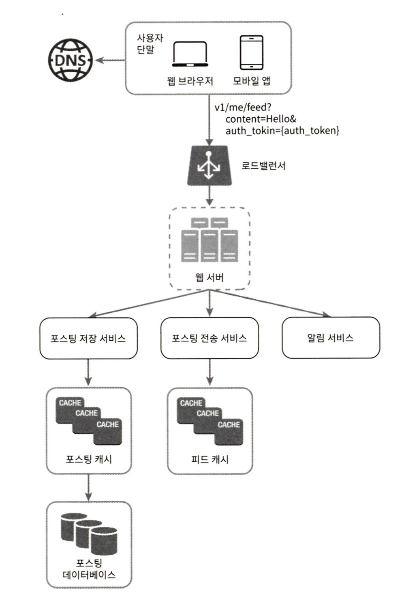
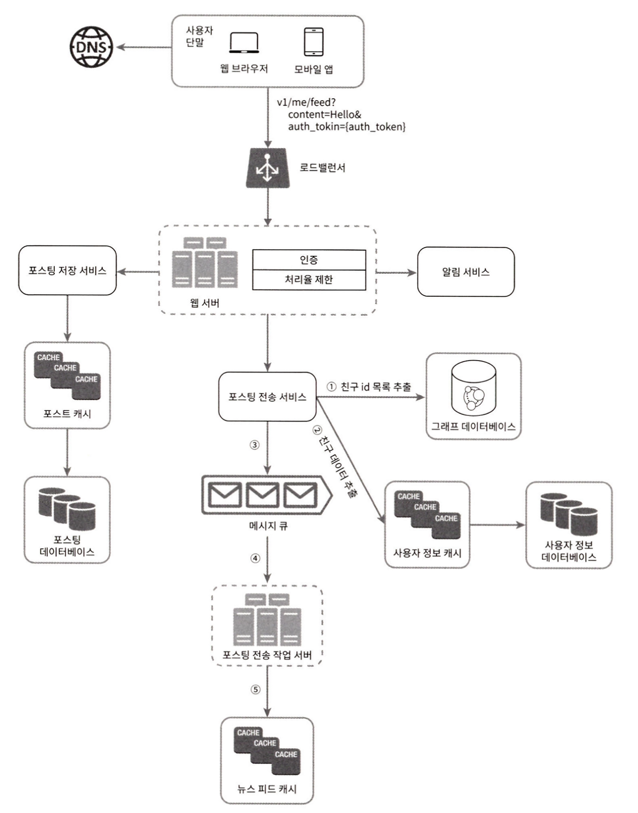

# 뉴스 피드 시스템 설계

## 뉴스 피드란?
- 사용자의 상태 정보 업데이트, 사진, 비디오, 링크 ,앱 활동
- 팔로우 하는 사람들, 페이지, 좋아요
- 페이스북 뉴스 피드 설계, 인스타그램 피드 설계, 트위터 타임라인 설계

## 1단계) 문제 이해 및 설계 범위 확정
- 요구 사항
  - 사용자는 뉴스 피드 페이지에 새로운 스토리를 올릴 수고, 친구들이 올린 스토리를 볼 수 있어야 함. 
  - 시간 흐름 역순으로 스토리가 표시되어야 함. 
  - 한 명의 사용자는 최대 5000명의 팔로워를 가질 수 있음. 
  - 하루에 천만명이 방문 가능
  - 피드에는 이미지나 비디오 등의 미디어 파일이 포함될 수 있음

## 2단계) 개락적 설계안 제시 및 동의 구하기
- 피드 발행과 뉴스 피드 생성으로 나누기
  - 피드 발행: 사용자가 스토리를 포스팅하면 해당 데이터를 캐시와 데이터베이스에 기록함. 새 포스팅은 친구의 뉴스 피드에도 전송됨
  - 뉴스 피드 생성: 모든 친구가 포스팅을 시간 흐름의 역순으로 모아서 만듦

- 뉴스 피드 API
  - 피드 발행 api
  - 피드 읽기 api
  - 피드 발행 api
    - POST /v1/me/feed
    - body: 포스팅 내용
      Authorization header: API 호출 인증 값
    - 
    1. 사용지는 피드 발생 API를 사용하여 새로운 포스팅을 올림
    2. 로드 밸랜서가 트래픽을 웹 서버들로 분산함
    3. 웹서버는 HTTP 요청을 내부 서비스로 중계함
    4. 포스팅 저장 서비스는 새 포스팅을 데이터베이스와 캐시에 저장
    5. 포스팅 전송 서비스는 새 포스팅을 친구의 뉴스 피드에 푸시함. 캐시에 보관하여 빠르게 읽을 수 있도록함
    6. 알림 서비스는 친구들에게 새 포스팅에 대한 알림을 보냄

- 피드 읽기 API
  - GET /v1/me/feed 
  - Authorization header: API 호출 인증 값
  - 
  1. 사용자는 피드 읽기 API를 호출함
  2. 로드밸런서는 트래픽을 웹 서버들로 분삼함
  3. 웹서버는 트래픽을 뉴스 피드 서비스로 보냄
  4. 뉴스 피드 서비스는 캐시에서 뉴스 피드를 가져옴
  5. 뉴스 피드 캐시는 뉴스 피드를 렌더링할 때 필요한 피드 ID를 보관함

## 3단계) 상세 설계

### 웹 서버의 역할
- 클라이언트와 통신
- 인증이나 처리율 제한 기능

### 포스팅 전송(팬아웃) 서비스
- 어떤 사용자의 새 포스팅을 그 사용자와 친구 관계에 있는 모든 사용자에게 전달하는 과정
- 두 가지 모델이 있는데 하나는 쓰기 시점에 포스팅을 전송하는 모델(push 모델)이고, 다른 하나는 읽기 시점에 포스팅 전송하는 모델(pull 모델)

### 쓰기 시점에 포스팅 전송하는 Push 모델
- 새로운 포스팅을 기록하는 시점에 뉴스피드를 갱신
장점
- 뉴스피드가 실시간으로 갱신되며 친구 목록에 있는 사용자들에게 즉시 전송됨
- 포스팅이 쓰이는 시점에 전송되므로 뉴스 피드를 읽는 데 드는 시간은 짧아짐
단점
- 친구가 많은 사용자의 경우 뉴스 피드 갱신에 많은 시간이 소요될 수 있음(핫키 이슈)
- 사용자의 친구 목록에 있는 사용자의 피드를 모두 갱신하므로 서비스를 자주 이용하지 않는 사용자의 피드까지 갱신됨. -> 컴퓨터 자원 낭비

### 읽기 시점에 포스팅 전송하는 Push 모델
- 피드를 읽어야 하는 시점에 뉴스 피드를 갱신함
장점
- 로그인하지 않은(비활성화된 사용자) 또는 서비스를 자주 이용하지 않는 사용자에서 피드가 갱신되지 않으므로 컴퓨팅 자원을 아낄 ㅜㅅ 있음
- 데이터 친구목록의 사용자 모두에게 푸시하는 작업이 필요없으므로 핫키 문제도 발생하지 않음
단점
- 뉴스 피드를 읽는데 많은 시간이 소요

### 두가지 모델 결함
- 뉴스 피드를 가져오는 작업에는 대부분 사용자에게 Push모델을 적용하고 핫키가 발행할 수 있는 유명인의 경우 pull모델을 적용해 시스템 부하를 방지함
- 안정 해시를 통해 요청과 데이터를 보다 고르게 분산시켜 핫키 이슈 자체를 줄이는 방법

1. 그래프 데이베이스에서 친구 ID목록을 가져옴
2. 사용자 정보 캐시에서 친구들의 정보를 가져와 사용자 설정에 따라 업데이트 유무 결정
3. 친구 목록과 새 스토리 포스팅 ID를 메세지 큐에 넣음
4. 팬아웃 작업 서버가 메세지 큐에서 데이터를 꺼내어 뉴스 피드 데이터를 뉴스 피드 캐시에 넣음
메모리 요구량을 고려하여
- 사용자 정보와 포스팅 정보를 전부 이 테이블에 저장하는 대신 포스트와 사용자의 ID만 보관함
- 캐시 크기에 제한을 둠

### 피드 읽기 흐름 상세 설계

1. 사용자는 피드 읽기 API를 호출함
2. 로드 밸랜서는 트래픽을 웹서버들로 분산함
3. 웹서버는 트래픽을 뉴스 피드 서비스로 보냄
4. 뉴스 피드 서비스는 캐시에서 포스팅ID목록을 가져옴
5. 뉴스 피드에 표시할 사용자 이름, 사진, 콘텐츠 등을 캐시에서 가져옴
6. 생성된 뉴스 피드를 JSOM형태로 클라이언트에거 보내고 클라이언트는 해당 피드를 랜더링

### 캐시 구조

#### 캐시는 뉴스 피드의 핵심 컴포넌트
- 뉴스 피드
  - 뉴스피드의 ID를 보관.
- 콘텐츠
  - 포스팅 데이터를 보관하고 인기 콘텐츠는 따로 보관함
- 소셜 그래프
  - 사용자 간 관계 정보를 보관함. (팔로워, 팔로잉)
- 행동
  - ‘좋아요’나 댓글 같은 사용자 행위에 관한 정보를 보관함.
- 횟수 
  - ‘좋아요’ 횟수, 응답 수, 팔로워 수, 팔로잉 수 등의 정보를 보관함.

## 4단계) 마무리

- 논의하면 좋을 만한 주제
  - 데이터베이스 규모 확장 
    - 수직적 규모 확장 vs 수평적 규모 확장 
    - SQL vs NoSQL 
    - 주-부 데이터베이스 다중화 
    - 복제본에 대한 읽기 연산 
    - 일관성 모델 
    - 데이터베이스 샤딩
- 이 외 주제
  - 웹 계층을 무상태로 운영하기
  - 가능한 한 많은 데이터를 캐시할 방법
  - 여러 데이터 센터를 지원할 방법
  - 메시지 큐를 사용하여 컴포넌트 :wq사이의 결합도 낮추기
  - 핵심 메트릭에 대한 모니터링.
  - 트래픽이 몰리는 시간대의 QPS, 사용자 피드를 새로고침할 때의 지연시간
