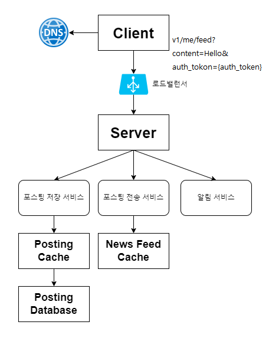
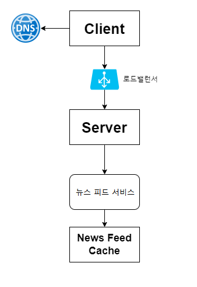
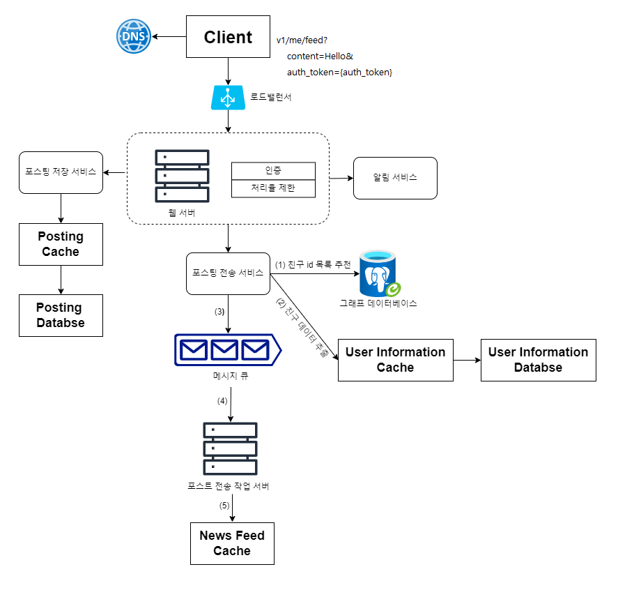
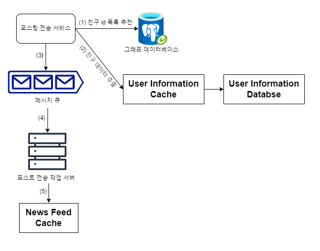
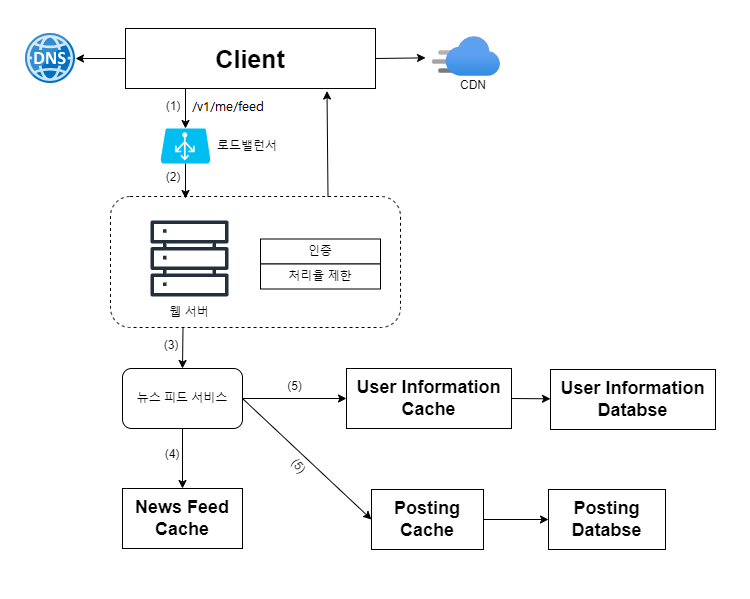

# 11장 뉴스 피드 시스템 설계
뉴스 피드(news feed)
- e.g. 페이스북 도움말 페이지
  - 홈 페이지 중앙에 지속적으로 업데이트되는 스토리
  - 사용자 상태 정보 업데이트, 사진, 비디오, 링크, 앱 활동(app activity), 팔로잉, 페이지, 좋아요 등을 포함함

## 1단계: 문제 이해 및 설계 범위 확정
- 모바일 앱, 웹 둘 다 지원
- 사용자는 뉴스 피드 페이지에 새로운 스토리를 올릴 수 있어야 하고, 친구들이 올리는 스토리를 볼 수도 있어야 함
- 시간 흐름 역순(reverse chronological order)으로 스토리 표시됨
- 한 명의 사용자는 최대 5,000명의 친구 가질 수 있음
- 매일 천만명이 방문한다고 가정(10million DAU)
- 스토리에는 이미지나 비디오 등의 미디어 파일이 포함될 수 있음

## 2단계: 개략적 설계안 제시 및 동의 구하기
- 피드 발행(feed publishing)
  - 사용자가 스토리를 포스팅하면 해당 데이터를 캐시와 데이터베이스에 기록
  - 새 포스팅은 친구의 뉴스 피드에도 전송됨
- 뉴스 피드 생성(news feed building)
  - 뉴스 피드는 모든 친구의 포스팅을 시간 흐름 역순으로 모아서 만든다고 가정

### 뉴스 피드 API
- 클라이언트가 서버와 통신하기 위해 사용하는 수단
- HTTP 프로토콜 기반

#### 피드 발행 API
- 새 스토리를 포스팅하기 위한 API
> POST /v1/me/feed

인자
- 바디(body): 포스팅 내용에 해당
- Authorization 헤더: API 호출을 인증하기 위해 사용

#### 피드 읽기 API
- 뉴스 피드를 가져오는 API
> GET v1/me/feed
 
인자
- Authorization 헤더: API 호출을 인증하기 위해 사용

### 피드 발행

- 사용자
  - 모바일 앱이나 브라우저에서 새 포스팅을 올리는 주체
  - POST /v1/me/feed API를 사용
- 로드밸런서(load balancer)
  - 트래픽을 웹 서버로 분산
- 웹 서버
  - HTTP 요청을 내부 서비스로 중계하는 역할 담당
- 포스팅 저장 서비스(post service)
  - 새 포스팅을 데이터베이스와 캐시에 저장
- 포스팅 전송 서비스(fanout service)
  - 새 포스팅을 친구의 뉴스 피드에 푸시(push)함
  - 뉴스 피드 데이터는 캐시에 보관하여 빠르게 읽어갈 수 있도록 함
- 알림 서비스(notification service)
  - 친구들에게 새 포스팅이 올라왔음을 알리거나, 푸시 알림을 보내는 역할 담당

### 뉴스 피드 생성

- 사용자
  - 뉴스 피드를 읽는 주체
  - GET /v1/me/feed API 이용
- 로드 밸런서
  - 트래픽을 웹 서버들로 분산
- 웹 서버
  - 트래픽을 뉴스 피드 서비스로 보냅
- 뉴스 피드 서비스(news feed service)
  - 캐시에서 뉴스 피드를 가져오는 서비스
- 뉴스 피드 캐시(news feed cache)
  - 뉴스 피드를 렌더링할 때 필요한 피드 ID 보관

## 3단계: 상세 설계
### 피드 발행 흐름 상세 설계

#### 웹 서버
- 클라이언트와 통신
- 인증 
  - 올바른 인증 토큰을 Authorization 헤더에 넣고 API를 호출하는 사용자만 포스팅할 수 있어야 함
- 처리율 제한
  - 특정 기간 동안 한 사용자가 올릴 수 있는 포스팅 수 제한 
    - 스팸을 막고 유해한 콘텐츠가 자주 올라오는 것을 방지하기 위해서

#### 포스팅 전송(팬아웃) 서비스
- 팬아웃(fanout): 어떤 사용자의 새 포스팅을 그 사용자와 친구 관계에 있는 모든 사용자에게 전달하는 과정
  - 쓰기 시점에 팬아웃
    - 새로운 포스팅을 기록하는 시점에 뉴스 피드 갱신
    - 포스팅이 완료되면 바로 해당 사용자의 캐시에 해당 포스팅 기록
    - 장점
      - 뉴스 피드가 실시간으로 갱신되며 친구 목록에 있는 사용자에게 즉시 전송됨
      - 새 포스팅이 기록되는 순간에 뉴스 피드가 이미 갱신되므로(pre-computed) 뉴스 피드를 읽는 데 드는 시간이 짧아짐
    - 단점
      - 친구가 많은 사용자의 경우, 친구 목록을 가져오고 그 목록에 있는 사용자 모두의 뉴스 피드를 갱신하는 데 많은 시간이 소요될 수 있음  
      -> 핫키(hotkey) 문제
      - 서비스를 자주 이용하지 않는 사용자의 피드까지 갱신해야하므로 컴퓨팅 자원이 낭비됨
  - 읽기 시점에 팬아웃
    - 피드를 읽어야 하는 시점에 뉴스 피드 갱신 
    - 요청 기반(on-demand) 모델
    - 사용자가 본인 홈페이지나 타임라인을 로딩하는 시점에 새로운 포스트를 가져오게 됨
    - 장점
      - 비활성화된 사용자, 서비스에 거의 로그인하지 않는 사용자의 경우에는 이 모델이 유리함
        - 로그인하기까지는 어떤 컴퓨팅 자원도 소모하지 않음
      - 데이터를 친구 각각에 푸시하는 작업이 필요 없으므로 핫키 문제도 생기지 않음
    - 단점
      - 뉴스 피드를 읽는 데 많은 시간이 소요될 수 있음

본 설계안
- 대부분의 사용자에 대해서는 푸시 모델 사용
- 친구나 팔로워가 아주 많은 사용자의 경우, 해당 사용자의 포스팅을 필요할 때 가져가도록 하는 풀 모델 사용
- 안정 해시 사용
  - 요청과 데이터를 보다 고르게 분산하여 핫키 문제를 줄임

**팬아웃 서비스**

1. 그래프 데이터베이스에서 친구 ID 목록을 가져옴
2. 사용자 정보 캐시에서 친구들의 정보를 가져온 후, 사용자 설정에 따라 친구 가운데 일부를 걸러냄
3. 친구 목록과 새 스토리의 포스팅 ID를 메시지 큐에 넣음
4. 팬아웃 작업 서버가 메시지 큐에서 데이터를 꺼내어 뉴스 피드 데이터를 뉴스 피드 캐시에 넣음
- 뉴스 피드 캐시

  | post_id | user_id |
  | --- | --- |
  | post_id | user_id |
  | post_id | user_id |
- <포스팅 ID, 사용자 ID>의 순서쌍을 보관하는 매핑 테이블
  - 새로운 포스팅이 만들어질 때마다 캐시에 레코드 추가
  - 캐시의 크기에 제한을 두고, 해당 값을 조정
    - id만을 저장해 메모리 크기를 적정 수준으로 유지
    - 대부분 사용자는 최신 스토리를 보기 때문에, 캐시 미스가 일어날 확률은 낮음
 
### 피드 읽기 흐름 상세 설계

1. 사용자가 뉴스 피드를 읽으려는 요청을 보냄 
2. 로드밸런서가 웹 서버 가운데 하나로 요청을 보냄
3. 웹 서버는 피드를 가져오기 위해 뉴스 피드 서비스를 호출
4. 뉴스 피드 서비스는 뉴스 피드 캐시에서 포스팅 ID 목록을 가져옴
5. 뉴스 피드에 표시할 사용자 이름, 사용자 사진, 포스팅 콘텐츠, 이미지 등을 사용자 캐시와 포스팅 캐시에서 가져와 완전한 뉴스 피드를 만듦
6. 생성된 뉴스 피드를 JSON 형태로 클라이언트에게 보냄. 클라이언트는 해당 피드를 렌더링

### 캐시 구조

- 뉴스 피드
  - 뉴스 피드의 ID 보관
- 콘텐츠
  - 포스팅 데이터 보관. 인기 콘텐츠는 따로 보관
- 소셜 그래프
  - 사용자 간 관계 정보 보관
- 행동(action)
  - 포스팅에 대한 사용자의 행위에 관한 정보 보관 
  - 포스팅에 대한 '좋아요', 답글 등등
- 횟수(counter)
  - '좋아요' 횟수, 응답 수, 팔로워 수, 팔로잉 수 등의 정보 보관

## 4단계: 마무리
데이터베이스 규모 확장
- 수직적 규모 확장 vs 수평적 규모 확장
- SQL vs NoSQL
- 주-부(master-slave) 다중화
- 복제본(replica)에 대한 읽기 연산
- 일관성 모델(consistency model)
- 데이터베이스 샤딩(sharding)

추가로 논의해보면 좋을 주제
- 웹 계층(web tier)을 무상태로 운영하기
- 가능한 한 많은 데이터를 캐시할 방법
- 여러 데이터 센터를 지원할 방법
- 메시지 큐를 사용하여 컴포넌트 사이의 결합도 낮추기
- 핵심 메트릭(key metric)에 대한 모니터링
  - 트래픽이 몰리는 시간대의 QPS(Queries for Second), 사용자가 뉴스 피드를 새로고침(refresh)할 때의 지연시간 등

