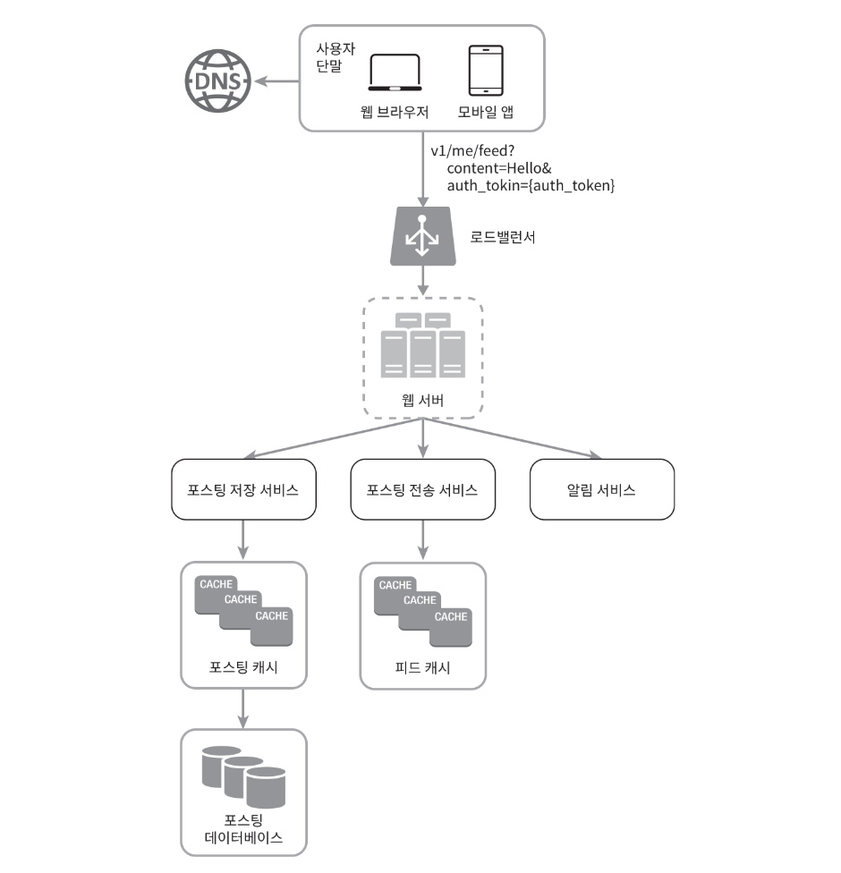
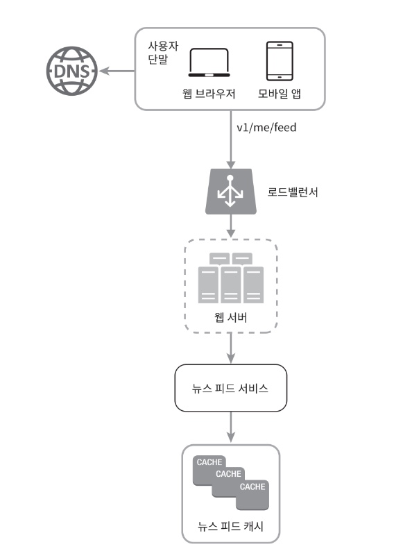
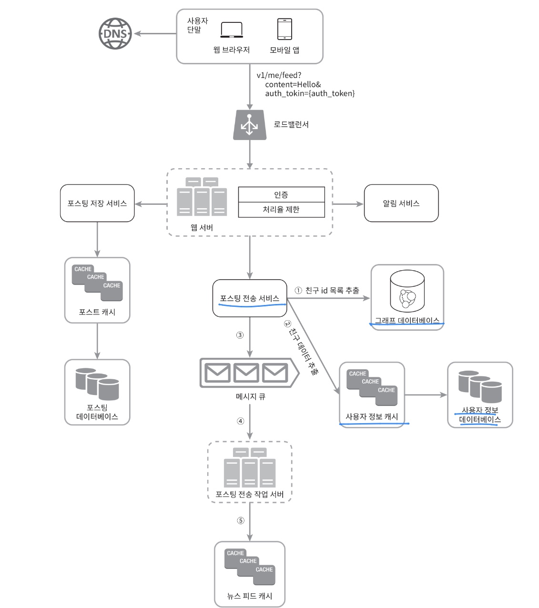
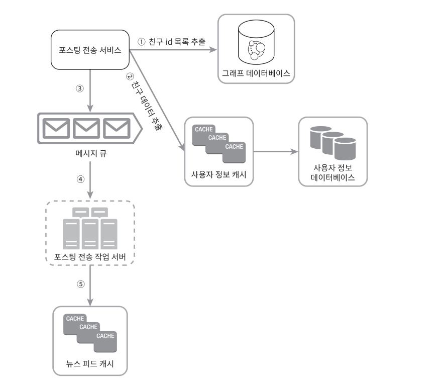
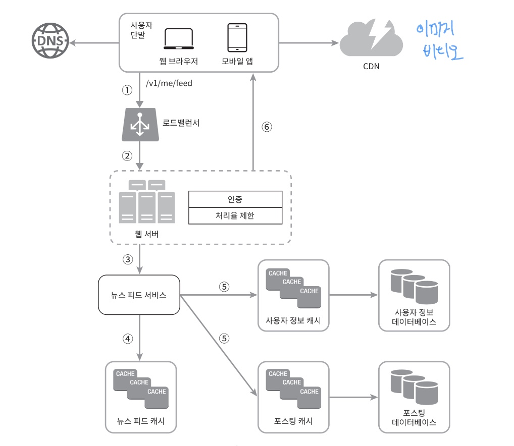
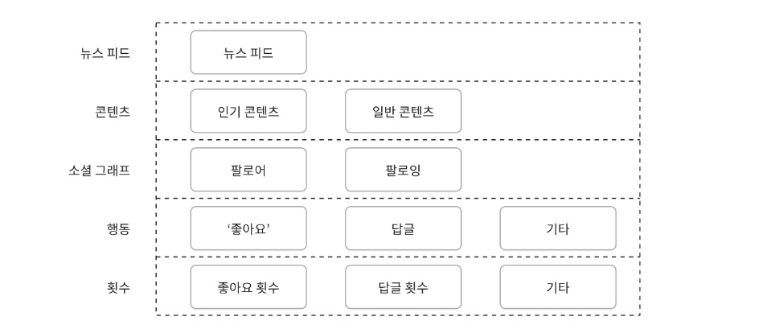

# 뉴스 피드 시스템 설계

뉴스피드
- 홈 페이지 중앙에 지속적으로 업데이트되는 스토리
- 사용자 상태 정보 업데이트
- 사진, 비디오, 링크, 앱 활동, 팔로하는 사람들, 페이지, 그룹으로 나오는 좋아요 등을 포함


# 1단계 : 질문을 통한 요구사항 파악, 문제 이해 및 설계 범위 확정

Q : 모바일 앱을 위한 시스템인가? 아니면 웹? 둘 다 지원 해야 하나?

A : 둘 다 지원 해야함. 

Q : 중요한 기능으로는 어떤 것이 있을까요?

A : 사용자는 뉴스 피드 페이지에 새로운 스토리를 올릴 수 있어야 하고, 친구들이 올리는 스토리를 볼 수도 있어야 함.

Q : 뉴스 피드에는 어떤 순서로 스토리가 표시되어야 하나? 최신 포스트가 위에 오도록 해야하는지? 아니면 토픽 점수같은 다른 기준이 있는지? 예를 들어 가까운 친구의 포스트는 좀 더 위에 배치되어야 한다든가...?

A : 그냥 단순히 시간 흐름 역순으로 표시된다고 가정

Q : 한 명의 사용자는 최대 몇 명의 친구를 가질 수 있는지?

A : 5000명

Q : 트래픽 규모는 어느 정도인지?

A : 매일 천만 명이 방문한다고 가정

Q : 피드에 이미지나 비디오 스토리도 올라올 수 있는지?
A : 스토리에는 이미지나 비디오 등의 미디어 파일이 포함될 수 있음


# 2단계 : 개략적 설계안 제시 및 동의 구하기

1. 피드 발행 
   - 가정
     - 사용자가 스토리를 포스팅하면 해당 데이터를 캐시와 데이터베이스에 기록. 
     - 새 포스팅은 친구의 뉴스피드에도 전송됨.

2. 뉴스 피드 생성
    - 가정
      - 지면 관계상 뉴스 피드는 모든 친구의 포스팅을 시간 흐름 역순으로 모아서 만듦.


### 뉴스 피드 API

- 클라이언트와 서버와 통신하기 위해 사용하는 수단
- HTTP 프로토콜 기반
- 상태 정보 업데이트, 뉴스 피드 가져오기, 친구를 추가하는 등의 다양한 작업을 수행하는 데 사용.


#### 피드 발행 API

- HTTP POST 형태로 요청 보내기

```
 POST/v1/me/feed
```

인자:
- 바디(body): 포스팅 내용에 해당
- Authorization 헤더 : API 호출을 인증하기 위해 사용함.


#### 피드 읽기 API

- 뉴스 피드를 가져오는 API

```
 GET/v1/me/feed
```
인자:
- Authorization 헤더 : API 호출을 인증하기 위해 사용함.

피드 발행



- 로드밸런서 : 트래픽을 웹서버들로 분상
- 웹서버: HTTP요청을 내부 서비스로 중계하는 역할 담당
- 포스팅 저장 서비스 : 새 포스팅을 데이터베이스와 캐시에 저장
- 포스팅 전송 서비스: 새 포스팅을 친구의 뉴스 피드에 푸시. 뉴스 피드 데이터는 캐시에 보관하여 빠르게 읽어갈 수 있도록 함.
- 알림 서비스 : 친구들에게 새 포스팅이 올라왔음을 알리거나, 푸시 알림을 보내는 역할 담당


뉴스 피드 생성



- 사용자 : 뉴스 피드를 읽는 주체 GET/v1/me/feed API 사용
- 로드 밸런서 : 트래픽을 웹 서버들로 분산
- 웹 서버: 트래픽을 뉴스 피드 서비스로 보냄
- 뉴스 피드 서비스 : 캐시에서 뉴스 피드를 가져오는 서비스임.
- 뉴스 피드 캐시 : 뉴스 피드를 렌더링할 때 필요한 피드 ID를 보관함.


# 3단계: 상세 설계


## 피드 발행 흐름의 상세 설계안



웹서버와 포스팅 전송 서비스에 초점


### 웹 서버

- 클라이언트와 통신
- 인증, 처리율 제한 수행
  - 올바른 인증 토큰을 Authorization 헤더에 넣고 API를 호출하는 사용자만 포스팅을 할 수 있어야 함.
  - 스팸을 막고 유해한 콘텐츠가 자주 올라오는 것을 방지하기 위해서 특정 기간 동안 한 사용자가 올릴 수 있는 포스팅의 수에 제한을 두어야 함.


### 포스팅 전송(팬아웃)서비스
  - 어떤 사용자의 새 포스팅을 그 사용자와 친구 관계에 있는 모든 사용자에게 전달하는 과정
  - 두가지 모델 존재
    1. 쓰기 시점에 팬아웃(푸시 모델)
    2. 읽기 시점에 팬아웃(풀 모델)


### 쓰기 시점에 팬아웃하는 모델

- 새로운 포스팅을 기록하는 시점에 뉴스 피드를 갱신
- 즉, 포스팅이 완료되면 바로 해당 사용자의 캐시에 해당 포스팅을 기록


장점:
    - 뉴스 피드가 실시간으로 갱신, 친구 목록에 있는 사용자에게 즉시 전송됨
    - 새 포스팅이 기록되는 순간에 뉴스 피드가 이미 갱신되므로 뉴스 피드를 읽는 데 드는 시간이 짧아짐.

단점:
    - 친구가 많은 사용자의 경우 친구 목록을 가져오고 그 목록에 있는 사용자 모두의 뉴스 피드를 갱신하는 데 많은 시간이 소요될 수 있음
    - 핫키(hotkey)라고 부르는 문제
    - 서비스를 자주 이용하지 않는 사용자의 피드까지 갱신해야 하므로 컴퓨팅 자원이 낭비됨


### 읽기 시점에 팬아웃하는 모델

- 피드를 읽어야 하는 시점에 뉴스 피드를 갱신
- 즉, 요청 기반 모델
- 사용자가 본인 홈페이지나 타임 라인을 로딩하는 시점에 새로운 포스트를 가져오게 됨.

장점:
    
-  비활성화된 사용자, 또는 서비스에 거의 로그인하지 않는 사용자의 경우에는 이 모델 유리
- 로그인하기까지는 어떤 컴퓨팅 자원도 소모하지 않기때문
- 데이터를 친구 각각에 푸시하는 작업이 필요 없으므로 핫키 문제도 생기지 않음

단점:
- 뉴스 피드를 읽는 데 많은 시간이 소요될 수 있음

<hr/>

본 설계안은 쓰기 시점의 팬아웃, 읽기 시점의 팬아웃 이 두 가지 방법을 결합하여 장점은 취하고 단점은 버리는 전략


- 뉴스 피드를 빠르게 가져올 수 있도록 하는 것은 중요하므로 -> push 모델

- 친구나 팔로어가 아주 많은 사용자의 경우에는 팔로어로 하여금 해당 사용자의 포스팅을 필요할 때 가져가도록 하는 풀 모델을 사용하여 시스템 과부화를 방지

- 안정 해시를 통해 요청과 데이터를 보다 고르게 분산하여 핫키 문제 줄여봄


팬아웃 서비스에 관한 부분만 따로 떼어냄




1. 그래프 데이터베이스에서 친구 ID 목록을 가져옴. 그래프 데이터베이스는 친구 관계나 친구 추천을 관리하기 적합


2. 사용자 정보 캐시에서 친구들의 정보를 가져온 다음 사용자 설정에 따라 친구 가운데 일부를 걸러냄.
  예) 친구 중 누군가의 피드를 무시하기로 설정했다면 친구 관계는 유지될지언정 해당 사용자의 새 스토리는 여러분의 뉴스 피드에 보이지 않아야 함.
    새로 포스팅된 스토리가 일부 사용자에게만 공유되도록 설정된 경우에도 비슷한 일이 벌어짐


3. 친구 목록과 새 스토리의 포스팅 ID를 메시지 큐에 넣음


4. 팬아웃 작업 서버가 메시지 큐에서 데이터를 커내어 뉴스 피드 데이터를 뉴스 피드 캐시에 넣음. 뉴스 피드 캐시는 <포스팅ID, 사용자ID>의 순서쌍을 보관하는 매핑 테이블이라고 볼 수 있음
   새로운 포스팅이 만들어질 때마다 캐시에 레코드가 추가될 것임.

   사용자 정보와 포스팅 정보 전부를 이 테이블에 저장하지 않는 이유는, 그렇게 하면 메모리 요구량이 지나치게 늘어날 수 있기 떄문
   따라서 ID만 보관함.
   또한 메모리 크기를 적정 수준으로 유지하기 위해서, 이 캐시의 크기에 제한을 두며, 해당 값은 조정이 가능하도록 함.
    
    어떤 사용자가 뉴스 피드에 올라온 수천 개의 스토리를 전부 훑어보는 일이 벌어질 확률은 지극히 낮음.
   대부분의 사용자가 보려 하는 것은 최신 스토리임.
   따라서 캐시 미스가 일어날 확률은 낮음.


## 피드 읽기 흐름 상세 설계



이미지나 비디오와 같은 미디어 콘텐츠는 CDN에 저장하여 빨리 읽어갈 수 있도록 함.

클라이언트가 뉴스 피드를 어떻게 읽어가나?

1. 사용자가 뉴스 피드를 읽으려는 요청을 보냄. /v1/me/feed로 전송될 것.
2. 로드밸런서가 요청을 웹 서버 가운데 하나로 보냄.
3. 웹 서버는 피드를 가져오기 위해 뉴스 피드 서비스를 호출함.
4. 뉴스 피드 서비스는 뉴스 피드 캐시에서 포스팅 ID 목록을 가져옴.
5. 뉴스 피드에 표시할 사용자 이름, 사용자 사진, 포스팅 콘텐츠, 이미지 등을 사용자 캐시와 포스팅 캐시에서 가져와 완전한 뉴스 피드를 만듦.
6. 생성된 뉴스 피드를 JSON 형테로 클라이언트에게 보냄. 클라이언트는 해당 피드를 렌더링함.


### 캐시 구조

캐시는 뉴스 피드 시스템의 핵심 컴포넌트임.
본 설계안은 캐시를 다섯 계층으로 나눔.



- 뉴스 피드 : 뉴스 피드의 ID를 보관
- 콘텐츠: 포스팅 데이터를 보관. 인기 콘텐츠는 따로 보관
- 소셜 그래프 : 사용자 간 관계 정보를 보관
- 행동 : 포스팅에 대한 사용자의 행위에 관한 정보를 보관, 포스팅에 대한 좋아요 답글 등등 해당
- 횟수 : 좋아요 횟수 , 응답 수 , 팔로어 수 , 팔로잉 수 등의 정보를 보관

# 4단계 : 마무리

- 정답은 없음
- 회사마다 독특한 제약이나 요구조건이 있기 때문에, 시스템을 설계할 때는 그런 점을 고려

- 설계를 진행하고 기술을 선택할 때는 그 배경에 어떤 타협적 결정들이 있었는지 잘 이해하고 설명할 수 있어야 함.


#### 추가로 다루면 좋을 만한 주제

데이터베이스 규모 확장
- 수직적 규모 확장 vs 수평적 규모 확장
- SQL vs NoSQL
- 주 부 다중화
- 복제본에 대한 읽기 연산
- 일관성 모델
- 데이터베이스 샤딩

- 웹 계층을 무상태로 운영하기
- 가능한 한 많은 데이터를 캐시할 방법
- 여러 데이터 센터를 지원할 방법
- 메시지 큐를 사용하여 컴포넌트 사이의 결합도 낮추기
- 핵심 메트릭에 대한 모니터링, 예를 들어 트래픽이 몰리는 시간대의 QPS, 사용자가 뉴스 피드를 새로고침할 때의 지연시간 등이 이에 해당
