# 채팅 시스템 설계

1단계: 문제 이해 및 설계 범위 확정

설계 대상이 1:1 채팅 앱인지 아니면 그룹 채팅 앱인지 정도는 알아내야 함.

Q : 어떤 앱을 설계 해야하나? 1:1 채팅 앱인지? 그룹 채팅 앱인지?

A : 둘 다 지원 해야함.

Q : 모바일 앱인지? 웹앱인지?

A : 둘 다임.

Q : 처리해야 하는 트래픽 규모는 어느 정도인지?

A : 일병 능동 사용자 수(DAU: Daliy Active User) 기준으로 5천만명을 처리할 수 있어야 함.

Q : 그룹 채팅의 경우에 인원 제한이 있는지?

A : 최대 100명까지 참가 가능

Q : 주요 기능으로는 어떤 것이 있는지? 첨부파일도 지원할 수 있는지?

A : 1:1 채팅, 그룹 채팅, 사용자 접속상태 표시를 지원해야 함. 텍스트 메시지만 주고받을 수 있음.

Q : 메시지 길이에 제한이 있는지?

A : 100,000자 이하여야 함.

Q : 종단 간 암호화를 지원해야 하나?

A : 현재로서는 필요 없음. 시간이 허락하면 논의해볼 수 있음.

Q : 채팅 이력은 얼마나 오래 보관해야 하는지?

A : 영원히

이번 장에서 페이스북 메신저와 유사한 채팅 앱을 설계할 것임.

앱의 기능

- 응답지연이 낮은 일대일 채팅 기능
- 최대 100명까지 참여할 수 있는 그룹 채팅 기능
- 사용자의 접속상태 표시 기능
- 다양한 단말 지원, 하나의 계정으로 여러 단말에 동시 접속 지원
- 푸시 알림

그리고 위의 질의응답 사례에 나온 대로, 5천만 DAU를 처리할 수 있도록 할 것.

# 2단계 : 계략적 설계안 제시 및 동의 구하기

이 문제에 대해 훌륭한 답을 내기 위해서는 클라이언트와 서버의 통신 방법에 대한 기본적인 지식을 갖추고 있어야 함.

채팅 시스템의 경우 클라이언트는 모바일 앱이거나 웹 애플리케이션임.

클라이언트는 서로 직접 통신하지 않음.

대신, 각 클라이언트는 위의 나열한 모든 기능을 지원하는 채팅 서비스와 통신함.

채팅 서비스가 제공하는 기능

- 클라이언트들로부터 메시지 수신
- 메시지 수신자 결정 및 전달
- 수신자가 접속 상태가 아닌 경우에는 접속할 때까지 해당 메시지 보관

클라이언트와 채팅 서비스 사이의 관계

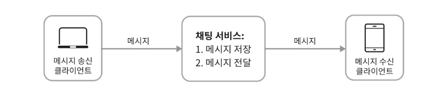

채팅을 시작하려는 클라이언트

- 네트워크 통신 프로토콜을 사용하여 서비스에 접속함
- 따라서 채팅 서비스의 경우 어떤 통신 프로토콜을 사용할 것인가도 중요한 문제임. 면접관과 상의하도록 하자

대부분의 클라이언트/서버 애플리케이션에서 요청을 보내는 것은 클라이언트인데, 채팅 시스템의 경우도 마찬가지임
메시지 송신 클라이언트가 이 역할을 함.

위의 그림에서 송신 클라이언트는 수신 클라이언트에게 전달할 메시지를 채팅 서비스에 보낼 때, 오랜 세원 검중된 HTTP 프로토콜을 사용함.

HTTP는 현재 웹에서 가장 널리 사용되는 프로토콜임.

클라이언트는 채팅서비스에 HTTP 프로토콜로 연결한 다음 메시지를 보내어 수신자에게 해당 메시지를 전달하라고 알림.

채팅 서비스와의 접속에는 keep-alive 헤더를 사용하면 효율적인데, 클라이언트와 서버 사이의 연결을 끊지 않고 계속 유지할 수 있어서임.

또한, TCP 접속 과정에서 발생하는 핸드셰이크 횟수를 줄일 수 있음.

HTTP는 메시지 전송 용도로 괜찮은 선택이며, 페이스북 같은 많은 대중적 채팅 프로그램이 초기에 HTTP를 사용함.

하지만 메시지 수신 시나리오는 이것보다 복잡
HTTP는 클라이언트가 연결을 만드는 프로토콜이며, 서버에서 클라이언트로 임의 시점에 메시지를 보내는 데는 쉽게 쓰일 수 없음

서버가 연결을 만드는 것처럼 동작할 수 있도록 하기 위해 많은 기법이 제안되어 왔음.

폴링(polling), 롱 폴링(long poll-ing), 웹소켓(WebSocket) 등이 그런 기술임.

### 폴링

폴링은 클라이언트가 주기적으로 서버에게 새 메시지가 있느냐고 물어보는 방법임.
폴링 비용은 폴링을 자주하면 할 수록 올라감.
답해줄 메시지가 없는 경우에는 서버 자원이 불필요하게 낭비된다는 문제도 있음

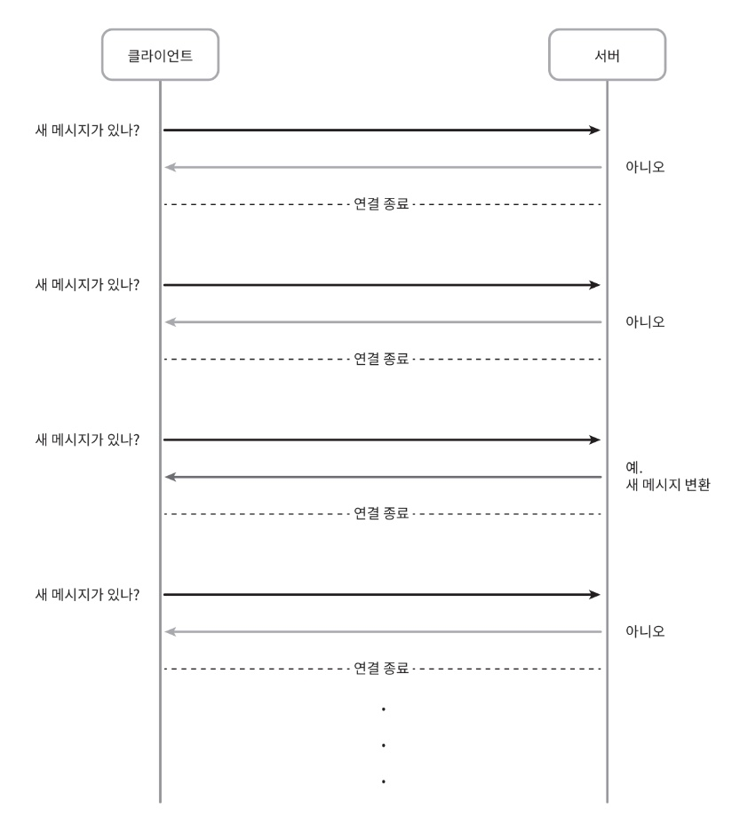

### 롱 폴링

폴링은 여러 가지로 비효율적일 수 있어서 나온 기법이 롱 폴링임.

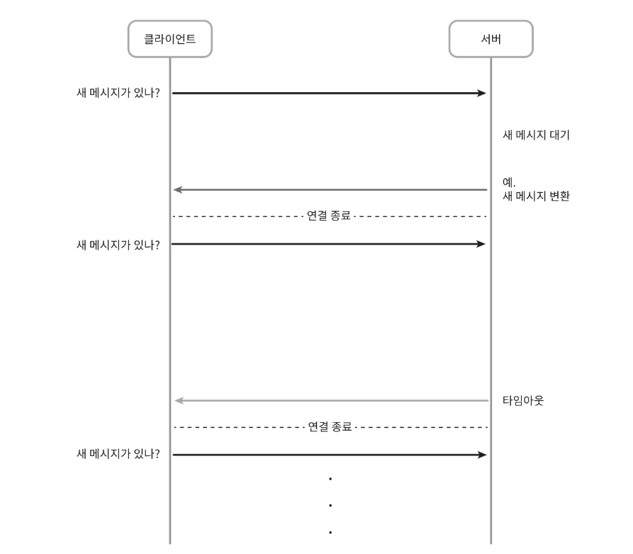

롱 폴링의 경우 클라이언트는 새 메시지가 반환된거나 타임아웃 될 때까지 연결을 유지함.

클라이언트는 새 메시지를 받으면 기존 연결을 종료하고 서버에 새로운 요청을 보내어 모든 절차를 다시 시작함.

- 메시지를 보내는 클라이언트와 수신하는 클라이언트가 같은 채팅 서버에 접속하게 되지 않을 수도 있음.
  HTTP서버들은 보통 무상태 서버임.
  로드밸런싱을 위해 라운드 로빈 알고리즘을 사용하는 경우, 메시지를 받은 서버는 해당 메시지를 수신할 클라이언트와의 롱 폴링 연결을 가지고 있지 않은 서버일 수 있는 것임.

- 서버 입장에서는 클라이언트가 연결을 해제했는지 아닌지 알 좋은 방법이 없음.
- 여전히 비효율적임.

- 메시지를 많이 받지않는 클라이언트도 타임아웃이 일어날 때마다 주기적으로 서버에 다시 접속할 것임.

### 웹소켓

웹소켓은 서버가 클라이언트에게 비동기(async) 메시지를 보낼 때 가장 널리 사용하는 기술임.

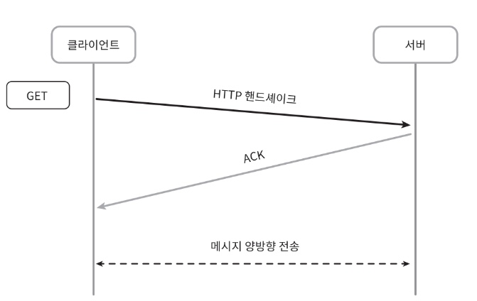

- 웹소켓 연결은 클라이언트가 시작
- 한번 맺어진 연결은 항구적이며 양방향임
- 이 연결은 처음에는 HTTP연결이지만 특정 핸드세이크 절차를 거쳐 웹소켓 연결로 업그레이드됨
- 일단 항구적인 연결이 만들어지고 나면 서버는 클라이언트에게 비동기적으로 메시지를 전송할 수 있음
- 웹 소켓은 일반적으로 방화벽이 있는 환경에서도 잘 동작함
- 80이나 443처럼 HTTP 혹은 HTTPS프로토콜이 사용하는 기본 포트번호를 그대로 쓰기 때문

웹소켓은 양방향 메시지 전송까지 가능하므로 HTTP보다 좋다고 할 수 있음

#### 웹소켓이 메시지 전송이나 수신에서 어떻게 쓰일 수 있는가?

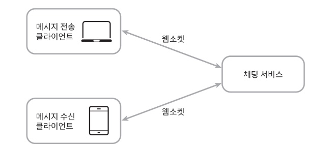

웹소켓을 이용하면 메시지를 보낼 때나 받을 때 동일한 프로토콜을 사용할 수 있으므로 설계뿐 아니라 구현도 단순하고 직관적임

유의할 것은 웹소켓 연결은 항구적으로 유지되어야 하기 때문에 서버 측에서 연결 관리를 효율적으로 해야한다는 것임

### 개략적 설계안

전체 시스템의 개략적 설계안

이번 장에서 다루는 채팅 시스템은 아래와 같이 세부분으로 나누어 볼 수 있음

- 무상태 서비스
- 상태유지 서비스
- 제 3자 서비스 연동

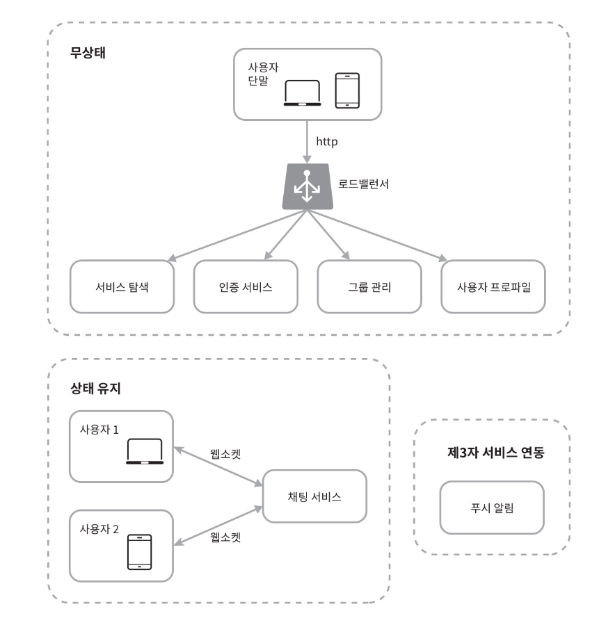

### 무상태 서비스

- 로그인, 회원가입, 사용자 프로파일 표시 등을 처리하는 전통적인 요청/응답 서비스
- 무상태 서비스는 로드밸런서 뒤에 위치함
- 로드밸런서가 하는 일
    - 요청을 그 경로에 맞는 서비스로 정확하게 전달하는 것
    - 로드밸런서 뒤에 오는 서비스는 모놀리틱 서비스일 수도 있고 마이크로서비스일 수도 있음
    - 이 서비스들 가운데 상당수가 시장에 완제품으로 나와 있어서 우리가 직접 구현하지 않아도 쉽게 사서 쓸 수 있음
    - 서비스 탐색 서비스
        - 클라이언트가 접속할 채팅 서버의 DNS 호스트명을 클라이언트에게 알려주는 역할을 함

### 상태 유지 서비스

- 본 설계안에서 유일하게 상태 유지가 필요한 서비스는 채팅 서비스임.
- 각 클라이언트가 채팅 서버와 독립적인 네트워크 연결을 유지해야하기 때문
- 클라이언트는 보통 서버가 살아있는 한 다른 서버로 연결을 변경하지 않음.
- 서비스 탐색 서비스는 채팅 서비스와 긴밀히 협력하여 특정 서버에 부하가 몰리지 않도록 함.

### 제 3자 서비스 연동

- 채팅 앱에서 가장 중요한 제 3자 서비스는 푸시 알림임

- 새 메시지를 받았다면 설사 앱이 실행 중이지 않더라도 알림을 받아야 함.

- 따라서 푸시알림 서비스와 통합은 아주 중요함

- 제 3장 알림시스템 설계를 참고

### 규모 확장성

트래픽 규모가 얼마 되지 않을 때는 방금 설명한 모든 기능을 서버 한 대로 구현할 수 있음

이때 따져봐야 할 것은 서버 한대로 얼마나 많은 접속을 동시에 허용할 수 있느냐임.

이번 장에서 다루는 시스템의 경우에는 동시 접속자가 1M이라고 가정할 것
접속당 10K의 서버 메모리가 필요하다고 본다면 10GB메모리만 있으면 모든 연결을 다 처리할 수 있을 것임.

하지만 모든 것을 서버 한 대에 담은 설계안을 내밀면 면접에서 좋은 점수를 따기는 어려울 것임.

SPOF(Sin-gle- Point-Of-Failure) 등 여러가지 이유 때문에 누구도 그 정도 규모의 트래픽을 서버 한 대로 처리하려 하지 않은 것이기 때문임.

하지만 서버만 한 대 갖는 설계안에서 출발하여 점차로 다듬어 나가는 것은 괜찮음

면접관에게 이것은 그저 시작일 뿐 이라는 것만 정확하게 전달해 놓으면 됨.

[위에서 설명한 것들을 합친 개략적인 설계안]
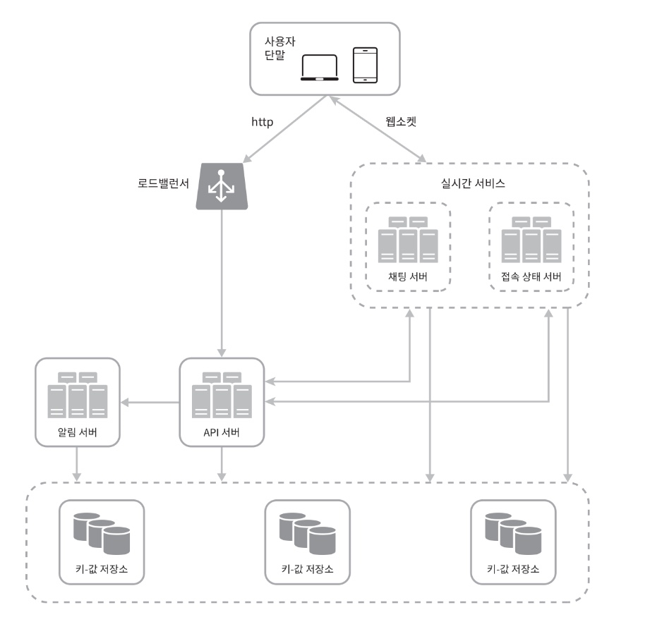

실시간으로 메시지를 주고받기 위해 클라이언트는 채팅 서버와 웹소켓 연결을 끊지 않고 유지함.

- 채팅 서버는 클라이언트 사이에 메시지를 중계하는 역할을 담당함
- 접속상태 서버는 사용자의 접속 여부를 관리
- API 서버는 로그인, 회원가입, 프로파일 변경 등 그 외 나머지 전부를 처리
- 알림 서버는 푸시 알림을 보냄
- 키-값 저장소에는 채팅 이력을 보관
- 시스템에 접속한 사용자는 이전 채팅 이력을 전부 보게 될 것임.

### 저장소

서버도 준비됨
제 3자 서비스 연동도 완료

이 기술 스택 깊은 곳에 데이터 계층이 있음
데이터 계층을 올바르게 만드는 데는 노력이 필요

중요한 것?
어떤 데이터베이스를 쓰는가? 관계형 데이터베이스? NoSQL?

- 이 질문에 대한 올바른 답을 하기 위해 중요하게 따져야 할 것?
    - 데이터의 유형과 읽기/쓰기 연산의 패턴

채팅 시스템이 다루는 데이터는 보통 2가지임

1. 사용자 프로파일, 설정, 친구 목록처럼 일반적인 데이터
    2. 안정성을 보장하는 관계형 데이터베이스에 보관
    3. 다중화와 샤딩은 이런 데이터의 가용성과 규모확장성을 보증하기 위해 보편적으로 사용되는 기술

2. 채팅 시스템에 고유한 데이터인 채팅 이력
    3. 이 데이터를 어떻게 보관할지 결정하려면 읽기/쓰기 연산 패턴을 이해해야 함.

- 채팅 이력 데이터 양은 엄청남.
- 이 데이터 가운데 빈번하게 사용되는 것은 주로 최근에 주고받은 메시지
- 사용자는 대체로 최근에 주고받은 메시지 데이터만 보게 되는 것이 사실이나, 검색 기능을 이용하거나, 특정 사용자가 언급된 메시지를 보거나, 특정 메시지로 점프하거나 하여 무작위적인 데이터 접근을 하게 되는 일도
  있음
- 데이터 계층은 이런 기능도 지원해야 함.
- 1:1 채팅 앱의 경우 읽기:쓰기 비율은 대략 1:1정도

본 설계안의 경우에는 이 모두를 지원할 데이터베이스에 키-값 저장소를 추천함

이유

- 키-값 저장소는 수평적 규모확장이 쉬움
- 키-값 저장소는 데이터 접근 지연시간이 낮음
- 관계형 데이터베이스는 데이터 가운데 롱 테일에 해당하는 부분을 잘 처리하지 못하는 경향이 있음
    - 인덱스가 커지면 데이터에 대한 무작위적 접근을 처리하는 비용이 늘어남
- 이미 많은 안정적인 채팅 시스템이 키-값 저장소를 채택하고 있음
- 페이스북 -> HBase , 디스코드 -> Cassandra 이용

### 데이터 모델

키-값 저장소를 데이터 계층 기술로 사용

메시지 데이터를 어떻게 보관할건지??

1:1 채팅을 위한 메시지 테이블

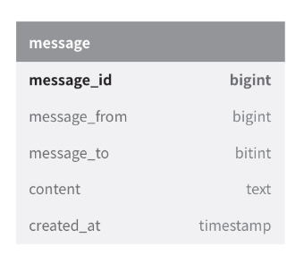

기본키: message_id -> 메시지 순서를 쉽게 정할 수 있도록 하는 역할도 담당

created_at 사용 -> 메시지 순서를 정할 수 없는데, 서로 다른 두 메시지가 동시에 만드어질 수도 있기 때문

그룹 채팅을 위한 메시지 테이블

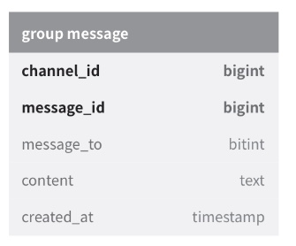

(channel_id, message_id)의 복합키를 기본키로 사용함

채널 : 채팅 그룹과 같은 의미

channel_id : 파티션 키로도 사용 -> 그룹 채팅에 적용될 모든 질의는 특정 채널을 대상으로 할 것이기 때문

### 메시지 ID

message_id는 메시지 순서를 표현할 수 있어야함

그러기 위해서 만족해야 하는 속성

- message_id의 값은 고유해야 함
- ID값은 정렬 가능해야 하며 시간 순서와 일치해야 함. 즉, 새로운 ID는 이전 ID보다 큰 값이어야 함.

이 두 조건을 어떻게 만족시킬 것인가?
RDBMS라면 auto_increment가 대안이 될 수 있곘지만, NoSQL은 보통 해당 기능을 제공하지 않음

다른 방법: 스노플레이크

- 전역적 64-bit 순서 번호 생성기 이용 (제 7장 "분산시스템을 위한 유일 ID 생성기 설계 참고)

또 다른 방법: 지역적 순서 번호 생성기 이용

- 지역적: ID의 유일성은 같은 그룹 안에서만 보증하면 충분하다는 것을 의미
- 이 방법이 통하는 이유는 메시지 사이의 순서는 같은 채널, 혹은 같은 1:1 채팅 세션 안에서만 유지되면 충분하기 때문임
- 전역적 ID 생성기에 비해 구현하기 쉬운 접근법임.

# 3단계 : 상세 설계

자세히 볼만 할 부분

- 서비스 탐색
- 메시지 전달 흐름
- 사용자 접속 상태를 표시하는 방법

### 서비스 탐색

- 주된 역할: 클라이언트에게 가장 적합한 채팅 서버를 추천하는 것
- 기준 : 클라이언트의 위치, 서버의 용량 등이 있음

- 서비스 탐색 기능을 구현하는 데 널리 쓰이는 오픈 소스 솔루션
    - 아파치 주키퍼

사용 가능한 모든 채팅 서버를 여기 등록시켜 두고, 클라이언트가 접속을 시도하면 사전에 정한 기준에 따라 최적의 채팅 서버를 골라주면 됨.

[주키퍼로 구현한 서비스 탐색 기능 동작 과정]

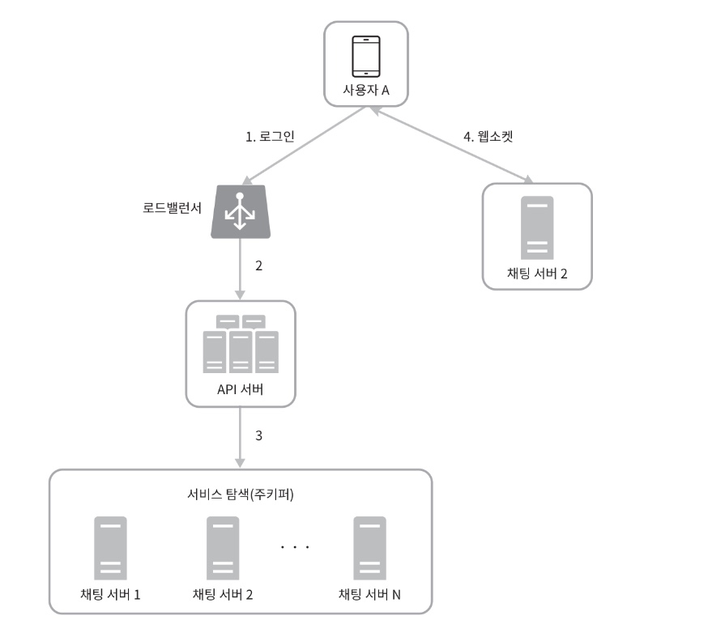

1. 사용자 A가 시스템에 로그인을 시도함
2. 로드밸런서가 로그인 요청을 API 서버들 가운데 하나로 보냄
3. API서버가 사용자 인증을 처리하고 나면 서비스 탐색 기능이 동작하여 해당 사용자를 서비스할 최적의 채팅 서버를 찾음. 위 예제의 경우에는 채팅 서버2가 선택되어 사용자 A에게 반환되었다고 가정
4. 사용자 A는 채팅 서버2와 웹소켓 연결을 맺음.

### 메시지 흐름

1:1 채팅 메시지 처리 흐름

사용자 A가 B에게 보낸 메시지가 어떤 경로로 처리되는지를 보여줌

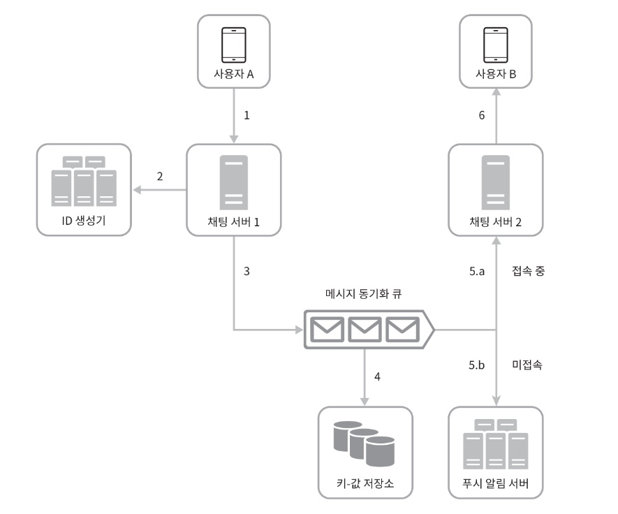

1. 사용자 A가 채팅 서버1로 메시지 전송
2. 채팅 서버 1은 ID 생성기를 사용해 해당 메시지의 ID 결정
3. 채팅 서버1은 해당 메시지를 메시지 동기화 큐로 전송
4. 메시지가 키-값 저장소에 보관됨
5. (a)사용자 B가 접속중인 경우 메시지는 사용자 B가 접속 중인 채팅 서버(서버2)로 전송됨. (b)사용자 B가 접속중이 아니라면 푸시 알림 메시지를 추시 알림 서버로 보냄
6. 채팅 서버2는 메시지를 사용자 B에게 전송. 사용자 B와 채팅 서버 2 사이에는 웹소켓 연결이 있는 상태이므로 그것을 이용

### 여러 단말 사이의 메시지 동기화

여러 개 단말 사이에 메시지 동기화 사례

위의 사례에서 사용자 A는 전화기와 랩톰의 두 대 단말을 이용하고 있음

사용자 A가 전화기에서 채팅 앱에 로그인한 결과로 채팅 서버1과 해당 단말 사이에 웹소켓 연결이 만들어져있고, 랩톱에서 로그인한 결과로 역시 별도 웹소켓이 채팅 서버 1에 연결되어 있는 상황

각 단말은 cur_max_message_id라는 변수를 유지

해당 단말에서 관측된 가장 최신 메시지의ID를 추적하는 용도
아래의 두 조건을 만족하는 메시지는 새 메시지로 간주

- 수신자 ID가 현재 로그인한 사용자 ID와 같음
- 키-값 저장소에 보관된 메시지로서, 그 ID가 cur_max_message_id보다 큼

cur_max_message_id는 단말마다 별도로 유지 관리하면 되는 값이라 키-값 저장소에서 새 메시지를 가져오는 동기화 작업도 쉽게 구현할 수 있음

### 소규모 그룹 채팅에서의 메시지 흐름

1:1 채팅에 비해 그룹 채팅에서의 메시지 흐름은 조금 더 복잡함

사용자 A가 그룹 채팅 방에서 메시지를 보냈을 때 어떤 일이 벌어지는 지 보여줌

해당 그룹에 3명의 사용자가 있다고 하자

- 사용자 A가 보낸 메시지가 사용자B와 C의 메시지 동기화 큐에 복사됨
- 이 큐를 사용자 각각에 할당된 메시지 수신함 같은 것으로 생각해도 무방
- 이 설계안은 소규모 그룹 채팅에 적함
    - 이유:
        - 새로운 메시지가 왔는지 확인하려면 자기 큐만 보면 되니까 메시지 동기화 플로가 단순함
        - 그룹이 크지 않으면 메시지를 수신자별로 복사해서 큐에 넣는 작업의 비용이 문제가 되지 않음

위챗이 이런 접근법을 쓰고 있으며, 그룹의 크기는 500명으로 제한 하고 있음

**하지만 많은 사용자를 지원해야 하는 경우라면 똑같은 메시지를 모든 사용자의 큐에 복사하는 게 바람직하지 않음**

수신자 관점에서 살펴보면 한 수신자는 여러 사용자로부터 오는 메시지를 수신할 수 있어야 함.
따라서 각 사용자의 수신함, 즉 메시지 동기화 큐는 아래와 같이 여러 사용자로부터 오는 메시지를 받을 수 있어야 함.

수신자 입장으로 설계하는 것이 좋다는 의미같음

### 접속상태 표시

사용자의 접속 상태를 표시하는 것은 상당수 채팅 애플리케이션의 핵심적 기능

개략적 설계안에서는 접속상태 서버를 통해 사용자의 상태를 관리한다고 했었음

접속상태 서버는 클라이언트와 웹소켓으로 통신하는 실시간 서비스의 일부라는 점에 유의

사용자의 상태가 바뀌는 몇가지 시나리오

#### 사용자 로그인

사용자 로그인 절차에 대해서는 '서비스 탐색' 절에서 설명한 바 있음

클라이언트와 실시간 서비스 사이에 웹소켓 연결이 맺어지고 나면 접속상태 서버는 A의 상태와 last_active_at 타임스탬프 값을 키-값 저장소에 보관함

이 절차가 끝나고 나면 해당 사용자는 접속 중인 것으로 표시될 것.

#### 로그아웃

키-값 저장소에 보관된 사용자 상태가 online에서 offline으로 바뀌게 된다는 점 유의

이 절차가 끝나면 UI 상에서 사용자의 상태는 접속 중이 아닌 것으로 표시될 것임.

### 접속 장애

접속 장애에 대응할 수 있는 설계

- 사용자의 인터넷 연결이 끊어지면 클라이언트와 서버 사이에 맺어진 웹소켓 같은 지속성 연결도 끊어짐
- 대응 방법: 사용재를 오프라인 상태로 표시하고 연결이 복구되면 온라인 상태로 변경하는 것
    - 문제점: 짧은 시간 동안 인터넷 연결이 끊어졌다 복구되는 일은 흔함. 이런 일이 있을 때마다 사용자의 접속 상태를 변경한다면 그것은 지나친 일이고, 사용자 경험 측면에서도 바람직하지 않음
- 본설계안에서의 해결방법: 박동검사
    - 온라인 사애의 클라이언트로 하여금 주기적으로 박동 이벤트를 접속상태 서버로 보내도록 하고, 마지막 이벤트를 받은지 x초 이내에 또 다른 박동 이벤트 메시지를 받으면 해당 사용자의 접속상태를 계속 온라인으로
      유지하는 것.
    - 그렇지 않을 경우에만 오프라인으로 바꾸는 것
    - 아래의 예제에 등장하는 클라이언트는 박동 이벤트를 매 5초마다 서버로 보내고 있음
    - 그런데 이벤트를 3번 보낸 후 x= 30초 동안 아무런 메시지를 보내지 않아서 오프라인 상태로 변경됨.

#### 상태 정보의 전송

그렇다면 사용자 A와 친구 관계에 있는 사용자들은 어떻게 해당 사용지의 상태 변화를 알게 될까?

상태정보 서버는 발행-구독 모델을 사용함

즉, 각각의 친구관계마다 채널을 하나씩 두는 것

가령 사용자 A의 접속상태가 변경되었다고 하자.

그 사실을 세 개 채널, 즉 A-B, A-C, A-D에 쓰는 것임

그리고 A-B는 B가 구독하고, A-C는 C가 구독하고, A-D는 D가 구독하도록 하는 것.

이렇게 하면 친구 관계에 있는 사용자가 상태정보 변화를 쉽게 통지받을 수 있게 됨.
클라이언트와 서버 사이의 통신에는 실시간 웹소켓을 사용

이 방안은 소규모일 떄 효과적임

그룹 크기가 더 커지면 이런 식으로 접속상태 변화를 알려서는 비용이나 시간이 많이 들게 될 것

가령 그룹 하나에 100,000 사용자가 있다고 하자
그러면 상태변화 1건당 100,000개의 이벤트 메시지가 발생할 것

이러한 성능 문제를 해소하는 한 가지 방법

- 사용자가 그룹 채팅에 입장하는 순간에만 상태 정보를 읽어가게 하거나, 친구 리스트에 있는 사용자의 접속상태를 갱신하고 싶으면 수동으로 하도록 유도하는 것

# 4단계 : 마무리

추가로 논의해보면 좋을 것들

- 채팅 앱을 확장하여 사진이나 비디오 등의 미디어를 지원하도록 하는 방법: 미디어 파일은 텍스트에 비해 크기가 큼. 그와 관련하여 압축 방식, 클라우드 저장소, 섬네일 생성 등을 논의해보면 재미있을 것.
- 종단 간 암호화: 왓츠앱은 메시지 전송에 있어 종단 간 암호화를 지원함. 메시지 발신인과 수신자 외에는 아무도 메시지 내용을 볼 수 없다는 의미
- 캐시: 클라이언트에 이미 읽은 메시지를 캐시해 두면 서버와 주고받는 데이터 양을 줄일 수 있음
- 로딩 속도 개선: 슬랙은 사용자의 데이터, 채널 등을 지역적으로 분산하는 네트워크를 구축하여 앱 로딩 속도를 개선함
- 오류 처리:
    - 채팅 서버 오류: 채팅 서버 하나에 수십만 사용자가 접속해 있는 상황을 생각해보자. 그런 서버 하나가 죽으면 서비스 탐색 기능(주키퍼 같은)이 동작하여 클라이언트에게 새로운 서버를 배정하고 다시 접속할 수
      있도록 해야함
    - 메시지 재전송 : 재시도나 큐는 메시지의 안정적 전송을 보장하기 위해 흔히 사용하는 기법임.