# 채팅 시스템 설계

## 1단계) 문제 이해 및 설계 범위 확정

### 문제 이해를 하기 위한 질문
- 1:1 채팅 앱입니까? 그룹 채팅 앱 입니까?
- 모바일 앱인가요? 웹 앱 인가요?
- 처리해야 하는 트래픽 규모는 얼마입니까?
- 그룹 채팅에 인원제한이 있습니까?
- 중요기능은 무엇인가요?
- 종단 간 암호화를 지원해야하나요?
- 채팅이력은 얼마나 오래 보관하나요?

### 요구 사항
- 응답지연이 낮은 일대일 채팅 기능
- 최대 100명까지 가능한 그룹 채팅 기능
- 사용자 접속상태 표시 기능
- 다양한 단말 지원 및 한 계정 여러 단말 동시 접속 지원
- 푸시 알림
- 5천만 DAU 지원

## 2단계) 개략적 설계안 제시 및 동의 구하기
클라이언트는 서로 직접 통신하지 않는다. 채팅 서비스의 기본 기능에 집중해보자.

- 클라이언트들로부터 메세지 수신
- 메시지 수신자 결정 및 전달
- 수신자가 접속 상태가 아닌 경우, 접속 시까지 해당 메세지 보관

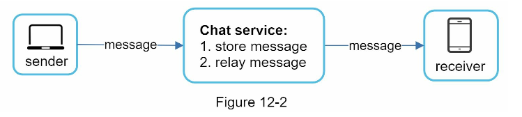

### 어떤 프로토콜을 사용할 것인가?
- 클라이언트/서버 애플리케이션에서 요청을 보내는 건 클라이언트
  - 채팅 시스템에서 메세지 송신 클라이언트가 해당 역할을 수행함
  - HTTP 프로토콜을 사용하여 연결 후 송신자는 채팅 서비스에 수신자에게 메세지 전달 요청
- keep-alive헤더를 사용하면 효율적
  - TCP 접속 과정에서 발생하는 handshake 횟수 줄일 수 있음

### 메시지 수신은 어떤 프로토콜을 사용할 것인가?

- HTTP는 클라이언트가 연결을 생성하는 프로토콜.
- 서버에서 클라이언트에게 임의 시점에 메시지 전달은 어려움.
- 이를 해결하기 위한 폴링, 롱 폴링, 웹 소켓 기술을 사용할 수 있음.
### 폴링

- 클라이언트가 주기적으로 서버에게 메시지 여부를 물어보는 방식.
- 폴링 비용은 주기가 짧을 수록 올라감.
- 답할 메시지가 없을 경우 서버 자원이 낭비.

### 롱풀링

- 폴링의 단점을 보완한 기법
- 새 메시지가 반환되거나 타임아웃 될 때까지 연결을 유지
- 클라이언트는 새 메시지를 받으면(또는 타임아웃 시) 기존 연결을 종료하고 서버에 새로운 요청을 보내 모든 절차를 다시 시작
- 약점
  - 송신자와 수신자가 같은 채팅 서버에 접속하지 않을 수 있음
  - HTTP 서버들은 대부분 stateless 서버이며, 로드 밸러싱을 위해 라운드 로빈 알고리즘을 사용하는 경우, 송신자와 수신자가 다른 채팅 서버를 사용할 수있음
  - 서버 입장에서 연결 해제 여부를 알 수 없음
  - 메시지를 받지않은 클라이언트도 타임아웃이 일어날 때마다 주기적으로 서버에 재접속해야하므로 여전히 비효율적

### 웹 소켓(Web socket)
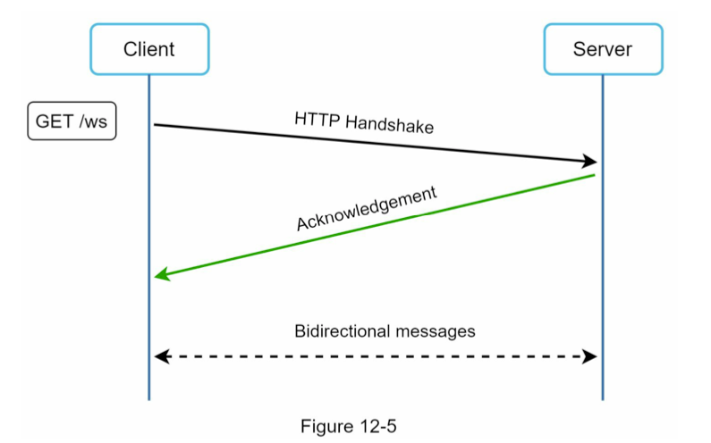

- 웹 소켓은 서버가 클라이언트에게 비동기 메시지를 보낼 때 가장 널리 사용하는 기술
- 연결은 클라이언트가 시작
- 처음에 HTTP 연결 후, 특정 handshake 절차를 거치고 웹 소켓 연결로 업그레이드
- 웹 소켓 연결은 항구적이며 양방향
- HTTP/HTTPS의 80 또는 443 포트를 그대로 사용하기 때문에 방화벽 환경에서도 동작함

- 웹 소켓을 이용하면 송수신 때, 동일한 프로토콜을 사용할 수 있음
  - 설계 및 구현이 단순하며 직관적
- 단, 연결이 항구적이므로 서버에서 연결 관리를 효율적으로 해야힘

### 개략적 설계안
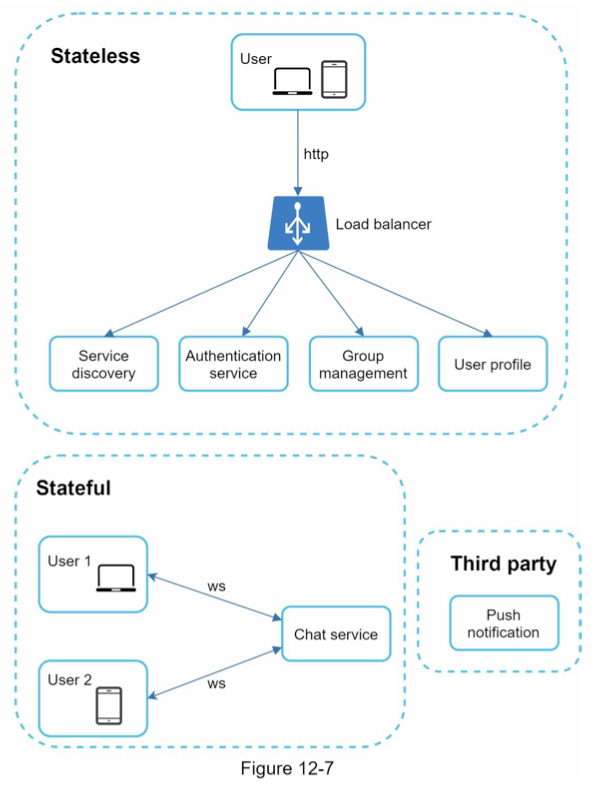

- 채팅을 제외한 대부분의 기능(회원가입, 로그인, 사용자 프로필 등)은 일반적인 HTTP로 구현해도 됨
- 채팅 시스템은 세 부분으로 구분 가능.
  - stateless(무상태) 서비스
  - stateful(상태유지) 서비스
  - third-party 연동

- stateless 서비스
  - 로그인, 회원가입, 사용자 프로필 등 전통적인 요청/응답이 해당
  - 무상태 서비스는 로드밸런서 뒤에 위치함
    - 로드밸런서 뒤에는 모놀리틱 또는 마이크로서비스일 수도 있음
  - 서비스 탐색(service discovery) 서비스는 클라이언트가 접속할 채팅 서버의 DNS 호스트명을 알려주는 서비스

- stateful 서비스
  - 채팅 서비스
  - 각 클라이언트와 채팅 서버는 독립적인 네트워크 연결을 유지해야함
    - 클라이언트는 서버와 연결이 살아있는 한 다른 서버로 연결을 변경하지 않음
  - 서비스 탐색 서비스는 채팅 서비스와 협력하여 특정 채팅 서버에 부하가 몰리지 않도록 함

- third-party 연동
  - 푸시 알림
  - 앱이 실행 중이 아니어도 알림을 받아야함.

### 규모확장성

- 서버 한 대로 구현하는 경우
  - 동시접속자가 1M이고, 접속당 서버 메모리가 10KB가 필요하다면, 10GB의 메모리로 모든 연결을 처리할 수 있음. 
  - 하지만 이는 SPOF 문제를 갖음. 
  - 서버 한 대 설계안에서 개선시켜나가는 것도 괜찮음
    - > 이 경우, 면접관에게 단지 시작이라는 것을 정확히 전달해야함.

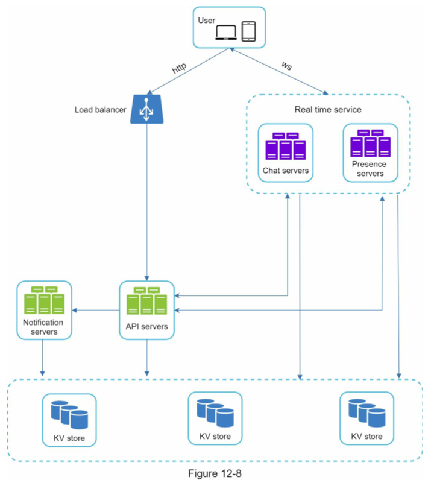

- 채팅서버는 클라이언트 간 메시지 중계를 담당함
- 접속상태 서버는 사용자 접속 여부를 관리함
- API서버는 채팅을 제외한 로그인, 회원가입 프로필 변경 등 전부를 처리함
- 알림 서버는 푸시 알림을 보냄
- 키-값 저장소에는 채팅 이력을 보관함
  - 시스템에 접속한 사용자는 이전 채팅 이력을 전부 봄
  
### 저장소
- 어떤 데이터베이스를 사용할 것인지는 데이터의 유형과 읽기/쓰기 연산의 패턴을 봐야함
- 채잉 시스템의 데이;터는 두가지임
  - 사용자 프로필, 설정, 친구 목록 등 일반 데이터
  - 채팅 이력 (chat history)
- 일반 데이터는 데이터 안정성을 보장하는 관계형 데이터베이스에 보관
- 채팅이력은 읽기/쓰기 연산 패턴을 이해해야함
  - 채팅 이력 데이터는 매우 큼
    - 페이스북 메신저나 왓츠앱은 매일 600억 개의 메시지를 처리
  - 이 데이터에서 가장 자주 사용되는 것은 최근 메시지
  - 용자는 대체로 최근 메시지를 보지만, 메시지 검색 기능, 특정 사용자가 언급된 메시지 보기, 특정 메시지로 점프하기 등 무작위 데이터 접근을 지원해야함
  - 1:1 채팅 앱의 경우 읽기:쓰기 비율은 대략 1:1
- 위 사항을 바탕으로 채팅 이력은 키-값 저장소를 추천
  - 수평적 규모확장이 쉬움
  - 데이터 접근 지연시간이 낮음.
  - 관계형 데이터베이스는 long tail에 해당하는 부분을 잘 처리하지 못함. 
  - 인덱스가 커지면 데이터에 대한 random access 비용이 늘어남.
  - 이미 많은 안정적인 채팅 시스템이 키-값 저장소를 사용함
    - 페이스북 메신저는 HBase를 사용하며 디스코드는 카산드라를 사용.

### 데이터 모델
#### 1:1 채팅 메시지 테이블
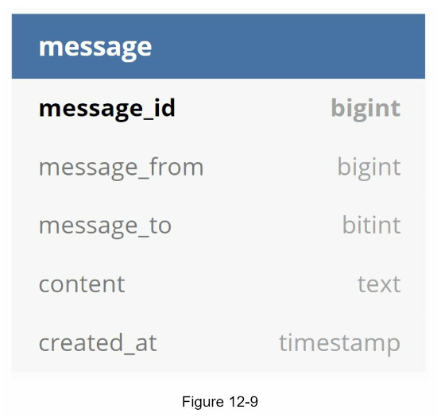

- message_id를 기본키로 갖음
 
#### 그룹 채팅 메시지 테이블

- channel_id, message_id 복합키를 기본키로 갖음

### 메세지 ID
- message_id는 고유해야함
- ID는 정렬 가능하며 시간 순서와 일치해야함
- snowflake와 같은 유일 ID를 사용할 수 있음. 
- 지역적 순서 번호 생성기를 이용할 수 있음. 
- message_id의 유일성은 같은 그룹 안에서만 보장하면 됨
- 전역에 비해 비교적 구현하기 쉬음.

## 3단계) 상세 설계
서비스 탐색, 메시지 전달 흐름, 사용자 접속 상태 표시 방법

### 서비스 탐색
- 클라이언트에게 가장 적합한 채팅 서버를 추천하는 것
- 기준은 클라이언트의 위치, 서버 용량 등
- 대표적으로는 아파치 주키퍼
- 사용가능한 모든 채팅 서버를 등록하고 클라이언트가 접속 시도 시, 기준에 따라 최적의 채팅 서버를 골라줌.
  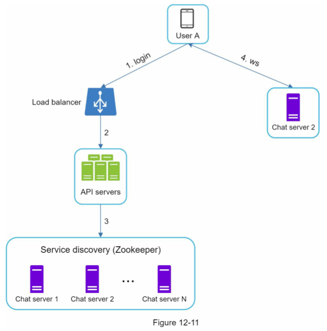

1. A가 시스템에 로그인 시도 
2. 로드밸런서가 로그인 요청을 API 서버에 보냄
3. API 서버가 인증 처리 후 서비스 탐색 기능을 통해 최적의 채팅 서버를 찾음
4. 최적의 채팅 서버로 2를 반환한다고 가정 
5. A는 채팅 서버 2와 웹 소켓 연결

### 메세지 흐름
#### 1:1 채팅 메시지 처리 흐름
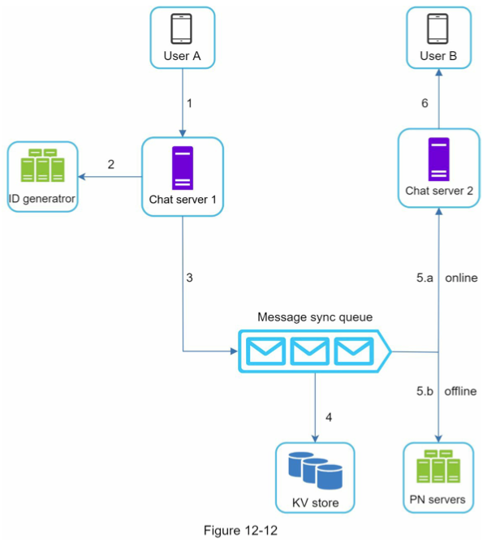

1. A가 채팅 서버 1로 메시지 전송 
2. 채팅 서버 1은 ID 생성기로 message_id 결정 
3. 채팅 서버 1은 해당 메시지를 메시지 동기화 큐로 전송 
4. 메시지를 키-값 저장소에 저장 
5. 5.a. B가 온라인인 경우, 메시지는 채팅 서버 2로 전송됨. 
   5.b. 오프라인인 경우, 메시지를 푸시 알림 서버로 전송 
6. B와 채팅서버 2는 웹소켓으로 연결되어 있으며, 채팅서버 2가 B에게 메시지 전송.

#### 여러 단말 사이의 메시지 동기화
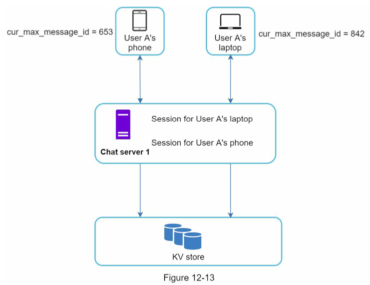

- 각 단말은 가장 최신 메시지 ID인 cur_max_message_id를 갖음
- 아래 두 조건을 만족한 경우 새 메시지로 간주함
  - 수신자 ID가 현재 로그인한 사용자 ID와 같은 경우
  - message_id가 cur_max_message_id보다 큰 경우

#### 소규모 그룹 채팅에서의 메시지 흐름
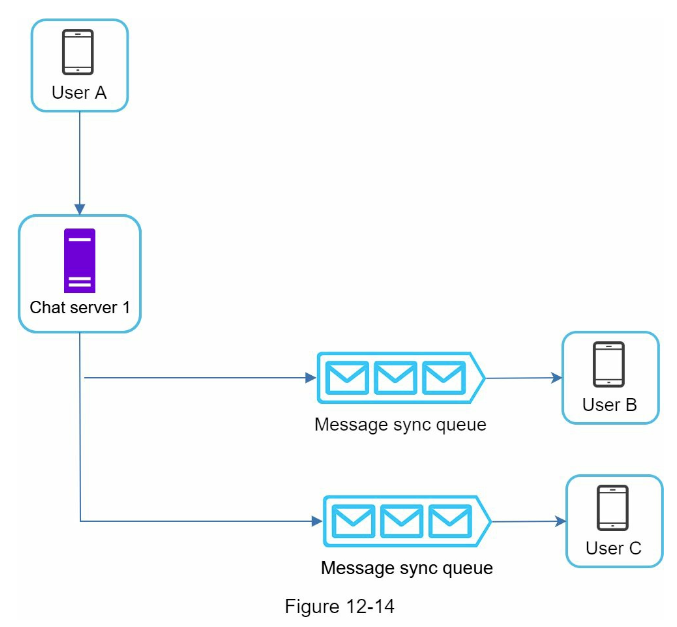

- A가 보낸 메시지는 B와 C의 메시지 큐에 복사됨
- 새 메시지 여부는 본인 큐만 확인하면 되므로 단순함
- 그룹이 크지않으면 큐마다 복사하는 비용이 문제되지 않음
- 위챗은 이 방법을 쓰며 그룹 크기를 500명으로 제한됨

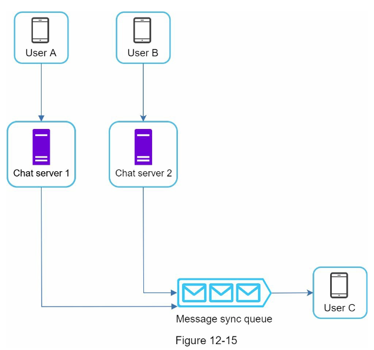

- 수신자 관점으로 보면, 수신자는 여러 송신자에서 오는 메시지를 수신할 수 있어야함
- 즉, 메시지 큐는 여러 사용자의 메시지를 받을 수 있어야함

### 접속 상테 표시
- 접속상태 표시는 채팅 애플리케이션의 핵심 기능
- 사용자 프로필 옆에 나타나는 녹색 불
- 접속 상태 서버는 웹소켓으로 통신하는 실시간 서비스 중 하나
- 사용자 상태가 변하는 로그인, 로그아웃, 접속 장애에 대해서 살펴보자.

#### 사용자  로그인
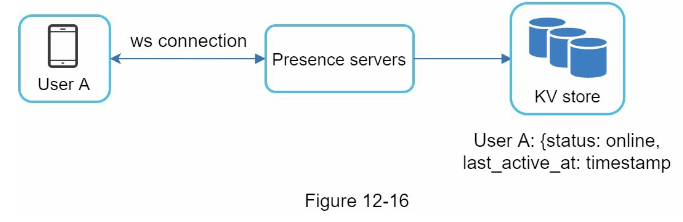

- 클라이언트가 웹 소켓 연결을 하고나면 접속 상태 서버는 유저 상태와 last_active_at 타임스탬프 값을 키-값 저장소에 보관

#### 로그아웃

- 로그아웃 시 사용자 상태를 offline으로 바꾸ㅡㅁ.
- 이때 UI 상에 사용자 상태는 접속 중이 아닌 것으로 표시됨.

#### 접속 장애
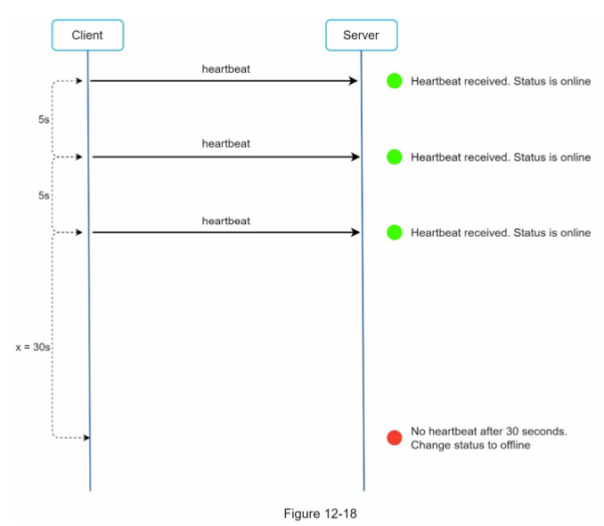

- 인터넷 연결은 항상 안정적인 것은 아님
- 잠깐의 연결이 끊겼다고 매번 접속 상태를 변경하는 것은 오버헤드가 큼. ex) 터널
- 이 문제는 heartbeat 검사를 통해 해결할 수 있음.
- 클라이언트는 주기적으로 heartbeat event를 접속상태 서버로 보냄 
- 마지막 이벤트가 x초 이내에 다시 오면 온라인으로 유지하고 아닐 경우 오프라인으로 변경
- 위 예시에서 x가 30초일 때, 클라이언트는 박동이벤트를 5초마다 보내다가 아무런 메시지를 보내지않아 오프라인으로 변경하ㅣㅁ

#### 상태정보의 전송

- 친구들(B, C, D)는 A의 상태정보를 어떻게 알까? 
- 접속상태 서버는 발행(publish)-구독(subscribe) 모델을 사용
- 각 친구관계마다 채널을 하나씩 둠
- 위 예시에서는 A-B, A-C, A-D 채널이 존재 
- 각 채널을 각 친구들이 구독 
- 이는 그룹의 크기가 작을 때 효과적. 동일 이벤트가 친구 수만큼 발생힘. 
- 그룹이 클 경우 사용자가 그룹 채팅에 입장하는 순간에만 상태정보를 읽거나 사용자가 친구의 접속상태를 수동으로 갱신하는 방식을 사용힘

## 4단계) 마무리
### 추가 논의 사항
- 미디어 파일을 지원하는 방법 
  - 미디어 파일은 용량이 크기 때문에 압축, 클라우드 저장소, 섬네일 생성 등을 논의할 수 있음
- 종단 간 암호화 
- 캐시 
  - 이미 읽은 메시지를 캐시하면 서버와 주고받는 데이터를 줄일 수 있음.
- 로딩 속도 개선 
  - 슬랙은 사용자 데이터, 채널 등을 지역적으로 분산하는 네트워크를 구축하여 앱 로딩 속도를 개선했음. 
- 오류 처리 
  - 채팅 서버 오류: 채팅 서버가 죽으면 서비스 탐색 서비스가 클라이언트에게 새로운 서버를 배정하고 재접속 할 수 있도록 해야힘
  - 메시지 재전송: 재시도나 큐는 메시지의 안정적 전송을 보장하는 일반적인 기법임