# 12장 채팅 시스템 설계
## 1단계: 문제 이해 및 설계 범위 확정
요구사항
- 1:1 채팅 앱, 그룹 채팅 둘 다 지원
- 모바일 앱, 웹 앱 
- 일별 능동 사용자(DAU: Daily Active User) 기준 5천만명 처리 가능해야 함
- 그룹 채팅의 인원 제한 수 100명
- 1:1 채팅, 그룹 채팅, 사용자 접속상태 표시 지원
- 텍스트 메시지만 주고받을 수 있음(첨부파일 지원X)
- 메시지 길이 100,000자 이하
- 종단 간 암호화(end-to-end encryption) 지원은 당장은 필요X
- 채팅 이력은 영원히 보관

기능 목록
- 응답지연이 낮은 일대일 채팅 기능
- 최대 100명까지 참여할 수 있는 그룹 채팅 기능
- 사용자의 접속상태 표시 기능
- 다양한 단말 지원, 하나의 계정으로 여러 단말에 동시 접속 지원
- 푸시 알림

## 2단계: 개략적 설계안 제시 및 동의 구하기
채팅 서비스의 기능
- 클라이언트들로부터 메시지 수신
- 메시지 수신자(recipient) 결정 및 전달
- 수신자가 접속(online) 상태가 아닌 경우에는 접속할 때까지 해당 메시지 보관

**클라이언트(메시지 송신 클라이언트와 수신 클라이언트)와 채팅 서비스 사이의 관계**
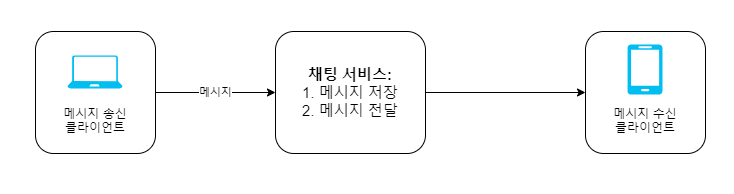
- 클라이언트는 채팅 서비스에 HTTP 프로토콜로 연결한 다음 메시지를 보내, 수신자에게 해당 메시지를 전달하라고 알림
- 채팅 서비스와의 접속에는 keep-alive 헤더 사용하면 효율적
  - 클라이언트와 서버 사이의 연결을 끊지 않고 계속 유지할 수 있음
  - TCP 접속 과정에서 발생하는 핸드셰이크(hand-shake) 횟수 줄일 수 있음
- 단점
  - 서버에서 클라이언트로 임의 시점에 메시지를 보내는 데는 쉽게 쓰일 수 없음
    - HTTP는 클라이언트가 연결을 만드는 프로토콜임  
  -> 폴링(polling), 롱 폴링(long polling), 웹소켓(WebSocket) 등의 기법이 제안됨

### 폴링
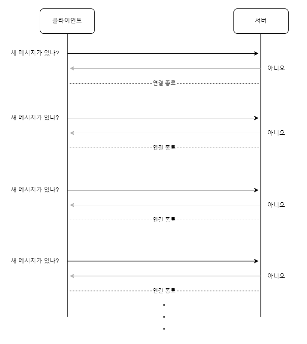
- 클라이언트가 주기적으로 서버에게 새 메시지가 있는지 물어봄
- 폴링을 자주할수록 비용 올라감
- 답해줄 메시지가 없는 경우, 서버 자원이 불필요하게 낭비됨

### 롱 폴링
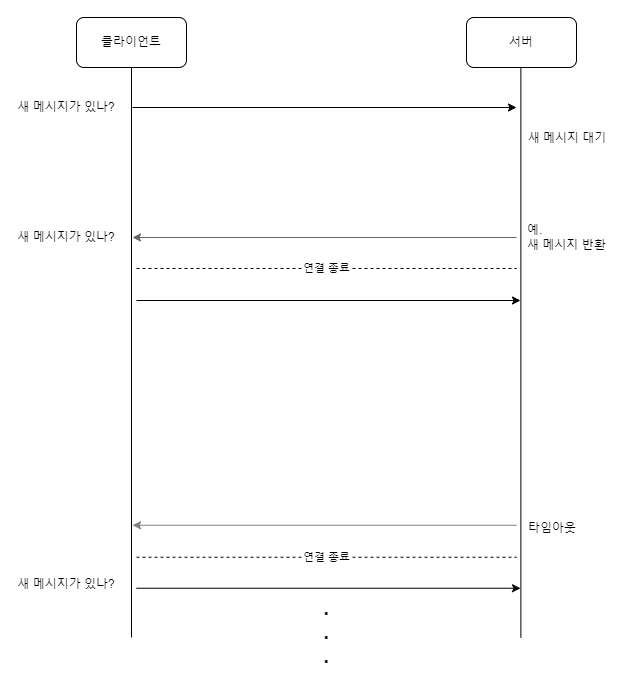
- 클라이언트는 새 메시지가 반환되거나 타임아웃될 때까지 연결을 유지
- 클라이언트는 새 메시지를 받으면 기존 열결을 종료하고 서버에 새로운 요청을 보내 모든 절차를 다시 시작함
- 단점
  - 메시지를 보내는 클라이언트와 수신하는 클라이언트가 같은 채팅 서버에 접속하게 되지 않을 수 있음
    - HTTP 서버들은 보통 무상태 서버
    - 로드밸런싱을 위해 라운드 로빈 알고리즘을 사용하는 경우, 메시지를 받은 서버는 해당 메시지를 수신할 클라이언트와의 롱 폴링 연결을 가지고 있지 않은 서버일 수 있음
  - 서버 입장에서는 클라이언트가 연결을 해제했는지 알 수 없음
  - 비효율적
    - 메시지를 많이 받지 않는 클라이언트도 타임아웃이 일어날 때마다 주기적으로 서버에 다시 접속함

### 웹소켓
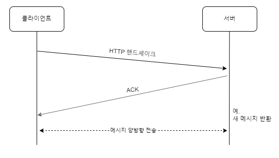
- 서버가 클라이언트에게 비동기(async) 메시지를 보낼 때 가장 널리 사용하는 기술
- 동작 방식
  - 클라이언트가 웹소켓 연결 시작
    - 한번 맺어진 연결은 항구적이며 양방향
    - 처음에는 HTTP 연결이지만, 특정 핸드셰이크 절차를 거쳐 웹소켓 연결로 업그레이드
  - 항구적인 연결이 만들어지면, 서버는 클라이언트에게 비동기적으로 메시지 전송할 수 있음
    - 웹소켓은 일반적으로 방화벽이 있는 환경에서도 잘 동작
    - 80이나 443처럼 HTTP 혹은 HTTPS 프로토콜이 사용하는 기본 포트번호를 그대로 쓰기 때문에

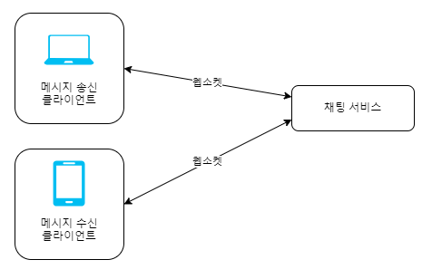
- 웹소켓 이용 시, 메시지를 보낼 때나 받을 때 동일한 프로토콜 사용할 수 있음
  - 설계뿐 아니라 구현도 단순하고 직관적임
- 웹소켓 연결은 항구적으로 유지되어야 함
  - 서버 측에서 연결 관리를 효율적으로 해야 함

### 개략적 설계안
#### 무상태 서비스
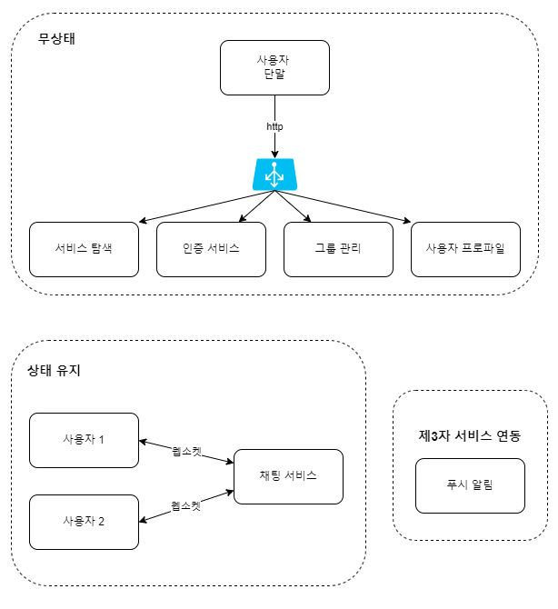
- 로그인, 회원가입, 사용자 프로파일 표시 등을 처리하는 전통적인 요청/응답 서비스
- 로드밸런스 뒤에 위치함
  - 로드밸런서는 요청을 그 경로에 맞는 서비스로 정확하게 전달
- 서비스 탐색 서비스: 클라이언트가 접속할 채팅 서버의 DNS 호스트명을 클라이언트에게 알려주는 역할

#### 상태 유지 서비스
- 채팅 서비스
  - 각 클라이언트가 채팅 서버와 독립적인 네트워크 연결을 유지해야 함
  - 클라이언트는 보통 서버가 살아있는 한 다른 서버로 연결을 변경하지 않음
  - 서비스 탐색 서비스는 채팅 서비스와 긴밀히 협력하여 특정 서버에 부하가 몰리지 않도록 함

#### 제3자 서비스 연동
- 푸시 알림
  - 새 메시지를 받았다면 앱이 실행 중이 아니더라도 알림을 받아야 함

#### 규모 확장성
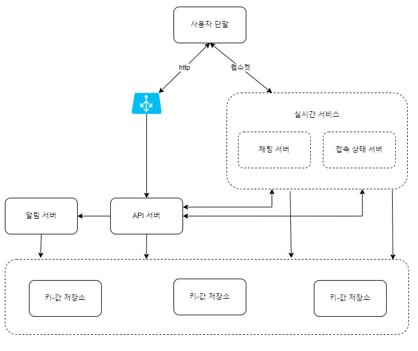
- 채팅 서버는 클라이언트 사이에 메시지를 중계하는 역할 담당
  - 실시간으로 메시지를 주고받기 위해 클라이언트는 채팅 서버와 웹소켓 연결을 끊지 않고 유지
- 접속상태 서버(presence server)는 사용자의 접속 여부 관리
- API 서버는 로그인, 회원가입, 프로파일 변경 등 그 외 나머지 전부를 처리
- 알림 서버는 푸시 알림을 보냄
- 키-값 저장소(key-value store)에는 채팅 이력(chat history)을 보관
  - 시스템에 접속한 사용자는 이전 채팅 이력을 전부 보게 됨

#### 저장소
채팅 시스템이 다루는 데이터
- 일반적인 데이터
  - 사용자 프로파일, 설정, 친구 목록
  - 안정성을 보장하는 관계형 데이터베이스에 보관
  - 다중화와 샤딩을 보편적으로 사용
- 채팅 시스템에 고유한 데이터
  - 채팅 이력
    - 채팅 이력 데이터 양은 엄청남 
    - 빈번하게 사용되는 것은 주로 최근에 주고받은 메시지
      - 대부분의 사용자는 오래된 메시지는 들여다보지 않음
    - 검색 기능을 이용하거나, 특정 사용자가 언급된 메시지를 보거나, 특정 메시지로 점프하여 무작위적인 데이터 접근을 하는 일도 있음
    - 1:1 채팅 앱의 경우 읽기:쓰기 비율은 대략 1:1 정도임  
  -> 키-값 저장소 사용

키-값 저장소
- 수평적 규모확장이 쉬움
- 데이터 접근 지연시간이 낮음
- 관계형 데이터베이스는 데이터 가운데 롱 테일에 해당하는 부분을 잘 처리하지 못하는 경향이 있음
  - 인덱스가 커지면 데이터에 대한 무작위적 접근을 처리하는 비용이 늘어남
- 이미 많은 안정적인 채팅 시스템이 키-값 저장소 채택하고 있음
  - 페이스북 메신저의 HBase 사용, 디스코드의 카산드라(Cassandra) 사용 등

### 데이터 모델
#### 1:1 채팅을 위한 메시지 테이블
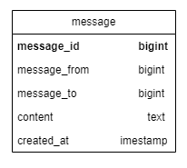
- 테이블의 기본키는 message_id
  - 메시지 순서를 쉽게 정할 수 있도록 하는 역할 담당
- created_at을 사용하여 메시지 순서를 정할 수는 없음
  - 서로 다른 두 메시지가 동시에 만들어질 수도 있기 때문

#### 그룹 채팅을 위한 메시지 테이블
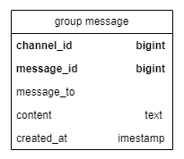
- (channel_id, message_id)의 복합키를 기본키로 사용
  - 채팅은 채팅 그룹과 같은 뜻
- channel_id는 파티션 키로도 사용
  - 그룹 채팅에 적용될 모든 질의는 특정 채널을 대상으로 할 것이기 때문

#### 메시지 ID
- message_id의 값은 고유해야 함(uniqueness)
- ID 값은 정렬 가능해야 하며, 시간 순서와 일치해야 함  
-> 새로운 ID는 이전 ID보다 큰 값이어야 함
  - 스노플레이크와 같은 전역적 64-bit 순서 번호 생성기 이용
  - 지역적 순서 번호 생성기(local sequence number generator) 이용
    - 지역적: ID의 유일성은 같은 그룹 안에서만 보증하면 충분하다는 것
    - 메시지 사이의 순서는 같은 채널, 같은 1:1 채팅 세션 안에서만 유지되면 충분하기 때문
    - 전역적 ID 생성기에 비해 구현하기 쉬움

## 3단계: 상세 설계
### 서비스 탐색
- 클라이언트에게 가장 적합한 채팅 서버 추천
- 클라이언트의 위치(geographical location), 서버의 용량(capacity) 등이 기준으로 사용됨
- 오픈 소스 솔루션으로는 아파치 주키퍼(Apache Zookeeper) 같은 것이 있음
  - 사용 가능한 모든 채팅 서버를 등록시켜 두고, 클라이언트가 접속을 시도하면 사전에 정한 기준에 따라 최적의 채팅 서버를 골라주면 됨

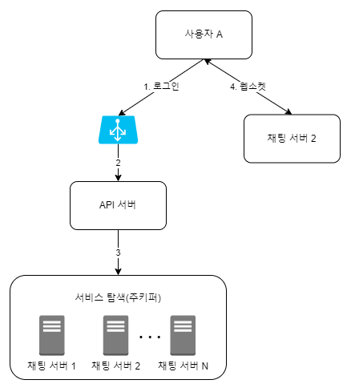
1. 사용자 A가 시스템에 로그인 시도
2. 로드밸런서가 로그인 요청을 API 서버들 가운데 하나로 보냄
3. API 서버가 사용자 인증을 처리하고 나면 서비스 탐색 기능이 동작하여 해당 사용자를 서비스할 최적의 서버 찾음
   - 예제에서는 채팅 서버 2가 선택되어 사용자 A에게 반환됨
4. 사용자 A는 채팅 서버 2와 웹소켓 연결을 맺음

### 메시지 흐름
#### 1:1 채팅 메시지 처리 흐름
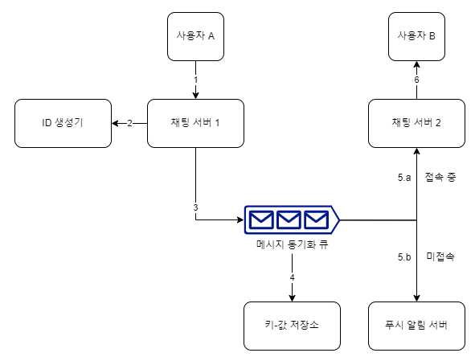
1. 사용자 A가 채팅 서버 1로 메시지 전송
2. 채팅 서버 1은 ID 생성기를 사용해 해당 메시지의 ID 결정
3. 채팅 서버 1은 해당 메시지를 메시지 동기화 큐로 전송
4. 메시지가 키-값 저장소에 보관됨
5. (a) 사용자 B가 접속 중인 경우 메시지는 사용자 B가 접속 중인 채팅 서버로 전송됨  
   (b) 사용자 B가 접속 중이 아니라면, 푸시 알림 메시지를 푸시 알림 서버로 보냄
6. 채팅 서버 2는 메시지를 사용자 B에게 전송
   - 사용자 B와 채팅 서버 2 사이에는 웹소켓 연결이 있는 상태이므로 그것을 이용

#### 여러 단말 사이의 메시지 동기화
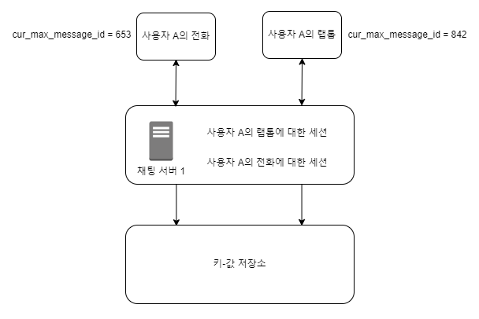
- 채팅 서버 1과 사용자 A의 전화 사이에 웹소켓 연결이 만들어져 있고, 랩톱과 채팅 서버 1 사이에 별도의 웹소켓 연결이 있음
- cur_max_message_id는 해당 단말에서 관측된 가장 최신 메시지의 ID를 추적하는 용도
- 아래 두 조건을 만족하는 메시지는 새 메시지로 간주함
  - 수신자 ID가 현재 로그인한 사용자 ID와 같다
  - 키-값 저장소에 보관된 메세지로서, 그 ID가 cur_max_message_id보다 크다
- cur_max_message_id는 단말마다 별도로 유지 관리하면 되는 값이기 때문에, 키-값 저장소에서 새 메시지를 가져오는 동기화 작업도 쉽게 구현할 수 있음

#### 소규모 그룹 채팅에서의 메시지 흐름
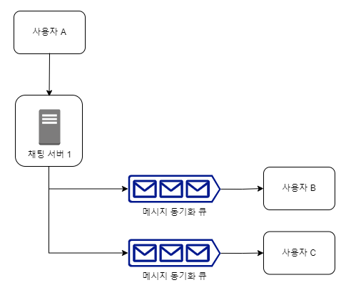
- 사용자 A가 보낸 메시지가 사용자 B와 C의 메시지 동기화 큐에 복사됨
- 새로운 메시지가 왔는지 확인하려면 자기 큐만 보면 되기 때문에 메시지 동기화 플로우가 단순함
- 그룹이 크지 않으면, 메시지를 수신자별로 복사해서 큐에 넣는 작업의 비용이 문제가 되지 않음
- 위챗(WeChat)이 이런 접근법을 쓰고 있고, 그룹의 크기는 500명으로 제한함
- 많은 사용자를 지원해야 하는 경우, 똑같은 메시지를 모든 사용자의 큐에 복사하는 게 바람직하진 않음
  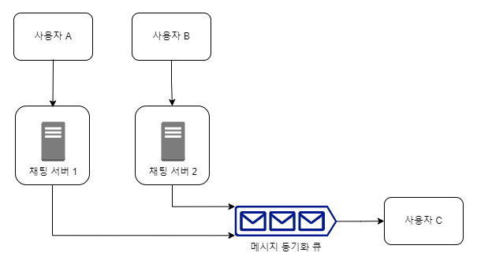
  - 한 수신자는 여러 사용자로부터 오는 메시지를 수신할 수 있어야 함
  - 각 사용자의 수신함, 즉 메시지 동기화 큐는 여러 사용자로부터 오는 메시지를 받을 수 있어야 함

### 접속상태 표시
#### 사용자 로그인
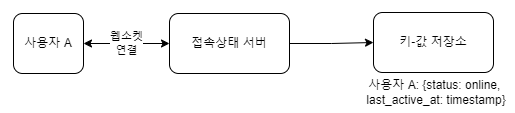
- 클라이언트와 실시간 서비스(real-time service) 사이에 웹소켓 연결이 맺어지고 나면, 접속상태 서버는 서비스 A의 상태와 last_active_at 타임스탬프 값을 키-값 저장소에 보관함
- 이 절차가 끝난 후, 해당 사용자는 접속 중인 것으로 표시됨

#### 로그아웃
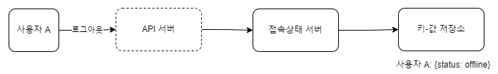
- 키-값 저장소에 보관된 사용자 상태가 online에서 offline으로 바뀜
- 이 절차가 끝나고 나면, UI 상에서 사용자의 상태는 접속 중이 아닌 것으로 표시됨

#### 접속 장애
- 접속 장애가 발생했을 때, 사용자를 오프라인 상태로 표시하고 연결이 복구되면 온라인 상태로 변경  
-> 짧은 시간 동안 인터넷 연결이 끊어졌다 복구되는 일은 흔함  
-> 사용자 경험 측면에서 바람직하지 않음  
-> 박동(heartbeat) 검사 사용
  - 온라인 상태의 클라이언트가 주기적으로 박동 이벤트를 접속상태 서버로 보내게 하고, 마지막 이벤트를 받은 지 x초 이내에 또 다른 박동 이벤트 메시지를 받으면 해당 사용자의 접속상태를 계속 온라인으로 유지

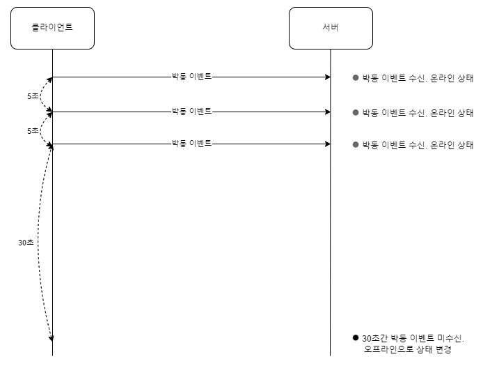
- 박동 이벤트를 매 5초마다 서버로 보냄
- 이벤트를 3번 보낸 후, x = 30초 동안 아무런 메시지를 보내지 않아 오프라인 상태로 변경됨

#### 상태 정보의 전송
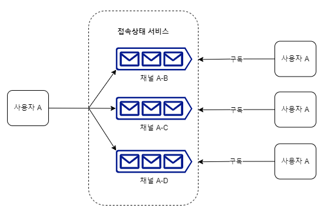
- 상태정보 서버는 발행-구독 모델(publish-subscribe model)을 사용
  - 각각의 친구 관계마다 채널을 하나씩 둠
  - 사용자 A의 접속상태가 변경되면, A-B, A-C, A-D 채널에 이 사실을 씀  
  -> 친구 관계에 있는 사용자가 상태 정보 변화를 쉽게 통지받을 수 있게 됨
- 단점
  - 그룹 크기가 커지면, 비용이나 시간이 많이 들게 됨  
-> 사용자가 그룹 채팅에 입장하는 순간에만 상태 정보를 읽어가게 하거나, 친구 리스트에 있는 사용자의 접속상태를 갱신하고 싶으면 수동으로 하도록 유도

## 4단계: 마무리
- 채팅 앱을 확장하여 사진이나 비디오 등의 미디어를 지원하도록 하는 방법
  - 압축 방식, 클라우드 저장소, 썸네일 생성 등 논의
- 종단 간 암호화
  - 왓츠앱은 메시지 전송에 있어 종단 간 암호화를 지원
  - 메시지 발신인과 수신자 외에는 아무도 메시지 내용을 볼 수 없읍
- 캐시
  - 클라이언트에 이미 읽은 메시지를 캐시해두면 주고 받는 데이터 양 줄일 수 있음
- 로딩 속도 개선
  - 슬랙은 사용자의 데이터, 채널 등을 지역적으로 분산하는 네트워크를 구축하여 앱 로딩 속도를 개선
- 오류 처리
  - 채팅 서버 오류
    - 채팅 서버 하나에 수십만 사용자가 접속해 있는 경우, 서버 하나가 죽으면 서비스 탐색 기능이 동작하여 클라이언트에게 새로운 서버를 배정하고 다시 접속할 수 있도록 해야 함
  - 메시지 재전송
    - 재시도나 큐는 메시지의 안정적 전송을 보장하기 위해 흔히 사용됨