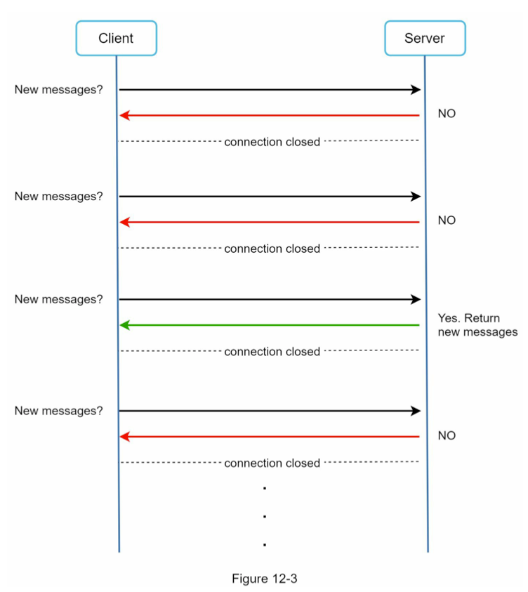
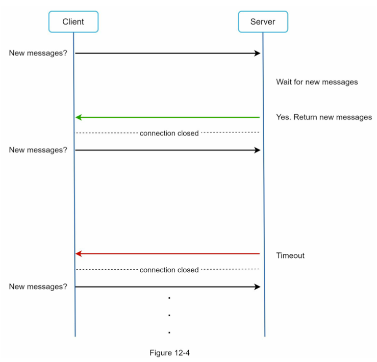
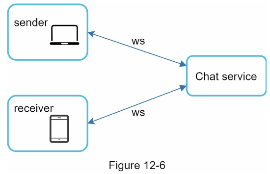
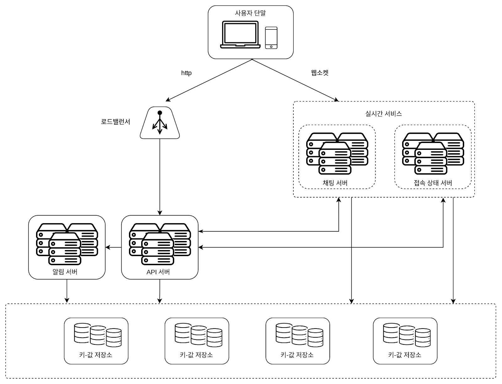
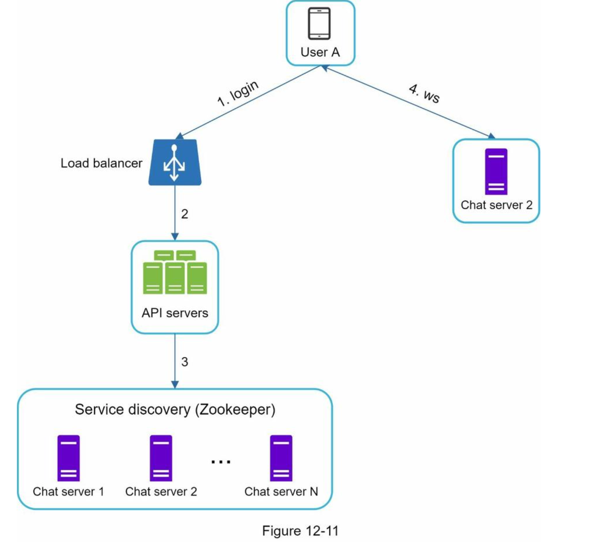
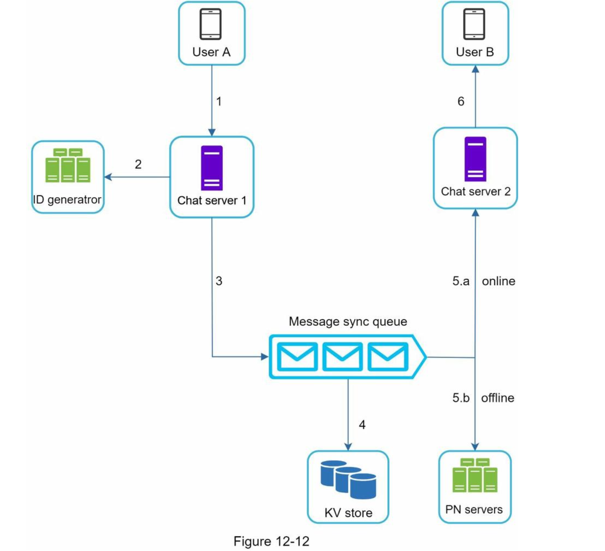
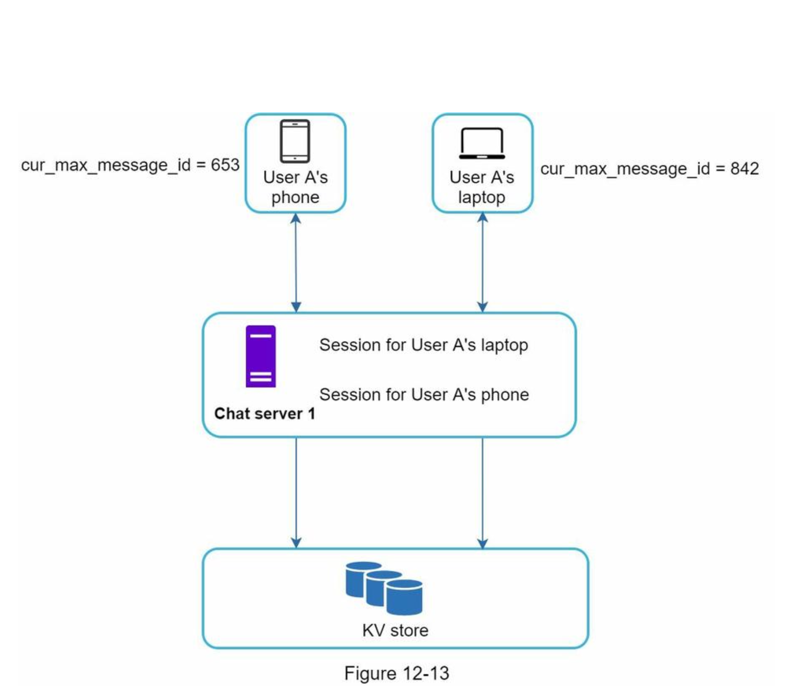
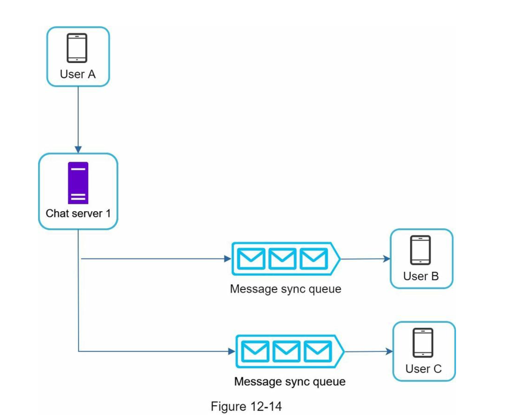
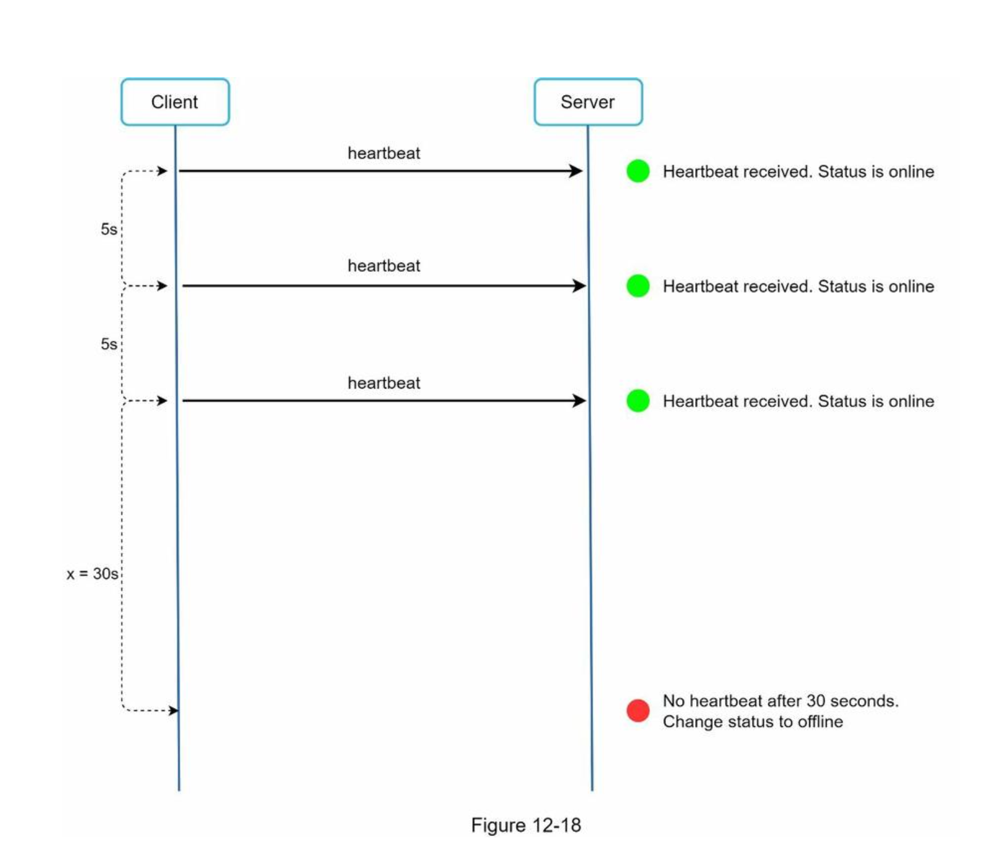
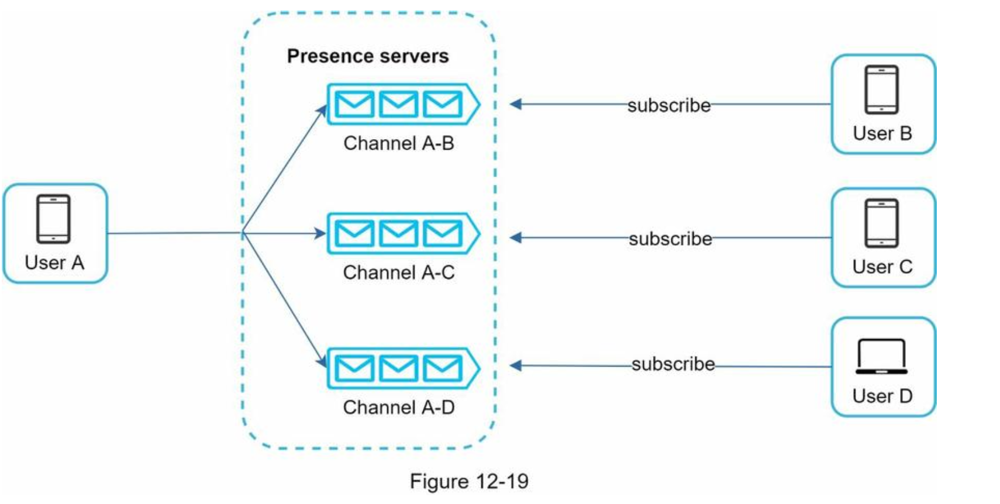

## 채팅 시스템 설계

#### 1단계. 문제 이해 및 설계 범위 확정

문제 이해를 위한 질문
- 1:1 채팅 앱입니까? 그룹 채팅 앱 입니까?
- 모바일 앱인가요? 웹 앱 인가요?
- 처리해야 하는 트래픽 규모는 얼마입니까?
- 그룹 채팅에 인원제한이 있습니까?
- 중요기능은 무엇인가요?
- 종단 간 암호화를 지원해야하나요?
- 채팅이력은 얼마나 오래 보관하나요?

요구사항
- 응답지연이 낮은 일대일 채팅 기능
- 최대 100명까지 가능한 그룹 채팅 기능
- 사용자 접속상태 표시 기능
- 다양한 단말 지원 및 한 계정 여러 단말 동시 접속 지원
- 푸시 알림
- 5천만 DAU 지원

#### 2단계. 개략적 설계안 제시 및 동의 구하기

채팅 서비스의 기본 기능
- 클라이언트들로부터 메시지 수신
- 메시지 수신자 결정 및 전달
- 수신자가 접속 상태가 아닌 경우, 접속 시까지 해당 메시지 보관

###### 어떤 프로토콜을 사용할 것인가?
- HTTP는 클라이언트가 연결을 생성하는 프로토콜이다.
  - 서버에서 클라이언트에게 임의 시점에 메시지 전달은 어렵다.
- 이를 해결하기 위한 폴링, 롱 폴링, 웹 소켓 기술을 사용할 수 있다.

##### 폴링(Polling)

- 클라이언트가 주기적으로 서버에게 메시지 여부를 물어보는 방식이다.
- 폴링 비용은 주기가 짧을 수록 올라간다.
- 답할 메시지가 없을 경우 서버 자원이 낭비된다.

##### 롱 폴링(Long Polling)

- 폴링의 단점을 보완한 기법이다.
- 새 메시지가 반환되거나 타임아웃 될 때까지 연결을 유지한다.
- 클라이언트는 새 메시지를 받으면(또는 타임아웃 시) 기존 연결을 종료하고 서버에 새로운 요청을 보내 모든 절차를 다시 시작한다.
- 이는 다음과 같은 약점을 갖는다.
  - 송신자와 수신자가 같은 채팅 서버에 접속하지 않을 수 있다.
  - HTTP 서버들은 대부분 stateless 서버이며, 로드 밸러싱을 위해 라운드 로빈 알고리즘을 사용하는 경우, 송신자와 수신자가 다른 채팅 서버를 사용할 수 있다.
  - 서버 입장에서 연결 해제 여부를 알 수 없다.
  - 메시지를 받지않은 클라이언트도 타임아웃이 일어날 때마다 주기적으로 서버에 재접속해야하므로 여전히 비효율적이다.

##### 웹 소켓(Web Socket)

- 웹 소켓은 서버가 클라이언트에게 비동기 메시지를 보낼 때 가장 널리 사용하는 기술이다.
- 연결은 클라이언트가 시작한다.
- 처음에 HTTP 연결 후, 특정 handshake 절차를 거치고 웹 소켓 연결로 업그레이드된다.
- 웹 소켓 연결은 항구적이며 양방향이다.
- HTTP/HTTPS의 80 또는 443 포트를 그대로 사용하기 때문에 방화벽 환경에서도 동작한다.

- 웹 소켓을 이용하면 송수신 때, 동일한 프로토콜을 사용할 수 있다.
  - 설계 및 구현이 단순하며 직관적이다.
- 단, 연결이 항구적이므로 서버에서 연결 관리를 효율적으로 해야한다.

##### 개략적 설계안
대부분의 기능들은 일반적인 HTTP상에서 구현하고 채팅과 관련된 부분만 웹소켓을 사용한다.

이 책에서 다루는 채팅 시스템은 세 부분으로 나누어 볼 수 있다.

무상태 서비스, 상태유지(stateful) 서비스, 그리고 제 3자 서비스 연동의 세 부분이다.

###### 무상태 서비스
일반적인 기능을 다룬다.

여기서 중요한 부분은 “서비스 탐색(service discovery)” 서비스다. 이 서비스는 클라이언트가 접속할 채팅 서버의 DNS 호스트명을 클라이언트에게 알려주는 역할을 한다.

###### 상태 유지 서비스
각 클라이언트는 채팅 서버와 독립적인 네트워크 연결을 유지해야 한다.

서비스 탐색 서비스는 채팅 서비스와 긴밀히 협력하여 특정 서버에 부하가 몰리지 않도록 해야 한다.

###### 제3자 서비스 연동
채팅 앱에서 가장 중요한 제3자 서비스는 푸시 알림이다. 새 메시지를 받았다면 설사 앱이 실행 중이지 않더라도 알림을 받아야 해서다. 따라서 푸시 알림 서비스와의 통합은 아주 중요하다.

###### 규모 확장성
트래픽 규모가 얼마 되지 않을 때는 방금 설명한 모든 기능을 서버 한 대로 구현할 수 있다. 이때 따져봐야할 것은 서버 한 대로 얼마나 많은 접속을 동시에 허용할 수 있느냐다. 이번 장에서 다루는 시스템의 경우에는 동시 접속자가 1M이라고 가정할 것인데, 접속당 10K의 서버 메모리가 필요하다고 본다면(아주 개략적으로 추정한 수치다) 10GB 메모리만 있으면 모든 연결을 다 처리할 수 있을 것이다.

하지만 모든 것을 서버 한 대에 담은 설계안을 내밀면 면접에서 좋은 점수를 따기는 어려울 것이다. 누구도 그 정도 규모의 트래픽을 서버 한 대로 처리하려 하지 않을 것이기 때문이다. 거기에는 여러 가지 이유가 있는데 SPOF(Single-Point-Of-Failure)도 그 가운데 하나다.

하지만 서버만 한 대 갖는 설계안에서 출발하여 점차 다듬어 나가는 것은 괜찮다. 면접관에게 ‘이 것은 그저 시작일 뿐’이라는 것을 정확하게 전달해 놓으면 된다.

실시간으로 메시지를 주고받기 위해 클라이언트는 채팅 서버와 웹소켓 연결을 끊지 않고 유지한다.

- 채팅 서버는 클라이언트 사이에 메시지를 중계하는 역할을 담당한다.
- 접속상태 서버(presence server)는 사용자의 접속 여부를 관리한다.
- API 서버는 로그인, 회원가입, 프로파일 변경 등 그 외 나머지 전부를 처리한다. 
- 알림 서버는 푸시 알림을 보낸다.
- 키-값 저장소(key-value)에는 채팅 이력(chat history)을 보관한다. 시스템에 접속한 사용자는 이전 채팅 이력을 전부 보게 될 것이다.

여기서의 API 서버는 이전에서 언급한 무상태 서비스를 모아서 설명한 것이라 생각된다.

##### 저장소
- 어떤 데이터 베이스를 쓰느냐 ? SQL vs NOSQL
- 데이터의 유형과 읽기/쓰기 연산 패턴을 기반으로 결정해야 한다.
- 채팅 시스템의 데이터 형태는 2가지 이다.
  - 사용자 프로파일, 설정, 친구 목록과 같은 일반적인 데이터
  - 채팅 이력과 같은 채팅 시스템에 고유한 데이터
    - 채팅 이력은 데이터 양이 엄청나다. 페이스북, 왓츠앱은 매일 60billion 개의 메시지를 처리한다.
    - 최근에 주고 받은 메시지만 빈번하게 사용된다.
    - 검색, 언급등으르 특정 메시지로 점프하여 무작위적인 데이터 접근도 많다.
    - 쓰기와 읽기가 1:1: 비율이다.
- 일반적인 데이터는 안정성을 보장하는 관계형 데이터베이스 추천
- 채팅 이력은 키-값 저장소 추천
  - 데이터 접근 지연시간이 낮다.
  - 관계형 데이터베이스는 데이터 중 롱 테일에 해당하는 부분을 잘 처리 못한다. 그리고 인덱스가 커지면 무작위적 접근을 처리하는 비용이 늘어난다.
  - 이미 많은 안정적인 채팅 시스템이 키-값 저장소 채택. 예) 페이스북 - Hbase, 디스코드 - cassandra

##### 데이터 모델

###### 1:1 채팅 메시지 테이블
- message_id를 기본키로 갖는다.

###### 그룹 채팅 메시지 테이블
- channel_id, message_id 복합키를 기본키로 갖는다.

###### 메시지 ID

- message_id는 고유해야한다.
- ID는 정렬 가능하며 시간 순서와 일치해야한다.
- snowflake와 같은 유일 ID를 사용할 수 있다.
  - 제 7장 분산 시스템을 위한 유일 ID 생성기 설계 참고
- 지역적 순서 번호 생성기를 이용할 수 있다.
  - message_id의 유일성은 같은 그룹 안에서만 보장하면 된다.
  - 전역에 비해 비교적 구현하기 쉽다.
 
#### 3단계 상세 설계
- 서비스 탐색, 메시지 전달 흐름, 사용자 접속 상태 표시 방법에 대해 좀 더 상세하게 살표보자

##### 서비스 탐색
- 주된 기능은 클라이언트에 가장 적합한 채팅 서버를 위치, 서버 용량을 기준으로 추천하는 것이다.
- 아파치 주키퍼가 가장 널리 쓰이는 오픈 소스 솔루션이다.

1.사용자 A가 시스템에 로그인한다.

2.로드 밸런스가 로그인 요청을 API 서버중 하나로 보낸다.

3.인증후 서비스 탐색 기능이 동작하여 해당 사용자에게 서비스 할 최적의 채팅서버를 찾는다. 여기서는 채팅 server 2가 선정되고 해당 서버 정보가 USER A에게 반환된다.

4.USER A가 채팅 server2에 연결한다.

##### 메시지 흐름
1:1 채팅 메시지 처리 흐름

1.사용자 A가 chat-server1 로 메시지 전송
2.chat-server1은 ID 생성기를 사용해 해당 Message ID 결정
3.chat-server1은 해당 메시지를 message queue로 전송
4.k-v저장소에 메시지를 보관
5.a) 사용자가 online이면 사용자 b가 접속 중인 chat-server로 메시지 전송
b) 사용자가 onffline이면 push server로 메시지 전송
6.chat-server2는 메시지를 사용자 b에게 전송 (기존에 있는 웹소켓 연결 사용)

##### 여러 단말 사이의 메시지 동기화

- 각 단말은(phoe, laptop) cur_max_message라는 가장 최신 메시지 ID를 추적하는 변수를 가진다.
- 아래의 두 조건을 만족하는 경우 새 메세지로 간주된다.
  - 수신자 ID가 현재 로그인 사용자와 ID와 같다.
  - 키-값 저장소에 저장된 메시지면서 그 ID가 cur_max_message_id 보다 크다.
- cur_max_message_id는 단말마다 별도로 유지 관리됨으로, 메시지 동기화도 쉽다. (각 단말기 별로 새로운 메시지를 cur_max_message_id기반으로 k-v store에서 가져오면 되니까)

##### 소규모 그룹 채팅에서의 메시지 흐름

그룹에 3명의 사용자가 있다고 하자.(A,B,C)

- 사용자 A가 보낸 메시지가 사용자 B,C 메시지 동기화 큐에 복사된다. (메시지 수신함과 비슷하다)
- 이 설계는 소규모 그룹 채팅에 적합하다. 이유는 다음과 같다.
  - 메시지 동기화 플로우가 단순하다. 왜냐하면 새로운 메시지 확인을 위해 자시 큐만 확인하면 되니까.
  - 그룹이 크지 않으면 메시지를 수신자별로 복사하여 큐에 넣는 작업의 비용이 문제가 되지 않는다.
- wechat은 이런 접근법을 사용하고 있고 크기는 500명 제한이다. (많으 그룹인원을 지원한다면 메시지를 유저별로 다 복사하는 방식은 문제가 될것이다.)
- 메시지 동기화큐는 여러 사용자로 부터 오는 모든 메시지를 받을 수 있도록 해야 한다.

##### 접속상태 표시
- 접속상태 표시는 상당수 채팅 어플리케이션의 핵심 기능이다.
- 접속상태 서버는 클라이언트와 웹소켓으로 통신하는 실시간 서비스의 일부이다.
###### 사용자 로그인
- 실시간 서비스와 웹소켓 연결이 맺어지고나면 접속 상태서버는 상태와 last_active_at timestamp 값을 k-v 저장소에 보관한다. 이 절차 후에는 해당 사용자가 접속 중인걸로 표시될 것이다.
###### 사용자 로그아웃
- Api 서버를 이용해서 로그아웃 하게 되면 api 서버에서 접속상태 서버로 해당 유저의 status를 offline으로 변경 요청을 한다.
###### 접속 장애
- 사용자의 인터넷 연결이 끊어지면 클라이언트와 서버 사이에 맺어진 웹소켓 같은 지속성 연결도 끊어진다.
- 간단한 방법은 연결이 끊어지면 오프라인으로 처리하고 연결이 복구되면 온라인으로 처리하는 것이지만 짧은 시간 동안의 인터넷 연결 문제가 일어날때마다 접속 상태를 변경한다는 것은 지나치 일이고 사용자 경험측면에도 좋지않다.
- 아래 그림과 같은 박동검사를 통해 문제를 해결할 수 있다.

- 클라이언트는 주기적으로(5s) 박동 이벤트를 서버로 보낸다.
- x초(5s) 이내에 박동 이벤트를 받으면 해당 사용자의 접속상태를 온라인을 유지한다.
- 특정 초(5s) 이내에 박동 이벤트가 없으면 오프라인으로 간주하고 상태를 변경한다.

###### 상태 정보의 전송
- 상태정보 서버는 발행-구독 모델을 사용해서 친구 관계에 있는 사용자들에게 특정 사용자의 상태 변화를 전파한다.
  

- 각각의 친구관계마다 채널을 하나씩 두는 방식이다.
- 방의 그룹 크기가 작을 때는 효과적이나 그룹의 크기가 커지면 접속상태 변화를 알리는 비용이나 시간이 많이 들게 된다.
- 성능문제를 해결하는 방안으로는 그룹 채팅에 입장하는 순간에만 상태 정보를 읽어가게 하거나, 리스트에 있는 사용자의 접속상태를 갱신을 수동으로 하게 유도하는것이다.

