# 검색어 자동완성 시스템

## 1단계) 문제 이해 및 설계 범위 확정
설계 범위
- 입력한 단어가 자동완성 될 검색어의 첫부분으로 한정함
- 5개의 자동완성 검색어가 표시 되어야 함
- 질의 빈도에 따라 정해지는 검색어 인기 순위를 기준으로 함
- 맞춤법 검사는 지원하지 않음
- 질의는 영어
- 모든 질의는 영어 소문자로 이루어진다고 가정
- 일간 능동 사용자(DAU) 기준 천만 명

검색어 자동완성 시스템이 요구하는 기능은…
1. 빠른 응답 속도: 시스템 응답속도는 100밀리초 이내
2. 정렬 : 계산 결과는 인기도 등의 순위 모델에 의해 정렬
3. 규모 확장성 : 많은 트래픽을 감당할 수 있도록 확장 가능해야함
4. 고가용성 : 시스템 일부에 장애, 예상치 못한 문제가 생겨도 계속 사용 가능해야 함

위 요구사항의 개략적 추정
- 일간 능동 사용자(DAU)는 천만 명으로 가정
- 평균적으로 한 사용자는 매일 10건의 검색을 수행한다고 가정
- 질의할 때마다 평균적으로 20바이트의 데이터를 입력한다고 가정
  - ASCII를 사용한다고 가정하면, 1 문자 = 1 바이트
  - 질의문은 평균적으로 4단어, 각 단어는 평균적으로 5글자로 구성된다고 가정하면 질의당 평균 20바이트임.
- 평규ㄴ적으로 1회 검색당 20건의 요청이 백엔드로 전달됨
- 대략 초당 24000건의 질의(QPS)가 발생할 것임
  - 천만 사용자 * 10 질의 * 20자 / 24시간 / 3600초 = 24000
- 최대 QPS = QPS * 2 = 대략 48000
- 질의 가운데 20%는 신규 검색어라고 가정하면… 
  - 천만 사용자 * 10질의 / 일 * 20자 * 20% = 대략 0.4GB 
  - 매일 0.4GB의 신규 데이터가 시스템에 추가됨.

## 2단계) 개략적 설계안 제시 및 동의 구하기
개략적으로 보면 시스템은 두 부분으로 나뉨
- 데이터 수집 서비스: 사용자가 입력한 질의를 실시간으로 수집하는 시스템
- 질의 서비스: 주어진 질의에 다섯 개의 인기 검색어를 정렬해서 내놓는 서비스

### 데이터 수집 서비스
- 질의문과 사용 빈도를 저장하는 빈도 테이블이 있다고 가정
- 사용자가 twitch, twitter, twitter, twillo를 순서대로 검색하면 아래와 같이 바뀌어 나감

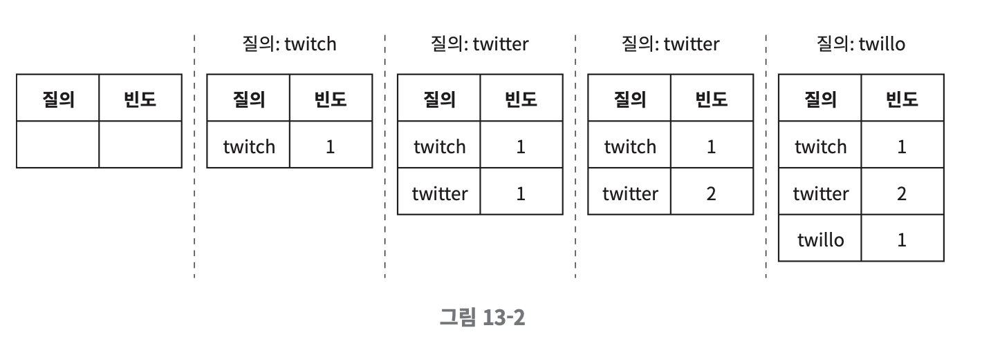

### 질의 서비스
사용자가 "tw"를 검색창에 입력하면 아래의 빈도 테이블에서 빈도수가 높은 5개를 정렬하여 자동 완성 검색어가 표시 되어야 함

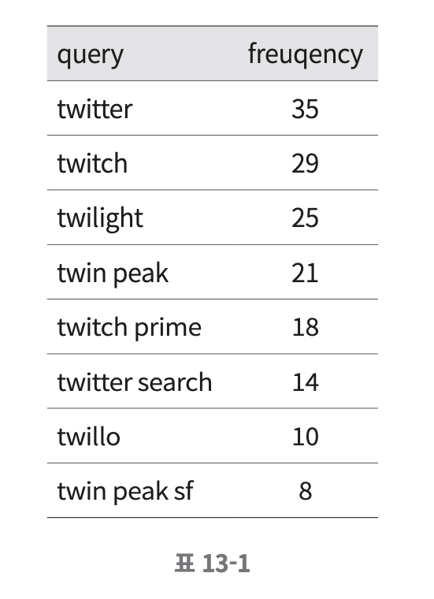

가장 많이 사용된 5개의 검색어는 아래 SQL 질의문을 사용해 계산할 수 있음

SELECT * FROM frequency_table
WHERE query Like `prefix%`
ORDER BY frequency DESC
LIMIT 5;

-> 데이터 양이 적을 떄는 나쁘지 않은 설계
-> 데이터가 많아진다면 데이터베이스 병목이 될 수 있음

## 3단계) 상세 설계
- 트라이(trie) 자료 구조
- 데이터 수집 서비스
- 질의 서비스
- 큐모 확장이 가능한 저장소
- 트라이 연산

### 트라이 자료 구조
관계형 db를 저장소로 사용 -> 효율적이지 않음

#### 트라이 (trie)
문자열을 저장하고 효율적으로 탐색하기 위한 트리 형태의 자료구조

- 트리 형태의 자료구조
- 루트 노드는 빈 문자열을 나타냄
- 각 노드는 글자 하나를 저장하며 26개의 자식 노드를 가질 수 있음
- 각 트리 노드는 하나의 단어, 또는 접두어 문자열을 나타냄

아래는 tree, try, true, toy, wish, win 가 보관된 트라이
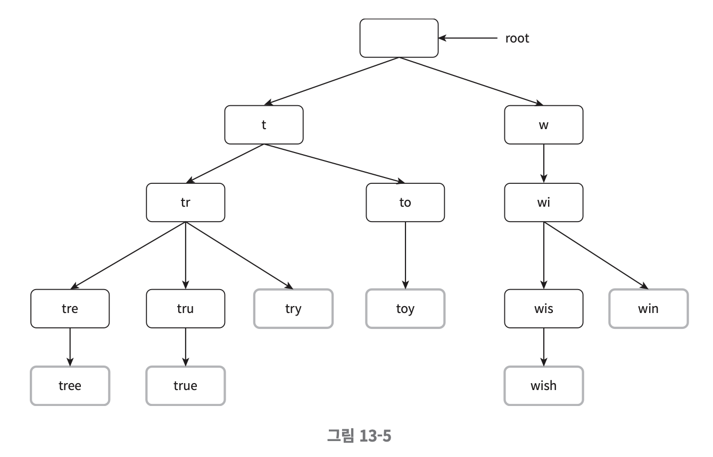
빈도에 따라 정렬된 결과를 내놓기 위해 트라이에 빈도 정보도 저장해야 함
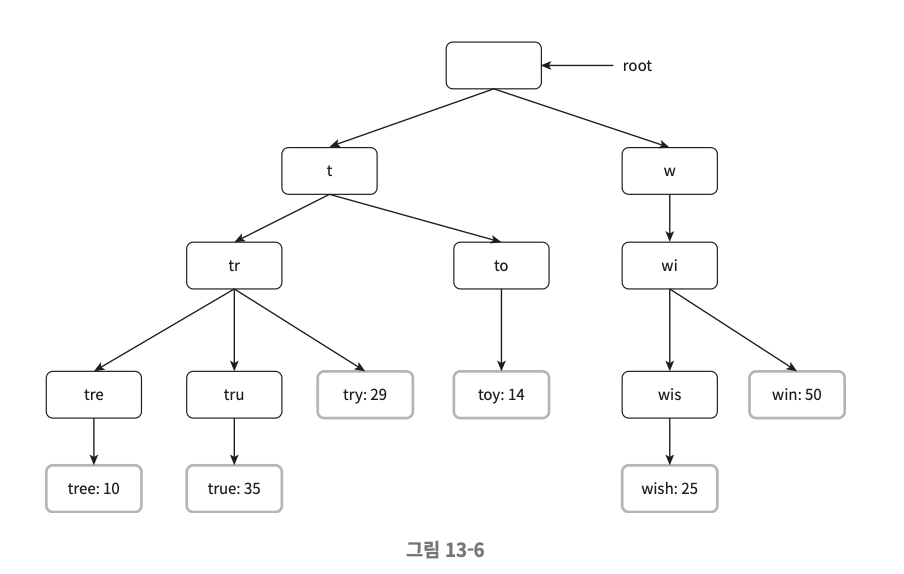

- p: 접두사(prefix)의 길이
- n: 트라이 안에 있는 노드 개수
- c: 주어진 노드의 자식 노드 개수

가장 많이 사용된 질의어 k개는 다음과 같이 찾을 수 있음
- 해당 접두어를 표현하는 노드를 찾음. 시간 복잡도 O(p)
- 해당 노드부터 시작하는 하위 트리를 탐색하여 모든 유효 노드를 찾음. 시간복잡도 O(c)
- 유효 노드들을 정렬하여 가장 인기 있는 검색어 k개를 찾음. 시간복잡도 O(clogc)

전체 알고리즘 복잡도 = O(p) + O(c) + O(clogc)

예제) k=2이고, 사용자가 검색창에 “be”를 입력한 경우

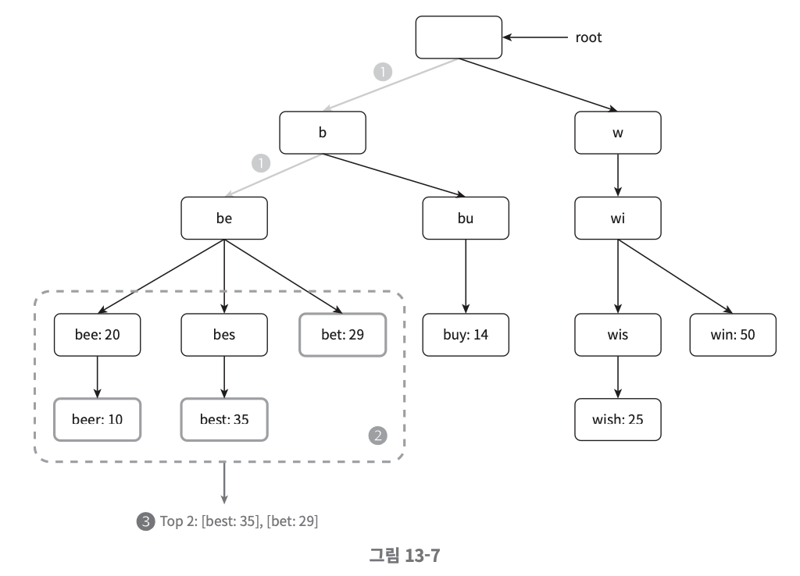

1. 접두어 노드 be 찾음
2. 해당 노드부터 시작하는 하위 트리를 탐색하여 모든 유효 노드를 찾음
   [beer: 10], [best: 35], [bet: 29]가 유효 노드
3. 유효 노드를 정렬하여 2개만 골라낸다. [best: 35], [bet: 29]

→ 최악의 경우 전체 트라이를 다 검색해야 하는 일이 생길 수 있음!
- 접두어의 최대 길이를 제한
- 각 노드에 인기 검색어를 캐시

### 접두어 최대 길이 제한
- 사용자가 검색창에 긴 검색어를 입력하는 일은 거의 없음.
- 따라서 p값은 작은 정숫값이라고 가정해도 안전함.
→ 시간복잡도는 O(p)에서 O(작은 상숫값) = O(1)로 바뀔 것임.

### 노드에 인기 검색어 캐시
각 노드에 k개의 인기 검색어를 저장해두면 전체 트라이를 검색하는 일을 방지 할 수 있음. 시간복작도 O(1)

- 각 노드에 질의어를 저장할 공간이 많이 필요하게 된다는 단점이 있음

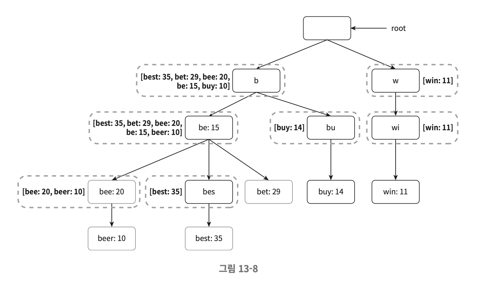
각 단계의 시간 복잡도가 O(1)로 바뀐 덕분에 최고 인기 검색어 k개를 찾는 전체 알고리즘의 복잡도는 O(1)로 바뀌게 됨

### 데이터 수집 서비스
지금까지의 설계안은 사용자가 검색창에 뭔가 타이핑을 할 때마다 실시간으로 데이터를 수정함

- 매일 수천만 건의 질의가 입력될 텐데 그때마다 트라이를 갱신하면 질의 서비스는 심각하게 느려질 것
- 일단 트라이가 만들어지고 나면 인기 검색어는 그다지 자주 바뀌지 않을 것임

트위터같은 실시간 애플리케이션이라면 항상 신선하게 유지할 필요가 있지만

구글 검색 같은 애플리케이션은 그렇게 자주 바꿔줄 이유는 없음
→ 용례에 따라 서비스를 설계하면 됨

수정된 데이터 분석 서비스의 설계안.

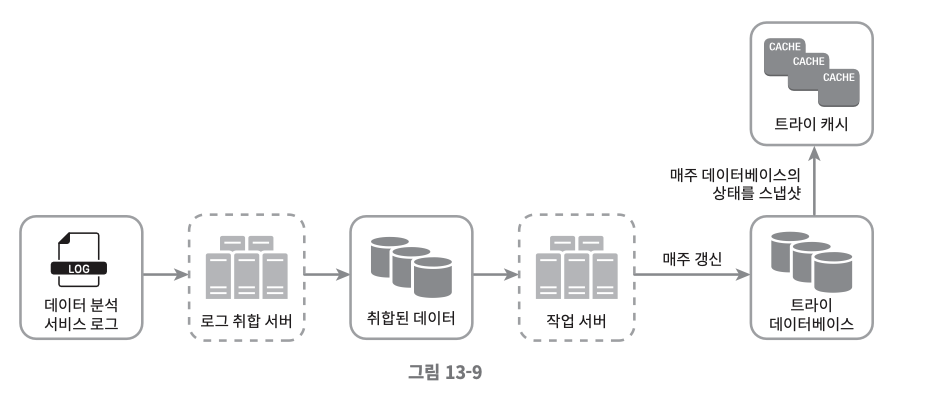

#### 데이터 분석 서비스 로그
- 검색창에 입력된 질의에 관한 원본 데이터가 보관.
- 데이터가 추가될 뿐 수정은 이루워지지 않으며 로그 데이터에는 인덱스를 걸지 않음
  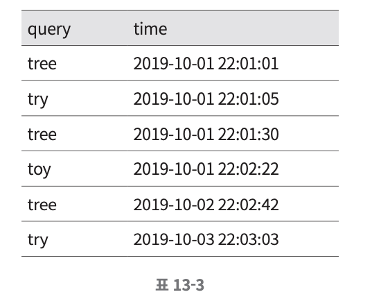

#### 로그 취합 서버
- 트위터와 같은 실시간 애플리케이션 → 데이터 취합 주기를 짧게 가져가는 것이 좋음
- 대부분의 경우 → 일주일에 한 번 정도로 로그를 취합

#### 취합한 데이터

#### 작업 서버
작업 서버(worker)는 주기적으로 비동기적 작업(job)을 실행하는 서버 집합.
트라이 자료구조를 만들고 트라이 데이터베이스에 저장하는 역할을 담당

#### 트라이 캐시
매주 트라이 데이터베이스의 스냅샷을 떠서 갱신함

#### 트라이 데이터베이스
트라이 데이터베이스는 지속성 저장소.
트라이 데이터베이스로 사용할 수 있는 선택지로는…
1. 문서 저장소
  - 새 트라이를 매주 만들 것이므로 주기적으로 트라이를 직렬화하여 데이터베이스에 저장할 수 있음
  - 몽고디비 같은 문서 저장소로 활용 가능
2. 키-값 저장소
   - 해시 테이블 형태로 변환 가능
   - 트라이에 보관된 모든 접두어를 해시 테이블 키로 변환
   - 각 트라이 노드에 보관된 모든 데이터를 해시 테이블 값을 변환

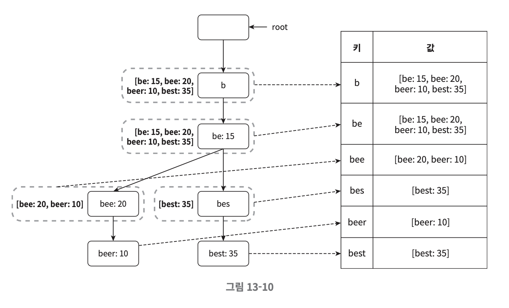

### 질의 서비스

1. 검색 질의가 로드밸런서로 전송
2. 로드밸런서는 해당 질의를 API 서버로 전달
3. API 서버는 트라이 캐시에서 데이터를 가져와 자동완성 검색어 제안 응답을 구성
4. 데이터가 트라이 캐시에 없는 경우 트라이 데이터베이스에서 가져와 캐시에 채움.

질의 서비스는 빠르게 동작해야 하므로 아래와 같은 최적화 방안을 생각할 수 있음
- AJAX 요청 
  - 요청을 보내고 받기 위해 페이지를 새로고침 할 필요가 없음
- 브라우저 캐싱 
  - 제안된 검색어들을 브라우저 캐시에 넣어두면 후속 질의의 결과는 해당 캐시에서 바로 가져갈 수 있음. 
- 데이터 샘플링 
  - 모든 질의 결과를 로깅하도록 하면 CPU 자원과 저장공간을 많이 소진하게 됨.
  - 데이터 샘플링 기법은 N개 요청 가운데 1개만 로깅하도록 하는 것.

### 트라이 연산

#### 트라이 생성
작업 서버가 담당하며, 로그나 데이터베이스로부터 취합된 데이터를 이용하여 트라이를 생성함

#### 트라이 갱신
- 매주 한 번 갱신하는 방법
  - 새로운 트라이를 만든 다음 기존 트라이를 대체함
- 트라이의 각 노드를 개별적으로 갱신하는 방법
  -  성능이 좋지 않다. (노드를 갱신할 때 모든 상위 노드도 갱신해야 하는데, 노드에 캐시도 보관되기 때문에..)
  - 트라이가 작을때는 고려해봄직한 방안.

#### 검색어 삭제
- 혐오성, 폭력적 등.. 여러 가지로 위험한 질의어를 자동완성 결과에서 제거
- 트라이 캐시 앞에 필터 계층을 두고 부적절한 질의어가 반환되지 않도록 할 수 있음.

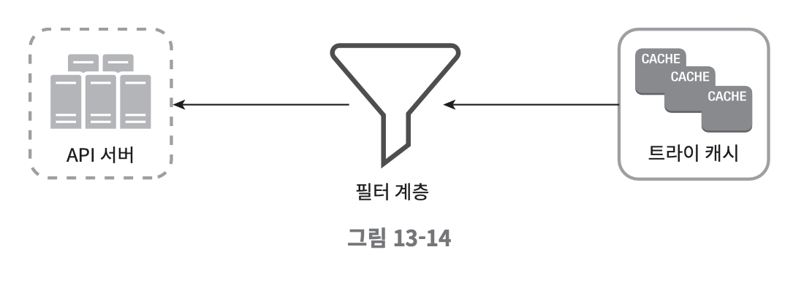

#### 저장소 규모 확장
트라이의 크기가 한 서버에 넣기엔 너무 큰 경우 대응할 수 있도록 규모 확장성 문제를 해결해보자

영어만 지원하면 되기 때문에, 간단하게는 첫 글자 기준으로 샤딩하는 방법을 생각해 볼 수 있음
- 두 대의 서버가 필요한 경우
  - ‘a’부터 ‘m’까지로 시작하는 검색어는 첫 번째 서버에, 나머지는 두 번째 서버에 저장한다.
- 세 대의 서버가 필요한 경우 
  - ‘a’부터 ‘i’까지는 첫 번째 서버에, ‘j’부터 ‘r’까지는 두 번째 서버에, 나머지는 세 번째 서버에 저장한다.

- ‘a’로 시작하는 검색어를 네 대의 서버에 나눠서 보관하고 싶다면… 
  - ‘aa’~’ag’, ‘ah’~’an’, ‘ao’~’au’, 나머지로 4개의 서버로 나누어 보관하면 된다.

과거 질의 데이터의 패턴을 분석하여 샤딩하는 방법을 사용한다

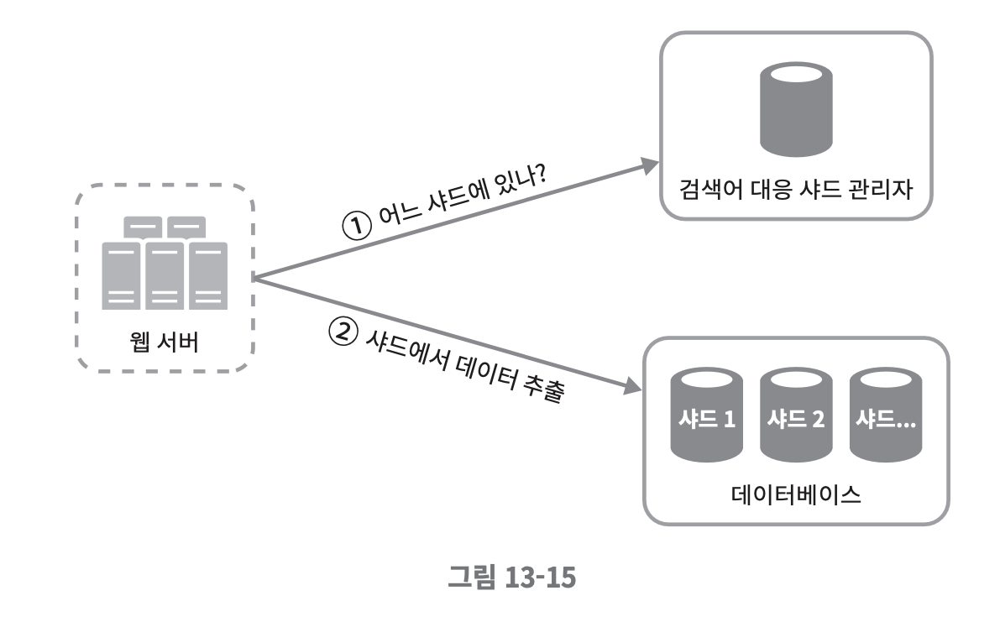
- 검색어 대응 샤드 관리자는 어떤 검색어가 어느 저장소 서버에 저장되는지에 대한 정보를 관리
- ‘s’로 시작하는 검색어의 양이 ‘u’, ‘v’, ‘w’, ‘x’, ‘y’, ‘z’로 시작하는 검색어를 전부 합친 것과 비슷하다면
    ’s’에 대한 샤드 하나와 ‘u’~’z’까지의 검색어를 위한 샤드 하나를 두어도 충분할 것.

## 4단계) 마무리
다국어 지원은 어떻게 할 수 있을까?
- 유니코드 사용 필요. 트라이에서 유니코드를 저장할 수 있도록. 

국가별로 인기 검색어 순위가 달라야한다면? 
- 국가별로 다른 트라이 구성 
- CDN 이용 고려해볼 수 있음

실시간 성 서비스에도 위 구조가 적용이 가능할까? 
- 실시간으로 트라이 업데이트를 진행하지 않으므로 불가. 
- 실시간 서비스 시, 고려해봐야 할 점 
  - 샤딩 통해 작업 대상 데이터 양 줄이기 
  - 최근 검색어에 높은 가중치 부여하기 
  - 데이터 스트림 형태 고려 → 스트림 프로세싱 시스템 필요(Apache Hadoop, Apache Spark, Apache Kafka 등)