# 13장 검색어 자동완성 시스템

## 1단계: 문제 이해 및 설계 범위 확정
- 빠른 응답 속도
  - 사용자가 검색어를 입력함에 따라 자동완성 검색어도 빨리 표시되어야 함
  - 페이스북 검색어 자동완성 시스템에 관한 문서를 보면, 시스템 응답속도는 100밀리초 이내여야 함
- 연관성
  - 자동 완성되어 출력되는 검색어는 사용자가 입력한 단어와 연관된 것이어야 함
- 정렬
  - 시스템의 계산 결과는 인기도(popularity) 등의 순위 모델(ranking model)에 의해 정렬되어 있어야 함
- 규모 확장성
  - 시스템은 많은 트래픽을 감당할 수 있도록 확장 가능해야 함
- 고가용성
  - 시스템의 일부에 장애가 발생하거나, 느려지거나, 예상치 못한 네트워크 문제가 생겨도 시스템은 계속 사용 가능해야 함

개략적 규모 추정
- 일간 능동 사용자(DAU)는 천만 명으로 가정
- 평균적으로 한 사용자는 매일 10건의 검색을 수행한다고 가정
- 질의할 때마다 평균적으로 20바이트의 데이터를 입력한다고 가정
  - 문자 인코딩 방법으로는 ASCII를 사용한다고 가정할 것이므로, 1문자 = 1바이트
  - 질의문은 평균적으로 4개 단어로 이루어진다고 가정할 것이며, 각 단어는 평균적으로 다섯 글자로 구성된다고 가정 <br>
  -> 질의당 평균 4 * 5 = 20바이트
- 검색창에 글자를 입력할 때마다 클라이언트는 검색어 자동완성 백엔드에 요청을 보냄
  - 평균적으로 1회 검색당 20건의 요청이 백엔드로 전달됨
  - e.g. 검색창에 dinner 검색
    - search?q=d
    - search?q=i
    - search?q=n
    - search?q=n
    - search?q=e
    - search?q=r <br>
 -> 위의 6개 요청이 순차적으로 백엔드에 전송됨
- 대략 초당 24,000건의 질의(QPS)가 발생할 것임(=10,000,000사용자 * 10질의 / 일 * 20자 / 24시간 / 3600초)
- 최대 QPS = QPS * 2 = 대략 48,000
- 질의 가운데 20% 정도는 신규 검색어라고 가정
  - 대략 0.4GB 정도임(=10,000,000사용자 * 10질의 / 일 * 20자 * 20%) <br>
  -> 매일 0.4GB의 신규 데이터가 시스템에 추가된다는 뜻

## 2단계: 개략적 설계안 제시 및 동의 구하기
- 데이터 수집 서비스(data gathering service)
  - 사용자가 입력한 질의를 실시간으로 수집하는 시스템
- 질의 서비스(query service)
  - 주어진 질의에 다섯 개의 인기 검색어를 정렬해 내놓는 서비스

### 데이터 수집 서비스
질의문과 사용빈도를 저장하는 빈도 테이블(frequency table)
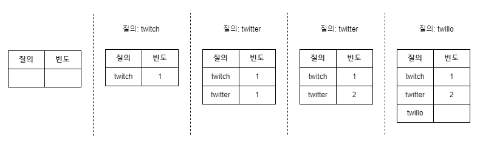

### 질의 서비스
| query | frequency |
| --- | --- |
| twitter | 35 |
| twitch | 29 |
| twilight | 25 |
| twin peak | 21 |
| twitch prime | 18 |
| twitter search | 14 |
| twillo | 10 |
| twin peak sf  | 8 |
- query: 질의문을 저장하는 필드
- frequency: 질의문이 사용된 빈도를 저장하는 필드

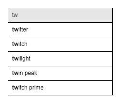
- tw를 검색창에 입력하면 위의 top 5 자동완성 검색어가 표시되어야 함
- 가장 많이 사용된 5개 검색어는 아래의 SQL 질의문 사용해 계산
```sql
SELECT * FROM frequency_table
WHERE query LIKE 'prefix%'
ORDER BY frequency DESC 
LIMIT 5
```

<br>

> 데이터 양이 적을 때는 나쁘지 않은 설계안이지만, 데이터가 많아지면 데이터베이스가 병목이 될 수 있음

## 3단계: 상세 설계
- 트라이(trie) 자료구조
- 데이터 수집 서비스
- 질의 서비스
- 규모 확장이 가능한 저장소
- 트라이 연산

### 트라이 자료구조
트라이
- 문자열들을 간략하게 저장할 수 있는 자료구조
- 트리 형태의 자료구조
- 루트 노드는 빈 문자열을 나타냄
- 각 노드는 글자(character) 하나를 저장하며, 26개의 자식 노드를 가질 수 있음
- 각 트리 노드는 하나의 단어, 또는 접두어 문자열(prefix string)을 나타냄
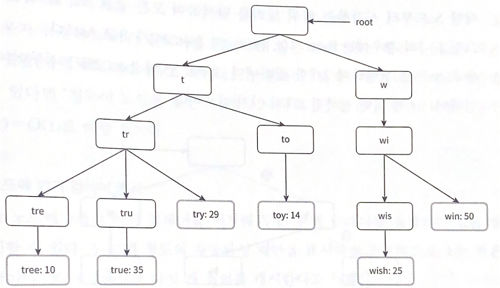
- 빈도 정보를 트라이 노드에 저장

```
- p: 접두어(prefix)의 길이
- n: 트라이 안에 있는 노드 개수
- c: 주어진 노드의 자식 노드 개수
```

가장 많이 사용된 질의어 k개를 찾는 방법
- 해당 접두어를 표현하는 노드를 찾음. 시간 복잡도는 O(p)
- 해당 노드부터 시작하는 하위 트리를 탐색하여 모든 유효 노드를 찾음
  - 유효한 검색 문자열을 구성하는 노드가 유효 노드임. 시간 복잡도는 O(c)
- 유효 노드들을 정렬하여 가장 인기 있는 검색어 k개를 찾음. 시간 복잡도는 O(clogc)

<br>

> 예제: k = 2, 사용자가 검색어 'be' 입력

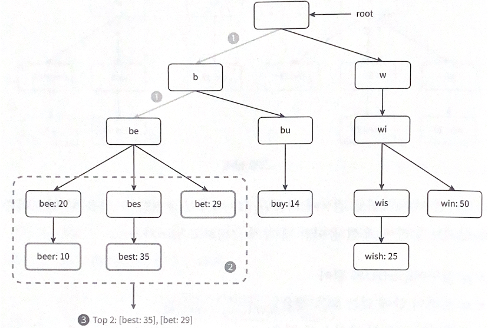
1. 접두어 노드 'be'를 찾음
2. 해당 노드부터 시작하는 하위 노드를 탐색하여 모든 유효 노드를 찾음
   - [beer: 10], [best: 35], [bet: 29]가 유효 노드
3. 유효 노드를 정렬하여 2개만 골라냄
   - [best: 35], [bet: 29]가 접두어 'be'에 대해 검색된 2개의 인기 검색어임

알고리즘의 시간 복잡도
- O(p) + O(c) + O(clogc)
- 최악의 경우, k개 결과를 얻으려고 전체 트라이를 다 검색해야 할 수도 있음
  - 해결 방법
    1. 접두어의 최대 길이 제한
    2. 각 노드에 인기 검색어 캐시

#### 접두어 최대 길이 제한
- 접두어 노드를 찾는 단계의 시간 복잡도는 O(p)에서 O(1)로 바뀜

#### 노드에 인기 검색어 캐시
- 각 노드에 k개의 인기 검색어를 저장해 전체 트라이를 검색하는 일을 방지할 수 있음
- 검색어를 질의하는 시간 복잡도를 엄청나게 낮출 수 있음
- 각 노드에 질의어를 저장할 공간이 많이 필요하게 됨
  - 빠른 응답 속도가 중요할 때 사용

**개선된 트라이 구조** 
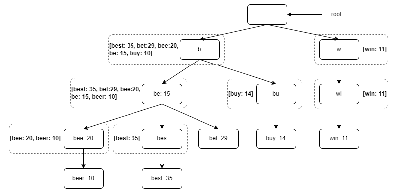
- 각 노드에 가장 인기있는 검색어 5개 저장
- e.g. 접두어 be를 나타내는 노드에는 [best: 35, bet: 29, bee: 20, be: 15, beer: 10] 캐시

두 가지 최적화 기법을 적용한 시간 복잡도
1. 접두어 노드를 찾는 시간 복잡도는 O(1)로 바뀜
2. 최고 인기 검색어 5개를 찾는 질의의 시간 복잡도도 O(1)로 바뀜
  - 검색 결과가 이미 캐시되어 있기 때문에 <br>
-> 각 단계의 시간 복잡도가 O(1)로 바뀌어, 최고 인기 검색어 k개를 찾는 전체 알고리즘의 복잡도도 O(1)로 바뀌게 됨

### 데이터 수집 서비스
앞서 본 설계안의 문제점
- 매일 수천만 건의 질의가 입력될 때마다 트라이를 갱신하면 질의 서비스는 심각하게 느려짐
- 일단 트라이가 만들어지고 나면 인기 검색어는 자주 바뀌지 않을 것임 
  - 트라이를 자주 갱신할 필요 없음

데이터 분석 서비스의 수정된 설계안
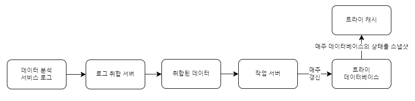

### 데이터 분석 서비스 로그
| query | time |
| --- | --- |
| tree | 2019-10-01 22:01:01 |
| try | 2019-10-01 22:01:05 |
| tree | 2019-10-01 22:01:30 |
| toy | 2019-10-01 22:02:22 |
| tree | 2019-10-01 22:02:42 |
| try | 2019-10-01 22:03:03 |
- 검색창에 입력된 질의에 관한 원본 데이터 보관됨
- 새로운 데이터가 추가될 뿐 수정은 이루어지지 않음 
- 로그 데이터에는 인덱스를 걸지 않음

#### 로그 취합 서버
- 데이터 분석 서비스로부터 나오는 로그는 보통 그 양이 엄청나고 데이터 형식도 제각각인 경우 많음
- 데이터를 잘 취합하여 우리 시스템이 쉽게 소비할 수 있도록 해야 함
- e.g. 트위터와 같은 실시간 애플리케이션
  - 결과를 빨리 보여주는 것이 중요
  - 데이터 취합 주기를 보다 짧게 가져갈 필요성
- e.g. 대부분의 경우
  - 일주일에 한 번 정도로 로그를 취합해도 충분 <br>
-> 데이터 취합의 실시간성이 얼마나 중요한지 확인하는 것 중요

#### 취합된 데이터
| query | time | frequency |
| --- | --- | --- |
| tree | 2019-10-01 | 12000 |
| tree | 2019-10-08 | 15000 |
| tree | 2019-10-15 | 9000 |
| toy | 2019-10-01 | 8500 |
| toy | 2019-10-08 | 6256 |
| toy | 2019-10-15 | 8866 |
- time 필드는 해당 주가 시작한 날짜
- frequency 필드는 해당 질의가 해당 주에 사용된 횟수의 합

#### 작업 서버
- 주기적으로 비동기적 작업(job)을 실행하는 서버 집합
- 트라이 자료구조를 만들고 트라이 데이터베이스에 저장하는 역할을 담당

#### 트라이 캐시
- 분산 캐시 시스템
- 트라이 데이터를 메모리에 유지하여 읽기 연산 성능을 높이는 구실을 함
- 매주 트라이 데이터베이스의 스냅샷을 떠서 갱신함

#### 트라이 데이터베이스
- 지속성 저장소
1. 문서 저장소(document store)
   - 새 트라이를 매주 만드므로 주기적으로 트라이를 직렬화하여 데이터베이스에 저장할 수 있음
   - 몽고디비(MongoDB) 같은 문서 저장소를 활용하면 이런 데이터를 편리하게 저장할 수 있음
2. 키-값 저장소
   - 트라이는 아래 로직을 적용하면 해시 테이블 형태로 변환 가능함
     - 트라이에 보관된 모든 접두어를 해시 테이블 키로 변환
     - 각 트라이 노드에 보관된 모든 데이터를 해시 테이블 값으로 변환

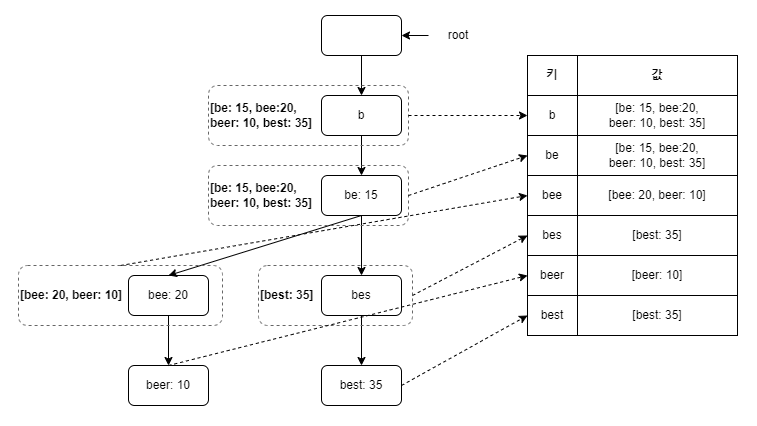  
- 트라이를 해시 테이블로 대응
- 각 트라이 노드는 하나의 <키, 값> 쌍으로 변환됨

### 질의 서비스
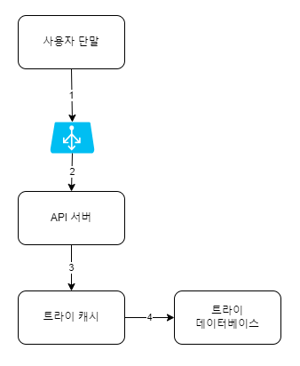
1. 검색 질의가 로드밸런서로 전송됨
2. 로드밸런서는 해당 질의를 API 서버로 보냄
3. API 서버는 트라이 캐시에서 데이터를 가져와 해당 요청에 대한 자동완성 검색어 제안 응답을 구성함
4. 데이터가 트라이 캐시에 없는 경우, 데이터를 데이터베이스에서 가져와 캐시에 채움
  - 그래야 다음에 같은 접두어에 대한 질의가 오면, 캐시에 보관된 데이터를 사용해 처리할 수 있음
  - 캐시 미스(cache miss)는 캐시 서버의 메모리가 부족하거나 캐시 서버에 장애가 있어도 발생할 수 있음

질의 서비스의 속도를 높이기 위한 최적화 방안
- AJAX 요청(request)
  - 웹 애플리케이션의 경우, 브라우저는 보통 AJAX 요청을 보내 자동완성된 검색어 목록을 가져옴
  - 장점: 요청을 보내고 받기 위해 페이지를 새로고침 할 필요가 없음
- 브라우저 캐싱(browser caching)
  - 대부분 애플리케이션의 경우 자동완성 검색어 제안 결과는 짧은 시간 안에 자주 바뀌지 않음 <br>
  -> 제안된 검색어들을 브라우저 캐시에 넣어두면 후속 질의의 결과는 해당 캐시에서 바로 가져갈 수 있음 <br>
  e.g. 구글 검색 엔진
  구글 검색 엔진에 system design interview라고 입력했을 때 날아오는 응답 헤더
  - 제안된 검색어를 한 시간동안 캐시해둠
  - cache-control 헤더 값에 등장하는 private은 해당 응답이 요청을 보낸 사용자의 캐시에만 보관될 수 있으며 공용 캐시에 저장되어서는 안 된다는 뜻
  - max - age = 3600은 해당 캐시 항목은 3600초, 즉 한 시간동안 유효하다는 뜻
- 데이터 샘플링(data sampling)
  - 대규모 시스템의 경우, 모든 질의 결과를 로깅하도록 해놓으면 CPU 자원과 저장공간을 엄청나게 소진하게 됨 <br>
  -> 이럴 때, 데이터 샘플링 기법 유용. N개 요청 가운데 1개만 로깅하도록 함

### 트라이 연산
- 트라이는 검색어 자동완성 시스템의 핵심 컴포넌트

#### 트라이 생성
- 트라이 생성은 작업 서버가 담당
- 데이터 분석 서비스의 로그나 데이터베이스로부터 취합된 데이터를 이용함

#### 트라이 갱신
1. 매주 한 번 갱신하는 방법
   - 새로운 트라이를 만든 다음에 기존 트라이를 대체함
2. 트라이의 각 노드를 개별적으로 갱신하는 방법
   - 성능이 좋지 않지만, 트라이가 작을 때는 고려볼만함
   - 트라이 노드를 갱신할 때는 모든 상위 노드(ancestor)도 갱신해야 함 
     - 상위 노드에도 인기 검색어 질의 결과가 보관되기 때문
   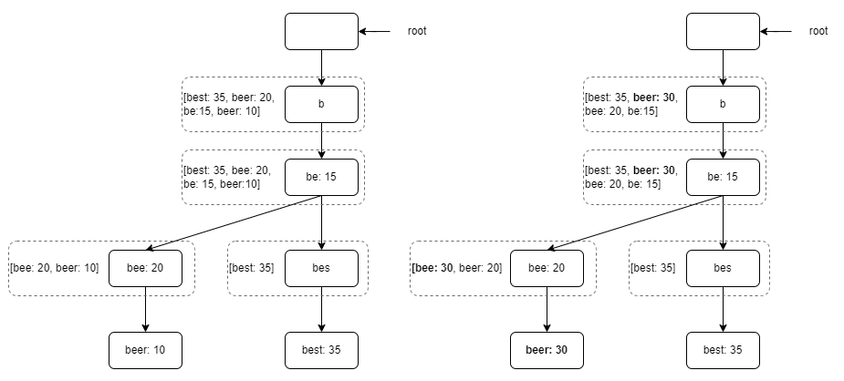
     - 검색어 'beer'의 이용 빈도를 10에서 30으로 갱신
     - 해당 노드에 기록된 'beer' 이용 빈도는 전부 30으로 바뀜
     - 해당 노드의 상위 노드들에 기록된 이용 빈도 수치도 전부 30으로 갱신됨

#### 검색어 삭제
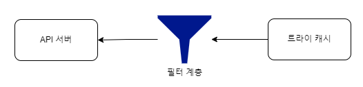
- 혐오성이 짙거나, 폭력적이거나, 성적으로 노골적이거나, 여러 가지로 위험한 질의어를 자동완성 결과에서 제거해야 함 <br>
-> 트라이 캐시 앞에 필터 계층(filter layer)을 두고 부적절한 질의어가 반환되지 않도록 함
- 장점
  - 필터 규칙에 따라 검색 결과를 자유롭게 변경할 수 있음
  - 데이터베이스에서 해당 검색어를 물리적으로 삭제하는 것은 다음 업데이트 사이클에 비동기적으로 진행하면 됨

### 저장소 규모 확장
- 트라이의 크기가 산 서버에 넣기가 너무 큰 경우에도 대응할 수 있게 함
- 첫 글자를 기준으로 샤딩(sharding)하는 방법 (영어만 지원하면 되기 때문에)
  - 검색어를 보관하기 위해 두 대 서버가 필요하다면 'a'부터 'm'까지 글자로 시작하는 검색어는 첫 번째 서버에 저장하고, 나머지는 두 번째 서버에 저장
  - 세 대 서버가 필요하다면 'a'부터 'i'까지는 첫 번째 서버에, 'j'부터 'r'까지는 두 번째 서버에, 나머지는 세 번째 서버에 저장

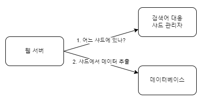
- 사용가능한 서버는 최대 26대로 제한됨 
  - 영어 알파벳에는 26자밖에 없기 때문에
  - 이 이상으로 서버 대수를 늘리려면 샤딩을 계층적으로 해야 함
    - e.g. a로 시작하는 검색어를 4대 서버에 나눠 보관
      - aa부터 ag까지 첫 번째 서버, ah부터 an까지 두 번째 서버, ao부터 au까지 세 번째 서버, 나머지는 네 번째 서버에 보관
      - c로 시작하는 단어가 x로 시작하는 단어보다 많음 <br>
      -> 데이터를 각 서버에 균등하게 배분하는 것 불가능 <br>
-> 과거 질의 데이터의 패턴을 분석하여 샤딩 <br>
  - 검색어 대응 샤드 관리자(shard map manager)는 어떤 검색어가 어느 저장소 서버에 저장되는지에 대한 정보를 관리
  - 예를 들어, s로 시작하는 검색어의 양이 u, v, w, x, y, z로 시작하는 검색어를 전부 합친 것과 비슷하다면, s에 대한 샤드 하나와 u부터 z까지의 검색어를 위한 샤드 하나를 두어도 충분

## 4단계: 마무리
- 다국어 지원이 가능하도록 시스템 확장 <br>
-> 트라이에 유니코드(unicode) 데이터 저장
  - 유니코드: 고금을 막론하고 세상에 존재하는 모든 문자 체계를 지원하는 표준 인코딩 시스템
- 국가별로 인기 검색어 순위가 다른 경우 <br>
-> 국가별로 다른 트라이 사용. 트라이를 CDN에 저장하여 응답속도를 높일 수 있음
- 실시간으로 변하는 검색어 추이 반영 <br>
-> 새로운 뉴스 이벤트가 생기는 등 특정 검색어의 인기가 갑자기 높아질 수 있음. 하지만, 현 설계안은 그런 검색어를 지원하기에 적합하지 않음
  - 작업 서버가 매주 한 번씩만 돌도록 되어 있어, 시의적절하게 트라이를 갱신할 수 없음
  - 때맞춰 서버가 실행된다 해도, 트라이를 구성하는데 너무 많은 시간이 소요됨

실시간 검색어 자동완성 시스템을 구축하는데 도움이 되는 아이디어
- 샤딩을 통해 작업 대상 데이터의 양을 줄임
- 순위 모델(ranking model)을 바꿔 최근 검색어에 보다 높은 가중치를 두도록 함
- 데이터가 스트림 형태로 올 수 있다는 점, 즉 한 번에 모든 데이터를 동시에 사용할 수 없는 가능성이 있다는 점을 고려
  - 데이터가 스트리밍된다는 것은 데이터가 지속적으로 생성된다는 뜻
  - 스트림 프로세싱에는 특별한 종류의 시스템이 필요함
    - e.g. 아파치 하둡 맵리듀스(Apache Hadoop MapReduce), 아파치 스파크 스트리밍(Apach Spark Streaming), 아파치 스톰(Apache Storm), 아파치 카프카(Apache Kafka) 등