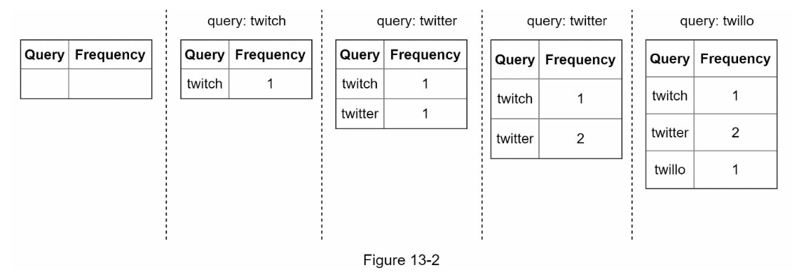
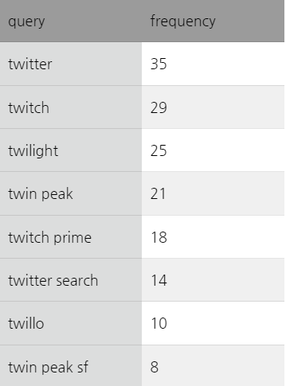
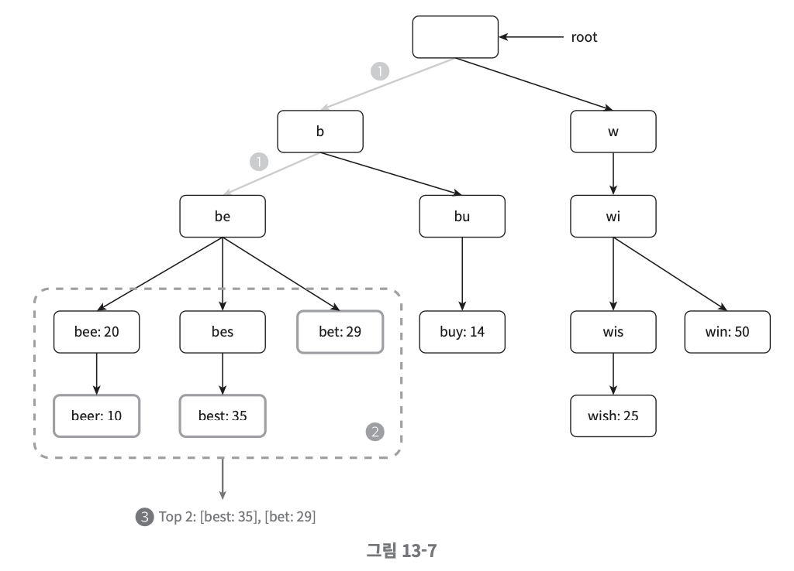
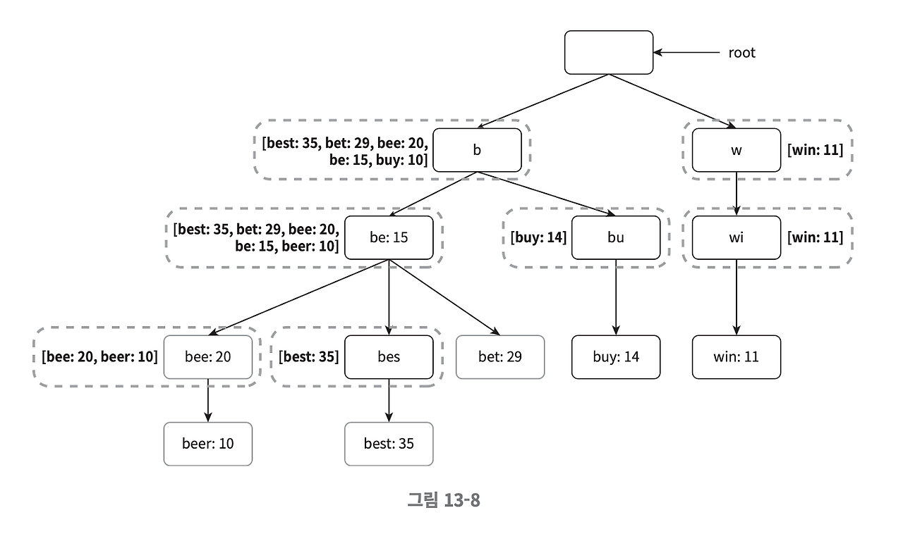
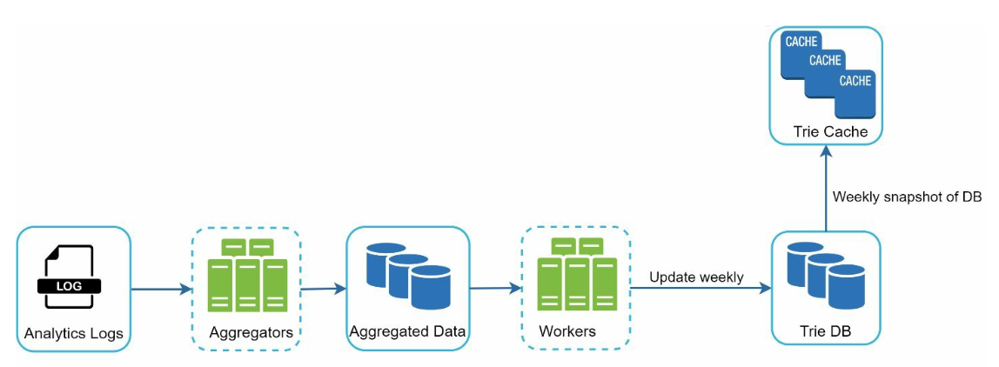
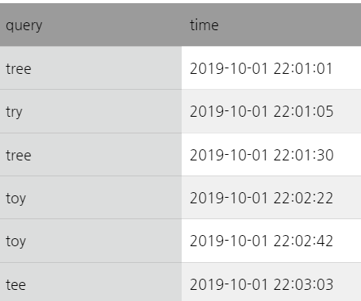
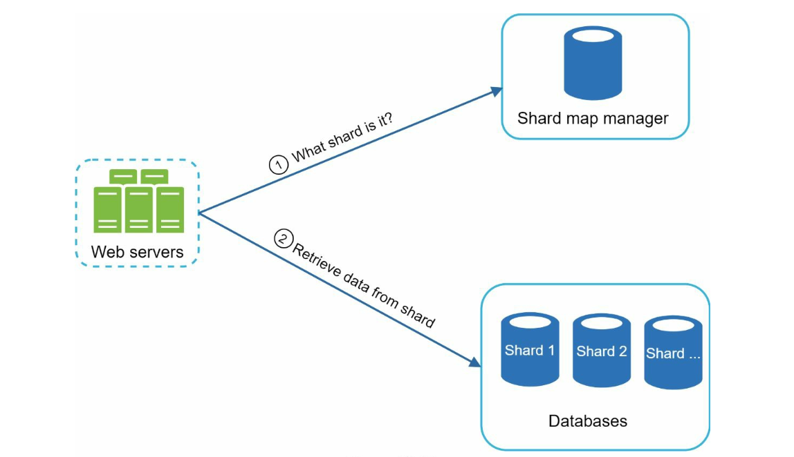

요구사항 예시
1. 자동완성될 검색어는 첫 부분으로 한정
2. 5개의 자동완성 검색어가 표시되어야 함
3. 인기 순위를 기준으로 5개의 검색어를 표시 
4. 맞춤법 검사나 자동수정은 지원하지 않음 
5. 질의어은 영어지만 다국어 지원을 생각하면 좋음 
6. 질의는 영어 소문자로 이루어짐 
7. DAU 천만 명 

위 요구사항을 정리하자면 다음과 같다.

- 빠른 응답 속도: 사용자가 검색어를 입력할 때마다 자동완성 검색어도 표시되어야 한다. 
- 연관성: 사용자가 입력한 단어와 연관되어야 한다. 
- 정렬: 인기도 등의 순위 모델에 의해 정렬되어 있어야 한다. 
- 규모 확정성: 시스템은 많은 트랙픽을 감당할 수 있도록 확장 가능해야 한다. 
- 고가용성: 시스템의 문제가 생겨도 가용할 수 있어야 한다.

요구사항의 개략적 추정

- DAU는 천 만명으로 가정 
- 평균적으로 한 사용자는 매일 10건의 검색을 수행한다고 가정 
- 질의할 때마다 평균적으로 20바이트의 데이터를 입력한다고 가정 
  - ASCII를 사용한다고 가정하면, 1 문자 = 1 byte

- 평균적으로 1회 검색당 20건의 요청이 백엔드로 전달된다고 가정 
- 대략 초당 24,000건의 QPS가 발생할 것이고 최대 QPS는 48,000건이 될 것이다. 
  - 천만 사용자 * 10질의 / 일 * 20자 / 24시간 / 3600초

- 질의 가운데 20%는 신규 검색어라고 가정하면 
  - 천만 사용자 * 10질의 / 일 * 20자 * 20%로 매일 0.4GB의 신규 데이터가 시스템에 추가된다


### 개략적 설계


개략적으로 보면 시스템은 데이터 수집 서비스(data gathering service), 질의 서비스(query service)로 나뉜다.

데이터 수집 서비스는 질의문과 사용빈도를 저장하는 빈도 테이블을 두었다고 가정한다면, 사용자가 'twitch', 'twitter', 'twitter', 'twillo' 순서를 검색하면 다음과 같이 빈도 테이블이 바뀌어짐.



질의 서비스는 다음 표과 같이 query, frequency 필드를 가지고 있을 것이다.




이 상태에서 사용자가  "tw"를 입력한다면 다음 SQL를 통해 "twitter", "twitch", "twilight", "twin peak", "twitch prime" 순으로 표시될 것이다.

```
SELECT * 
FROM frequency_table
WHERE query LIKE 'prifix%'
ORDER BY frquency DESC
LIMIT 
```

데이터 양이 적을 때는 나쁘지 않겠지만, 데이터가 아주 많아진다면 데이터베이스의 병목 현상이 발생할 수 있다.

### 개선된 설계

트라이 자료구조, 데이터 수집 서비스, 질의 서비스를 이용하여 앞선 설계를 최적화할 수 있을 것이다.

#### 트라이 자료구조

트라이는 문자열들을 간략하게 저장할 수 있는 자료구조다. 문자열을 꺼내는 연산에 최적화되어 있다.

트라이 자료구조의 핵심 아이디어는 다음과 같다.

- 트라이는 트리형태의 자료구조 
- 루트 노드는 빈 문자열 
- 각 노드는 문자 하나를 저장하며, 26개의 자식노드를 가질 수 있다. 
- 각 트리 노드는 하나의 단어 또는 prefix string을 나타낸다.


이용 빈도에 따라 정렬된 값을 반환하기 위해서 노드에 빈도 정보를 같이 저장한다.



[트라이 자료구조와 노드의 빈도를 입힌 예시]

해당 트라이로 "be"을 입력했다고 가정하고 시간복잡도와 알고리즘을 알아보자.

- p: prefix의 길이 
- n: 트라이 노드 개수 
- c: 주어진 노드의 자식 개수


가장 많이 사용된 질의어 k 개는 다음과 같이 찾을 수 있다. (k = 3이라고 가정)

- 해당 접두어를 표현하는 노드를 찾는다. O(p)
  - b -> be 

- 해당 노드부터 시작하는 하위 트리를 탐색하여 모든 유효 노드를 찾는다. O(n)
  - 유효 노드란? 사용자가 검색한 문자열을 구성하는 노드 
  - 그림 13.7의 경우 [bee: 20], [beer: 10], [best: 35], [bet: 29]가 유효한 노드가 될 것이다.


- 상위  k개 검색어를 정렬한다. O(clogc)
  - [best:35], [bet:29], [bee: 20]
      

따라서 최종 시간 복잡도는 O(p) + O(n) + O(clogc)가 된다.

해당 알고리즘을 최적화하기 위해서 다음 두 가지 방법이 있을 것이다.

- 접두어 최대 길이 제한 
  - p값을 작은 정숫값으로 제한한다면 O(1)이 될 것이다. 
- 노드에 인기 검색어 캐시 
  - 각 노드에 인기 질의어를 캐시 하면 공간 복잡도는 증가하겠지만 시간 복잡도를 엄청나게 낮출 수 있다.



[각 노드에 캐시 적용]

### 데이터 수집 서비스

현재까지 살펴본 설계안은 사용자가 검색창에 타이핑을 할 때마다 실시간으로 데이터를 수정하고 있다. 이 방법은 두 가지 문제를 가지고 있다.

- 매일 수천만 건의 질의가 입력되면 수천 만 번의 트라이가 갱신되면서 서비스가 심각하게 느려짐
- 인기 검색어는 자주 바뀌지 않음 따라서 갱신을 자주 할 필요 없음

따라서 데이터 분석을 하여 어떻게 트라이를 갱신할 것인가 설계안을 수정이 필요하다.


[개선된 설계안]

### 데이터 분석 서비스 로그
데이터 분석 서비스 로그는 검색창에 입력된 검색어에 관한 원본 데이터가 보관된다.



#### 로그 취합 서버

로그 취합 서버는 데이터 분석 로그에 쌓인 데이터를 잘 취합하여 시스템이 쉽게 소비할 수 있도록 해야 한다.

데이터 취합 주기는 요구사항에 달라질 것이다.

ex) 트위터와 실시간 애플리케이션의 경우 취합 주기를 짧게 가져감


#### 트라이 캐시

트라이 캐시는 분산 캐시 시스템으로 트라이 데이터를 메모리에 유지하여 읽기 연산 성능을 높이는 역할을 한다.

취합 주기에 맞게 데이터베이스의 스냅샷을 떠서 갱신한다.

#### 트라이 데이터베이스
트라이 저장소는 MongoDB와 같은 문서 저장소, DynamoDB와 같은 키-값 저장소를 선택할 수 있다.

- Document Store: 트라이를 직렬화하여 데이터베이스에 저장
- Key-Value Store: prefix를 키로 두어 prefix에 해당하는 데이터를 값을 해시 테이블에 저장


#### 저장소 규모 확장

위 요구사항은 영어만 지원하므로 간단하게 첫 글자를 기준으로 샤딩할 수 있다. 하지만 이 방법은 데이터를 각 서버에 균등하게 배분하기가 어렵다.


이 문제를 해결하기 위해, 과거 질의 데이터 패턴을 분석하여 샤딩할 수 있도록 한다.


예를 들면, 샤드 관리자는 's'로 시작하는 검색어의 양이 'u', 'v', 'w', 'x', 'y', 'z'로 시작하는 검색어를 전부 합친 것과 비슷하다면 's'에 대한 샤드 하나와 'u' ~ 'z'까지의 샤드 하나로 둘 수 있다.



[샤드관리자를 통한 샤딩 아키텍처]

### 질의 서비스
질의 서비스는 매우 빨라야 하므로 다음과 같은 최적화 방안을 제안할 수 있다.

- AJAX 요청: 요청을 보내고 받기 위해 페이지를 새로고침 할 필요 없음 
- 브라우저 캐싱: 대부분의 애플리케이션의 경우 자동완성 검색어 제안 결과는 짧은 시간 안에 자주 바뀌지 않으므로 브라우저 캐시에 넣어두면 후속 질의어 결과는 해당 캐시에서 바로 가져갈 수 있음 
- 데이터 샘플링: N개 요청 가운데 1개만 로깅

### 트라이 연산

#### 트라이 생성

트라이는 worker에서 담당하며, 데이터 분석  서비스의 로그나 데이터베이스로부터 취합된 데이터를 이용한다.


#### 트라이 갱신

트라이 갱신은 두 가지 방법이 있다.

- 매주 한 번 갱신: 새로운 트라이를 만든 다음 기존 트라이 대체
- 트라이의 각 노드 갱신: 트라이가 작을 때는 고려해 볼 수 있지만 트라이가 크다면 성능이 떨어짐


#### 검색어 삭제

혐오성, 폭력적, 선정적 성질을 가진 검색어는 필터 계층을 두고 자동완성 결과에서 제거한다.

### 마무리
- 다국어 지원: 유니코드로 저장 
- 국가별 인기 검색어 지원: CDN 활용 
  - 실시간 검색어 추이 지원 
  - 샤딩을 통하여 작업 대상 데이터 양을 줄인다.
  
  - 순위 모델을 바꾸어 최근 검색어에 보다 높은 가중치를 준다.
  
  - 스트림 형태의 데이터를 지원하기 위해 아파치 카프카, 아파치 하둡 맵리듀스 등의 시스템을 사용한다.