# 유튜브 설계

## 1단계) 문제 이해 및 설계 범위 확정
- 빠른 비디오 업로드
- 원할한 비디오 재생
- 재생 품질 선택기능
- 낮은 인프라 비용
- 높은 가용성과 규모 확장성, 그리고 안정성
- 지원클라이언트: 모바일앱, 웹브라우저, 그리고 스마트 TV

### 개략적 규모 추정
- 일간 능동 사용자(DAU) : 5 백만
- 한 사용자는 하루에 평균 5 개 비디오 시청
- 10%의 사용자가 하루에 1비디오 업로드
- 비디오 평균 크기는 300MB -> 비디오 저장을 위해 매일 새로 요구되는 저장 용량 -> 5백만 * 10% * 300MB = 150TB
- CDN 비용 -> 5백만 * 5비디오 * 0.3B * $0.02 = $150,000

## 2단계) 개략적 설계안 제시 및 동의 구하기
- 모든 것을 밑바닥 부터 설명하여 말할 필요없음
  - 주어진 시간에 안에 적절한 기술을 골라 설계를 마치고 그 기술 각각이 어떻게 동작하는지 상세히 설명하는게 중요함.

CDN과 BLOB 저장소는 클라우드 이용

개략적으로 보면 이 시스템은 다음 세 개 컴포넌트로 구성됨

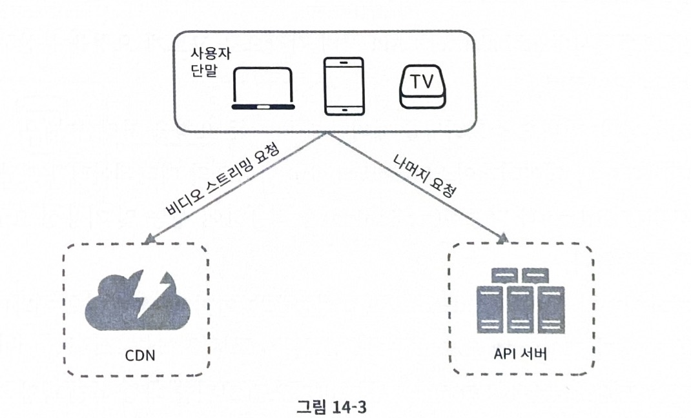

- 단말(client) : 컴퓨터, 모바일 폰, 스마트 TV를 통해서 유튜브를 시청할 수  있음
- CDN : 비디오는 CDN에 저장함. 재생 버튼을 누르면 CDN으로 부터 스트리밍이 이뤄짐
- API 서버: 비디오 스트리밍을 제외한 모든 요청은 API서버에서 처리함. 피드 추천, 비디오 업로드 URL생성, 메타데이터 데이터베이스와 캐시 갱신, 사용자 가입 등

다음 기능에 대한 개략적인 설계

- 비디오 업로드 절차
- 비디오 스트리밍 절차

### 비디오 업로드 절차

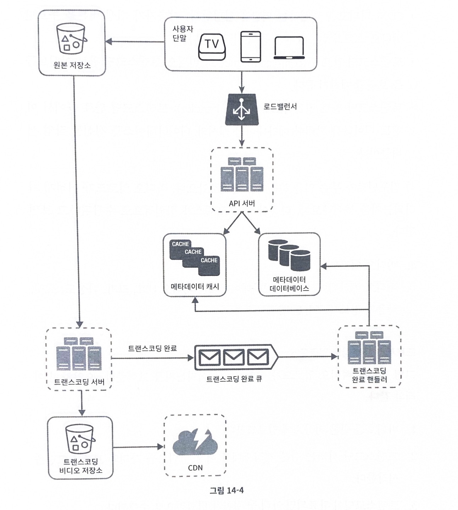

- 로드 밸런서: API 서버 각각으로 고르게 요청을 분산하는 역할을 담당함
- API 서버: 비디오 스트리밍을 제외한 다른 요청을 처리함
- 메타데이터 데이터베이스: 비디오의 메타데이터를 보관함, 샤딩과 다중화를 적용하여 성능 및 가용성 요구사항을 충족함
- 메타데이터 캐시: 성능을 높이기 위해 비디오 메타데이터와 사용자 객체를 캐시함
- 원본 저장소: 원본 비디오를 보관할 대형 이진 파일 저장소 (BLOB, Binary Large Object storage) 시스템임, 
- 트랜스코딩 서버: 비디오 트랜스코딩은 비디오 인코딩이라 불기도 하는 절차로, 비디오 포맷(MPEG, HLS 등)을 변환하는 절차임
  - 단말이나 대역폭 요구사항에 맞는 최적의 비디오 스트림을 제공하기 위해 필요함
- 트랜스코딩 비디오 저장소: 트랜스 코딩이 완료된 비디오를 저장하는 BLOB 저장소
- CDN: 비디오를 캐시하는 역할을 담당
- 트랜스코딩 완료 큐: 비디오 트랜스코딩 완료 이벤트들을 보관할 메시지 큐
- 트랜스코딩 완료 핸들러 : 트랜스코딩 완료 큐에서 이벤트 데이터를 꺼내어 메타데이터 캐시와 데이터베이스를 갱신할 작업 서버들

#### 비디오 업로드 처리 과정
a. 비디오 업로드
b. 비디오 메타데이터 갱신, 메타데이터에는 비디오 URL, 크기, 해상도, 포맷, 사용자 정보가 포함됨

- 이 두가지 프로세스가 병렬적으로 수행됨

<b>프로세스 a : 비디오 업로드</b>
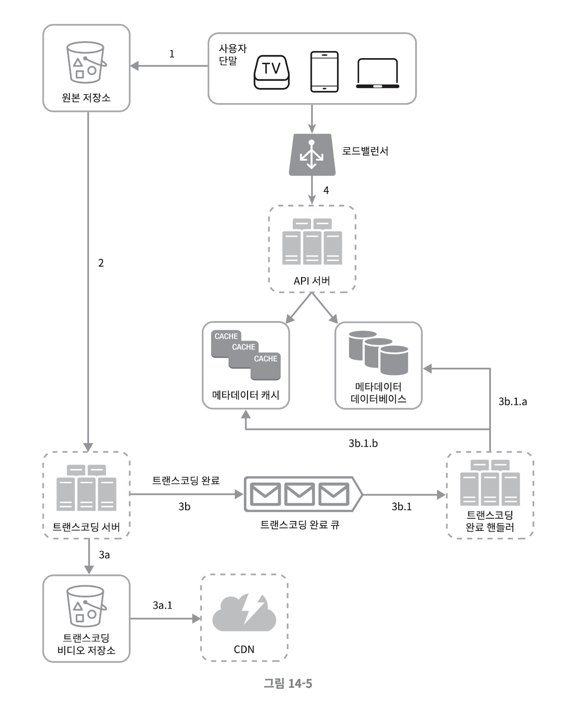

1. 비디오를 원본 저장소에 업로드
2. 트랜스코딩 서버는 원본 저장소에서 해당 비디오를 가져와 트랜스코딩 시작함
3. 트랜스코딩이 완료 되면 아래 두 절차가 병렬적으로 수행됨
   a. 완료된 비디오를 트랜스코딩 비디오 저장소로 업로드함
   b. 트랜스 코딩 완료 이벤트를 트랜스코딩 완료 큐에 넣음
        3a.1. 트랜스코딩이 씉난 비디오를 CDN에 올림
        3b.1. 완료 핸들러가 이벤트 데이터를 큐에서 꺼냄
        3b.1.a, 3b.1.b. 완료 된 핸들러가 메타데이터 데이터베이스와 캐시를 갱신함
4. API 서버가 단말에게 비디오를 업로드가 끝나서 스트리밍 준비가 되었음을 알림

<b>프로세스 b : 메타데이터 갱신</b>
- 원본 저장소에 파일이 업로드 되는 동안 단말은 병렬적으로 비디오 메타데이터(파일 이름, 크기, 포맷) 갱신요청을 보냄

### 비디오 스트리밍 절차
스트리밍 프로토콜
- 비디오 스트리밍을 위해 데이터를 전송할 때 쓰이는 표준 통신 방법
  - ex)
    - MPEG_DASH
    - HLS
    - Microsoft Smooth Streaming
    - HDS

- 각각의 프로토콜을 동작원리를 정확하게 알 필요도 없고 외울 필요는 없음 
- 다만 기억하는 해야하는 것은 프로토콜마다 지원하는 비디오 인코딩이 다르고 플레이어도 다름

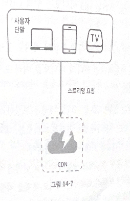

- 비디오는 CDN 에서 바로 스트리밍 된다. 사용자의 단말에 가장 가까운 CDN 에지 서버가 비디오 전송을 담당함
## 3단계) 상세 설계
### 비디오 트랜스코딩
업로드된 비디오가 다른 단말에서 순조롭게 재생되려면 다른 단말과 호홚되는 비트레이트와 포맷으로 저장되어야함

비트레이트 : 비디오를 구성하는 비트가 얼마나 빨리 처리되어야 하는지를 나타냐는 단ㄷ위
- 비트레이트가 높으면 ㄱ화질
  - 높은 성능의 컴퓨터 파워가 필요

#### 비디오 트랜스코딩이 중요한 이유
- 가공되지 않은 원본 비디오는 저장공간을 많이 차지함
- 사ㅇ당수의 단말과 브라우저는 특정 종류의 비디오 포맷만 지원함
  - 호환성 문제 해결
- 사용자에게 끊김 없는 고화질 비디오 재생 보장하려면 네트워크 대역폭이 충분하지 않은 사용자에게는 저화질 비디오를, 대역폭이 충분한 사용자에게는 고화질 비디오를 보내는 것이 바람직함
- 모바일 단말의 경우 네트워크 상황이 수시로 달리질 수 있음, 비디오가 끊김없이 재생되도록 하기 위해서는 비디오 화질을 자동으로 변경하거나 수동으로 변경할 수 있게 하는 것이 바람직함

#### 인코딩 포맷
- 컨테이너: 비디오, 파일, 오디오, 메타데이터를 담는 바구니 것은 것
    - .avi, .mov, .mp4 같은 파일 확장자를 보면 할 수 있음
- 코덱: 비디오 화질은 보존하면서 파일 크기를 줄일 목적으로 고안된 압축 및 압추갷제 알고리즘

### 유향 비순환 그래프(DAG) 모델
- 각기 다른 유형의 비디오 프로세싱 파이프라인을 지원하는 한편 처리 과정의 병렬성을 높이기 위해서는 적절한 수준의 추상화를 도입하여 클라이언트 프로그래머로 하여금 실행할 작업을 손수 정의할 수 있도록 해야함
- 사용자는 자신만의 비디오 프로세싱 요구사항을 가지고 있음
ex) 워터마크, 썸네일, 비디오 화질 등
- DAG 모델을 도입하여 유연성과 병렬성을 달성

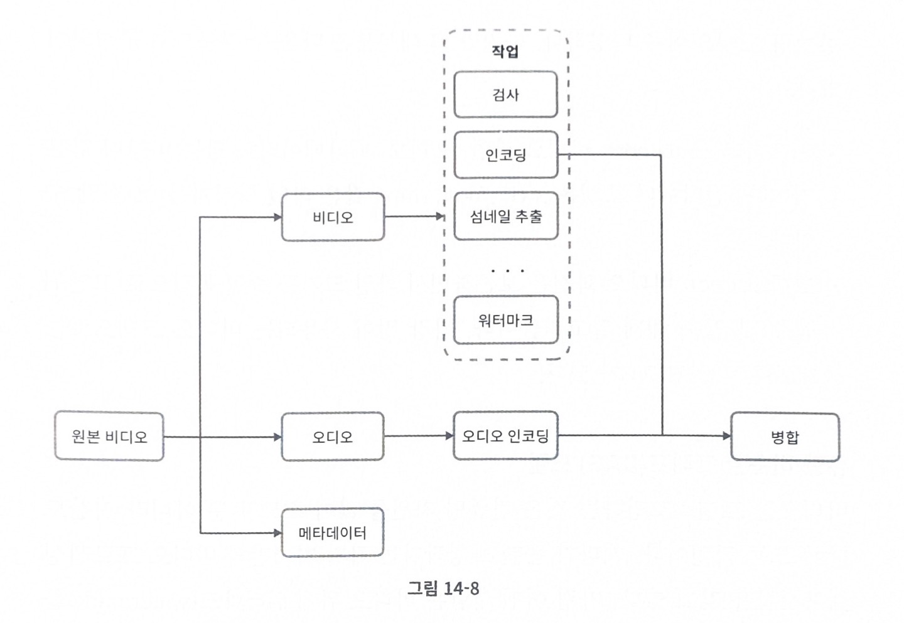

오디오 비디오 메타데이터의 세부분으로 나뉘어 처리 됨

- 검사: 좋은 품질의 비디오인지, 손상은 없는지 확인하는 작업임
- 비디오 인코딩: 비디오를 다양한 해상도, 코덱, 비트레이트 조합으로 인코디ㅣㅇ하는 작업
아래는 그 결과물임

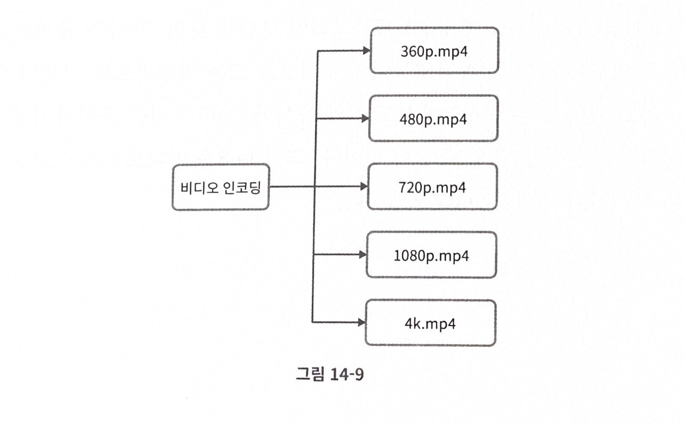

#### 비디오 트렌스코딩 아키텍처
클라우드 서비스를 활용한 아키텍처로 다음과 같이 정의함

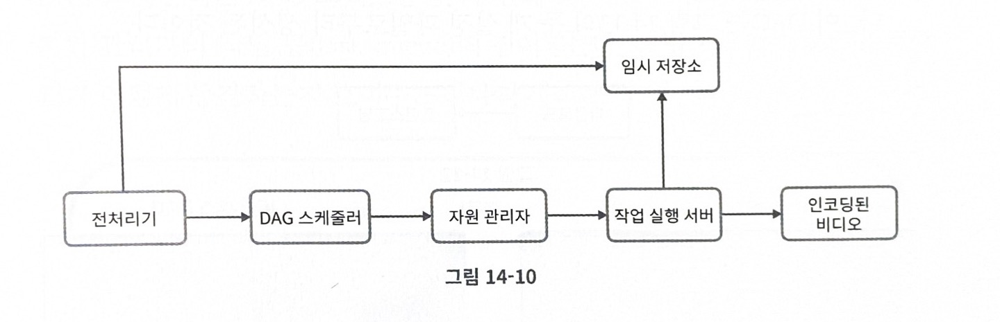

전처리기, DAG 스케줄러, 자원 관리자, 작업 실행서버, 임시 저장소 로 이루어져있음

결과로 인코딩 된 비디오가 만들어짐

<b>전처리기</b>
1. 비디오 분할
    - 비디오 스트림을 GOP(Group of Picture)로 불리는 단위로 쪼갬
    - GOP는 특정 순서로 배열된 프레임 그룹임
    - 하나의 GOP는 독립적으로 재생이 가능함
    - 오래된 단말이나 브라우저는 GOP 비디오 분할 지원을 안할 수 있음 -> 전처리기가 비디오 분할을 대신 함
2. DAG 생성
   - 클라이언트 프로그래머가 작성한 설정 파일에 따라 DAG를 만듦
3. 데이터 캐시
   - 전처리기는 분할 된 비디오의 캐시이기도 함
   - GOP와 메타데이터를 임시저장소에 보관함 -> 안정성을 높이기 위해
   - 비디오 인코딩 실패시 보관된 데이터를 활용해 인코딩 재개

<b>DAG 스케줄러</b>

DAG 그래프를 몇 개 단계로 분할한 다음에 그 각각을 지원관리자의 작업큐에 집어넣음

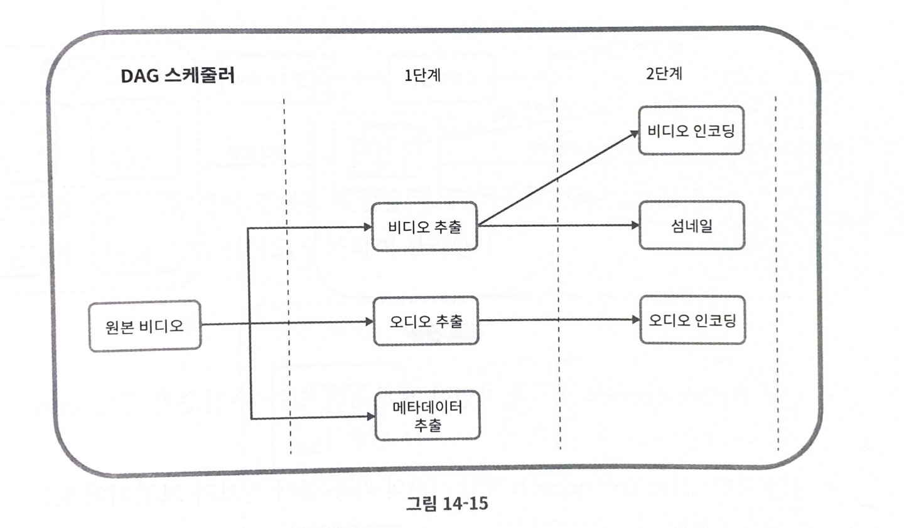

- 하나의 DAG그래프를 2개 작업 단계로 쪼갠 사례임
- 1단계: 비디오, 오디오, 메타데이터 분리함
- 2단계: 해당 비디오 파일을 인코딩하고 섬네일을 추출, 오디오 파일 또한 인코딩함

<b>자원 관리자</b>

자원 배분을 효율적으로 수행하는 역할 담당

아래와 같이 세 개의 큐와 작업 스케줄러로 구성됨

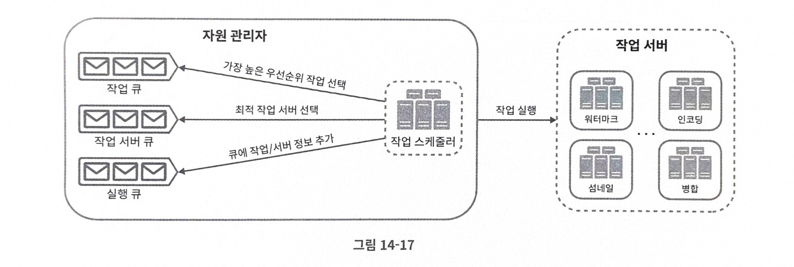

- 작업 큐: 실행할 작업이 보관되어 있는 우선 순위 큐
- 작업 서버 큐: 작업 서버의 가용상태 정보가 보관 되어있는 우선 순위 큐
- 실행 큐: 현재 실행 중인 작업 및 작업 서버 정보가 보관 되어 있는 큐
- 작업 스케줄러: 최적의 작업/서버 조합을 골라. 해당 작업 서버가 작업을 수행 할 수 있도록 지시하는 역할을 담당

#### 동작
1. 작업 관리자는 작업 큐에서 가장 높은 우선 순위 작업을 꺼냄
2. 작업 관리자는 해당 작업을 실행하기 적합한 작업 서버를 고름
3. 작업 스케줄러는 해당 작업 서버에게 작업 실행을 지ㅣ시함
4. 작업 스케줄러는 해당 작업이 어떤 서버에게 핼당되어있는지에 솬한 정보를 실행 큐에 넣음
5. 작업 스케줄러는 적업이 완료 되면 해당 작업을 실행큐에서 제거함

<b>작업 서버</b>
DAG에 정의 된 작업을 실행, 작업 종류에 따라 작업 서버도 구분하여 관리함

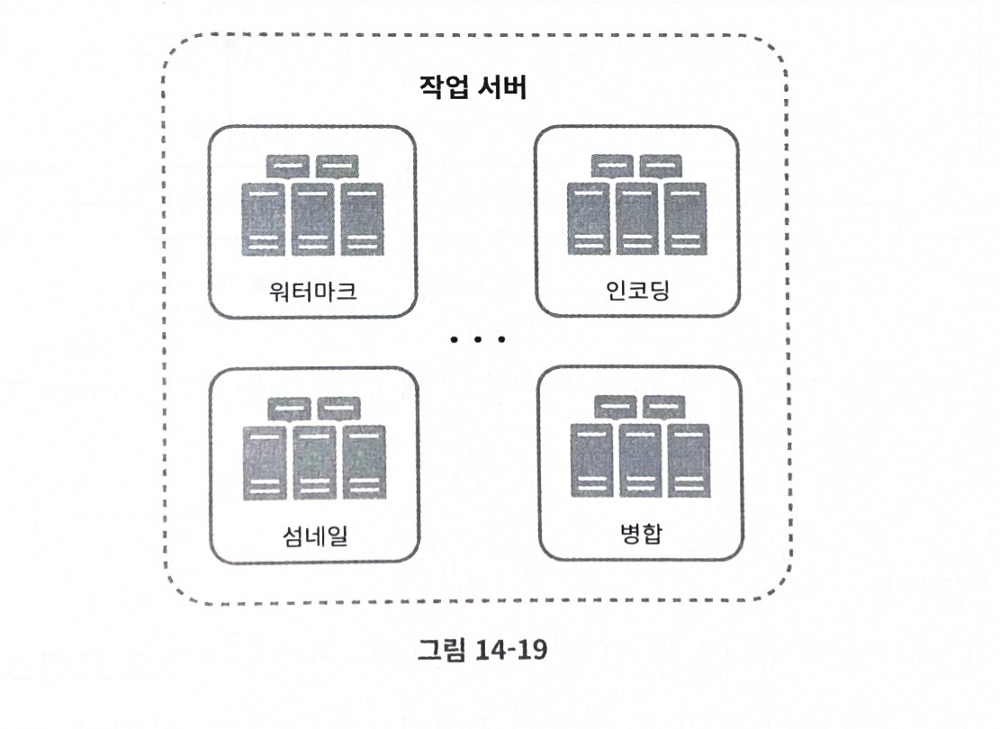

<b>임시 저장소</b>
- 임시 저장소 구현에는 여러 저장소 시스템을 활용 할 수 있음
- 저장할 데이터의 유형, 크기, 이용 빈도, 데이터 유효기간 등에 따라 선택이 달라짐
- ex) 메타 데이터는 작업서버가 빈번히 참조하는 정보이고 크기도 작음 -> 메모리에 캐시해 두면 좋음
- 비디오/오디오 데이터는 BLOB 저장소에 두는 것이 좋음
- 임시 저장소에 보관한 데이터는 비디오 프로세싱이 완려되면 삭제함

### 시스템 최적화
속도, 안전성, 비용 측면에서 최적화

#### 속도 최적화: 비디오 병렬 업로드
비디오 전부를 한 번의 업로드로 올리는 것은 비효율적임, 하나의 비디오는 작은 GOP로 분할 할 수 있음
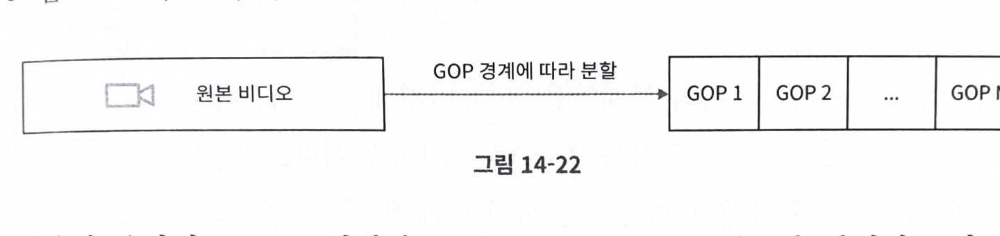

- 일부가 실패하더라도 빠르게 업르드 재개 가능

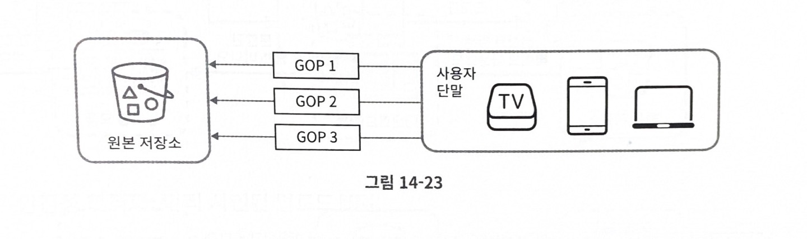

#### 속도 최적화 : 업로드 센터를 사용자 근거리에 지정
업로드 센터를 여러 곳 두는 방법

#### 속도 최적화 : 모든 절차를 병렬화
느슨하게 결합된 시스템을 만들어 병렬성을 높임(낮은 응답 지연을 달성하기 위해)

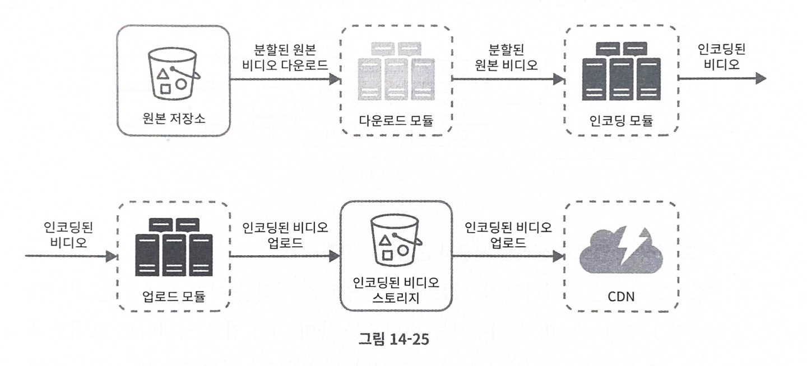
비디오를 원본 저장소에서 CDN으로 옮기는 절차

어떤 단계의 결과물은 이전 단계의 결과물을 입력으로 사용하여 만들어진다는 것을 알 ㅜㅅ 있음
-> 의존성이 있으면 병렬성을 높이기 어려움

결합도를 낮추기 위해 메세지 큐를 도입!!

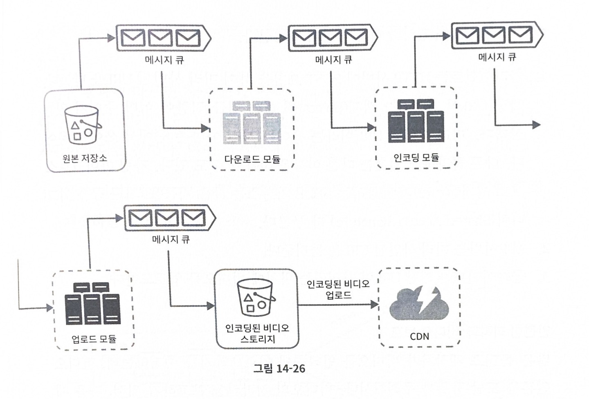

- 메세지 큐를 도입하기 전에는 인코딩 모듈은 다운로드 모듈의 작업이 끝나기를 기다려야 했음
- 메세지 큐를 도입한 뒤에 인코딩 모둘은 다운로드 모듈의 작업이 끝나기를 기다릴 필요가 없음. 메세지 큐에 보관된 이벤트 각각을 인코딩 모듈은 병렬적으로 처리 가능함

#### 안전성 최적화: 미리 사인된 업로드 URL
허가받은 사용자만이 올바른 장소에 비디오를 업로드 할 수 있도록 함

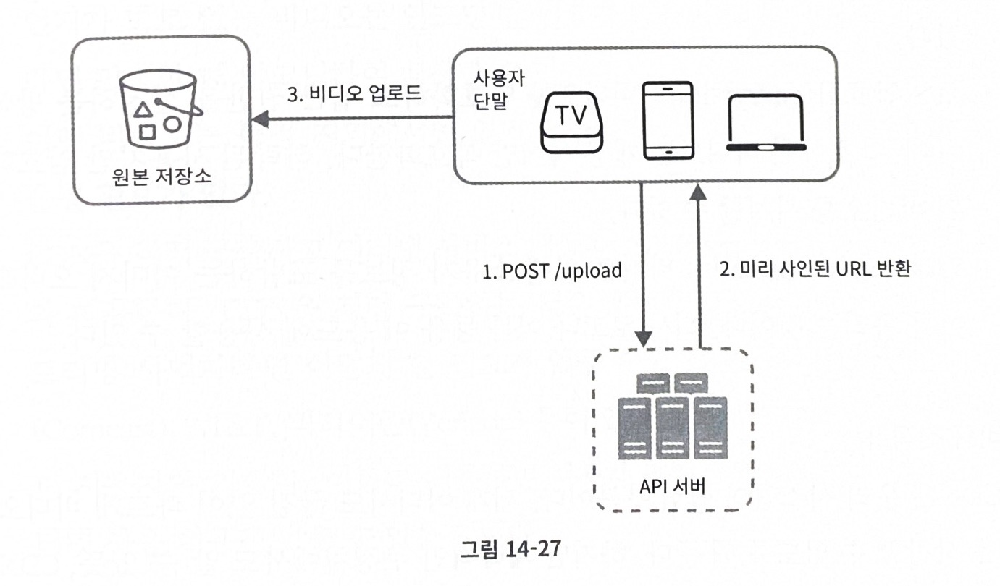

미리 사인된 업로드 URL만 이용
1. 클라이언트는 HTTP 서버에 POST 요청을 하여 미리 사인된 URL을 받음
2. API 서버는 미리 사인된 URL를 돌려줌
3. 클라이언트는 해당 URL이 가리키는 위치에 비디오를 업로드함

#### 안전성 최적화: 비디오 보호
비디오 원본을 도난 당할까봐 우려함

비디오 저작권 보호를 위해 세가지 중 하나 채택할 수 있음
- 디지털 저작권 관리 시스템 도입
  - ex
    - 애플 페어플레이
    - 구글 와이드바인
    - 마이크로소프드 플레이레디 등
- AES 암호화
  - 비디오를 암호화하고 접근 권항을 설정하는 방식임
  - 암호화된 비디오는 재생 시에만 복호화됨
- 워터마크
  - 비디오 위에 소유자 정보를 포함하는 이미지 오버레이를 올리는 것

#### 비용 최적화
1. 인기 비디오는 CDN을 통해 재생하되 다른 비디오는 비디오 서버를 통해 재생함
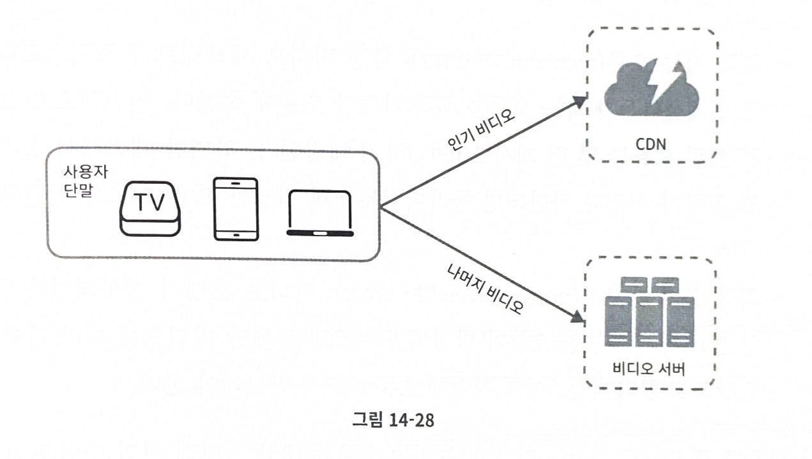
2. 인기가 별로 없는 비디오는 인코딩할 필요가 없을 수도 있음, 짧은 비디오라면 필요할 때 인코딩하여 재생
3. 특정 지역에서만 인기가 높은 비디오, 다른 지역에 옮길 필요가 없음
4. CDN을 직접 구축하고 인터넷 서비스 제공자(ISP)와 제휴함

### 오류 처리
시스템 오류에는 두 가지 종류가 있음
1. 회복 가능 오류(recoverable error)
   - 특정 비디오 세그먼트를 트랜스코딩하다 실패했다든가 하는 오류
   - 몊 번 재시도 하면 보통 해결됨
   - 계쏙 실패시 클라이언트에게 적절한 오류 코드 반환해야함
2. 회복 불가능 오류 
   - 비디오 포맷이 잘못되었다거나 하는 오류
   - 비디오에 대한 작업을 중단하고 클라이언트에게 적절한 오류 반환해야함

- 시스템 컴포넌트별 오류
  - 업로드 오류: 재시도
  - 비디오 분할 오류: 낡은 버전의 클라이언트가 GOP 경계에 따라 비디오를 분할 하지 못하는 경우라면 전체 비디오를 서버로 전송하고 서버가 해당 비디오 분할을 처리하도록 함
  - 트랜스코딩 오류: 제시도
  - 전처리 오류: DAG 그래프 재생성
  - DAG 스케줄러 오류: 작업을 다시 스케줄링
  - 자원 관리자 큐에 장야 발생: 사본을 이용
  - 작업 서버 장야: 다른 서버에서 해당 작업 재시도
  - API서버 장애: API 서버는 무상태 서버이므로 신규 요청은 다른 API 서버로 우회됨
  - 메타데이터 캐시 서버 장애: 데이터는 다중화 되어 있으므로 다른 노드애서 데이터를 여전히 가져올 수 있을 것음, 장애가 난 캐시 서버는 새로운 것으로 교체함
  - 메타 데이터 데이터 베이스 장애
    - 주서버가 죽었다면 부서버 가운데 하나를 주 서버로 교체
    - 부서버가 죽었다면 다른 부 서버를 통해 읽기 연산을 처리하고 죽은 서버는 새것으로 교체

## 4단계) 마무리
더 논의 해보면 좋을 것
- API 계층의 규모 확장성 확보 방안
- 데이터베이스 계층의 규모 확장성 확보 방안
- 라이브 스트리밍
- 비디오 삭제

