# 14장 유튜브 설계
유튜브에 대한 통계자료
- 월간 능동 사용자 수: 20억(2billion)
- 매일 재생되는 비디오 수: 50억(5billion)
- 미국 성인 가운데 73%가 유튜브 이용
- 5천만(50billion)명의 창작자
- 유튜브의 광고 수입은 2019년 기준으로 150억(15.1billion) 달러이며 이는 2018년도 대비 36%가 증가한 수치
- 모바일 인터넷 트래픽 가운데 37%를 유튜브가 점유
- 80개 언어로 이용 가능

## 1단계: 문제 이해 및 설계 범위 확정
- 빠른 비디오 업로드
- 원활한 비디오 재생
- 재생 품질 선택 가능
- 낮은 인프라 비용(infrastructure cost)
- 높은 가용성과 규모 확장성, 그리고 안정성
- 지원 클라이언트: 모바일 앱, 웹브라우저, 스마트TV

### 개략적 규모 추정
- 일간 능동 사용자 수는 5백만
- 한 사용자는 하루에 평균 5개의 비디오를 시청
- 10%의 사용자가 하루에 1비디오 업로드
- 비디오 평균 크기는 300MB
- 비디오 저장을 위해 매일 새로 요구되는 저장 용량 = 5백만 * 10% * 300MB = 150TB
- CDN 비용
  - 클라우드 CDN을 통해 비디오를 서비스할 경우 CDN에서 나가는 데이터의 양에 따라 과금함
  - 아마존의 클라우드프론트(CloudFront)를 CDN 솔루션으로 사용할 경우, 100% 트래픽이 미국에서 발생한다고 가정하면 1GB당 $0.02의 요금이 발생함
    - 문제를 단순화하기 위해 비디오 스트리밍 비용만 따짐
  - 매일 발생하는 요금은 5백만 * 5비디오 * 0.3GB * $0.02 = $150,000 <br>
-> CDN을 통해 비디오를 서비스하면 비용이 엄청남

## 2단계: 개략적 설계안 제시 및 동의 구하기
- CDN과 BLOB 스토리지의 경우, 기존 클라우드 서비스 활용
  - 넷플릭스는 아마존의 클라우드 서비스, 페이스북의 Akamai의 CDN 이용
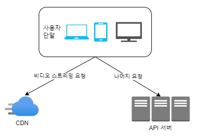
- 단말(client)
  - 컴퓨터, 모바일 폰, 스마트 TV를 통해서 유튜브를 시청할 수 있음
- CDN
  - 비디오는 CDN에 저장
  - 재생 버튼을 누르면 CDN으로부터 스트리밍이 이루어짐
- API 서버
  - 비디오 스트리밍을 제외한 모든 요청은 API 서버가 처리함
  - 피드 추천(feed recommendation), 비디오 업로드 URL 생성, 메타데이터 데이터베이스와 캐시 갱신, 사용자 가입 등등이 API 서버가 처리하는 작업

### 비디오 업로드 절차
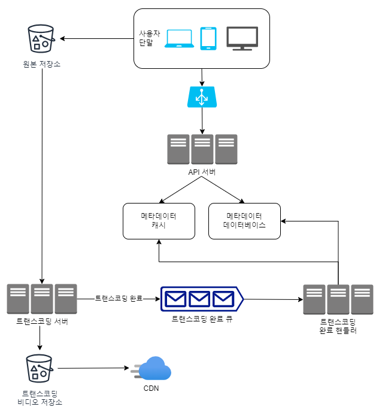
- 사용자
    - 컴퓨터나 모바일 폰, 혹은 스마트 TV를 통해 유튜브를 시청하는 이용자
- 로드밸런서
  - API 서버 각각으로 고르게 요청을 분산하는 역할을 담당
- API 서버
  - 비디오 스트리밍을 제외한 다른 모든 요청을 처리
- 메타데이터 데이터베이스
  - 비디오의 메타데이터를 보관
  - 샤딩과 다중화를 적용하여 성능 및 가용성 요구사항 충족
- 메타데이터 캐시
  - 성능을 높이기 위해 비디오 메타데이터와 사용자 객체는 캐시
- 원본 저장소
  - 원본 비디오를 보관할 대형 이진 파일 저장소(BLOB: Binary Large Object storage) 시스템
  - 이진 데이터를 하나의 개체로 보관하는 데이터베이스 관리 시스템
- 트랜스코딩 서버(transcoding server)
  - 비디오 트랜스코딩은 비디오 인코딩이라 부르기도 하는 절차로, 비디오의 포맷(MPEG, HLS 등)을 변환하는 절차
  - 단말이나 대역폭 요구사항에 맞는 최적의 비디오 스트림을 제공하기 위해 필요함
- 트랜스코딩 비디오 저장소(transcoded storage)
  - 트랜스코딩이 완료된 비디오를 저장하는 BLOB 저장소
- CDN
  - 비디오를 캐시하는 역할 담당
  - 사용자가 재생 버튼을 누르면 비디오 스트리밍은 CDN을 통해 이루어짐
- 트랜스코딩 완료 큐(completion queue)
  - 비디오 트랜스코딩 완료 이벤트들을 보관할 메시지 큐
- 트랜스코딩 완료 핸들러(completion handler)
  - 트랜스코딩 완료 큐에서 이벤트 데이터를 꺼내, 메타데이터 캐시와 데이터베이스를 갱신할 작업 서버들

비디오 업로드 처리과정 <br>
a. 비디오 업로드 <br>
b. 비디오 메타데이터 갱신. 메타데이터에는 비디오 URL, 크기, 해상도, 포맷, 사용자 정보가 포함됨

#### 프로세스 a: 비디오 업로드
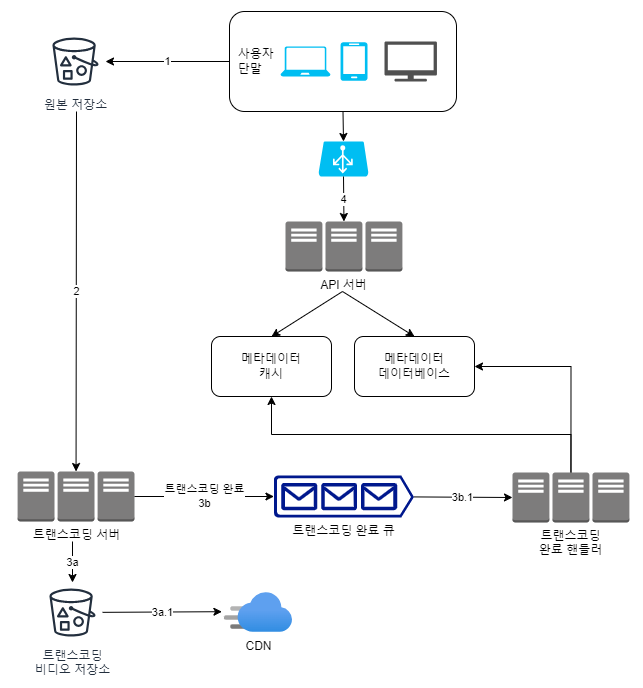
1. 비디오를 원본 저장소에 업로드
2. 트랜스코딩 서버는 원본 저장소에서 해당 비디오를 가져와 트랜스코딩을 시작함
3. 트랜스코딩이 완료되면 아래 두 절차가 병렬적으로 수행됨 <br>
    3a. 완료된 비디오를 트랜스코딩 비디오 저장소로 업로드 <br>
    3b. 트랜스코딩 완료 이벤트를 트랜스코딩 완료 큐에 넣음 <br>
   &nbsp;&nbsp; 3a.1. 트랜스코딩이 끝난 비디오를 CDN에 올림 <br>
   &nbsp;&nbsp; 3b.1. 완료 핸들러가 이벤트 데이터를 큐에서 꺼냄 <br>
   &nbsp;&nbsp; 3b.1.a, 3b.1.b 완료 핸들러가 메타데이터 데이터베이스와 캐시를 갱신함 <br>
4. API 서버가 단말에게 비디오 업로드가 끝나서 스트리밍 준비가 되었음을 알림

#### 프로세스 b: 메타데이터 갱신
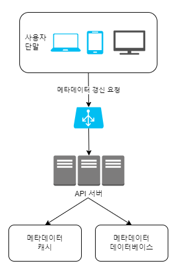
- 원본 저장소에 파일이 업로드되는 동안, 단말은 병렬적으로 비디오 메타데이터 갱신 요청을 API 서버에 보냄
  - 메타데이터에는 파일 이름, 크기, 포맷 등의 정보가 들어있음
- API 서버는 메타데이터 정보로 메타데이터 캐시와 데이터베이스를 업데이트 함

### 비디오 스트리밍 절차
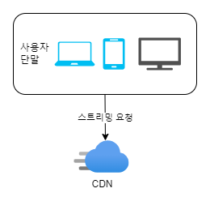
- 스트리밍은 사용자의 장치가 원격지의 비디오로부터 지속적으로 비디오 스트림을 전송받아 영상을 재생하는 것
- 스트리밍 프로토콜(streaming protocol)
  - 비디오 스트리밍을 위해 데이터를 전송할 때 쓰이는 표준화된 통신방법
    - 널리 사용되는 스트리밍 프로토콜
      - MPEG-DASH
        - MPEG은 Moving Picture Express Group의 약어
        - DASH는 Dynamic Adaptive Streaming over HTTP의 약어
      - 애플(Apple) HLS
        - HLS는 HTTP Live Streaming의 약어
      - 마이크로소프트 스무드 스트리밍(Microsoft Smooth Streaming)
      - 어도비 HTTP 동적 스트리밍(Adobe HTTP Dynamic Streaming, HDS)
  - 프로토콜마다 지원하는 비디오 인코딩, 플레이어가 다름 <br>
  -> 서비스의 용례에 맞는 프로토콜을 잘 골라야 함
- 비디오는 CDN에서 바로 스트리밍됨
  - 사용자의 단말에서 가장 가까운 CND 에지 서버(edge server)가 비디오 전송을 담당함 <br>
  -> 전송지연은 아주 낮음

## 3단계: 상세 설계
### 비디오 트랜스코딩
- 비디오가 다른 단말에서도 순조롭게 재생되려면 다른 단말과 호환되는 비트레이트(bitrate)와 포맷으로 저장되어야 함
  - 비트레이트: 비디오를 구성하는 비트가 얼마나 빨리 처리되어야 하는지를 나타내는 단위
- 비디오 트랜스코딩이 중요한 이유
  - 가공되지 않은 원본 비디오(raw video)는 저장 공간을 많이 차지함
  - 상당수의 단말과 브라우저는 특정 종류의 비디오 포맷만 지원함
    - 호환성 문제를 해결하려면 하나의 비디오를 여러 포맷으로 인코딩해두는 게 바람직함
  - 네트워크 대역폭이 충분하지 않은 사용자에게는 저화질 비디오, 대역폭이 충분한 사용자에게는 고화질 비디오를 보내는 것이 바람직함
  - 비디오가 끊김없이 재생되도록 하기 위해서는 비디오 화질을 자동으로 변경하거나 수동으로 변경할 수 있도록 하는 것이 바람직함
- 인코딩 포맷
  - 컨테이너(container)
    - 비디오 파일, 오디오, 메타데이터를 담는 바구니 같은 것
    - 컨테이너 포맷은 .avi, .mov, .mp4 같은 파일 확장자를 보면 알 수 있음
  - 코덱(codec)
    - 비디오 화질은 보존하면서 파일 크기를 줄일 목적으로 고안된 압축 및 압축 해제 알고리즘
    - e.g. H.264, VP9, HEVC

### 유향 비순환 그래프(DAG) 모델
- 적절한 수준의 추상화를 도입하여 클라이언트 프로그래머로 하여금 실행할 작업(task)을 손수 정의할 수 있도록 함
  - 각기 다른 유형의 비디오 프로세싱 파이프라인을 지원
  - 처리 과정의 병렬성을 높임
  - e.g. 페이스북의 스트리밍 비디오 엔진
    - 유향 비순환 그래프(DAG: Directed Acyclic Graph) 프로그래밍 모델을 도입
    - 작업을 단계별로 배열할 수 있도록 하여 해당 작업들이 순차적으로 또는 병렬적으로 실행될 수 있도록 함

본 설계안에서 채택한 DAG 모델
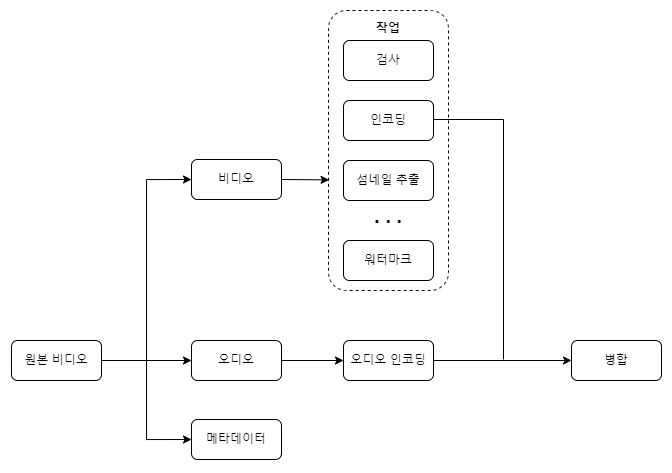
- 원본 비디오는 비디오, 오디오, 메타데이터 세 부분으로 나뉘어 처리함
- 비디오 부분에 적용되는 작업
  - 검사(inspection)
    - 좋은 품질의 비디오인지, 손상은 없는지 확인하는 작업
  - 비디오 인코딩(video encoding) <br>
    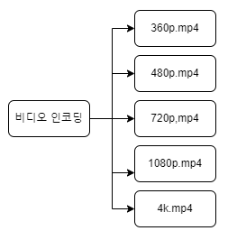
    - 비디오를 다양한 해상도, 코덱, 비트레이트 조합으로 인코딩하는 작업
  - 섬네일(thumbnail)
    - 사용자가 업로드한 이미지나 비디오에서 자동 추출된 이미지로 섬네일을 만드는 작업
  - 워터마크(watermark)
    - 비디오에 대한 식별정보를 이미지 위에 오버레이(overlay) 형태로 띄워 표시하는 작업

### 비디오 트랜스코딩 아키텍처
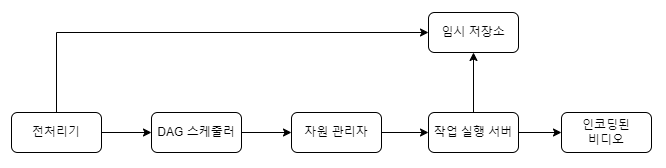

#### 전처리기(preprocessor)
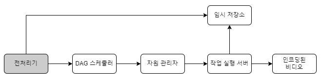
1. 비디오 분할(video splitting)
- 비디오 스트림을 GOP(Group of Pictures) 단위로 쪼갬
  - GOP: 특정 순서로 배열된 프레임(frame) 그룹
  - 하나의 GOP는 독립적으로 재생 가능하며, 길이는 보통 몇 초정도임
  - GOP 단위의 비디오 분할을 지원하지 않는 오래된 단말이나 브라우저의 경우, 전처리기가 비디오 분할을 대신함
2. DAG 생성 
- 클라이언트 프로그래머가 작성한 설정 파일에 따라 DAG를 만듦
- 2개 노드와 1개 연결선으로 구성된 DAG의 사례

- 설정 파일
```C
task {
    name 'download-input'
    type 'Download'
    input {
      url config.url
    }
    output { it->
      context.inputVideo = it.file
    }
    next 'transcode'
}
```
```C
task {
    name 'transcode'
    type 'Transcode'
    input {
      input context.inputVideo
      config config.transConfig
    }
    output { it->
      context.file = it.outputVideo
    }
}
```
3. 데이터 캐시
- 전처리기는 분할된 비디오의 캐시이기도 함
- 전처리기는 GOP와 메타데이터를 임시 저장소(temporary storage)에 보관함
  - 안정성을 높임
- 비디오 인코딩이 실패하면 시스템은 보관된 데이터를 활용해 인코딩을 재개함

#### DAG 스케줄러
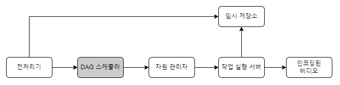
- DAG 그래프를 몇 개 단계(stage)로 분할한 다음에 그 각각을 자원 관리자의 작업 큐(task queue)에 집어넣음
- 하나의 DAG 그래프를 2개 작업 단계(stage)로 쪼갠 사례
- 
- 1단계: 비디오, 오디오, 메타데이터를 분리
- 2단계: 해당 비디오 파일을 인코딩하고, 섬네일을 추출하며, 오디오 파일도 인코딩

#### 자원 관리자(resource manager) 
- 자원 배분을 효과적으로 수행하는 역할 담당
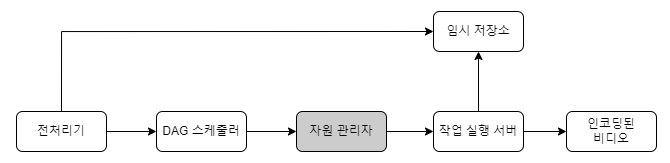
- 작업 큐(task queue)
  - 실행할 작업이 보관되어 있는 우선순위 큐(priority queue)
- 작업 서버 큐(worker queue)
  - 작업 서버의 가용 상태 정보가 보관되어 있는 우선순위 큐
- 실행 큐(running queue)
  - 현재 실행 중인 작업 및 작업 서버 정보가 보관되어 있는 큐
- 작업 스케쥴러
  - 최적의 작업/서버 조합을 골라, 해당 작업 서버가 작업을 수행하도록 지시하는 역할을 담당

작업 관리자 동작 방식
- 작업 관리자는 작업 큐에서 가장 높은 우선순위의 작업을 꺼냄
- 작업 관리자는 해당 작업을 실행하기 적합한 작업 서버를 고름
- 작업 스케쥴러는 해당 작업 서버에게 작업 실행을 지시함
- 작업 스케쥴러는 해당 작업이 어떤 서버에게 할당되었는지에 대한 정보를 실행 큐에 넣음
- 작업 스케쥴러는 작업이 완료되면 해당 작업을 실행 큐에서 제거함

#### 작업 실행 서버(resource worker)

- 작업 서버는 DAG에 정의된 작업을 수행함 <br><br>
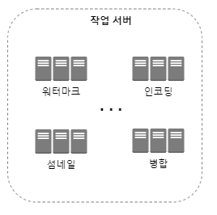
- 작업 종류에 따라 작업 서버도 구분하여 관리

#### 임시 저장소(temporary storage)
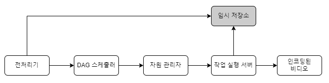
- 임시 저장소 구현에는 여러 저장소 시스템을 활용할 수 있음
  - 저장할 데이터의 유형, 크기, 이용 빈도, 데이터 유효기간 등에 따라 선택하는 시스템 달라짐
    - 메타데이터는 작업 서버가 빈번히 참조되는 정보이고, 그 크기도 작기 때문에 메모리에 캐시
    - 비디오/오디오 데이터는 BLOB 저장소에 두는 것이 바람직
- 임시 저장소에 보관한 데이터는 비디오 프로세싱이 완료되면 삭제함

#### 인코딩된 비디오
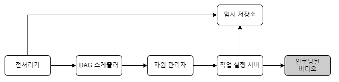
- 인코딩된 비디오는 인코딩 파이프라인의 최종 결과물임
  - funny_720p.mp4와 같은 이름을 가짐
  
### 시스템 최적화
- 속도, 안전성, 비용 측면에서 시스템 최적화

#### 속도 최적화: 비디오 병렬 업로드

- 비디오 전부를 한 번의 업로드로 올리는 것은 비효율적
- 하나의 비디오는 작은 GOP들로 분할할 수 있음

#### 속도 최적화: 업로드 센터를 사용자 근거리에 지정
- 업로드 센터를 여러 곳에 둠
  - 미국 거주자는 비디오를 북미 지역 업로드 센터로 보내도록 함 <br>
-> CDN 사용

#### 속도 최적화: 모든 절차를 병렬화
- 느슨하게 결합된 시스템을 만들어서 병렬성을 높임
  - 낮은 응답지연 달성

**원본 저장소에서 CDN으로 비디오를 옮기는 절차**
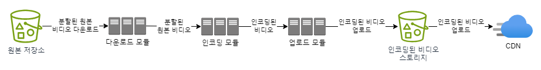
- 이전 단계의 결과물을 입력으로 사용하여 만들어짐 <br>
-> 이런 의존성이 있으면 병렬성을 높이기 어려움

**메시지 큐 도입**
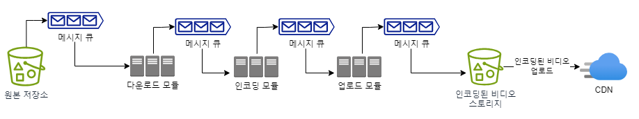
- 메시지 큐를 도입하기 전에 인코딩 모듈은 다운로드 모듈의 작업이 끝나기를 기다려야 했음
- 메시지 큐를 도입한 뒤에 인코딩 모듈은 다운로드 모듈의 작업이 끝나기를 더 이상 기다릴 필요가 없음
  - 메시지 큐에 보관된 이벤트 각각을 인코딩 모듈은 병렬적으로 처리할 수 있음

#### 안전성 최적화: 미리 사인된 업로드 URL
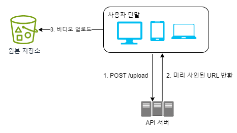
- 미리 사인된(pre-signed) 업로드 URL 이용
  - 허가 받은(authorized) 사용자만이 올바른 장소에 비디오를 업로드할 수 있도록 <br>
  
업로드 절차 변경 
1. 클라이언트는 HTTP 서버에 POST 요청을 해 미리 사인된 URL을 받음
  - 해당 URL이 가리키는 객체에 대한 접근 권한이 이미 주어져 있는 상태
  - 미리 사인된 URL이라는 용어는 아마존 S3에서 쓰이는 용어
  - Azure가 제공하는 BLOB 저장소는 같은 기능을 접근 공유 시그니처(Shared Access Signature)라 부름
2. API 서버는 미리 사인된 URL을 돌려줌
3. 클라이언트는 해당 URL이 가리키는 위치에 비디오를 업로드 함

#### 안전성 최적화: 비디오 보호
- 디지털 저작권 관리(DRM: Digital Rights Management) 시스템 도입
  - e.g. 애플의 FairPlay, 구글의 Widevine, 마이크로소프트의 PlayReady
- AES 암호화(encryption)
  - 비디오를 암호화하고 접근 권한을 설정하는 방식
  - 암호화된 비디오는 재생 시에만 복호화함
  - 허락된 사용자만 암호화된 비디오를 시청할 수 있음
- 워터마크(watermark)
  - 비디오 위에 소유자 정보를 포함하는 이미지 오버레이를 올리는 것
  - 회사 로고나 이름 등을 이 용도에 사용할 수 있음

#### 비용 최적화
- 유튜브의 비디오 스트리밍은 롱테일(long-tail) 분포
  - 인기 있는 비디오만 빈번하게 재생되고, 나머지는 거의 보는 사람이 없음

**최적화 방법** <br>
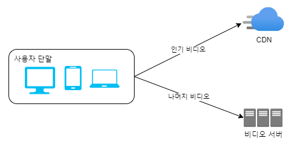
1. 인기 비디오는 CDN을 통해 재생하되 다른 비디오는 비디오 서버를 통해 재생
2. 인기가 별로 없는 비디오는 인코딩 할 필요가 없을 수도 있음
  - 짧은 비디오라면 필요할 때 인코딩하여 재생할 수 있음
3. 어떤 비디오는 특정 지역에서만 인기가 높음
   - 이런 비디오는 다른 지역에 옮길 필요가 없음
4. CDN을 직접 구축하고 인터넷 서비스 제공자(ISP: Internet Service Provider)와 제휴함
   - CDN을 직접 구축하는 것은 초대형 프로젝트임(대규모 스트리밍 사업자라면 해야 할 필요성이 있을 수도 있음)
   - ISP로는 Comcast, AT&T, Verizon 등이 있음
     - ISP는 전세계 어디나 있으며, 사용자와 가까움
     - ISP와 제휴하면 사용자 경험을 향상시킬 수 있고 인터넷 사용 비용을 낮출 수 있을 것임

>모든 최적화는 콘텐츠 인기도, 이용 패턴, 비디오 크기 등의 데이터에 근거한 것 <br>
> 최적화를 시도하기 전에 시청 패턴을 분석하는 것 중요함

### 오류 처리
- 회복 가능 오류(recoverable error)
  - e.g. 특정 비디오 세그먼트를 트랜스코딩하다 실패
  - 몇 번 재시도(retry)하면 해결됨
  - 계속해서 실패하고 복구가 어렵다 판단되면 클라이언트에게 적절한 오류 코드를 반환해야 함
- 회복 불가능 오류(non-recoverable error)
  - e.g. 비디오 포맷이 잘못된 경우
  - 시스템은 해당 비디오에 대한 작업을 중단하고 클라이언트에게 적절한 오류 코드 반환해야 함

**해결 방법**
- 업로드 오류
  - 몇 회 재시도함
- 비디오 분할 오류
  - 낡은 버전의 클라이언트가 GOP 경계에 따라 비디오를 분할하지 못하는 경우, 전체 비디오를 서버로 전송하고 서버가 해당 비디오 분할을 처리하도록 함
- 트랜스코딩 오류
  - 재시도함
- 전처리 오류
  - DAG 그래프를 재생성함
- DAG 스케쥴러 오류
  - 작업을 다시 스케쥴링함
- 자원 관리자 큐에 장애 발생
  - 사본(replica)을 이용함
- 작업 서버 장애
  - 다른 서버에서 해당 작업을 재시도함
- API 서버 장애
  - API 서버는 무상태 서버이므로 신규 요청은 다른 API 서버로 우회될 것임
- 메타데이터 캐시 서버 장애
  - 데이터는 다중화되어 있으므로 다른 노드에서 데이터를 여전히 가져올 수 있을 것임
  - 장애가 난 캐시 서버는 새로운 것으로 교체함
- 메타데이터 데이터베이스 서버 장애
  - 주 서버가 죽었다면 부 서버 가운데 하나를 주 서버로 교체
  - 부 서버가 죽었다면 다른 부 서버를 통해 읽기 연산을 처리하고 죽은 서버는 새것으로 교체

## 4단계: 마무리
- API 계층의 규모 확장성 확보 방안
  - API 서버는 무상태 서버이므로 수평적 규모 확장이 가능
- 데이터베이스 계층의 규모 확장성 확보 방안
  - 데이터베이스의 다중화와 샤딩 
- 라이브 스트리밍(live streaming)
  - 응답지연이 더 낮아야 함
    - 스트리밍 프로토콜 선정에 유의해야 함
  - 병렬화 필요성은 떨어짐
    - 작은 단위의 데이터를 실시간으로 빨리 처리해야 하기 때문
  - 오류 처리 방법을 다르게 해야 함
    - 너무 많은 시간이 걸리는 방안은 사용하기 어려움
- 비디오 삭제(takedown)
  - 저작권을 위반한 비디오, 선정적 비디오, 불법적 행위에 관계된 비디오는 내려야 함
  - 내릴 비디오는 업로드 과정에서 식별해낼 수도 있고, 사용자의 신고 절차를 통해 판별할 수도 있음