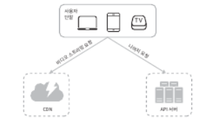
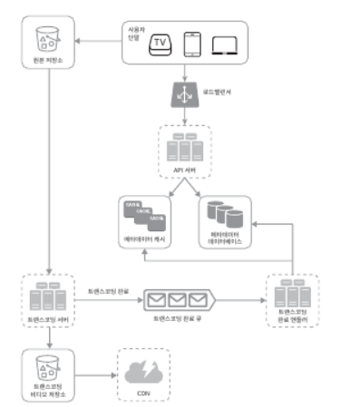
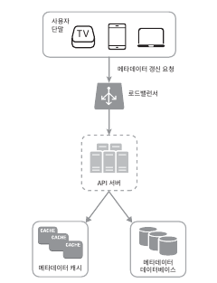
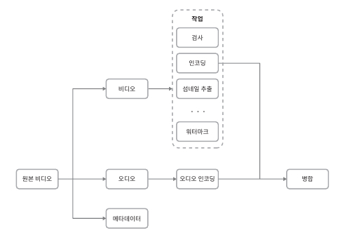
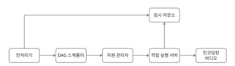
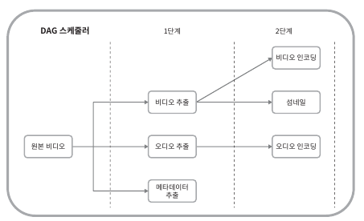
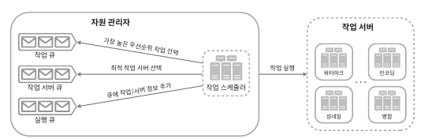
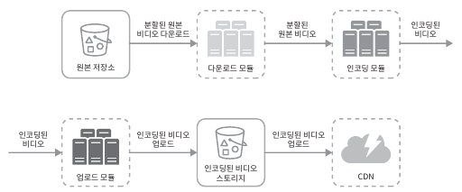
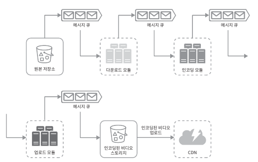
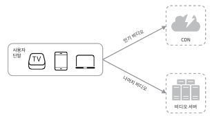

### 1단계. 문제 이해 및 설계 범위 확정

아래와 같은 기능을 갖는 비디오 스트리밍 서비스 설계에 초점을 맞출 예정

- 빠른 비디오 업로드 
- 원활한 비디오 재생

- 재생 품질 선택 기능

- 낮은 인프라 비용 infrastructure cost

- 높은 가용성과 규모 확장성, 그리고 안정성

- 지원 클라이언트: 모바일 앱, 웹 브라우저, 그리고 스마트 TV

#### 개략적 규모 추정

- 일간 능동 사용자DAU 수는 5백만(5million)

- 한 사용자는 하루에 평균 5개의 비디오 시청

- 10%의 사용자가 하루에 1비디오 업로드

- 비디오 평균 크기는 300MB

- 비디오 저장을 위해 매일 새로 요구되는 저장 용량 : 150TB

- CDN 비용

  - 클라우드 CDN을 통해 비디오를 서비스할 경우 CDN에서 나가는 데이터의 양에 따라 과금
  
  - 아마존의 클라우드프론트CloudFront를 CDN 솔루션으로 사용할 경우, 100% 트래픽이 미국에서 발생한다고 가정하면 1GB당 $0.02의 요금이 발생. 문제를 단순화하기 위해 비디오 스트리밍 비용만 따지도록 가정
  
  - 매일 발생하는 요금은 $150,000

### 2단계. 개략적 설계안 제시 및 동의 구하기
  
> 규모 확장이 쉬운 BLOB 저장소 나 CDN을 만드는 것은 지극히 복잡할 뿐 아니라 많은 비용이 드는 일. 넷플릭스나 페이스북 같은 큰 회사도 모든 것을 스스로 구축하지는 않음. 넷플릭스는 아마존의 클라우드 서비스를 사용하고, 페이스북은 아카마이(Akamai)의 CDN을 이용

개략적으로 보면 이 시스템은 단말(client), CDN, API 서버 세 개의 컴포넌트로 구성

- API 서버 : 비디오 스트리밍을 제외한 모든 요청은 API 서버가 처리. 피드 추천(Feed recommendation), 비디오 업로드 URL 생성, 메타데이터 데이터베이스와 캐시 갱신, 사용자 가입 등등이 API 서버가 처리하는 작업

#### 비디오 업로드 절차

비디오 업로드는 비디오 업로드 와 비디오 메타데이터 갱신(메타 데이터에는 비디오 URL, 크기, 해상도, 포맷, 사용자 정보가 포함) 두 프로세스가 병렬적으로 수행된다.

##### 프로세스 A: 비디오 업로드

1. 비디오를 원본 저장소에 업로드 
2. 트랜스코딩 서버는 원본 저장소에서 해당 비디오를 가져와 트랜스코딩 시작 
3. 트랜스 코딩이 완료되면 아래 두 절차가 병렬적으로 수행

   3a.1. 완료된 비디오를 트랜스 코딩 비디오 저장소로 업로드
   3b.1. 완료 핸들러가 이벤트 데이터를 큐에서 꺼냄
   3b.1.a, 3b.1.b. 완료 핸들러가 메타데이터 데이터베이스와 캐시를 갱신
   
4. API 서버가 단말에게 비디오 업로드가 끝나서 스트리밍 준비가 되었음을 알림

##### 프로세스 B: 메타데이터 갱신

원본 저장소에 파일이 업로드 되는 동안. 단말 병렬적으로 비디오 메타데이터 갱신 요청 API 서버에 보냄

### 비디오 스트리밍 절차

스트리밍 프로토콜(streaming protocol) : 비디오 스트리밍을 위해 데이터를 전송할 때 쓰이는 표준화된 통신방법

##### 널리 사용되는 스트리밍 프로토콜

- MPEG-DASH : MPEG(Moving Picture Experts Group). DASH(Dynamic Adaptive Streaming over HTTP)

- 애플(Apple) HLS : HLS(HTTP Live Streaming)

- 마이크로소프트 스무드 스트리밍(Microsoft Smooth Streaming)

- 어도비 HTTP 동적 스트리밍(Adobe HTTP Dynamic Streaming, HDS)

프로토콜마다 지원하는 비디오 인코딩이 다르고 플레이어도 다르므로 비디오 스트리밍 서비스를 설계할 때에는 서비스의 용례에 맞는 프로토콜을 잘 골라야 함.

비디오는 CDN에서 바로 스트리밍

### 3단계. 상세 설계

#### 비디오 트랜스 코딩
#### 비디오 트랜스코딩이 중요한 이유

1. 가공되지 않은 원본 비디오(raw video)는 저장 공간을 많이 차지

2. 상당 수의 단말과 브라우저는 특정 종류의 비디오 포맷만 지원

3. 사용자에게 끊김 없는 고화질 비디오 재생을 보장하려면, 네트워크 대역폭이 충분하지 않은 사용자에게는 저화질 비디오를, 대역폭이 충분한 사용자에게는 고화질 비디오를 보내자

4. 모바일 단말의 경우 네트워크 상황이 수시로 달라질 가능성. 비디오가 끊김 없이 재생되도록 하기 위해서는 비디오 화질을 자동으로 변경하거나 수동으로 변경할 수 있도록 지원하자

##### 인코딩 포맷

1. 컨테이너(container) : 비디오 파일, 오디오, 메타데이터를 담는 바구니 같은 것. .avi, .mov, .mp4 같은 파일 확장자를 보고 컨테이너 포맷 확인 가능
2. 코덱(codec) : 비디오 화질은 보존하면서 파일 크기를 줄일 목적으로 고안된 압축 및 압축 해제 알고리즘. 가장 많이 사용되는 비디오 코덱으로는 H.264, VP9, HEVC

### 유향 비순환 그래프(DAG) 모델

각기 다른 유형의 비디오 프로세싱 파이프라인을 지원하는 한편
처리 과정의 병렬성을 높이기 위해서는 적절한 수준의 추상화를 도입하여 클라이언트 프로그래머로 하여금 실행할 작업task을 손수 정의할 수 있도록 해야 함

**비디오 트랜스코딩을 위해 본 설계안이 채택한 DAG 모델**

원본 비디오는 비디오, 오디오, 메타데이터의 세 부분으로 나뉘어 처리

**비디오 트랜스코딩 아키텍처**

##### 전처리기

전처리기가 하는 일

1. 비디오 분할(video splitting) : 비디오 스트림을 GOP(Group of Picture)라고 불리는 단위로 쪼갬. GOP는 특정 순서로 배열된 프레임(frame) 그룹. 하나의 GOP는 독립적으로 재생이 가능하며, 길이는 보통 몇 초 정도
→ 어떤 종류의 오래된 단말이나 브라우저는 GOP 단위의 비디오 분할을 지원하지 않음
→ 이런 경우에 전처리기가 비디오 분할을 대신함

2. DAG 생성
3. 데이터 캐시 : 전처리기는 분할된 비디오의 캐시이기도 함. 안정성을 높이기 위해 전처리기는 GOP와 메타데이터를 임시 저장소(temporary storage)에 보관
→ 비디오 인코딩 실패 시 시스템은 이렇게 보관된 데이터를 활용해 인코딩 재개

##### DAG 스케줄러

DAG 스케줄러는 DAG 그래프를 몇 개 단계(stage)로 분할한 다음 그 각각을 자원 관리자의 작업 큐(task queue)에 집어넣는다.

**하나의 DAG 그래프를 2개 작업 단계(stage)로 나눈 사례**

**자원 관리자**
자원 관리자(resoyrece manager) 는 자원 배분을 효과적으로 수행하는 역할

3개의 큐와 작업 스케줄러(task scheduler) 로 구성

**작업 서버
임시 저장소
인코딩된 비디오**

#### 시스템 최적화

속도 최적화: 비디오 병렬 업로드
비디오 전부를 한 번의 업로드로 올리는 것은 비효율적

분할한 GOP를 병렬적으로 업로드하면 설사 일부가 실패해도 빠르게 업로드를 재개할 수 있음

비디오를 GOP 경계에 맞춰 분할하는 작업을 단말이 수행하면 업로드 속도를 향상시킬 수 있음

**속도 최적화: 업로드 센터를 사용자 근거리에 지정**
업로드 센터를 여러 곳에 두고 근거리에 있는 센터에 데이터를 요구하면 된다

**속도 최적화: 모든 절차를 병렬화**
느슨하게 결합된 시스템을 만들어서 병렬성을 높이자

**비디오를 원본 저장소에서 CDN으로 옮기는 절차**

이런 형태로 의존성이 있으면 병렬성을 높이기 어려움 - 메세지 큐를 도입

메세지 큐가 어떻게 시스템 결합도를 낮추는데 ?

- 메세지 큐를 도입하기 전 인코딩 모듈은 다운로드 모듈의 작업이 끝나기를 기다려야 했음

- 메세지 큐 도입 이후 인코딩 모듈은 다운로드 모듈의 작업이 끝나기를 더 이상 기다릴 필요가 없음. 메세지 큐에 보관된 이벤트 각각을 인코딩 모듈은 병렬적으로 처리할 수 있게 됨

비디오를 원본 저장소에서 CDN으로 옮기는 절차 - 메세지 큐 도입

**안정성 최적화: 미리 사인된 업로드 URL**
허가 받은(authorized) 사용자 만이 올바른 장소에 비디오를 업로드

**안전성 최적화: 비디오 보호**

비디오 저작권 보호

- 디지털 저작권 관리(DRM:Digital Rights Management) 시스템 도입

- AES 암호화(encryption) : 비디오를 암호화하고 접근 권한을 설정하는 방식. 암호화된 비디오는 재생 시에만 복호화.

- 워터마크(watermark)

**비용 최적화**

유튜브의 비디오 스트리밍은 롱테일(long-tail) 분포를 따름
인기 있는 비디오는 빈번히 재생되는 반면, 나머지는 거의 보는 사람이 없다는 것

1. 인기 비디오는 CDN을 통해 재생하되 다른 비디오는 비디오 서버를 통해 재생

2. 인기가 별로 없는 비디오는 인코딩할 필요가 없을 수도...
3. 어떤 비디오는 특정 지역에서만 인기가 높음. 이런 비디오는 다른 지역에 옮길 필요가 있음
4. CDN을 직접 구축하고 인터넷 서비스 제공자(ISP: Internet Service Provider) 와 제휴.

이런 방법들을 구축하기 위해서 시청 패턴을 분석하는 것이 매우 중요

**오류 처리**

시스템 오류의 종류

- 회복 가능 오류(recoverable error) : 특정 비디오 세그먼트를 트랜스코딩하다 실패했다든가 하는 오류는 회복 가능한 오류에 속함. 그냥 retry만 하면 됨. 만약 계속 반복될 시에는 오류코드 반환

- 회복 불가능 오류(non-recoverable error) : 비디오 포맷이 잘못되었다거나 하는 회복 불가능한 오류가 발견되면 시스템은 해당 비디오에 대한 작업을 중단하고 클라이언트에게 적절한 오류 코드를 반환
오류에 대한 전형적 해결 방법

**업로드 오류: 몇 번 재시도**

- 비디오 분할 오류: 낡은 버전의 클라이언트가 GOP 경계에 따라 비디오를 분할하지 못하는 경우라면 전체 비디오를 서버로 전송하고 서버가 해당 비디오 분할을 처리하도록...

- 트랜스코딩 오류: 재시도

- 전처리 오류: DAG 그래프를 재생성

- DAG 스케줄러 오류: 작업을 다시 스케줄링

- 자원 관리자 큐에 장애 발생: 사본(replica)을 이용

- 작업 서버 장애: 다른 서버에서 해당 작업을 재시도

- API 서버 장애: API 서버는 무상태 서버이므로 신규 요청은 다른 API 서버로 우회될 것

- 메타데이터 캐시 서버 장애: 다른 노드에서 데이터 가져오고, 장애가 난 캐시 서버는 새로운 걸로 교체

- 메타데이터 데이터베이스 서버 장애

  - 주 서버가 죽었으면 부 서버 가운데 하나를 주 서버로 교체

  - 부 서버가 죽었으면 다른 부 서버를 통해 읽기 연산을 처리하고 죽은 서버는 새 것으로 교체
