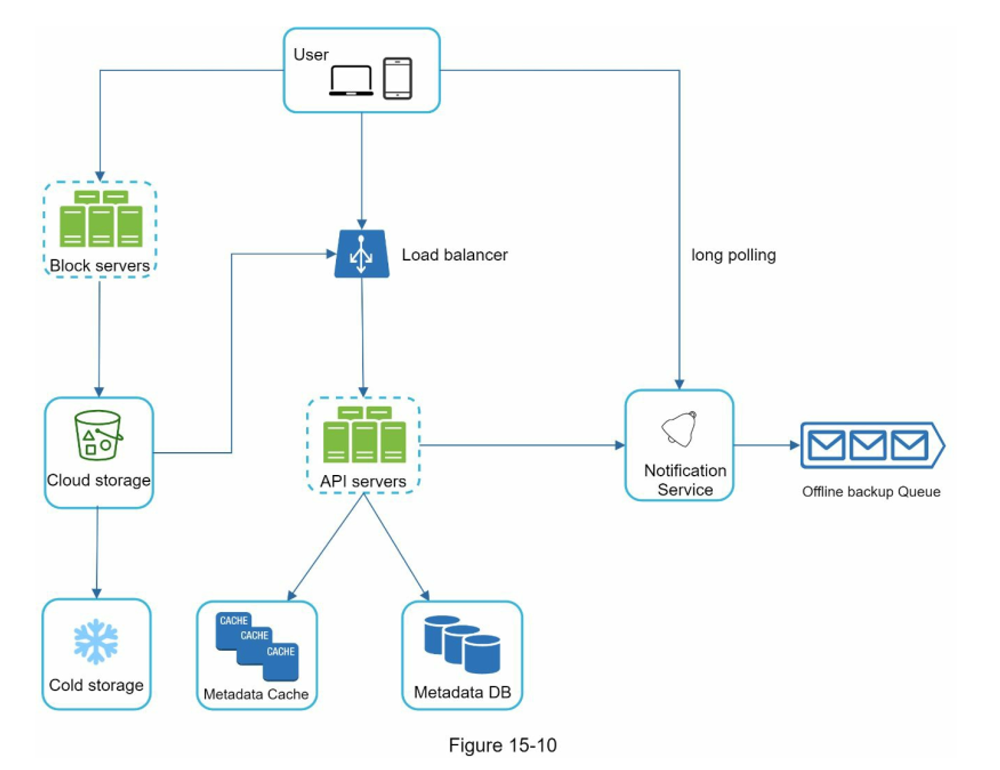
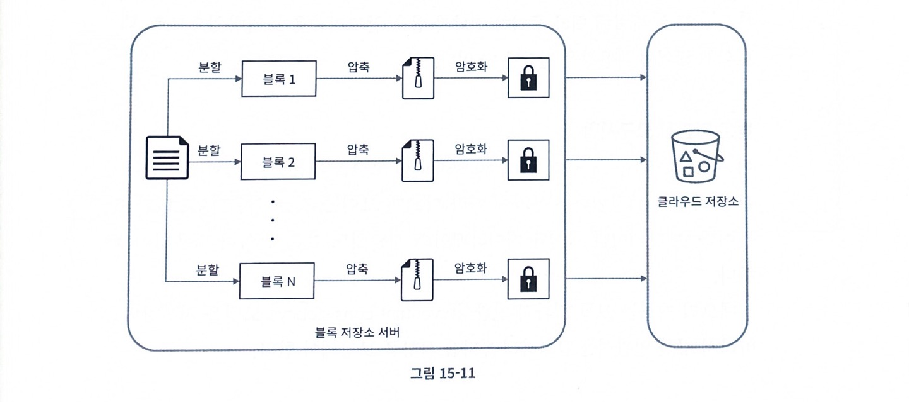
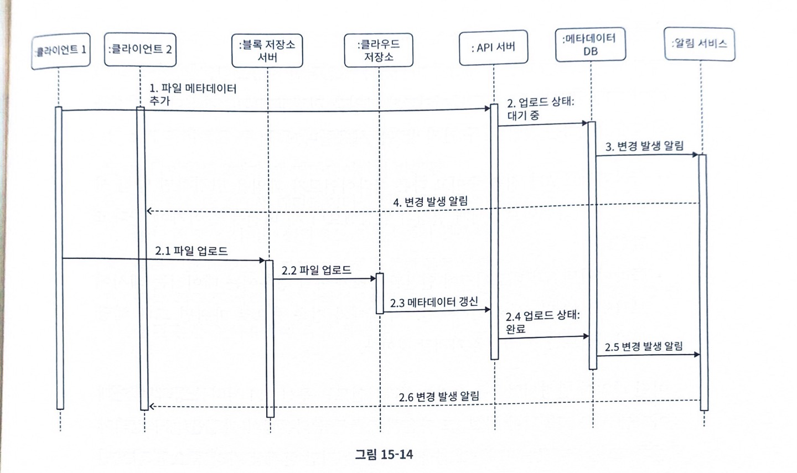
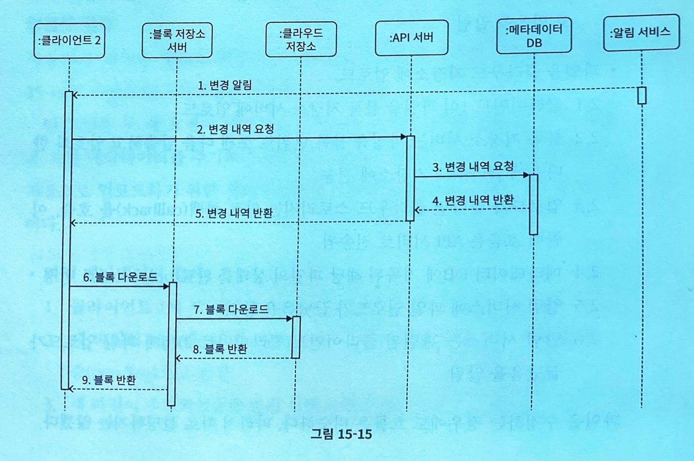

# 구글 드라이브 설계

구글 드라이브는 파일 저장 및 동기화 서비스로 문서, 사진, 비디오, 기타 파일을 클라우드에 보관할 수 있도록 함.

파일은 어떤 단말에서도 이용 가능 해야하고, 공유하고 싶은 사람들과 공유 가능해야 함

## 1단계) 문제 이해 및 설계 범위 확정
설계 범위를 좁히기 위해 얻어야 할 질문들
- 지원해야할 기능은 무엇인지
- 모바일과 웹을 지원하는지
- 파일을 암호화해야 하는지
- 파일 크기에 제한이 있는지
- 사용자는 얼마나 되는지

- 파일 업로드 및 다운로드 기능
- 여러 단말에 파일 동기화
- 파일 갱신 이력 조회
- 파일 공유
- 파일이 편집되거나 삭제되면 새롭게 공유됨을 표시

비기능적 요구
- 안정성 : 저장소 시스템에서 안정성은 중요하다. 너무 많이 걸리면 사용자는 인내심을 잃고 해당 제품을 더 이상 사용하지 않게 됨
- 빠른 동기화 속도 : 제품이 네트워크 대역폭을 불필요하게 많이 소모한다면 사용자는 좋아하지 않움
- 규모 확장성 : 아주 많은 양의 트래픽 처리가 가능해야 함
- 높은 가용성 : 일부 서버에 장애가 발생하거나 느려지거나 네트워크 일부가 끊겨도 시스템은 계속 사용 가능해야 함

개략적 추정치
- 가입 사용자는 5,000만 명이고 1,000만 명의 DAU 사용자가 있다고 가정
- 모든 사용자에게 10GB의 무료 저장공간 할당
- 매일 각 사용자가 평균 2개의 파일을 업로드한다고 가정하고  각 파일의 크기는 500KB라 가정
- 읽기:쓰기 비율은 1:1임
- 필요한 저장공간 총량은
  - 5000만 * 10GB = 500 petabyte
- 업로드 API QPS는
  - 1000만 사용자 * 2회 업로드/24시간/3600초 = 240QPS
- 최대 APS는 480

## 2단계) 개략적 설계안 및 동의 구하기

### API
기본적으로 세가지 API 필요함
1. 파일 업로드 API
  - 단순 업로드: 파일 크기가 작을 떄 사용
  - 이어올리기: 파일 사이즈가 크고 네트워크 문제로 업로드가 중단될 가능성이 높다고 생각하면 사용함
    - 이어올리기 URL을 받기 위한 최초 요청 전송
    - 데이터를 업로드하고 업로드 상태를 모니터링
    - 업로드에 장애가 발생하면 장애 발생 시점부터 업로드 재시작

2. 파일 다운로드 API
3. 파일 갱신 히스토리 API

### 동기화 충돌
두명 이상의 사용자가 같은 파일이나 폴더를 동시에 업데이트하려고 하는 경우

오류가 발생한 시점에 이 시스템에는 같은 파일의 두가지 버전이 존재하게 됨

- 블록 저장소 서버: 파일 블록을 클라우드 저장소에 업로드하는 서버
  - 파일을 여러 개의 블록으로 나눠서 저장
  - 각 블록에 고유한 해시 할당 ⇒ 메타데이터 데이터베이스 저장
  - 하나의 블록은 최대 4MB
- 클라우드 저장소: 블록 단위로 나뉘어진 파일 보관
- 아카이빙 저장소: 오랫동안 사용되지 않은 비황성 데이터를 저장하기 위한 시스템
- 메타데이터 데이터베이스: 사용자, 파일, 블록, 버전 메타데이터 정보 관리
- 메타데이터 캐시: 자주 쓰이는 메타 데이터 캐시
- 알림 서비스: pub-sub 시스템
- 오프라인 사용자 백업 큐: 클라이언트가 접속 중이 아닐 때 파일의 최신 상태를 큐에 두어 접속했을 때 동기화될 수 있도록 함

## 3단계) 상세 설계

### 블록저장소 서버
정기적으로 갱신되는 큰 파일들은 업데이트가 일어날 때마다 전체 파일을 서버로 보내면 네트워크 대역폭을 많이 잡아 먹게 됨
1. 델타 동기화 : 파일이 수정되면 전체 파일 대신 수정이 일어난 블록만 동기화
2. 압축 : 블록 단위로 압축해 두면 데이터 크기를 많이 줄일 수 있음
클라이언트가 보낸 파일을 블록 단위로 나눠야 함, 각 블록에 압축 알고리즘을 적용해야 함, + 암호화
3. 아울러 전체 파일을 저장소 시스템으로 보내는 대신 수정된 블록만 ㅓㄴ송해야 함

- 주어진 파일을 작은 블록들로 분할함
- 각 블록을 압축
- 클라우드 저장소로 보내기전에 암호화함
- 클라우드 저장소로 보냄

- 갱신된 부분만 동기화해여 클라우드 저장소에 업로드

### 높은 일관성 요구사항
- 메모리 캐시는 보통 결과적 일돤성 모델을 지원함
- 강한 일관성을 달성하려면 다음 사항 보장해야함
  - 캐시에 보관된 사본과 데이터베이스에 있는 원본 일치
  - 데이터베이스에 보관된 원본에 변경이 발생하면 캐시에 있는 사본을 무효화함

### 업로드 절차

두개 요청이 병렬적으로 전송된 상황을 보여줌, 첫 번째 요청은 파일 메타데이터를 추가하기 위한 것이고 두 번째 요청은 파일을 클라우드 저장소로 업로드 하기 위한 것임
- 이 두 요청은 전부 클라이언트 1이 보낸 것
- 파일 메타데이터 추가
1. 쿨라이언트 1이 새 파일의 메타데이터를 추가하기 위한 요청 전송
2. 새 파일의 메타데이터를 데이터베이스에 저장하고 업로드 상태를 대기중으로 변경
3. 새 파일이 추가되었음을 알림 서비스에 통지
4. 알림 서비스는 관련된 클라이언트(클라이언트 2)에게 파일이 업로드되고 있음을 알림
- 파일을 클라우드 저장소에 업로드

2.1. 클라이언트 1이 파일을 블록 저장소 서버에 업로드

2.2. 블록 저장소 서버는 파일 블록 단위로 쪼갠 다음 압축하고 암호화 한 다음에 클라우드 저장소에 전송

2.3. 업로드가 끝나면 클라우드 스토리지는 완료 콜백(callback)을 호출, 이 콜백 호출은 API 서버로 전송됨

2.4. 메타데이터 DB에 기록된 해당 파일의 상태를 완료로 변셩

2.5. 알림 서비스에 파일 업로드가 끝났음을 통지

2.6. 알림 서비스는 관련된 클라이언트(클라이언트2)에게 파일 업로드가 끝났음을 알림

### 다운로드 절차
파일 다운로드는 파일이 새로 추가되거나 편집되면 자동으로 시작됨. 그렇다면 클라이언트는 다른 클라이언트가 파일을 편집하거나 추가했다는 사실을 어떻게 감지함..?
1. 클라이언트 A가 접속 중이고 다른 클라이언트가 파일을 변경하면 알림 서비스가 클라이언트 A에게 변경이 발생했으니 새 버전을 끌어가야 한다고 알림
2. 클라이언트 A가 네트워크에 연결된 상태가 아닐 경우에는 데이터는 캐시에 보관될 것임. 해달 클라이언트의 상태가 접속 중으로 바꾸면 그때 해당 클라이언트는 새 버전을 가져갈 것임

1. 알림서비스가 클라이언트 2에게 누군가 파일을 변경했음을 알림
2. 알림을 확인한 클라이언트 2는 새로운 메타데이터를 요청
3. API 서버는 메타데이터 데이터베이스에게 새 메타데이터 요펑
4. API서버에게 새 메타데이터가 반환됨
5. 클라이언트 2에게 새 메타데이타가 반환됨
6. 클라이언트 2는 새 메타데이터를 받는 즉시 블록 다운로드 요청 전송
7. 블록 저장소 서버는 클라우드 저장소에서 블록 다운로드
8. 클라우드 저장소는 블록 서버에 요청된 블록 반환
9. 블록 저장소 서버는 클라이언트에게 요청된 블록 반환. 클라이언트 2는 전송된 블록을 사용하여 파일 재구성

### 알림 서비스
- 롱폴링 : 드롭박스가 이 방식을 채택하고 있음
- 웹소켓 : 클라이언트와 서버 사이에 지속적인 통신 채널을 제공함 (양방향 통신 가능)

### 저장소 공간
파일 갱신 이력을 보존하고 안정성을 보장하기 위해서는 파일의 여러 버전을 여러 데이터 센터에 보관해야할 필요가 있음. 모든 버전을 자주 백업하게 되면 저장 용량이 너무 빨리 소진될 가능성이 있음
1. 중복제거
   - 중복된 파일 블록을 계정 차원에서 제거하는 방법임. 두 블록이 같은 블록인지는 해시 값을 비교하여 판단
2. 지능적 백업 전략 도입
   - 한도 설정 : 보관해야 하는 파일 버전 개수에 상한을 둠, 상한에 도달하면 제일 오래된 버전은 버림
   - 중요한 버전만 보관 : 어떤 파일은 아주 자주 바꿈. 불필요한 버전ㅇ과 사본이 만들어지는 것을 피하려면 그 가운데 중요한 것만 골라내야함
3. 자주 쓰이지 않는 데이터는 아카이빙 저장소로 옮김
    - 아마존 S3 글래시어 같은 아카이빙 저장소 이용료는 S3보다 더 저렴

### 장애 처리
- 로드 밸런서 장애: 로드밸런서끼리는 보통 박동 신호를 주기적으로 보내서 상태를 모니터링함. 일정 시간 동안 박동 신호에응답하지 않은 로드밸런서는 장애로 간주
- 블록 저장소 서버 장애 : 다른 서버가 미완료 상태 또는 대기 상태인 작업을 이어받아야 함
- 클라우드 저장소 장애: S3버킷은 여러 지역에 다중화할 수 있으므로, 한 지역에서 장애가 발생하였다면 다른 지역에서 파일을 가져오면 됨
- 메타데이터 캐시 장애: 메타데이터 캐시 서버도 다중화함. 한 노드에 장애가 생겨도 다른 노드에서 데이터를 가져올 수 있음. 장애가 발생한 서버는 새 서버로 교체하면됨
- 메타데이터 데이터베이스 장애
  - 주 데이터베이스 서버 장애: 부 데이터베이스 서버 가운데 하나를 주 데이터베이스 서버로 바꾸고, 부 데이터베이스 서버를 하나 추가함
  - 부 // : 다른 부 데이터베이스 서버가 읽기 연산을 처리하도록 하고 그동안 장애 서버는 새 것으로 교체함
- 알림 서비스 장애: 접속중인 모든 사용자는 알림 서버와 롱 폴링 연결을 하나씩 유지함.
- 오프라인 사용자 백업 큐 장애 : 이 큐 또한 다중화 해놔야 함

## 4단계) 마무리
- 논의해보면 좋을 것들
  - 블록 저장소 서버를 거치지 않고 파일을 클라우드 저장소에 직접 업로드하면 어떤가
