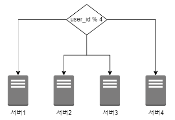
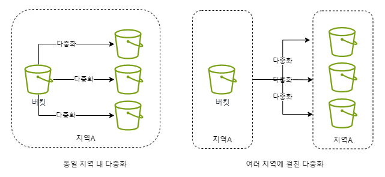
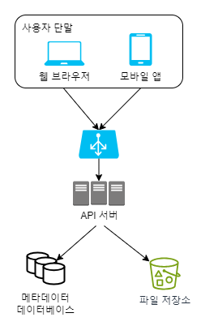
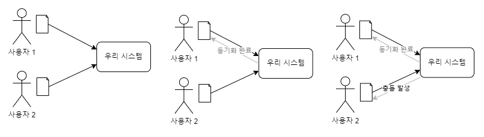
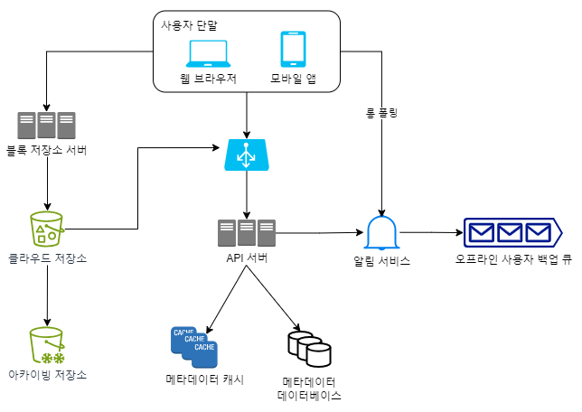
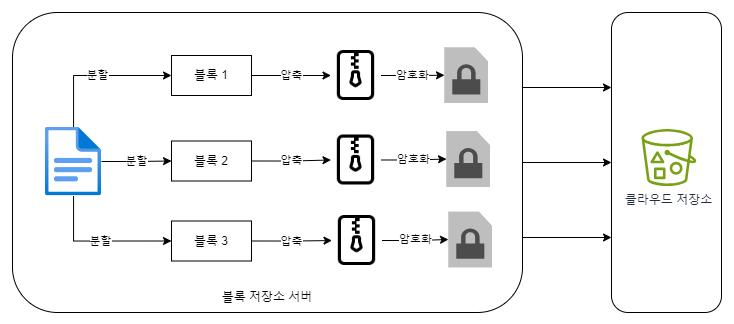
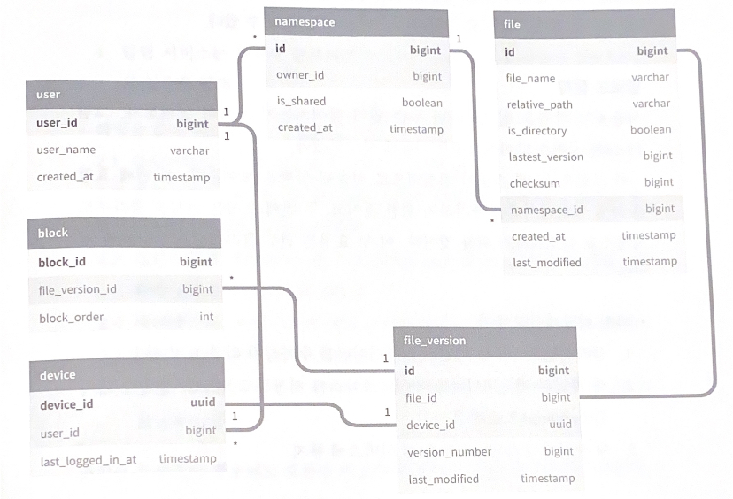
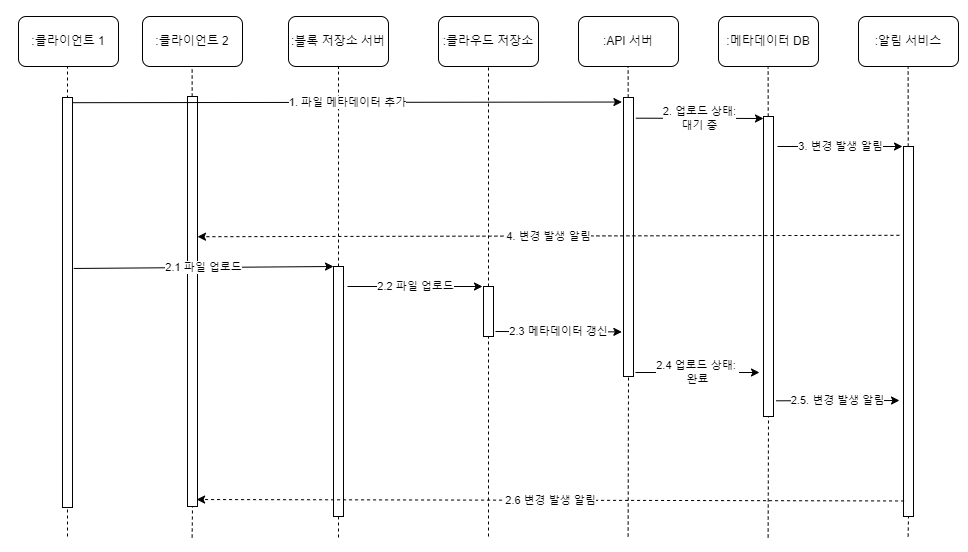
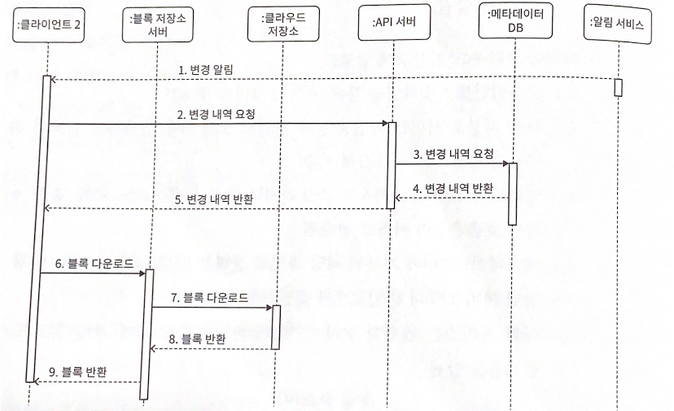

# 15장 구글 드라이브 설계
구글 드라이브 서비스
- 파일 저장 및 동기화 서비스
- 문서, 사진, 비디오, 기타 파일을 클라우드에 보관할 수 있도록 해야 함
- 컴퓨터, 스마트폰, 태블릿 등 어떤 단말에서도 이용 가능해야 함
- 보관된 파일은 친구, 가족, 등료들과 손쉽게 공유할 수 있어야 함

## 1단계: 문제 이해 및 설계 범위 확정
기능적 요구사항
- 파일 추가
- 파일 다운로드
- 여러 단말에 파일 동기화
- 파일 갱신 이력 조회(revision history)
- 파일 공유
- 파일이 편집되거나 삭제되거나 새롭게 공유되었을 때 알림 표시

비기능적 요구사항
- 안정성
- 빠른 동기화 속도
- 네트워크 대역폭
- 규모 확장성
- 높은 가용성

### 개략적 추정치
- 가입 사용자는 5천만(50million)명이고 1천만명의 DAU 사용자가 있다고 가정
- 모든 사용자에게 10GB의 무료 저장공간 할당
- 매일 각 사용자가 평균 2개의 파일을 업로드한다고 가정
  - 각 파일의 평균 크기는 200KB
- 읽기:쓰기 비율은 1:1
- 필요한 저장공간 총량 = 5천만 사용자 * 10GB = 500페타바이트(Petabyte)
- 업로드 API QPS = 1천만 사용자 * 2회 업로드 / 24시간 / 3600초 = 약 240
- 최대 QPS = QPS * 2 = 480

## 2단계: 개략적 설계안 제시 및 동의 구하기

- 모든 것을 담은 한 대 서버에서 출발해 점진적으로 천만 사용자 지원이 가능한 시스템으로 발전
- 아래와 같은 구성의 서버 한 대로 시작
  - 파일을 올리고 다운로드하는 과정을 처리할 웹 서버
  - 사용자 데이터, 로그인 정보, 파일 정보 등의 메타데이터를 보관할 데이터베이스
  - 파일을 저장할 저장소 시스템
    - 파일 저장을 위해 1TB의 공간을 사용할 것임 <br>
  -> 아파치 웹 서버, MYSQL 데이터베이스, 업로드되는 파일을 저장할 drive/라는 디렉터리 준비

### API 
1. 파일 업로드 API
- 단순 업로드
  - 파일 크기가 작을 때 사용
- 이어 올리기(resumable upload)
  - 파일 사이즈가 크고 네트워크 문제로 업로드가 중단될 가능성이 높다고 생각되면 사용
  - e.g. https://api.example.com/files/upload?uploadType=resumable
    - 인자
      - uploadType=resumable
      - data: 업로드할 로컬 파일
    - 절차
      - 이어 올리기 URL을 받기 위한 최초 요청 전송
      - 데이터를 업로드하고 업로드 상태 모니터링
      - 업로드에 장애가 발생하면 장애 발생시점부터 업로드를 재시작
2. 파일 다운로드 API
- e.g. https://api.example.com/files/download
- 인자
  - path: 다운로드할 파일의 경로
```json
{
  "path": "/recipes/soup/best_soup.txt"
}   
```
3. 파일 갱신 히스토리 제공 API
- e.g. https://api.example.com/files/list_revisions
- 인자
  - path: 갱신 히스토리를 가져올 파일의 경로
  - limit: 히스토리 길이의 최대치
```json
{
  "path": "/recipes/soup/best_soup.txt",
  "limit": 20
}
```
- 지금까지 사용한 모든 API는 사용자 인증을 필요로 하고 HTTPS 프로토콜을 사용해야 함
- SSL(Secure Socket Layer)를 지원하는 프로토콜을 이용하는 이유
  - 클라이언트와 백엔드 서버가 주고받는 데이터를 보호하기 위해

### 한 대 서버의 제약 극복
- 업로드되는 파일이 많아지면 파일 시스템은 가득 차게 됨 <br>
-> 데이터를 샤딩(sharding)하여 여러 서버에 나누어 저장


-> 아마존 S3 사용 
- S3는 다중화 지원

- S3 버킷은 파일 시스템의 폴더와도 같은 것임

개선할 부분
- 로드밸런서
  - 네트워크 트래픽 분산
  - 특정 웹 서버에 장애가 발생하면 자동으로 해당 서버 우회해줌
- 웹 서버
  - 로드밸런서를 추가하고 나면 더 많은 웹 서버를 손쉽게 추가할 수 있음
  - 트래픽이 폭증해도 쉽게 대응 가능
- 메타데이터 데이터베이스
  - 데이터베이스를 파일 저장 서버에서 분리하여 SPOF(Single Point of Failure) 회피
  - 다중화 및 샤딩 정책을 적용하여 가용성과 규모 확장성 요구사항에 대응
- 파일 저장소
  - S3를 파일 저장소로 사용
  - 가용성과 데이터 무손실을 보장하기 위해 두 개 이상의 지역에 데이터 다중화

**수정한 설계안** <br>


### 동기화 충돌

- 먼저 처리되는 변경은 성공한 것으로 보고, 나중에 처리되는 변경은 충돌이 발생한 것으로 표시
  - 사용자 1과 2는 같은 파일을 동시에 갱신하려 함
  - 시스템은 사용자 1의 파일을 먼저 처리
  - 사용자 1의 파일 갱신 시도는 정상적으로 처리되지만 사용자 2에 대해서는 동기화 충돌 오류 발생 <br>
  -> 두 파일을 하나로 합치거나 둘 중 하나를 다른 파일로 대체

### 개략적 설계안

- 사용자 단말
  - 사용자가 이용하는 웹브라우저나 모바일 앱 등의 클라이언트
- 블록 저장소 서버(block server)
  - 파일 블록을 클라우드 저장소에 업로드하는 서버
  - 블록 저장소
    - 블록 수준 저장소(block-level storage)라고도 함
    - 클라우드 환경에서 데이터 파일을 저장하는 기술
    - 파일을 여러 개의 블록으로 나눠 저장하며, 각 블록에는 고유한 해시값 할당
    - 해시값은 메타데이터 데이터베이스에 저장됨
    - 각 블록은 독립적인 객체로 취급되며 클라우드 저장소 시스템에 보관됨
    - 파일을 재구성하려면 블록들을 원래 순서대로 합쳐야 함
- 클라우드 저장소
  - 파일은 블록 단위로 나눠져 클라우드 저장소에 보관됨
- 아카이빙 저장소(cold storage)
  - 오랫동안 사용되지 않은 비활성(inactive) 데이터를 저장하기 위한 컴퓨터 시스템
- 로드밸런서
  - 요청을 모든 API 서버에 고르게 분산하는 구실을 함
- API 서버
  - 파일 업로드 외에 거의 모든 것을 담당하는 서버
  - 사용자 인증, 사용자 프로파일 관리, 파일 메타데이터 갱신 등에 사용됨
- 메타데이터 데이터베이스
  - 사용자, 파일, 블록, 버전 등의 메타데이터 정보를 관리함
  - 실제 파일은 클라우드에 보관하며, 이 데이터베이스에는 오직 메타데이터만 둠
- 메타데이터 캐시
  - 성능을 높이기 위해 자주 쓰이는 메타데이터는 캐시함
- 알림 서비스
  - 특정 이벤트가 발생했음을 클라이언트에게 알리는데 쓰이는 발생/구독 프로토콜 기반 시스템
- 오프라인 사용자 백업 큐(offline backup queue)
  - 클라이언트가 접속 중이 아니라서 파일의 최신 상태를 확인할 수 없을 때는 해당 정보를 이 큐에 두어 나중에 클라이언트가 접속했을 때 동기화될 수 있도록 함

## 3단계: 상세 설계
### 블록 저장소 서버
- 정기적으로 갱신되는 큰 파일들은 업데이트가 일어날 때마다 전체 파일을 서버로 보내면 네트워크 대역폭을 많이 잡아먹게 됨 <br>
-> 최적화 방법
  - 델타 동기화(delta sync)  
    - 파일이 수정되면 전체 파일 대신 수정이 일어난 블록만 동기화
  - 압축(compression)
    - 블록 단위로 압축해두면 데이터 크기를 많이 줄일 수 있음
    - 압축 알고리즘은 파일 유형에 따라 정함
      - 텍스트 파일: gzip이나 bzip2 사용
      - 이미지나 비디오: 다른 압축 알고리즘 사용
      
**블록 저장소 서버**
- 파일 업로드에 관계된 힘든 일을 처리하는 컴포넌트
- 클라이언트가 보낸 파일을 블록 단위로 나눔
- 각 블록에 압축 알고리즘 적용, 암호화
- 전체 파일을 저장소 시스템으로 보내는 대신 수정된 블록만 전송

> 새 파일이 추가되었을 때 블록 저장소 서버의 동작 


- 주어진 파일을 작은 블록들로 분할
- 각 블록을 압축
- 클라우드 저장소로 보내기 전에 암호화
- 클라우드 저장소로 보냄

**델타 동기화 전략**

- 갱신된 부분만 동기화

### 높은 일관성 요구사항
- 강한 일관성 모델(strong consistency)을 기본으로 지원해야 함
  - 같은 파일이 단말이나 사용자에 따라 다르게 보이는 걸 허용할 수 없음
  - 메타데이터 캐시와 데이터베이스 계층에도 같은 원칙이 적용되어야 함
- 메모리 캐시는 보통 결과적 일관성(evetual consistency) 모델을 지원함
  - 강한 일관성을 달성하려면 다음 사항을 보장해야 함
    - 캐시에 보관된 사본과 데이터베이스에 있는 원본(master)이 일치
    - 데이터베이스에 보관된 원본에 변경이 발생하면 캐시에 있는 사본을 무효화함
  - 관계형 데이터베이스는 ACID(Atomicity, Consistency, Isolation, Durability) 보장 <br>
  -> 강한 일관성 보장하기 쉬움 <br>
    - NoSQL 데이터베이스는 기본으로 지원X. 동기화 로직 안에 프로그램해 넣어야 함

### 메타데이터 데이터베이스

- user
  - 이름, 이메일, 프로파일 사진 등 사용자에 관계된 기본적 정보들이 보관됨
- device
  - 단말 정보가 보관됨
  - push_id는 모바일 푸시 알림을 보내고 받기 위한 것
  - 한 사용자가 여러 대의 단말을 가질 수 있음
- namespace
  - 사용자의 루트 디렉터리 정보가 보관됨
- file
  - 파일의 최신 정보가 보관됨
- file_version
  - 파일의 갱신 이력이 보관되는 테이블
  - 이 테이블에 보관되는 레코드는 전부 읽기 전용
  - 갱신 이력이 훼손되는 것을 막기 위한 조치
- block
  - 파일 블록에 대한 정보를 보관하는 테이블
  - 특정 버전의 파일은 파일 블록을 올바른 순서로 조합하기만 하면 복원해 낼 수 있음

### 업로드 절차

- 파일 메타데이터 추가
1. 클라이언트 1이 새 파일의 메타데이터를 추가하기 위한 요청 전송
2. 새 파일의 메타데이터를 데이터베이스에 저장하고 업로드 상태를 대기 중(pending)으로 변경
3. 새 파일이 추가되었음을 알림 서비스에 통지
4. 알림 서비스는 관련된 클라이언트(클라이언트 2)에게 파일이 업로드되고 있음을 알림

- 파일을 클라우드 저장소에 업로드 <br>
2.1 클라이언트 1이 파일을 블록 저장소 서버에 업로드 <br>
2.2. 블록 저장소 서버는 파일을 블록 단위로 쪼갠 다음 압축하고 암호화 한 다음에 클라우드 저장소에 전송 <br>
2.3. 업로드가 끝나면 클라우드 스토리지는 완료 콜백(callback)을 호출. 이 콜백 호출은 API 서버로 전송됨 <br>
2.4. 메타데이터 DB에 기록된 해당 파일의 상태를 완료(uploaded)로 변경 <br>
2.5. 알림 서비스에 파일 업로드가 끝났음을 통지 <br>
2.6. 알림 서비스는 관련된 클라이언트(클라이언트 2)에게 파일 업로드가 끝났음을 알림

### 다운로드 절차
- 클라이언트 A가 접속 중이고 다른 클라이언트가 파일을 변경하면 알림 서비스가 클라이언트 A에게 변경이 발생했으니 새 버전을 끌어가야 한다고 알림
- 클라이언트 A가 네트워크에 연결된 상태가 아닐 경우에는 데이터는 캐시에 보관됨
  - 해당 클라이언트의 상태가 접속 중으로 바뀌면 그때 해당 클라이언트는 새 버전을 가져갈 것임


1. 알림 서비스가 클라이언트 2에게 누군가 파일을 변경했음을 알림
2. 알림을 확인한 클라이언트 2는 새로운 메타데이터를 요청
3. API 서버는 메타데이터 데이터베이스에게 새 메타데이터 요청
4. API 서버에게 새 메타데이터가 반환됨
5. 클라이언트 2에게 새 메타데이터가 반환됨
6. 클라이언트 2는 새 메타데이터를 받는 즉시 블록 다운로드 요청 전송
7. 블록 저장소 서버는 클라우드 저장소에서 블록 다운로드
8. 클라우드 저장소는 블록 서버에 요청된 블록 반환
9. 블록 저장소 서버는 클라이언트에게 요청된 블록 반환. 클라이언트 2는 전송된 블록을 사용하여 파일 재구성

### 알림 서비스
- 클라이언트는 로컬에서 파일이 수정되었음을 감지하는 순간 다른 클라이언트에 그 사실을 알려서 충돌 가능성을 줄여야 함
  - 파일의 일관성 유지
- 알림 방식
  - 롱 폴링(long polling)
    - 드롭박스가 이 방식 채택함
  - 웹소켓(WebSocket)
    - 클라이언트와 서버 사이에 지속적인 통신 채널을 제공
    - 양방향 통신 가능

본 설계안에서는 롱 폴링 사용
- 채팅 서비스와 달리 본 시스템의 경우, 알림 서비스와 양방향 통신이 필요하지 않음
  - 서버는 파일이 변경된 사실을 클라이언트에게 알려주어야 하지만 반대 방향의 통신은 요구되지 않음
- 웹소켓은 실시간 양방향 통신이 요구되는 채팅 같은 응용에 적합함
  - 구글 드라이브의 경우 알림을 보낼 일은 그렇게 자주 발생하지 않으며, 알림을 보내야 하는 경우에도 단시간에 많은 양의 데이터를 보낼 일은 없음
- 각 클라이언트는 알림 서버와 롱 폴링용 연결을 유지하다가 특정 파일에 대한 변경을 감지하면 해당 연결을 끊음
  - 클라이언트는 반드시 메타데이터 서버와 연결해 파일의 최신 내역을 다운로드해야 함
  - 해당 다운로드 작업이 끝났거나 연결 타임아웃 시간에 도달한 경우에는 즉시 새 요청을 보내어 롱 폴링 연결을 복원하고 유지해야 함

### 저장소 공간 절약
- 중복 제거(de-dupe)
  - 중복된 파일 블록을 계정 차원에서 제거
  - 두 블록이 같은 블록인지는 해시 값을 비교해서 판단함
- 지능적 백업 전략 도입
  - 한도 설정
    - 보관해야 하는 파일 버전 개수에 상한을 둠
    - 상한에 도달하면 제일 오래된 버전은 버림
  - 중요한 버전만 보관
- 자주 쓰이지 않는 데이터는 아카이빙 저장소(cold storage)로 옮김
  - 몇 달 혹은 수년 간 이용되지 않은 데이터가 이에 해당됨
  - 아마존 S3 글래시어(glacier) 같은 아키이빙 저장소 이용료는 S3보다 훨씬 저렴함

### 장애 처리
- 로드밸런서 장애
  - 로드밸런서에 장애가 발생한 경우 secondary 로드밸런서가 활성화되어 트래픽을 이어받아야 함
    - 로드 밸런서끼리는 보통 박동 신호를 주기적으로 보내 상태를 모니터링함
    - 일정 시간 동안 박동 신호에 응답하지 않은 로드밸런서는 장애가 발생한 것으로 간주함
- 블록 저장소 서버 장애
  - 블록 저장소 서버에 장애가 발생했다면 다른 서버가 미완료 상태 또는 대기 상태인 작업을 이어받아야 함
- 클라우드 저장소 장애
  - S3 버킷은 여러 지역에 다중화할 수 있으므로, 한 지역에서 장애가 발생했다면 다른 지역에서 파일을 가져오면 됨
- API 서버 장애
  - API 서버들은 무상태 서버이기 때문에 로드밸런서는 API 서버에 장애가 발생하면 트래픽을 해당 서버로 보내지 않음으로써 장애 서버 격리
- 메타데이터 캐시 장애
  - 메타데이터 캐시 서버도 다중화함
    - 한 노드에 장애가 생겨도 다른 노드에서 데이터를 가져올 수 있음
    - 장애가 발생한 서버는 새 서버로 교체하면 됨
- 메타데이터 데이터베이스 장애
  - 주 데이터베이스 서버 장애
    - 부 데이터베이스 서버 가운데 하나를 주 데이터베이스 서버로 바꿈
    - 부 데이터베이스 서버를 새로 하나 추가함
  - 부 데이터베이스 서버 장애
    - 다른 부 데이터베이스 서버가 읽기 연산을 처리하도록 하고 그동안 장애 서버는 새 것으로 교체함
- 알림 서비스 장애
  - 접속 중인 모든 사용자는 알림 서버와 롱 폴링 연결을 하나씩 유지함
    - 알림 서비스는 많은 사용자와의 연결을 유지하고 관리해야 함
    - 한 대 서버에 장애가 발생하면 백만명 이상의 사용자가 롱 폴링 연결을 다시 만들어야 함
      - 한 대 서버로 백만개 이상의 접속을 유지하는 건 가능하지만, 동시에 백만개 접속을 시작하는 건 불가능 <br>
      -> 롱 폴링 연결을 복구하는 건 상대적으로 느릴 수 있음
- 오프라인 사용자 백업 큐 장애
  - 큐 또한 다중화해두어야 함
  - 큐에 장애가 발생하면 구독 중인 클라이언트들은 백업 큐로 구독 관계를 재설정해야 함

## 4단계: 마무리
- 블록 저장소 서버를 거치지 않고 파일을 클라우드 저장소에 직접 업로드
  - 장점: 업로드 시간이 빨라질 수 있음
  - 단점
    분할, 압축, 암호화 로직을 클라이언트에 두어야 하므로 플랫폼별로 따로 구현해야 함
    - 클라이언트가 해킹 당할 가능성이 있으므로 암호화 로직을 클라이언트 안에 두는 것은 적절하지 않을 수 있음
- 접속상태를 관리하는 로직을 별도 서비스로 옮기기
  - 관련 로직을 알림 서비스에서 분리하면, 다른 서비스에서도 쉽게 활용할 수 있게 됨